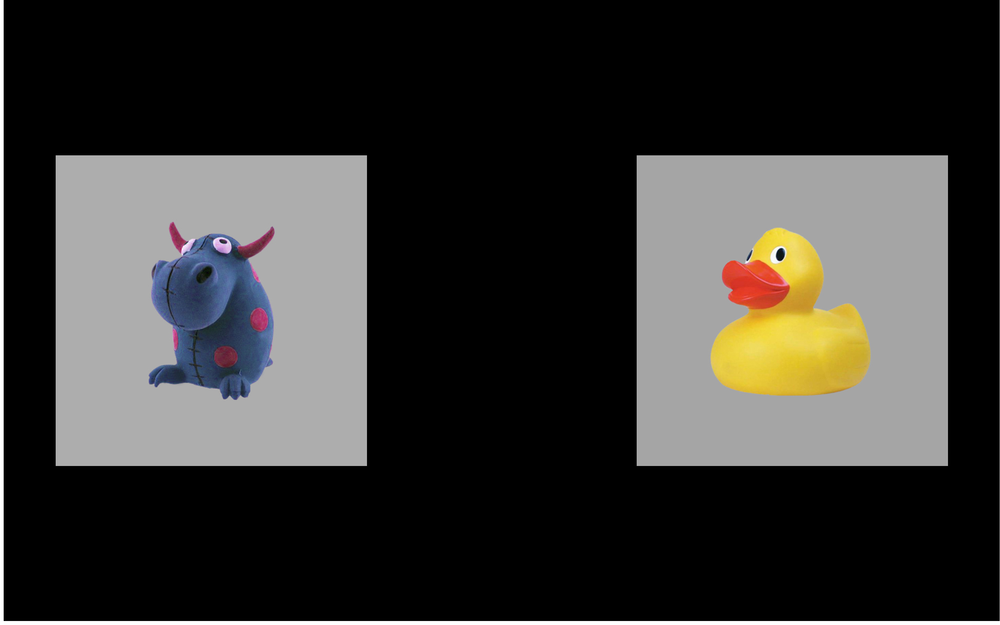

Methods
========

General Research Design: Participants
-------------------------------------

Word recognition data and vocabulary data, among other measures, were
collected over a three-year longitudinal study (R01DC002932; the
Learning to Talk project). Children were 28–39 months-old at Time 1,
39–52 at Time 2, and 51–65 at Time 3. Approximately, 180 children
participated at Time 1, 170 at Time 2, and 160 at Time 3. Of these
children, approximately 20 were identified by their parents as late
talkers. Prospective families were interviewed over telephone before
participating in the study, and “children with an individualized
education program or any parent-reported visual problems, language
problems, or developmental delays were not scheduled for testing” 
[@RWLPaper].[^1] Recruitment and data
collection occurred at two Learning to Talk lab sites—one at the
University of Wisconsin–Madison and the other at the University of
Minnesota.

[^1]: Appendix C (Related Work) describes how this dissertation relates
    to other work from our lab.

Table \@ref(tab:participant-info) summarizes the cohort of children in each year of
testing. The numbers and summary statistics here are approximate,
describing children who participated at each year, but whose data may
still be excluded from the analyses. Some potential reasons for
exclusion include: excessive missing data during eyetracking, experiment
or technology error, developmental concerns not identified until later
in study, or a failed hearing screening. Final sample sizes will depend
on the measures needed for an analysis and the results from data
screening checks. For each project aim, I will disclose all measurements
and data exclusions following guidelines by the Center for Open Science
[@OSF_Statement].

                                          Year 1             Year 2             Year 3
----------------------------------------- ------------------ ------------------ ------------------
N                                         184                175                160
Boys, Girls                               94, 90             89, 86             82, 78
Maternal education: Low, Middle, High\*   15, 98, 71         12, 92, 71         6, 90, 64
Dialect: MAE, AAE                         171, 13            163, 12            153, 7
Parent-identified late talkers            20                 19                 16
Age (months): Mean (SD) [Range]           33 (3) [28–39]     45 (4) [39–52]     57 (4) [51–66]
EVT-2 standard score: Mean (SD)           115 (18)           118 (16)           118 (14)
PPVT-4 standard score: Mean (SD)          113 (17)           120 (16)           —
GFTA-2 standard score: Mean (SD)          92 (13)            —                  91 (13)

Table: (\#tab:participant-info) Participant characteristics. \* Education levels: Low: less 
than high school, or high school; Middle: trade school, technical or associates 
degree, some college, or college degree; and High: graduate degree.

General Eyetracking Procedure
-----------------------------

Two eyetracking experiments were performed each year of the longitudinal
study. These experiments followed the same essential procedure: During
each trial, photographs of images appeared on a computer screen for a
few seconds followed by a prompt to view one of the images (e.g., *find
the dog*). This procedure measures a child’s real-time comprehension of
words by capturing how the child’s gaze location changes over time in
response to speech.

### Experiment Administration

Children participating in the study were tested over two lab visits
(i.e., on different dates). The first portion of each visit involved
“watching movies”—that is, performing two blocks of the eyetracking
experiments. A play break or hearing screening occurred between the two
eyetracking blocks, depending on the visit.

Each eyetracking experiment was administered as a block of trials (24
for the four-image task and 38 for the two-image task). Children
received two different blocks of each experiment. The blocks for an
experiment differed in trial ordering and other features (see Specific
Procedures). Experiment order and block selection were counterbalanced
over children and visits. For example, a child might have received Exp.
1 Block A and Exp. 2 Block B on Visit 1 and next received Exp. 2 Block A
and Exp. 1 Block B on Visit 2. The purpose of this presentation was to
control possible ordering effects where a particular experiment or block
benefited from consistently occurring first or second.

Experiments were administered using E-Prime 2.0 and a Tobii T60XL
eyetracker which recorded gaze location at a rate of 60 Hz. The
experiments were conducted by two examiners, one “behind the scenes” who
controlled the computer running the experiment and another “onstage” who
guided the child through the experiment. At the beginning of each block,
the child was positioned so the child’s eyes were approximately 60 cm
from the screen. The examiners calibrated the eyetracker to the child’s
eyes using a five-point calibration procedure (center of screen and
centers of four screen quadrants). The examiners would repeated this
calibration procedure if one of the five calibration points for one of
the eyes did not calibrate successfully. During the experiment, the
behind-the-scenes examiner monitored the child’s distance from the
screen and whether the eyetracker was capturing the child’s gaze. The
onstage examiner coached the child to stay fixated on the screen and
repositioned the child as needed to ensure the child’s eyes were being
tracked. Every six or seven trials in a block of an experiment, the
experiment briefly paused with a reinforcing animation or activity.
During these breaks, the onstage examiner could reposition the child if
necessary before resuming the experiment.

We used a gaze-contingent stimulus presentation. “After 2 s of
familiarization time with the images in silence, the experiment paused
to verify that the child’s gaze was being tracked. After 300 ms of
continuous gaze tracking, the trial advanced. Otherwise, if the gaze
could not be verified after 10 s, the trial advanced. This step ensured
that for nearly every trial, the gaze was being tracked before playing
the carrier phrase, or in other words, that the child was ready to hear
the carrier stimuli” (Mahr & Edwards, in revision). During Year 1 and
Year 2, an attention-getter (e.g., *check it out*!) played 1 s following
the end of the target noun. These reinforcers were dropped in Year 3 to
streamline the experiment for older listeners.

### Stimuli

For both experiments, “stimuli were presented in children’s home
dialect, either Mainstream American English (MAE) or African American
English (AAE). We made an initial guess about what the home dialect was
likely to be based on a number of factors, including the recruitment
source and the child’s address. For most children, the home dialect was
MAE. If we thought the home dialect might be AAE, a native AAE speaker
who was a fluent dialect-shifter between AAE and MAE was scheduled for
the lab visit, and she confirmed the home dialect by listening to the
caregiver interact with the child during the consent procedure at the
beginning of the visit” (Mahr & Edwards, in revision). Prompts to view
the target image of a trial (e.g., *find the girl*) used the carrier
phrases “find the” and “see the”. These carriers were recording in the
frame “find/see the egg” and cross-spliced with the target nouns to
minimize coarticulatory cues on the determiner “the”.

The images used in each experiment consisted of color photographs on
gray backgrounds. These images were piloted in a preschool classroom to
ensure that children consistently used the same label for familiar
objects and did not consistently use the same label for novel/unfamiliar
objects.

### Data Preparation

Data from both experiments were prepared using the same procedure. “We
mapped the gaze *x*-*y* coordinates onto the images onscreen. We
performed *deblinking* by interpolating short windows of missing data
(up to 150 ms) if the child fixated on the same image before and after a
missing data window. In other words, if the gaze did not shift to
another image, and if the missing data window was short enough, that
window was classified as a blink and interpolated, using the fixated
image as the imputed value” (Mahr & Edwards, in revision). Next, we
performed trial-level cleaning. “We examined eyetracking data in the 2-s
window following the onset of the target word. A trial was considered
unreliable if at least 50% of the eyetracking data during the 2-s window
was missing. These trials were not reliable because the child did not
look at the display for the majority of the analysis window” (Mahr &
Edwards, in revision). If more than half of a child’s trials, combined
across blocks, were unreliable, that child was excluded from analysis.
“Finally, we downsampled our data into 50-ms bins, reducing the
eyetracking sampling rate from 60 Hz to 20 Hz. This procedure smoothed
out high-frequency noise in the data by pooling together data from
adjacent frames” (Mahr & Edwards, in revision).

Specific Procedure: Aim 1 (Familiar Word Recognition and Lexical Competition)
-----------------------------------------------------------------------------

*Visual World Paradigm Task.* In eyetracking studies with toddlers, two
familiar images are usually presented: a target and a distractor. This
experiment is a four-image eyetracking task that was designed to provide
a more demanding word recognition task for preschoolers. In this
procedure, four familiar images are presented onscreen followed by a
prompt to view one of the images (e.g., *find the bell!*). The four
images include the target word (e.g., *bell*), a semantically related
word (*drum*), a phonologically similar word (*bee*), and an unrelated
word (*swing*).

(ref:sample-vw-screen-cap) Example display for the target *bell* with
the semantic foil *drum*, the phonological foil *bee*, and the unrelated
*swing*.

```{r sample-vw-screen, echo = FALSE, fig.cap = "(ref:sample-vw-screen-cap)", out.width = "70%"}
knitr::include_graphics("./misc/rwl-screens/TimePoint1/actual/Block2_17_swing2_bell2_bee2_drum2_UpperRightImage_bell.png")
```


Specific Procedure: Aim 2 (Referent Selection and Mispronunciations)
--------------------------------------------------------------------

*Mispronunciation Task.* This experiment is an adaptation of the
mispronunciation detection task by @WhiteMorgan2008 and @MPPaper. 
In this experiment, two images are presented onscreen—a
familiar object and an unfamiliar object—and the child hears a prompt to
view one of the images. In the *correct pronunciation* (or *real word*)
and *mispronunciation* conditions, the child hears either the familiar
word (e.g., *soup*) or a one-feature mispronunciation of the first
consonant of the target word ([*sh*]*oup*). Importantly, within a
block of trials, the child never hears both the correct and
mispronounced forms of the word. These conditions are designed to test
whether children map mispronunciations to novel words. To encourage fast
referent selection, there were also trials in a *nonword* condition
where the label was an unambiguous novel word (e.g., *cheem* presented
with images of a bed and a novel-looking pastry mixer). Each nonword was
constructed to match the phonotactic probability of one of the
mispronunciations.

(ref:sample-mp-screen-cap) Example display for a trial in which *duck* 
is mispronounced as “guck”.

```{r sample-mp-screen, echo = FALSE, fig.cap = "(ref:sample-mp-screen-cap)", out.width = "70%"}

```

In a block of trials, there were 12 trials each from the nonword
condition, correct production condition, and mispronunciation
conditions, and children received two blocks of the experiment. A
complete list of the items used in the experiment over the three years
of the study is included in 
[Appendix \@ref(mp-experiment-items)](#mp-experiment-items).
