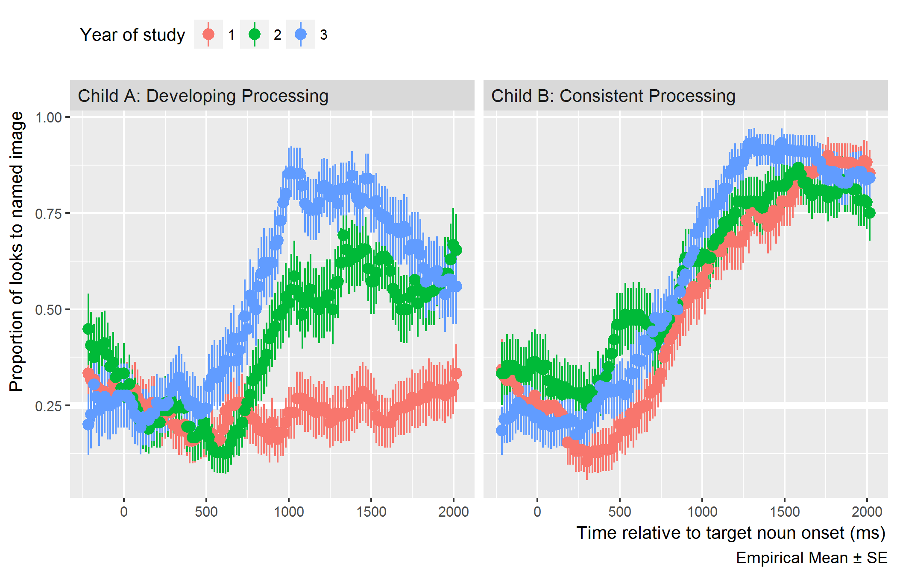

Outcome Measures
================

The primary outcome measure for this project is word recognition
performance, and I will study how it changes over time, under different
experimental conditions, across children, and so on. I will measure word
recognition performance using eyetracking growth curves. In this
technique, I aggregate looking locations across trials to compute the
proportion of looks to the target object (versus the distractor images)
at each time point after the onset of the target word. This growth curve
measures how the probability of fixating on a named object changes over
time. Thus, children who have steeper accuracy growth curves demonstrate
faster word recognition because the probability of looking at a named
object increases more quickly over time.

The other primary child-level measurements of interest for this project
are vocabulary and speech perception. Expressive vocabulary was measured
at all three years using the Expressive Vocabulary Test [EVT-2,
@EVT2]. Receptive vocabulary was measured at Year 1 and Year 2 using
the Peabody Picture Vocabulary Test [PPVT-4, @PPVT4]. These tests will
provide child-level measures of vocabulary and vocabulary growth. At
Year 1 and Year 2, we measured speech perception using a minimal-pair
discrimination task [as in @ProtoMinPair], and Year 2 and Year 3, we
measured speech perception with a speech sound judgment task [SAILS as
in @Rvachew2006]. Performance on these tasks will quantify individual
differences in speech perception.

Two other relevant measures include an articulation test administered at
Year 1 and Year 3 [GFTA-2, @GFTA2] and phonological awareness given at
Year 2 and Year 3 [CTOPP-2, @CTOPP2]. They are relevant because they
draw on a child’s phonological knowledge of words, but I limit their
consideration for only post-hoc, exploratory analyses because they
measure a child’s speech production performance.

Sample Data
-----------

Figure \@ref(fig:sample-data-plot) shows the development of word
recognition on the four-image task over the three years of the
longitudinal study for two participants in this data set. To limit
data-peeking, I only considered at data from the first 20 participants
and then selected two patterns of development with clean individual
differences.

(ref:sample-data-plot-cap) Data for two children on the four-image task
over the three years of the study.

```{r sample-data-plot, fig.cap = "(ref:sample-data-plot-cap)", echo = FALSE, out.width="100%", fig.fullwidth = TRUE}

```

The participant on the left showed substantial gains in processing
ability from year to year, whereas the child on the right showed
approximately the same level of performance each year, with some small
gains in peak accuracy and rate of change. The child with substantial
changes in word recognition also showed gains in expressive vocabulary
with improved *standard* scores on the EVT-2: 83 at Year 1, 95 at
Year 2, and 103 at Year 3. In contrast, the child with consistent
processing had an above-average standard expressive vocabulary score
during each year of the study: 133 at Year 1, 138 at Year 2, and 130 at
Year 3.

These two children give a glimpse of the many possible developmental
trajectories for this task and how they relate to expressive vocabulary.
The main work of this project will be describing and characterizing the
trajectories of many children on different aspects of lexical
processing.
