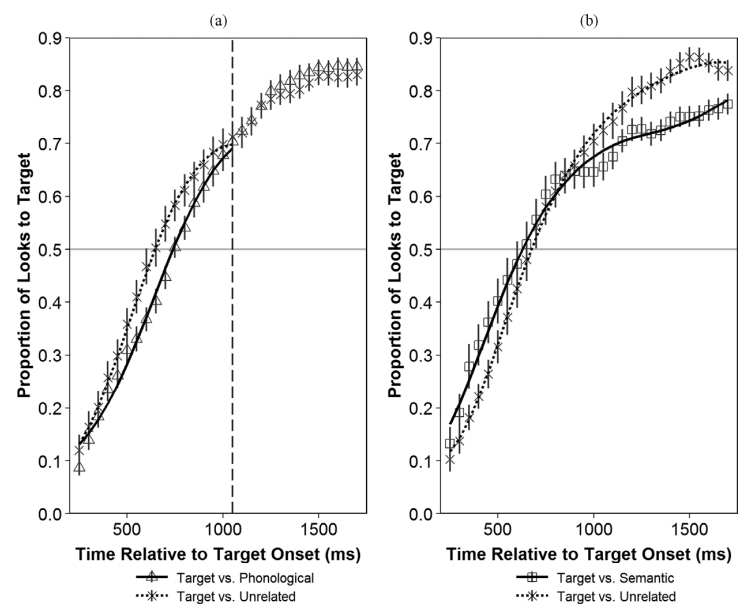
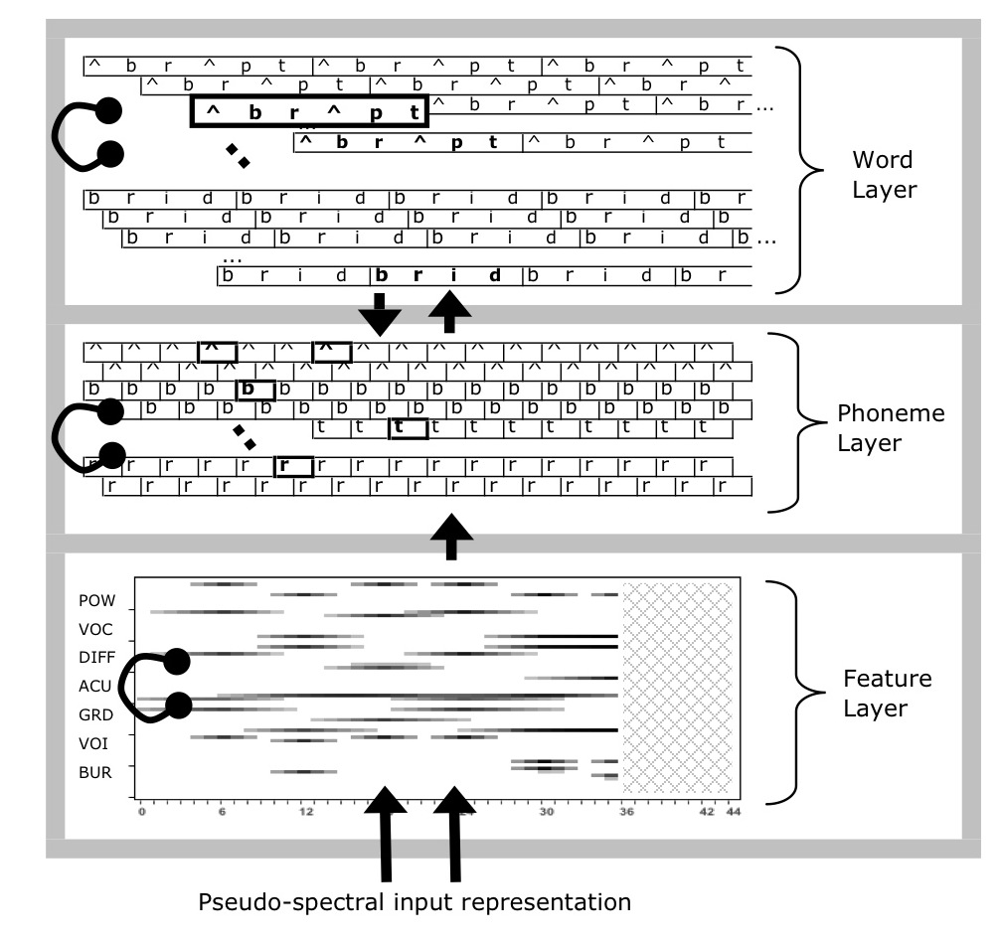

# Analysis

## Growth Curve Analysis

Eyetracking growth curves will be analyzed using **Bayesian mixed
effects logistic regression**. I will use *logistic* regression because
the outcome measurement is a probability (the log-odds of looking to the
target image versus a distractor). I will use *mixed-effects* models
because I want to estimate a separate growth curve for each child (to
measure individual differences in word recognition) but also treat each
child's individual growth curve as a draw from a distribution of related
curves.

I plan to use *Bayesian* techniques to study a generative model of the
data. Instead of reporting and describing a single, best-fitting model
of some data, Bayesian techniques consider an entire distribution of
plausible models that are consistent with the data and any prior
information we have about the models. By using this approach, I can
explicitly quantify uncertainty about statistical effects and draw
inferences using estimates of uncertainty (instead of using statistical
significance—which is not a straightforward matter for mixed-effects
models).[^2]

[^2]: It is tempting to further justify this approach by comparing
    Bayesian versus classical/frequentist statistics, but my goals in
    using this method are simple: To estimate statistical effects and
    quantify uncertainty about those effects. This pragmatic brand of
    Bayesian statistics is illustrated in texts by @GelmanHill and 
    @RethinkingBook.

The eyetracking growth curves will be fit using an orthogonal cubic polynomial
function of time [a now-conventional approach; see @Mirman2014]. Put
differently, I will model the probability of looking to the target during an
eyetracking task as:

$$
\text{log-odds}(\mathit{looking}) = \beta_0 + \beta_1 * \textit{Time}^1 +  \beta_2 * \textit{Time}^2 +   \beta_3 * \textit{Time}^3
$$

That the time terms are *orthogonal* means that $\textit{Time}^1$, $\textit{Time}^2$ and
$\textit{Time}^3$ are transformed so that they are uncorrelated. Under this
formulation, the parameters $\beta_0$ and $\beta_1$ have a clear
interpretation in terms of lexical processing performance. The
intercept, $\beta_0$, measures the area under the growth curve—or the
probability of fixating on the target word averaged over the whole
window. We can think of $\beta_0$ as a measure of average accuracy or of
*word recognition reliability*. The linear time parameter, $\beta_1$,
estimates the steepness of the growth curve—or how the probability of
fixating changes from frame to frame. We can think of $\beta_1$ as a
measure of *processing efficiency*, because growth curves with stronger
linear features exhibit steeper frame-by-frame increases in looking
probability.[^3]

For each experimental task, I will study how word recognition changes
over time by modeling how growth curves change over developmental time.
This amounts to study how the growth curve parameters changes year over
year in the study. I can model the data for an eyetracking task by
including dummy-coded indicators for Year 1, Year 2, and Year 3 and
having these indicators interact with the growth curve parameters. In
such a model, Year 2 would be the reference year, so the Year 1
parameters would estimate how the word-recognition-curves change from
Year 2 to Year 1, and Year 3 parameters would be interpreted similarly.

`r insert_html_math()`
\begin{align*}
   \text{Year 2 Growth Curve:}\\ 
   \text{log-odds}(\mathit{looking}) &= \beta_0 + \beta_1 * \textit{Time}^1 +  \beta_2 * \textit{Time}^2 +   \beta_3 * \textit{Time}^3 \\
   \text{Adjustments to Year 2:} \\
  \beta_i &= \gamma_{i:2} + \gamma_{i:1} * \text{Year1}  + \gamma_{i:3} * \text{Year3}  \\
\end{align*}
`r insert_html_math()`

Thus, the interaction effects for the intercept term ($\gamma_{0:1}$,
$\gamma_{0:3}$) describe how overall accuracy changed between years, and
interaction effects for the linear-time terms ($\gamma_{1:1}$, $\gamma_{1:3}$)
describe changes in overall processing efficiency between years.[^3b]

[^3b]: In the case that these omnibus multi-year interaction
models do not converge or are otherwise computationally ill-behaved, I will
model each year separately, extract each participant's growth curve parameters,
and compare those measures in a second stage of modeling.

Lastly, a brief comment about priors. Bayesian
models require prior information (“priors”). For these models, I will
use weakly to moderately informative priors. For example, suppose _x_
and _y_ are scaled to mean 0 and standard deviation 1. A weakly
informative prior for the effect of _x_ on _y_ might be Normal(0,\ 5)—a
normal distribution with mean 0 and standard deviation 5. If we fit a
regression model and observed an effect size of 12 SD units, our first
assumption would be that something went wrong with our software. The
weakly informative prior captures this level of prior information. A
moderately informative prior would be Normal(0,\ 1). This prior
information captures our disciplinary experience that effect sizes
greater than ±1 relatively uncommon in child language research. A
strongly informative prior for this effect might be something like
Normal(.4,\ .1) which says that our model should be very skeptical of
negative effects and of effects larger than .8. For this project, I will
default to the first two levels of prior information.

[^3]: The polynomial other terms are less important—or rather, they have
    do not map as neatly onto behavioral descriptions as the accuracy
    and efficiency parameters. The primary purpose of quadratic and
    cubic terms is to ensure that the estimated growth curve adequately
    fits the data. In this kind of data, there is a steady baseline at
    chance probability before the child hears the word, followed a
    window of increasing probability of fixating on the target as the
    child recognizes the word, followed by a period of plateauing and
    then diminishing looks to target. The cubic polynomial allows the
    growth curve to be fit with two inflection points: the point when
    the looks to target start to increase from baseline and the point
    when the looks to target stops increasing.


Aim 1 (Familiar Word Recognition and Lexical Competition)
----------------------------------------------------------------------------

In the four-image task, I will model the development of familiar word
recognition by studying how looks to the target image change year over
year, as described in [Growth Curve Analysis](#growth-curve-analysis).

I predict that children will be more sensitive to the phonological foil
and semantic foils in this task as they age and learn more words. This
hypothesis is based on the idea that children discover similarities
among words as they learn word and integrate them into their lexicon. To
test this hypothesis, I will study how the probability of fixating on
the foils changes over trial-time and how these growth curves change
from year to year. In the conventional model of eyetracking data, the
outcome is a binomial choice—Target versus Distractor—and we can
estimate the log-odds of fixating on the target image relative to the
distractors. To study the specific effect of the Phonological foil in
this task, @RWLPaper treated the
Unrelated foil as a reference distractor and compared two separate
binomial growth curves (see Figure \@ref(fig:rwl-comp-to-unre)): Target versus 
Phonological, and Target versus
Unrelated. The same technique was used on the Semantic foil as well.
With this approach, shown below, we observed an early negative effect of
the phonological foil and a late negative effect of the semantic foil.

(ref:rwl-comp-to-unre-cap) Reprint of Figure 4 from @RWLPaper to illustrate the strategy of examining lexical competition effects where the semantic foil and phonological foil are compared to the unrelated image.

```{r rwl-comp-to-unre, fig.cap = "(ref:rwl-comp-to-unre-cap)", echo = FALSE, out.width="80%"}

```

I plan to employ this technique for studying lexical competition effects
and their development from Year\ 1 to Year\ 2 to Year\ 3.[^4] Increased
lexical completion would be reflected in greater interference from the
foils compared to the unrelated image.

[^4]: Most of the phonological foils for this task are cohorts or words
    that shared onset consonants (*bear-bell*, *flag-fly*). Only trials
    with this type of phonological foil will be used to measure
    phonological interference effects. The other phonological foils
    included some rhymes (like *ring*-*swing*) and some words with
    onsets that differed by a phonetic feature (*kite-gift*). Effects
    from those foils will be considered separately.


A more comprehensive statistical model for this experiment would capture
the fact that the data are multinomial: Target versus Phonological
versus Semantic versus Unrelated. However, multinomial mixed effects
growth curves have not been used for eyetracking data. They are not
estimable with the standard classical modeling software (lme4). I plan
to examine whether such a model is feasible with Bayesian techniques,
but it may prove to be too unstable. In that case, I will fall back to
the above described strategy.

I will also examine whether individual differences in lexical processing
are stable over time. For an initial analytic step, I will identify how
frequently children change quartiles or deciles. The idea here is that
stable individual differences in processing should preserve some
relative rankings—fast-processing children should remain relatively fast
compared to their peers. If children make large swings in their
rankings, e.g., changing from the bottom 55^th^ to the 30^th^
percentile, then we have evidence that these rankings are unstable. I am
also interested in how the magnitude of individual differences change
over time. The differences among children could diminish over time so
that the rankings are unstable and reflect small variations among
children.

Another question concerns the relationship between the development of
lexical processing and the development of vocabulary size. Specifically,
I will ask how age-adjusted lexical processing measures (accuracy and
efficiency) correlate with age-adjusted vocabulary size each year.
Moreover, I will also examine whether children who make large gains in
vocabulary size also show large concurrent changes in their lexical
processing measures.


Aim 2 (Referent Selection and Mispronunciations)
-------------------------------------------------------------------

For this task, I will model how the looks to the familiar image differ
in each condition (real words, mispronunciations, nonwords) and how the
growth curves for each condition change year over year. This model will
use growth curve model described in [Growth Curve Analysis](#growth-curve-analysis) but
augmented with Condition effects.

I will examine whether and when any dissociation is observed for word
recognition in the real word and nonword conditions. @McMurray2012 argue that 
familiar word recognition and fast
association for novel words reflect the same cognitive process: referent
selection. Data from this task would support with this hypothesis when
the growth curves for looks to the familiar image are symmetrical for
the real word and nonword conditions. Figure \@ref(fig:le-means), showing data
from Law and Edwards (2015, 34 children, 30-46 months old), shows some
symmetry for the real word and nonword conditions.

(ref:le-means-cap) Condition averages for data described by Law and Edwards
(2015; cf. Figure 2 in the original manuscript).

```{r le-means, fig.cap = "(ref:le-means-cap)", echo = FALSE, out.width="80%"}
knitr::include_graphics("./misc/le_means.png")
```


I will test whether the two measures ever dissociate by computing the
posterior predicted difference between the growth curves. This approach
is similar to the bootstrap-based divergence analyses used in some word
recognition experiments [e.g., @Oleson2015; @eyetrackingR]. The essential question is when—at which
specific time points—do two growth curves differ significantly from one
another. The bootstrap approach uses resampling to get an estimate,
whereas I will use posterior predicted samples to estimate these
differences. (I have not seen my approach used yet in the literature, so
it is a small innovation.)

Specifically, I will compute the posterior-predicted looks to the
familiar object in the real word condition, P(Familiar | Real Word, Time
*t*, Child *i*) and the analogous looks to the unfamiliar object in the
nonword condition, P(Unfamiliar | Nonword, Time *t*, Child *i*). The
difference between these two probabilities estimates how the time course
of word recognition differs between these two conditions, and I can use
50% and 90% uncertainty intervals to determine during which time points
the curves credibly differ from each other. Figure \@ref(fig:le-post-diff) 
shows this calculation performed on data from @MPPaper. If feasible, I will also
examine whether these measures dissociate *within* children and examine
which child-level factors are associated with these kinds of listeners.

(ref:le-post-diff-cap) Demonstration of posterior difference technique on data from @MPPaper.

```{r le-post-diff, fig.cap = "(ref:le-post-diff-cap)", echo = FALSE, out.width="80%"}
knitr::include_graphics("./misc/mp_post_diff.png")
```

Even though performance on the real word and nonword conditions might be
highly correlated, one might intuitively hypothesize that that
performance on the nonword condition to be a better predictor of
concurrent or future vocabulary size. The rationale would be that
referent selection for novel words is a more transparent test of the
word learner’s basic task of associating new labels with objects.
Therefore, I will examine how each of these measures relates to
vocabulary growth.

I will describe how looking behavior in the mispronunciation condition
changes over time and changes for specific mispronunciation patterns.
Overall, I predict that children will be more tolerant of
mispronunciations as they age, because older children know more words
and have more implicit knowledge about the similarities among words. As
for specific mispronunciation items, let us (safely) suppose that speech
perception improves with age, especially for later mastered sounds. Then
we should expect that looking patterns for the *rice*-*wice* trials
change significantly between Year 2 and Year 3, at least compared to
looking patterns on trials with mispronunciations of earlier acquired
sounds (e.g., *girl*-*dirl* or *duck*-*guck*). Therefore, I will examine
individual mispronunciation effects and how they are associated with
child-level measures, including speech perception.


Aim 3 (Computational Modeling)
-------------------------------------------------

### TRACE Model Architecture

TRACE [@TRACE] is an interactive activation model, and
it interprets an input pattern by spreading energy (activation) through
a network of processing units. The pattern of activation over the
network is its interpretation of the input signal, so that more active
units represent more likely interpretations. Over many processing
cycles, the network propagates energy among its connections until it
settles into a stable pattern of activation.

The input for TRACE is a mock-speech signal that activates perceptual
feature-detectors. These units respond to phonetic features like voicing
or vocalic resonance. The perceptual units activate phoneme units, and
the phoneme units activate lexical word units, as shown in 
Figure \@ref(fig:trace-schematic).

(ref:trace-schematic-cap) TRACE model architecture [cf. Figure 1 in @jTRACE]. Thick arrows 
indicate excitatory connections between
layers, including a top-down connections from words onto phoneme
units. Lines with points at the end reflect inhibitory connections
among competing units within a layer. Image source: <https://en.wikipedia.org/wiki/File:TRACE_architecture.jpg>

```{r trace-schematic, fig.cap = "(ref:trace-schematic-cap)", echo = FALSE, out.width="66%"}

```

Units within a level (phonetic, phonemic, lexical) compete through
lateral inhibition, so that more active units can suppress less active
units. This inhibition allows the network to rule out possible units and
narrow its interpretations over time. There are also top-down
connections so that word units in the lexical layer can reinforce the
sound units that make up those words. One consequence of this feature is
that the network can resolve ambiguous phonemes, as in *Xift* where *X*
is a sound between /k/ and /g/ and top-down influence supports *gift*
rather than *kift*. Lastly, activation in units gradually decays over
time, and the network will eventually “forget” it input pattern to
return to a resting state.

The model parameters that govern how activation propagates through the
network map onto psychological processing constructs. For instance, the
phoneme inhibition strength parameter controls how decisively (or
categorically) the network interprets speech sounds. Phoneme-to-word
activation strength reflects how quickly speech sounds begin to activate
words. Decay parameters control the model’s temporary memory for
different kinds of representations.

### Modeling Looking Data

To simulate behavioral data, we need a *linking hypothesis* for
translating between human behavior and network behavior [@Magnuson2012_Models]. 
During each network cycle, some words are
activated, some more activated than others, so that the unit with the
highest activation is the preferred interpretation of the input. We can
convert these activations into probabilities using the *softmax*
function:

$$P(\textit{word}_w) = 
  \mathrm{softmax}(\textit{activation}_w) = 
  \frac{\exp(k * \textit{activation}_w)}
       {\sum{\exp(k * \textit{activation}_{[\text{words to choose from}]})}}$$

In other words, scale the activation using some parameter *k*,
exponentiate the scaled activation values of all relevant choices, and
the proportion of the total exponentiated activation belonging to word w
is the probability of fixating on word *w*.[^5] The scaling value *k* is
manipulated to help the model-simulated probabilities match the observed
looking probabilities.


[^5]: Some terminology trivia: This linking function is usually ascribed
    to Luce [-@Luce2008; -@Luce1959]: “The Luce choice rule is the standard method of
    linking model activations to behavioral responses (e.g., McClelland
    & Elman, 1986), including fixation behavior measured in human
    participants” [@Mirman2011, p. 62].
    From my reading, it seems that the mathematical function is the
    softmax, but the Luce rule is a trick that let us ignore irrelevant
    choices: “An important property of the softmax function […] is
    known as independence from irrelevant attributes (Luce, 1959, 2008).
    The model implies that the ratio of probabilities of two outcomes is
    the same regardless of what other possible outcomes are included in
    the set” [@kruschke2015doing, p. 654]. In other words, to model a
    4-alternative force choice task, we only need to consider the
    activation of the four relevant alternatives.


The next step, and this process will be rather open-ended and iterative,
is to simulate the behavioral data with the model. As a first step, I
will need to create a developmentally appropriate lexicon. I will use
developmental norms and databases to determine an appropriate set of
items. I will first try to simulate the mispronunciation experiment.
@TRACE_Mispro successfully simulated some mispronunciation
data from experiments with data, so I will borrow some of their
strategies for modeling these kinds of experiments. After I get the
model to simulate Year 1 data, I will explore which parameters need to
change to account for Year 2 and then Year 3 data. There are many
degrees of freedom (model parameters) for how to replicate these
development changes, so I will plan to systematically report the model
fitting and the development consequences of the model fit.

The four-image experiment is slightly trickier, because it incorporates
semantically related information, and TRACE has no built-in semantic
representations. Two options for modeling the experiment are 1) to
ignore looks to the semantic foil, following the Luce choice rule 
[-@Luce2008; -@Luce1959]
and 2) to try to incorporate semantic information into the model by
modifying connections between semantically related words—although it is
unclear whether either is tractable. At any rate, part of this project
will be to explore how to reconcile these data with this apparent
limitation with the TRACE model.

Finally, I would like to account for individual differences among
children and incorporate child-level information into the simulations.
Specifically, I would like to test how vocabulary differences are
associated with large lexicons for model simulations. Moreover, I would
like to whether children’s speech perception abilities systematically
relate to the model’s phonological activation parameters. Such a
correspondence would further validate the models. These simulations
would further validate these child-level measures by describing how they
specifically affect word recognition.

For these research questions, I will following the modeling heuristics
described by @Magnuson2012_Models. For example, for any
modeling failures, I will assess the failure in terms of the
computational consequences: Is the failure a problem with the theory,
implementation, parameters or link between human data and model
activity? Similarly, can the model fit specific item effects or just
condition effects? The authors provide other heuristics, and these
guidelines heuristics will help formalize the assessment and comparison
of computational models.


