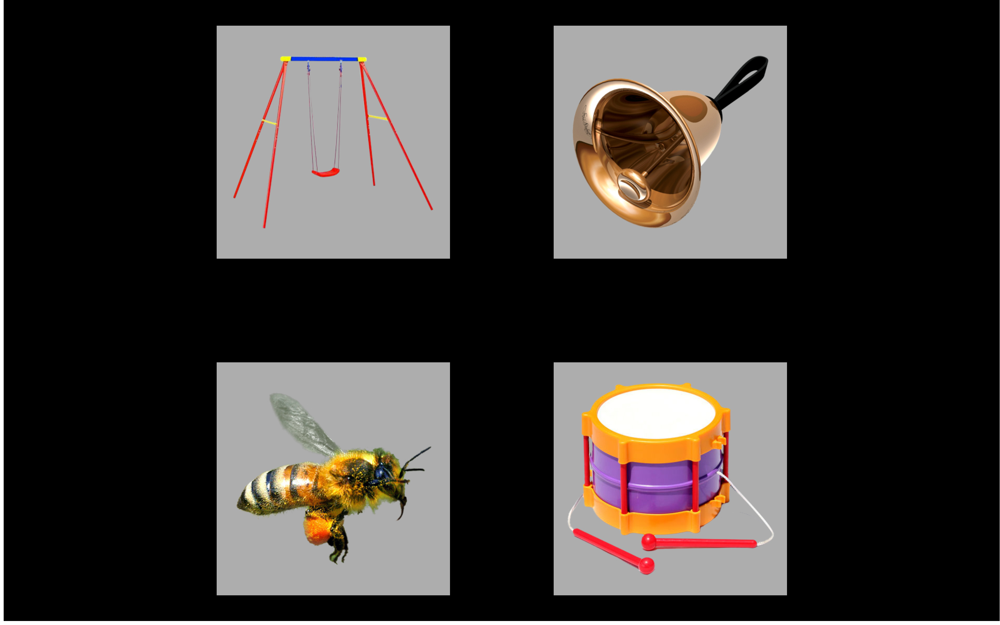

Method {#aim1-method}
===========================================================================

```{r include = FALSE}
knitr::read_chunk("./helpers.R")
if (interactive()) source("./helpers.R")
knitr::opts_chunk$set(echo = FALSE, warning = FALSE, message = FALSE)
```

```{r helpers, message = FALSE, warning = FALSE}
```


## Participants

The participants were 28–39 months-old at Time 1,
39–52 at Time 2, and 51–65 at Time 3. Approximately, 180 children
participated at Time 1, 170 at Time 2, and 160 at Time 3. Of these
children, approximately 20 were identified by their parents as late
talkers. Prospective families were interviewed over telephone before
participating in the study, and “children with an individualized
education program or any parent-reported visual problems, language
problems, or developmental delays were not scheduled for testing” 
[@RWLPaper].[^1] Recruitment and data
collection occurred at two Learning to Talk lab sites—one at the
University of Wisconsin–Madison and the other at the University of
Minnesota.

[^1]: [Appendix \@ref(related-work)](#related-work) describes how this 
      dissertation relates to other work from our lab.

Table \@ref(tab:participant-info) summarizes the cohort of children in each year of
testing. The numbers and summary statistics here are general,
describing children who participated at each year, but whose data may
have been excluded from the analyses. Some potential reasons for
exclusion include: excessive missing data during eyetracking, experiment
or technology error, developmental concerns not identified until later
in study, or a failed hearing screening. Final sample sizes will depend
on the measures needed for an analysis and the results from data
screening checks. For each project aim, I will disclose all measurements
and data exclusions following guidelines by the Center for Open Science
[@OSF_Statement].

                                          Year 1             Year 2             Year 3
----------------------------------------- ------------------ ------------------ ------------------
N                                         184                175                160
Boys, Girls                               94, 90             89, 86             82, 78
Maternal education: Low, Middle, High     15, 98, 71         12, 92, 71         6, 90, 64
Dialect: MAE, AAE                         171, 13            163, 12            153, 7
Parent-identified late talkers            20                 19                 16
Age (months): Mean (SD) [Range]           33 (3) [28–39]     45 (4) [39–52]     57 (4) [51–66]
EVT-2 standard score: Mean (SD)           115 (18)           118 (16)           118 (14)
PPVT-4 standard score: Mean (SD)          113 (17)           120 (16)           —
GFTA-2 standard score: Mean (SD)          92 (13)            —                  91 (13)

Table: (\#tab:participant-info) Participant characteristics. Education levels:
_Low_: less than high school, or high school; _Middle_: trade school, technical
or associates degree, some college, or college degree; and _High_: graduate
degree.


### Special case data screening

(_Skip for now._ This is where I review the participant notes and will remove 
children who have to be excluded for other reasons, like being diagnosed with a 
language disorder at TimePoint 3.)


## Procedure

This experiment used a version of the Visual World Paradigm for word recognition
experiments [@RWLPaper]. In eyetracking studies with toddlers, two familiar images are
usually presented: a target and a distractor. This experiment is a four-image
eyetracking task that was designed to provide a more demanding word recognition
task for preschoolers. In this procedure, four familiar images are presented
onscreen followed by a prompt to view one of the images (e.g., *find the
bell!*). The four images include the target word (e.g., *bell*), a semantically
related word (*drum*), a phonologically similar word (*bee*), and an unrelated
word (*swing*). Figure \@ref(fig:sample-vw-screen) shows an example of a trial's
items. This procedure measures a child’s real-time comprehension of
words by capturing how the child’s gaze location changes over time in
response to speech.

(ref:sample-vw-screen-cap2) Example display for the target *bell* with
the semantic foil *drum*, the phonological foil *bee*, and the unrelated
*swing*.

```{r sample-vw-screen, echo = FALSE, fig.cap = "(ref:sample-vw-screen-cap2)", out.width = "100%"}

```

## Experiment Administration

Children participating in the study were tested over two lab visits
(i.e., on different dates). The first portion of each visit involved
“watching movies”—that is, performing two blocks of eyetracking
experiments. A play break or hearing screening occurred between the two
eyetracking blocks, depending on the visit.

Each eyetracking experiment was administered as a block of trials (24 for this
experiment and 38 for a two-image task---see chapter X). Children received two
different blocks of each experiment. The blocks for an experiment differed in
trial ordering and other features. Experiment order and block selection were
counterbalanced over children and visits. For example, a child might have
received Exp. 1 Block A and Exp. 2 Block B on Visit 1 and next received Exp. 2
Block A and Exp. 1 Block B on Visit 2. The purpose of this presentation was to
control possible ordering effects where a particular experiment or block
benefited from consistently occurring first or second.

Experiments were administered using E-Prime 2.0 and a Tobii T60XL
eyetracker which recorded gaze location at a rate of 60 Hz. The
experiments were conducted by two examiners, one “behind the scenes” who
controlled the computer running the experiment and another “onstage” who
guided the child through the experiment. At the beginning of each block,
the child was positioned so the child’s eyes were approximately 60 cm
from the screen. The examiners calibrated the eyetracker to the child’s
eyes using a five-point calibration procedure (center of screen and
centers of four screen quadrants). The examiners repeated this
calibration procedure if one of the five calibration points for one of
the eyes did not calibrate successfully. During the experiment, the
behind-the-scenes examiner monitored the child’s distance from the
screen and whether the eyetracker was capturing the child’s gaze. The
onstage examiner coached the child to stay fixated on the screen and
repositioned the child as needed to ensure the child’s eyes were being
tracked. Every six or seven trials in a block of an experiment, the
experiment briefly paused with a reinforcing animation or activity.
During these breaks, the onstage examiner could reposition the child if
necessary before resuming the experiment.

We used a gaze-contingent stimulus presentation. “After 2 s of
familiarization time with the images in silence, the experiment paused
to verify that the child’s gaze was being tracked. After 300 ms of
continuous gaze tracking, the trial advanced. Otherwise, if the gaze
could not be verified after 10 s, the trial advanced. This step ensured
that for nearly every trial, the gaze was being tracked before playing
the carrier phrase, or in other words, that the child was ready to hear
the carrier stimuli” (Mahr & Edwards, in revision). During Year 1 and
Year 2, an attention-getter (e.g., *check it out*!) played 1 s following
the end of the target noun. These reinforcers were dropped in Year 3 to
streamline the experiment for older listeners.

## Stimuli

_A few sentences to reiterate what the four kinds of images represented_. A complete list of the items used in the experiment in [Appendix \@ref(vw-experiment-items)](#vw-experiment-items).


Recorded “stimuli were presented in children’s home
dialect, either Mainstream American English (MAE) or African American
English (AAE). We made an initial guess about what the home dialect was
likely to be based on a number of factors, including the recruitment
source and the child’s address. For most children, the home dialect was
MAE. If we thought the home dialect might be AAE, a native AAE speaker
who was a fluent dialect-shifter between AAE and MAE was scheduled for
the lab visit, and she confirmed the home dialect by listening to the
caregiver interact with the child during the consent procedure at the
beginning of the visit” (Mahr & Edwards, in revision). Prompts to view
the target image of a trial (e.g., *find the girl*) used the carrier
phrases “find the” and “see the”. These carriers were recording in the
frame “find/see the egg” and cross-spliced with the target nouns to
minimize coarticulatory cues on the determiner “the”.

The images used in the experiment consisted of color photographs on
gray backgrounds. These images were piloted in a preschool classroom to
ensure that children consistently used the same label for familiar
objects.


## Data screening

```{r prep-raw-data, message = FALSE, warnings = FALSE}
looks1 <- readr::read_csv("./data-raw/rwl_timepoint1_looks.csv.gz")
looks2 <- readr::read_csv("./data-raw/rwl_timepoint2_looks.csv.gz")
looks3 <- readr::read_csv("./data-raw/rwl_timepoint3_looks.csv.gz")
looks <- bind_rows(looks1, looks2, looks3) %>%
  filter(Version == "Standard")

resp_def <- create_response_def(
  primary = "Target",
  others = c("PhonologicalFoil", "SemanticFoil", "Unrelated"),
  elsewhere = "tracked",
  missing = NA)

# Keep only frames from -500 to 2000 plus or minus any frames to make the
# number of frames divisible by 3 (for binning)
times_to_keep <- looks %>%
  distinct(Time) %>%
  trim_to_bin_width(
    bin_width = 3, time_var = Time, key_time = 0, key_position = 2,
    min_time = -500, max_time = 2000) %>%
  pull(Time) %>%
  range()

raw_data <- looks %>%
  filter(between(Time, times_to_keep[1], times_to_keep[2])) %>%
  aggregate_looks(resp_def, Study + ResearchID + Time ~ GazeByImageAOI)
```

```{r aim1-screening-rules, include = FALSE}
# We use the following options for data screening.
rules <- list(
  screening_window = c(0, 2000),
  missing_data_limit = .5,
  min_trials = 12
)
```

“We mapped the gaze *x*-*y* coordinates onto the images onscreen. We
performed *deblinking* by interpolating short windows of missing data
(up to 150 ms) if the child fixated on the same image before and after a
missing data window. In other words, if the gaze did not shift to
another image, and if the missing data window was short enough, that
window was classified as a blink and interpolated, using the fixated
image as the imputed value” (Mahr & Edwards, in revision).

After mapping the gaze coordinates onto the onscreen images, we performed data
screening. We considered the time window from `r rules$screening_window[1]` to
`r rules$screening_window[2]` ms after target noun onset. We identified a trial
as _unreliable_ if at least `r rules$missing_data_limit * 100`% of the looks
were missing during the time window. We excluded an entire block of trials if it
had fewer than `r rules$min_trials` reliable trials. 

```{r apply-data-screening-rules, echo = FALSE, results = 'hide'}
# The first and last times are offset by 20 ms because we downsample our data
# into 50-ms (3-frame) bins. The frames at -16.65, 0, +16.65 ms make up the
# frames in the bin at time 0, so we need to capture the frame at -16.65. The
# same reasoning applies to the frame at 2016.65.
screening_times <- looks %>% 
  distinct(Time) %>% 
  trim_to_bin_width(
    bin_width = 3, key_time = 0, 
    key_position = 2, time_var = Time, 
    min_time = rules$screening_window[1] - 20, 
    max_time = rules$screening_window[2] + 20) %>% 
  pull(Time) %>% 
  range()
screening_times

missing_data_by_trial <- looks %>% 
  filter(screening_times[1] <= Time, Time <= screening_times[2]) %>% 
  aggregate_looks(
    resp_def, 
    Study + Version + ResearchID + Basename + TrialNo ~ GazeByImageAOI) %>% 
  mutate(BadTrial = rules$missing_data_limit <= PropNA)

bad_trial_counts <- missing_data_by_trial %>% 
  count(Study, ResearchID, Basename, BadTrial) %>% 
  tidyr::spread(BadTrial, n) %>% 
  rename(n_bad = `TRUE`, n_good = `FALSE`) %>% 
  # Replace NAs with 0, in case there were 0 good trials in a block or 
  # 0 bad trials in a block
  mutate(
    n_bad = coalesce(n_bad, 0L),
    n_good = coalesce(n_good, 0L),
    trials = n_good + n_bad,
    prop_bad = round(n_bad / trials, 2)) 

blocks_to_drop <- bad_trial_counts %>% 
  filter(.5 <= prop_bad)
blocks_to_drop

leftover_bad_trials <- missing_data_by_trial %>% 
  anti_join(blocks_to_drop, by = c("Study", "ResearchID", "Basename")) %>% 
  filter(.5 <= PropNA)

clean_looks <- looks %>% 
  anti_join(blocks_to_drop, by = c("Study", "ResearchID", "Basename")) %>% 
  anti_join(leftover_bad_trials)

data <- clean_looks %>% 
  filter(between(Time, times_to_keep[1], times_to_keep[2])) %>% 
  readr::write_csv("./data/aim1-screened.csv.gz") 
```

```{r bad-version-counts, message = FALSE}
ids_by_version <- readr::read_csv("./data-raw/rwl_timepoint1_blocks.csv") %>% 
  select(ResearchID, Basename, Version) %>% 
  split(.$Version) %>% 
  lapply(getElement, "ResearchID")

n_lost_in_bad_version <- ids_by_version$`Early attention getter` %>% 
  setdiff(ids_by_version$Standard) %>% 
  length()
```

Table \@ref(tab:screening-counts) shows the numbers of participants and trials
at each timepoint before and after data screening. There were more children in
the second timepoint than the first timepoint due to a timing error in the
initial version of this experiment, leading to the exclusion of
`r n_lost_in_bad_version` participants from the first timepoint.

```{r screening-counts, echo = FALSE}
screening_results <- list(Screened = clean_looks, Raw = looks) %>% 
  bind_rows(.id = "Dataset") %>% 
  distinct(Dataset, Study, ResearchID, Basename, TrialID) %>% 
  group_by(Dataset, Study) %>% 
  summarise(
    `N Children` = n_distinct(ResearchID),
    `N Blocks` = n_distinct(Basename),
    `N Trials` = n_distinct(TrialID)) %>% 
  ungroup()

# Add an extra set of rows computing difference
screening_results2 <- screening_results %>% 
  tidyr::gather("Stat", "Value", -Study, -Dataset) %>% 
  tidyr::spread(Dataset, Value) %>% 
  mutate(`Raw &minus; Screened` = Raw - Screened) %>% 
  tidyr::gather(Dataset, "Count", -Study, -Stat) %>% 
  tidyr::spread(Stat, Count) %>% 
  mutate(
    Dataset = Dataset %>% 
      factor(c("Raw", "Screened", "Raw &minus; Screened"))) %>% 
  select(Dataset, Study, `N Children`, `N Blocks`, `N Trials`) %>% 
  arrange(Dataset, Study) %>% 
  mutate(Dataset = Dataset %>% as.character() %>% replace_if_same_as_last(""))

knitr::kable(
  screening_results2,
  caption = glue::glue(
    "Eyetracking data before and after data screening. For convenience, the \\
     number of exclusions are included as Raw &minus; Screened."),
  booktabs = TRUE)
```


## Prepare the dataset for modeling

```{r, include = FALSE}
opts_model <- list(
  bin_width = 3,
  start_time = 250,
  end_time = 1500
)
opts_model$bin_length <- round(opts_model$bin_width * 16.67, -1)
opts_model
```

To prepare the data for modeling, we downsampled the data into
`r opts_model$bin_length`-ms (`r opts_model$bin_width`-frame) bins, “reducing
the eyetracking sampling rate from 60 Hz to 20 Hz. This procedure smoothed out
high-frequency noise in the data by pooling together data from adjacent frames”
(Mahr & Edwards, in revision). We modeled the looks from
`r opts_model$start_time` to `r opts_model$end_time` ms. Lastly, we aggregated
looks by child, study and time, and created orthogonal polynomials to use as
time features for the model.

```{r, echo = FALSE, message = FALSE, warnings = FALSE}
m_data <- data %>% 
  select(Study, ResearchID, TrialID:GazeByImageAOI) %>% 
  assign_bins(bin_width = opts_model$bin_width, Time, TrialID)

# Compute time at center of each bin
bin_times <- m_data %>% 
  distinct(Time, .bin) %>% 
  group_by(.bin) %>% 
  mutate(BinTime = round(median(Time), -1)) %>% 
  ungroup()

# Attach bin times
binned <- m_data %>% 
  left_join(bin_times, by = c("Time", ".bin")) %>% 
  ungroup() %>% 
  select(-Time) %>% 
  rename(Time = BinTime) 

resp_def <- create_response_def(
  primary = "Target",
  others = c("PhonologicalFoil", "SemanticFoil", "Unrelated"),
  elsewhere = "tracked",
  missing = NA)
  
d <- binned %>% 
  aggregate_looks(resp_def, Study + ResearchID + Time ~ GazeByImageAOI)

d_m <- d %>% 
  filter(opts_model$start_time <= Time, Time <= opts_model$end_time) %>% 
  polypoly::poly_add_columns(
    Time, degree = 3, scale_width = 1, prefix = "ot")

readr::write_csv(d_m, "./data/aim1-model-ready.csv.gz")
```


```{r spaghetti-elogit, echo = FALSE, message = FALSE, out.width = "100%", fig.height = 2.5, fig.width = 6}
# Plot the model-ready data. For this plot, we use the so-called _empirical logit_
# transformation because the regular logit (log-odds) generates too extreme of
# values for plotting. 

ggplot(d_m) + 
  aes(x = Time, y = empirical_logit(Primary, Others)) + 
  geom_line(aes(group = ResearchID), alpha = .2) + 
  stat_smooth() +
  theme_grey(base_size = 9) +
  facet_grid(. ~ Study) + 
  labs(x = "Time after target onset (smoothed to 50 ms bins)", 
       y = "Emp. logit looking to target")
```

```{r, echo = FALSE, eval = FALSE}
# Those extreme lines indicate sparse data where there are zero-to-few looks to
# the distractors compared to the target. These are the 20 most extreme bins, to 
# illustrate how empirical logit tames infinite values.

d_m %>% 
  select(Study:Time, Primary, Others) %>% 
  arrange(desc(log(Primary / Others))) %>% 
  mutate(
    logit = log(Primary / Others) %>% round(2),
    elogit = empirical_logit(Primary, Others) %>% round(2)) %>% 
  head(20) %>% 
  knitr::kable()
```

```{r raw-aim1, out.width = "50%", fig.show = 'hold', fig.height = 3, fig.width = 3, eval = FALSE}
# ## Raw data visualization
# 
# First, let's plot the overall averages from each year.

ggplot(raw_data) + 
  aes(x = Time, y = Prop, color = Study) +
  geom_hline(size = 2, color = "white", yintercept = .25) +
  stat_summary(fun.data = mean_se) +
  labs(x = "Time after target onset [ms]",
       y = "Proportion looks to target",
       caption = "Mean ± SE") +
  theme_grey(base_size = 9) +
  theme(legend.position = c(0.05, 0.95), 
        legend.justification = c(0, 1))

ggplot(raw_data) + 
  aes(x = Time, y = Prop, color = Study) +
  geom_hline(size = 2, color = "white", yintercept = .25) +
  stat_smooth() +
  labs(x = "Time after target onset [ms]",
       y = "Proportion looks to target",
       caption = "GAM smooth") +
  theme_grey(base_size = 9) +
  theme(legend.position = c(0.05, 0.95), 
        legend.justification = c(0, 1))
```

```{r clean-aim1, echo = FALSE, message = FALSE, warning = FALSE, out.width = "50%", fig.show='hold', fig.height=3, fig.width=3, eval = FALSE}
# Plot the data after partial data screening. We include the curves from the
# earlier plots in gray. The data-cleaning process slightly increases the average
# accuracy during the plateau-ed portion of the growth curve.

agg_data <- data %>% 
  aggregate_looks(resp_def, Study + ResearchID + Time ~ GazeByImageAOI)

ggplot(agg_data) + 
  aes(x = Time, y = Prop, color = Study) +
  geom_hline(size = 2, color = "white", yintercept = .25) +
  stat_summary(aes(group = Study), data = raw_data, color = "gray70") +
  stat_summary() +
  labs(
    x = "Time after target onset [ms]",
    y = "Proportion looks to target",
    caption = "Mean ± SE. Screened data drawn over raw data (gray).") +
  theme_grey(base_size = 9) +
  theme(
    legend.position = c(0.05, 0.95), 
    legend.justification = c(0, 1))

ggplot(agg_data) + 
  aes(x = Time, y = Prop, color = Study) +
  geom_hline(size = 2, color = "white", yintercept = .25) +
  stat_smooth(aes(group = Study), data = raw_data, color = "gray70") +
  stat_smooth() +
  labs(
    x = "Time after target onset [ms]",
    y = "Proportion looks to target",
    caption = "GAM smooth. Screened data drawn over raw data (gray).") +
  guides(colour = guide_legend(override.aes = list(fill = NA))) + 
  theme_grey(base_size = 9) +
  theme(
    legend.position = c(0.05, 0.95), 
    legend.justification = c(0, 1))
```

```{r spaghetti-aim1, out.width = "100%", fig.height = 2.5, fig.width = 6, include = FALSE, eval = FALSE}
# The raw data plainly confirm hypothesis 1:
# 
# > Children’s accuracy and efficiency of recognizing words will improve each year.
# 
# We can also plot a spaghetti plot to invidual lines for each participant. We see
# that they tighten from year to year.

ggplot(raw_data) + 
  aes(x = Time, y = Prop, group = ResearchID) +
  geom_hline(size = 2, color = "white", yintercept = .25) +
  geom_line(alpha = .15) +
  facet_grid(~ Study) +
  theme_grey(base_size = 9) +
  labs(x = "Time after target onset [ms]",
       y = "Proportion looks to target",
       caption = "Lines: Individual participants") +
  theme(legend.position = c(0.05, 0.95), 
        legend.justification = c(0, 1))
```

