Analyze familiar word recognition
===========================================================================

Next steps:

- Model year over year changes.
- Download test scores and individual differences. 
- Analyze individual differences


## Data preparation

Earlier we cleaned the data to remove trials with excessive missing data 
and blocks of trials with too few trials. Now we prepare the data for modelling.


```r
opts_model <- list(
  bin_width = 3,
  start_time = 250,
  end_time = 1500
)
opts_model$bin_length <- round(opts_model$bin_width * 16.67, -1)
opts_model
#> $bin_width
#> [1] 3
#> 
#> $start_time
#> [1] 250
#> 
#> $end_time
#> [1] 1500
#> 
#> $bin_length
#> [1] 50
```

We next downsample the data into 50 ms
(3-frame) bins in order to smooth the data. We will model
the looks from 250 to 1500 ms, so we
filter down to that time window. Lastly, we aggregate looks by child, study and
time, and create orthogonal polynomials to use as time features for the model


```r
data <- readr::read_csv("./data/aim1-screened.csv.gz") %>% 
  select(Study, ResearchID, TrialID:GazeByImageAOI) %>% 
  assign_bins(bin_width = opts_model$bin_width, Time, TrialID)

# Compute time at center of each bin
bin_times <- data %>% 
  distinct(Time, .bin) %>% 
  group_by(.bin) %>% 
  mutate(BinTime = round(median(Time), -1)) %>% 
  ungroup()

# Attach bin times
binned <- data %>% 
  left_join(bin_times, by = c("Time", ".bin")) %>% 
  ungroup() %>% 
  select(-Time) %>% 
  rename(Time = BinTime) 

resp_def <- create_response_def(
  primary = "Target",
  others = c("PhonologicalFoil", "SemanticFoil", "Unrelated"),
  elsewhere = "tracked",
  missing = NA
)  
  
d <- binned %>% 
  aggregate_looks(resp_def, Study + ResearchID + Time ~ GazeByImageAOI)

d_m <- d %>% 
  filter(opts_model$start_time <= Time, 
         Time <= opts_model$end_time) %>% 
  polypoly::poly_add_columns(Time, degree = 3, 
                             scale_width = 1, prefix = "ot")
```

Plot the model-ready data. For this plot, we use the so-called _empirical logit_
transformation because the regular logit (log-odds) generates too extreme of
values for plotting. 

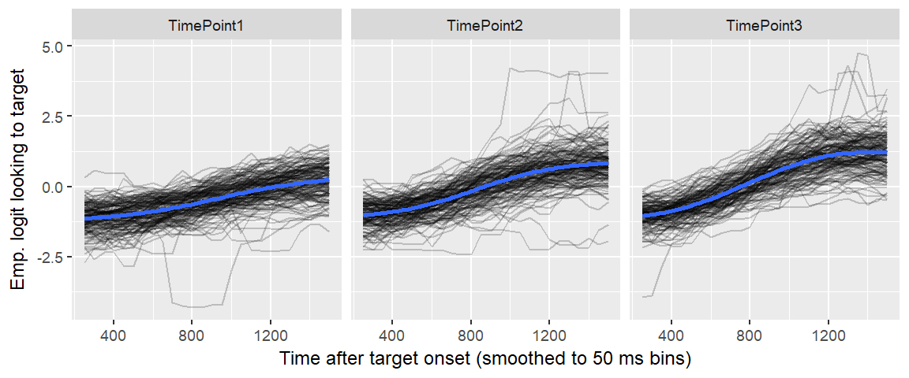

Those extreme lines indicate sparse data where there are zero-to-few looks to
the distractors compared to the target. These are the 20 most extreme bins, to 
illustrate how empirical logit tames infinite values.


Study        ResearchID    Time   Primary   Others   logit   elogit
-----------  -----------  -----  --------  -------  ------  -------
TimePoint2   607L          1300        30        0     Inf     4.11
TimePoint2   607L          1350        29        0     Inf     4.08
TimePoint2   640L          1000        33        0     Inf     4.20
TimePoint2   640L          1050        29        0     Inf     4.08
TimePoint2   640L          1100        31        0     Inf     4.14
TimePoint2   640L          1150        30        0     Inf     4.11
TimePoint2   640L          1200        27        0     Inf     4.01
TimePoint2   640L          1250        24        0     Inf     3.89
TimePoint2   640L          1300        27        0     Inf     4.01
TimePoint2   640L          1350        26        0     Inf     3.97
TimePoint2   640L          1400        28        0     Inf     4.04
TimePoint2   640L          1450        27        0     Inf     4.01
TimePoint2   640L          1500        28        0     Inf     4.04
TimePoint3   014L          1350        58        0     Inf     4.76
TimePoint3   014L          1400        53        0     Inf     4.67
TimePoint3   640L          1300       110        1    4.70     4.30
TimePoint3   037L          1350        88        1    4.48     4.08
TimePoint3   037L          1300        87        1    4.47     4.07
TimePoint3   037L          1250        84        1    4.43     4.03
TimePoint3   640L          1100        94        2    3.85     3.63


## Maximum likelihood results

Fit a maximum likelihood model as a first pass for the analysis. We won't fit
the model automatically (whenever this page is updated). It's too time
consuming. Instead, we do it manually here, and save the results.


```r
library(lme4)
m <- glmer(
    cbind(Primary, Others) ~
      (ot1 + ot2 + ot3) * Study +
      (ot1 + ot2 + ot3 | ResearchID/Study),
    family = binomial,
    data = d_m)
readr::write_rds(m, "./data/aim1_cubic_model.rds.gz")
```

And reload the saved model here.


```r
library(lme4)
#> Loading required package: Matrix
#> Loading required package: methods
m <- readr::read_rds("./data/aim1_cubic_model.rds.gz")
arm::display(m)
#> glmer(formula = cbind(Primary, Others) ~ (ot1 + ot2 + ot3) * 
#>     Study + (ot1 + ot2 + ot3 | ResearchID/Study), data = d_m, 
#>     family = binomial)
#>                     coef.est coef.se
#> (Intercept)         -0.47     0.03  
#> ot1                  1.58     0.06  
#> ot2                  0.05     0.04  
#> ot3                 -0.17     0.03  
#> StudyTimePoint2      0.41     0.03  
#> StudyTimePoint3      0.70     0.04  
#> ot1:StudyTimePoint2  0.56     0.08  
#> ot1:StudyTimePoint3  1.10     0.08  
#> ot2:StudyTimePoint2 -0.16     0.05  
#> ot2:StudyTimePoint3 -0.35     0.05  
#> ot3:StudyTimePoint2 -0.12     0.04  
#> ot3:StudyTimePoint3 -0.21     0.04  
#> 
#> Error terms:
#>  Groups           Name        Std.Dev. Corr              
#>  Study:ResearchID (Intercept) 0.30                       
#>                   ot1         0.68      0.18             
#>                   ot2         0.44     -0.12  0.03       
#>                   ot3         0.29     -0.09 -0.44 -0.05 
#>  ResearchID       (Intercept) 0.27                       
#>                   ot1         0.46      0.86             
#>                   ot2         0.09     -0.98 -0.84       
#>                   ot3         0.03     -0.92 -0.98  0.92 
#>  Residual                     1.00                       
#> ---
#> number of obs: 12584, groups: Study:ResearchID, 484; ResearchID, 195
#> AIC = 74467.3, DIC = -61745.9
#> deviance = 6328.7

d_m$cubic_fit <- fitted(m)

ggplot(d_m) + 
  aes(x = Time, y = cubic_fit) + 
  geom_line(aes(group = ResearchID), alpha = .2) + 
  facet_grid(. ~ Study) + 
    labs(
      x = "Time after target onset (smoothed to 50 ms bins)",
      y = "Proportion looks to target (fitted)") +
  theme_grey(base_size = 9) 
```

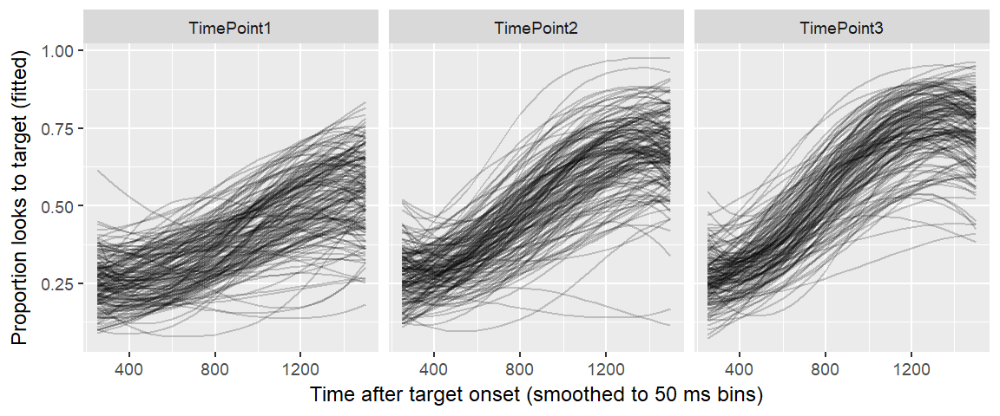

### What's being captured by the random effects? 

First, let's plot just the fixed effect predictions.


```r
predict_y <- function(...) predict(..., type = "response")
d_m$fixef_fit <- predict_y(m, re.form = ~ 0)
d_m$subj_fit  <- predict_y(m, re.form = ~ (ot1 + ot2 + ot3 | ResearchID))
d_m$study_fit <- predict_y(m, re.form = ~ (ot1 + ot2 + ot3 | Study:ResearchID))
d_m$full_fit  <- predict_y(m, re.form = ~ (ot1 + ot2 + ot3 | Study:ResearchID) + 
                            (ot1 + ot2 + ot3 | ResearchID))

ggplot(d_m) + 
  aes(x = Time, y = fixef_fit) + 
  geom_line(aes(group = ResearchID), alpha = .2) + 
  facet_grid(. ~ Study) + 
  theme_grey(base_size = 9) +
  labs(
    x = "Time after target onset (smoothed to 50 ms bins)",
    y = "Proportion looks to target (fitted)",
    caption = "Conditioned on no random effects") 
```


Now, we condition on child level effects. 


```r
ggplot(d_m) + 
  aes(x = Time, y = subj_fit) + 
  geom_line(aes(group = ResearchID), alpha = .2) + 
  facet_grid(. ~ Study) + 
  theme_grey(base_size = 9) +
  labs(
    x = "Time after target onset (smoothed to 50 ms bins)",
    y = "Proportion looks to target (fitted)",
    caption = "Conditioned on Child effects") 
```

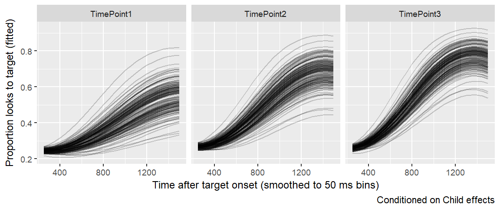

```r

ggplot(d_m) + 
  aes(x = Time, y = subj_fit - fixef_fit) + 
  geom_line(aes(group = ResearchID), alpha = .2) + 
  facet_grid(. ~ Study) + 
  theme_grey(base_size = 9) +
  labs(
    x = "Time after target onset (smoothed to 50 ms bins)",
    y = "Child-conditioned minus study means") 
```

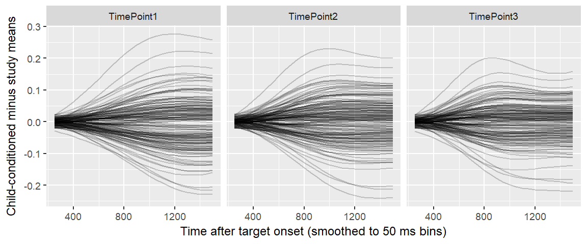

It looks like the range of y values is
smaller in TimePoint2 and TimePoint3, but could that just be the different
numbers of participants who contribute to each study?


```r
d_m %>% 
  distinct(ResearchID, Study) %>% 
  count(Study) %>% 
  rename(`Num children in model` = n) %>% 
  knitr::kable()
```


Study         Num children in model
-----------  ----------------------
TimePoint1                      163
TimePoint2                      165
TimePoint3                      156

Now we condition on Study x Child effects. These would be capturing the
subject-x-study variability.


```r
ggplot(d_m) +
  aes(x = Time, y = study_fit) +
  geom_line(aes(group = ResearchID), alpha = .2) +
  facet_grid(. ~ Study) +
  theme_grey(base_size = 9) +
  labs(
    x = "Time after target onset (smoothed to 50 ms bins)",
    y = "Proportion looks to target (fitted)",
    caption = "Conditioned on Study x Child effects")
```

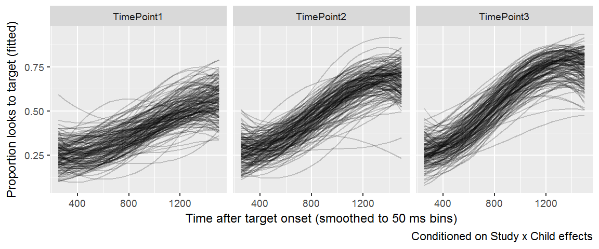

```r

ggplot(d_m) +
  aes(x = Time, y = study_fit - fixef_fit) +
  geom_line(aes(group = ResearchID), alpha = .2) +
  facet_grid(. ~ Study) +
  theme_grey(base_size = 9) +
  labs(
    x = "Time after target onset (smoothed to 50 ms bins)",
    y = "Child-x-Study-conditioned minus study means")
```

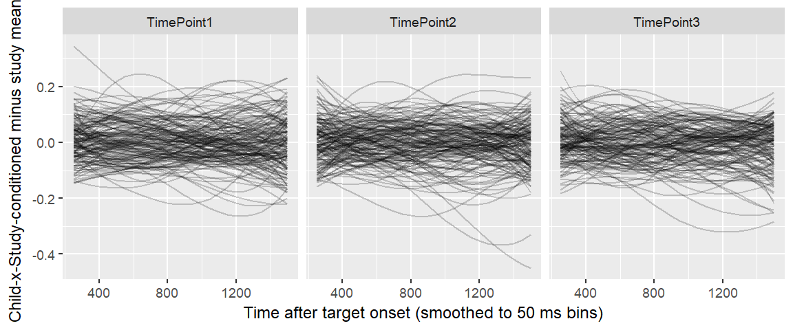

Look for weak spots in the time series.


```r
d_corr <- d_m %>% 
  group_by(Time, Study) %>% 
  summarise(r = cor(Prop, cubic_fit)) 

ggplot(d_corr) + 
  aes(x = Time, y = r, color = Study) + 
  geom_point(shape = 1, size = 3) + 
  ylim(c(.8, 1)) + 
  labs(
    x = "Time after target onset (smoothed to 50 ms bins)",
    y = "Correlation of fitted and observed") + 
  theme_grey(base_size = 9) +
  theme(
    legend.position = c(0.025, 0.05), 
    legend.justification = c(0, 0)) 
```

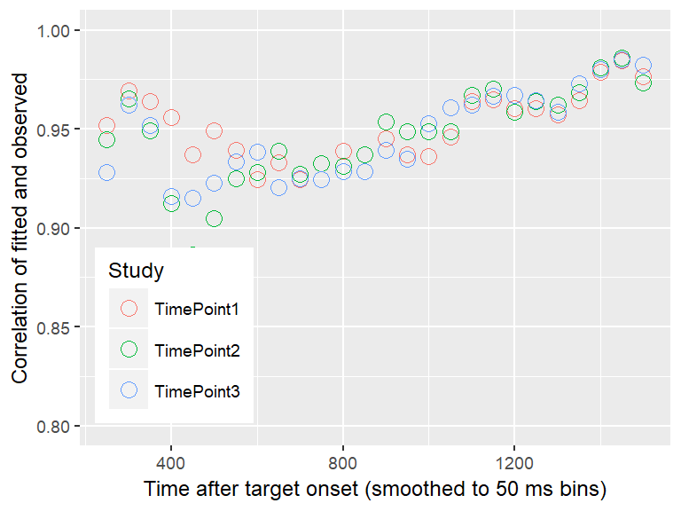

Rank the participants by their growth curve parameters---that is, the growth
curve features when conditioned on child ID.


```r
xstudy_effects <- m %>% 
  ranef() %>% 
  getElement("ResearchID") %>% 
  tibble::rownames_to_column("ResearchID") %>% 
  as_tibble() %>% 
  select(ResearchID, intercept = `(Intercept)`, slope = ot1)

top_20 <- top_n(xstudy_effects, 20, slope)
bot_20 <- top_n(xstudy_effects, 20, -slope)
```


```r
ggplot(d_m %>% filter(Study == "TimePoint2")) + 
  aes(x = Time, y = subj_fit) + 
  geom_line(aes(group = ResearchID), alpha = .2) +
  geom_line(aes(group = ResearchID), 
            data = semi_join(d_m, top_20) %>% filter(Study == "TimePoint2"), 
            size = .7, color = "#0074D9") + 
  geom_line(aes(group = ResearchID), 
            data = semi_join(d_m, bot_20) %>% filter(Study == "TimePoint2"), 
            size = .7, color = "#FF4136") + 
  theme_grey(base_size = 9) +
  labs(y = "TP2 fits conditioned on Child effects", 
       x = "Time after target onset (smoothed to 50 ms bins)",
       caption = "Colors: Top 20 and bottom 20 children by linear time effect")
#> Joining, by = "ResearchID"
#> Joining, by = "ResearchID"
```

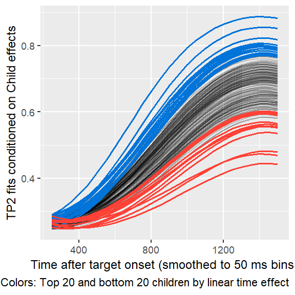

Visualize the model fits for the top and bottom 20 children. This plot
illustrates that the children with strongest and weakest linear time components
overall stay clustered away from each other when looking study level
predictions. That is, the top 20 in general perform bunch together in all three
studies.


```r
ggplot(d_m) + 
  aes(x = Time, y = cubic_fit) + 
  geom_line(aes(group = ResearchID), alpha = .2) +
  geom_line(aes(group = ResearchID), data = semi_join(d_m, top_20), 
            size = .7, color = "#0074D9") + 
  geom_line(aes(group = ResearchID), data = semi_join(d_m, bot_20), 
            size = .7, color = "#FF4136") + 
  facet_grid(. ~ Study) + 
  theme_grey(base_size = 9) +
  labs(y = "Proportion looks to target [model fits]", 
       x = "Time after target onset (smoothed to 50 ms bins)",
       caption = "Colors: Top 20 and bottom 20 children by linear time effect")
#> Joining, by = "ResearchID"
#> Joining, by = "ResearchID"
```


To confirm that this differences are not just an artifact of modeling, visualize
the ranks on the observed data.


```r
ggplot(d_m) + 
  aes(x = Time, y = Prop) + 
  geom_line(aes(group = ResearchID), alpha = .2) +
  geom_line(aes(group = ResearchID), data = semi_join(d_m, top_20), 
            size = .7, color = "#0074D9") + 
  geom_line(aes(group = ResearchID), data = semi_join(d_m, bot_20), 
            size = .7, color = "#FF4136") + 
  facet_grid(. ~ Study) + 
  labs(y = "Proportion looks to target", 
       x = "Time after target onset (smoothed to 50 ms bins)",
       caption = "Colors: Top 20 and bottom 20 children by linear time effect")
#> Joining, by = "ResearchID"
#> Joining, by = "ResearchID"
```

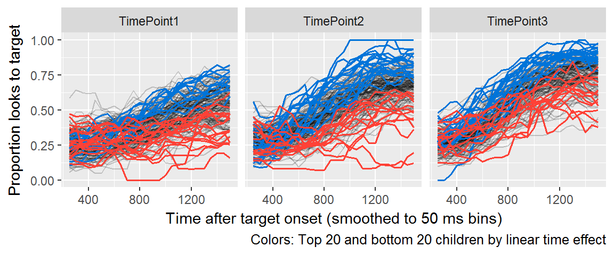

Open questions:

* How to test for stability of individual differences over time? 
  + Intuitively, I would say that the differences are unstable if the red and 
    blue lines got shuffled in each study. What stats formalize this intuition?


## Bayesian model results

Here is the code used to fit the model with Stan. It took about 24 hours to run
the model. The regression terms have the prior Normal(0, 1)


```r
library(rstanarm)
options(mc.cores = parallel::detectCores())

m <- stan_glmer(
  cbind(Primary, Others) ~
    (ot1 + ot2 + ot3) * Study +
    (ot1 + ot2 + ot3 | ResearchID/Study),
  family = binomial,
  prior = normal(0, 1),
  prior_intercept = normal(0, 5),
  prior_covariance = decov(2, 1, 1),
  data = d_m)
readr::write_rds(m, "./data/stan_aim1_cubic_model.rds.gz")
```

Let's try to understand our model by making some plots.

### Fixed effects plots

First, let's prepare to plot the intervals for the fixed effects.


```r
library(rstanarm)
#> Loading required package: Rcpp
#> rstanarm (Version 2.15.3, packaged: 2017-04-29 06:18:44 UTC)
#> - Do not expect the default priors to remain the same in future rstanarm versions.
#> Thus, R scripts should specify priors explicitly, even if they are just the defaults.
#> - For execution on a local, multicore CPU with excess RAM we recommend calling
#> options(mc.cores = parallel::detectCores())
library(bayesplot)
#> This is bayesplot version 1.4.0.9000
#> - Plotting theme set to bayesplot::theme_default()
#> - Online documentation at mc-stan.org/bayesplot
theme_set(theme_grey())
library(stringr)
library(ggstance)
#> 
#> Attaching package: 'ggstance'
#> The following objects are masked from 'package:ggplot2':
#> 
#>     geom_errorbarh, GeomErrorbarh
parse_text <- function(x) parse(text = x)

b <- readr::read_rds("./data/stan_aim1_cubic_model.rds.gz")
b
#> stan_glmer
#>  family:  binomial [logit]
#>  formula: cbind(Primary, Others) ~ (ot1 + ot2 + ot3) * Study + (ot1 + ot2 + 
#> 	   ot3 | ResearchID/Study)
#> ------
#> 
#> Estimates:
#>                     Median MAD_SD
#> (Intercept)         -0.5    0.0  
#> ot1                  1.6    0.1  
#> ot2                  0.0    0.0  
#> ot3                 -0.2    0.0  
#> StudyTimePoint2      0.4    0.0  
#> StudyTimePoint3      0.7    0.0  
#> ot1:StudyTimePoint2  0.6    0.1  
#> ot1:StudyTimePoint3  1.1    0.1  
#> ot2:StudyTimePoint2 -0.2    0.0  
#> ot2:StudyTimePoint3 -0.4    0.1  
#> ot3:StudyTimePoint2 -0.1    0.0  
#> ot3:StudyTimePoint3 -0.2    0.0  
#> 
#> Error terms:
#>  Groups           Name        Std.Dev. Corr             
#>  Study:ResearchID (Intercept) 0.305                     
#>                   ot1         0.691     0.20            
#>                   ot2         0.437    -0.11  0.02      
#>                   ot3         0.294    -0.11 -0.44 -0.06
#>  ResearchID       (Intercept) 0.264                     
#>                   ot1         0.423     0.78            
#>                   ot2         0.125    -0.75 -0.56      
#>                   ot3         0.058    -0.23 -0.31  0.19
#> Num. levels: Study:ResearchID 484, ResearchID 195 
#> 
#> Sample avg. posterior predictive 
#> distribution of y (X = xbar):
#>          Median MAD_SD
#> mean_PPD 49.9    0.1  
#> 
#> ------
#> For info on the priors used see help('prior_summary.stanreg').

summary(b, pars = names(fixef(b)))
#> 
#> Model Info:
#> 
#>  function:  stan_glmer
#>  family:    binomial [logit]
#>  formula:   cbind(Primary, Others) ~ (ot1 + ot2 + ot3) * Study + (ot1 + ot2 + 
#> 	   ot3 | ResearchID/Study)
#>  algorithm: sampling
#>  priors:    see help('prior_summary')
#>  sample:    4000 (posterior sample size)
#>  num obs:   12584
#>  groups:    Study:ResearchID (484), ResearchID (195)
#> 
#> Estimates:
#>                       mean   sd   2.5%   25%   50%   75%   97.5%
#> (Intercept)         -0.5    0.0 -0.5   -0.5  -0.5  -0.4  -0.4   
#> ot1                  1.6    0.1  1.4    1.5   1.6   1.6   1.7   
#> ot2                  0.0    0.0  0.0    0.0   0.0   0.1   0.1   
#> ot3                 -0.2    0.0 -0.2   -0.2  -0.2  -0.2  -0.1   
#> StudyTimePoint2      0.4    0.0  0.3    0.4   0.4   0.4   0.5   
#> StudyTimePoint3      0.7    0.0  0.6    0.7   0.7   0.7   0.8   
#> ot1:StudyTimePoint2  0.6    0.1  0.4    0.5   0.6   0.6   0.7   
#> ot1:StudyTimePoint3  1.1    0.1  0.9    1.0   1.1   1.2   1.3   
#> ot2:StudyTimePoint2 -0.2    0.1 -0.3   -0.2  -0.2  -0.1  -0.1   
#> ot2:StudyTimePoint3 -0.4    0.1 -0.5   -0.4  -0.4  -0.3  -0.3   
#> ot3:StudyTimePoint2 -0.1    0.0 -0.2   -0.1  -0.1  -0.1   0.0   
#> ot3:StudyTimePoint3 -0.2    0.0 -0.3   -0.2  -0.2  -0.2  -0.1   
#> 
#> Diagnostics:
#>                     mcse Rhat n_eff
#> (Intercept)         0.0  1.0  1086 
#> ot1                 0.0  1.0   857 
#> ot2                 0.0  1.0   842 
#> ot3                 0.0  1.0  1156 
#> StudyTimePoint2     0.0  1.0  1034 
#> StudyTimePoint3     0.0  1.0   959 
#> ot1:StudyTimePoint2 0.0  1.0   674 
#> ot1:StudyTimePoint3 0.0  1.0   934 
#> ot2:StudyTimePoint2 0.0  1.0   836 
#> ot2:StudyTimePoint3 0.0  1.0   762 
#> ot3:StudyTimePoint2 0.0  1.0  1183 
#> ot3:StudyTimePoint3 0.0  1.0  1390 
#> 
#> For each parameter, mcse is Monte Carlo standard error, n_eff is a crude measure of effective sample size, and Rhat is the potential scale reduction factor on split chains (at convergence Rhat=1).

prior_summary(b)
#> Priors for model 'b' 
#> ------
#> Intercept (after predictors centered)
#>  ~ normal(location = 0, scale = 5)
#> 
#> Coefficients
#>  ~ normal(location = [0,0,0,...], scale = [1,1,1,...])
#>      **adjusted scale = [3.33,3.33,3.33,...]
#> 
#> Covariance
#>  ~ decov(reg. = 2, conc. = 1, shape = 1, scale = 1)
#> ------
#> See help('prior_summary.stanreg') for more details
```

Below the TimePoint2, TimePoint3, Time x TimePoint2, and Time x TimePoint3 
effects confirm that children get more reliable and faster each year of the 
study. Only the Time^2^ effect is near 0, which does not matter. We mostly care
about the intercept and time terms.

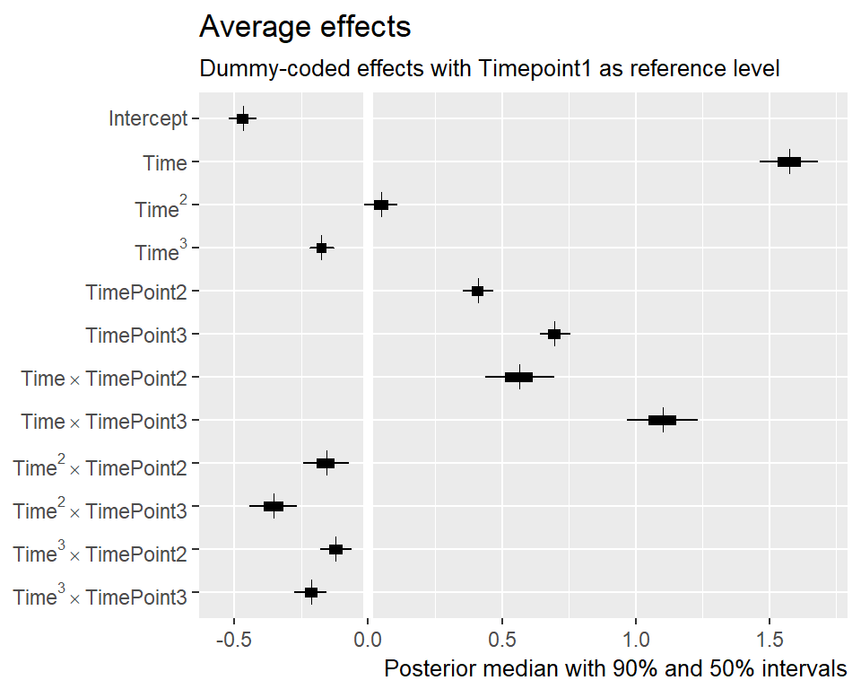

Now, let's undo interactions by adding year 1 main effects to interaction 
effects and plot the effects for each year of the study. For each effect, there
appears to be a linear trend in the change from TP1 to TP2 and from TP2 to TP3.


Compute pairwise comparisons.


Bayesplot supports transformations so we could invert the log-odds measure to
see the intercepts (area under curve/average accuracy) in proportion units.


parameter                   outer   inner      ll       l       m       h      hh
-------------------------  ------  ------  ------  ------  ------  ------  ------
plogis(Intercept~~(TP1))      0.9     0.5   0.372   0.380   0.385   0.390   0.397
plogis(Intercept~~(TP2))      0.9     0.5   0.473   0.480   0.485   0.490   0.498
plogis(Intercept~~(TP3))      0.9     0.5   0.544   0.551   0.557   0.562   0.569

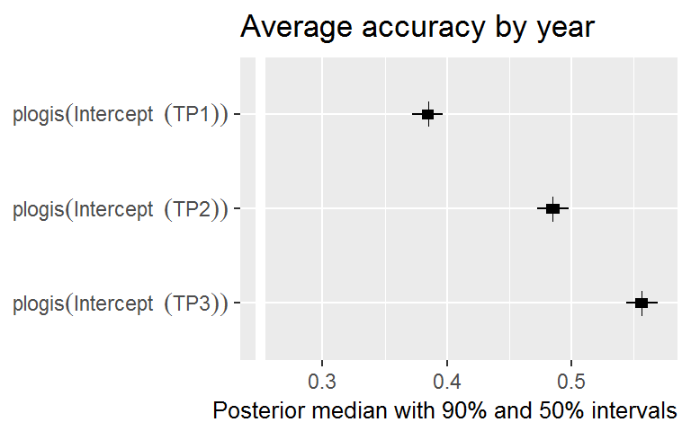

We can compute differences in average accuracy as well.

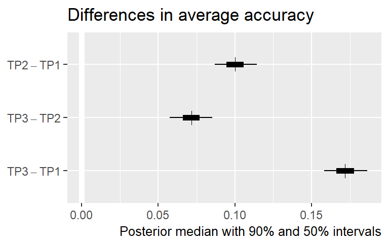


The average accuracy was 0.385 [90% UI: 0.372--0.397] for timepoint
1, 0.485 [0.473--0.498] for timepoint 2, and 0.557 [0.544--0.569]
for timepoint 3. The average accuracy increased by 0.1
[0.087--0.114] from timepoint 1 to timepoint 2 and by 0.072
[0.058--0.085] from timepoint 2 to timepoint 3.


### Plot the intervals for the random effect parameters

These are the parameters governing the random effect distributions. First, we
plot the standard deviations.

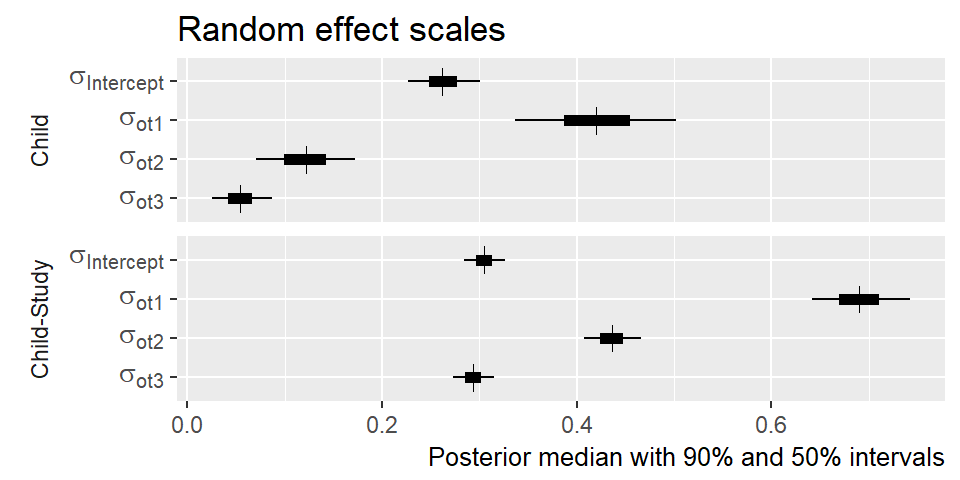

Then the correlations.

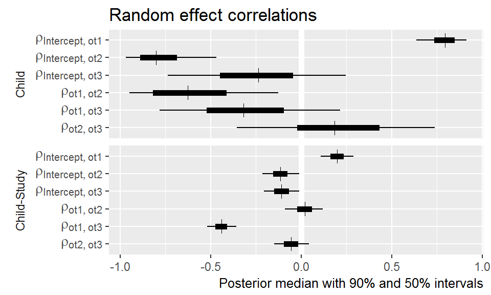


### Check for stable individual differences


We predicted that children would show stable individual differences such that
children who are faster and more accurate at recognizing words at age 3 remain
relatively faster and more accurate at age 5. To evaluate this hypothesis,
we used Kendall's _W_ (the coefficient of correspondence or concordance). This
nonparametric statistic measures the degree of agreement among _J_ judges who
are rating _I_ items. For our purposes, the items are the 123
children who provided reliable eyetracking for all three years of the study.
(That is, we excluded children who only had reliable eyetracking data for one or
two years.) The judges are the sets of growth curve parameters from each year of 
study. For example, the intercept term provides three sets of ratings: The 
participants' intercept terms from year 1 are one set of ratings and the 
terms from years 2 and 3 provide two more sets of ratings. These three ratings
are the "judges" used to compute the intercept's _W_. Thus, we compute four sets
of _W_ coefficients, one for each set of growth curve features: Intercept,
Time^1^, Time^2^, and Time^3^.

(Maybe: Table X illustrates 
some sample ratings of these participants.)


Participant ID   Growth curve feature               Year 1              Year 2       Year 3
---------------  ---------------------  ------------------  ------------------  -----------
640L             intercept                      0.09 (006)          1.78 (001)   1.53 (001)
040L             intercept                      0.02 (009)          0.31 (017)   1.18 (002)
080L             intercept               &minus;0.02 (013)          0.77 (005)   1.09 (003)
037L             intercept               &minus;0.33 (052)   &minus;0.03 (060)   0.95 (004)
043L             intercept                      0.22 (002)          0.87 (003)   0.94 (005)
050L             intercept               &minus;0.39 (063)          0.45 (008)   0.92 (006)
014L             intercept               &minus;0.06 (015)          0.05 (047)   0.92 (007)
090L             intercept               &minus;0.10 (019)   &minus;0.20 (088)   0.90 (008)
106L             intercept               &minus;0.06 (016)          0.88 (002)   0.86 (009)
674L             intercept               &minus;0.03 (014)          0.21 (024)   0.79 (010)

Because we used a Bayesian model, we have a distribution of ratings and thus a
distribution of concordance statistics. Each sample of the posterior
distribution fits a growth curve for each child in each study, so each sample
provides a set of ratings for concordance coefficients. The distribution of
_W_'s lets us quantify our uncertainty because we can compute _W_'s for each of 
the 4000 samples from the posterior distribution.

One final matter is how do we assess whether a concordance statistic is 
meaningful. To tackle this question, we also included a "null rater", a fake 
parameter that assigned each child in each year a random number. We can use the 
distribution of _W_'s generated by randomly rating children as a benchmark for 
assessing whether the other concordance statistics differ meaningfully from 
chance.

We used the `kendall()` function in the `irr` package (vers.
0.84, CITATION) to compute concordance statistics.

(ref:kendall-stats) Uncertainty intervals for the Kendall's coefficient of
concordance. Random ratings provide a baseline of null _W_ statistics. The
intercept and linear time features are decisively non-null, indicating a
significant degree of correspondence in children's relative word recognition
reliability and efficiency over three years of study.

<div class="figure">

<p class="caption">(\#fig:kendall-stats)(ref:kendall-stats)</p>
</div>


Figure \@ref(fig:kendall-stats) depicts uncertainty intervals for the Kendall
_W_'s for these growth curve features. The 90% uncertainty interval of _W_
statistics from random ratings [0.275--0.392] subsumes the
intervals for the Time^2^ effect [0.295--0.351] and the Time^3^ effect
[0.276--0.348], indicating that these values do not differentiate
children in a longitudinally stable way. That is, the Time^2^ and Time^3^
features differentiate children across studies as well as random numbers.
Earlier, we stated that only the intercept and linear terms have psychologically
meaningful interpretations and that the higher-order terms of these models serve
to capture the shape of the growth curve data. These statistics support that
assertion.

Concordance is strongest for the intercept term, _W_\ = 0.585
[0.573--0.596] followed by the linear time term, _W_\ = `r
w_pts[["Time"]]` [0.483--0.518]. Because these values are from the
statistics for random ratings, we conclude that there is a credible degree of
correspondence across studies when we rank children using their average accuracy
(the intercept) or their growth curve slope (linear time).

#### Summary of this section 

Growth curve features reflect individual differences in word recognition
efficiency and accuracy. By using Kendall's _W_ to measure the degree of
concordance among growth curve features over time, we can measure whether
individual differences in lexical processing are stable over time. We found 
that the intercept and linear time terms were stable over time.


### Posterior predictive checks

Next, we let's check how well the model can simulate the observed data.


```r
rstanarm::pp_check(b, nreps = 200, seed = "09272017") + 
  labs(
    x = "Proportion of looks", 
    title = "Observed data and 200 posterior simulations") +
  guides(color = "none") +
  coord_cartesian(xlim = c(0, 1))
```

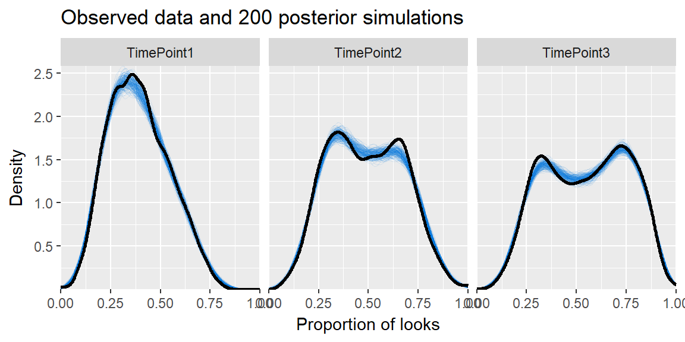


### Look at some predictions

Plot the posterior predictions for random participants. This is the model 
simulating new data for these participants.


```r
set.seed(09272017)

ppred <- d_m %>% 
  sample_n_of(8, ResearchID) %>% 
  tristan::augment_posterior_predict(b, newdata = ., nsamples = 100) %>% 
  mutate(trials = Primary + Others)

ggplot(ppred) + 
  aes(x = Time, y = Prop, color = Study, group = Study) + 
  geom_line(aes(y = .posterior_value / trials, 
                group = interaction(.draw, Study)), 
            alpha = .20) + 
  geom_line(size = 1, color = "grey50") + 
  facet_wrap("ResearchID") + 
  theme(
    legend.position = c(.95, 0), 
    legend.justification = c(1, 0),
    legend.margin = margin(0)) +
  guides(color = guide_legend(title = NULL, override.aes = list(alpha = 1))) +
  labs(
    title = "Observed means and 100 simulations of new data",
    x = "Time after target onset",
    y = "Proportion looks to target") 
```

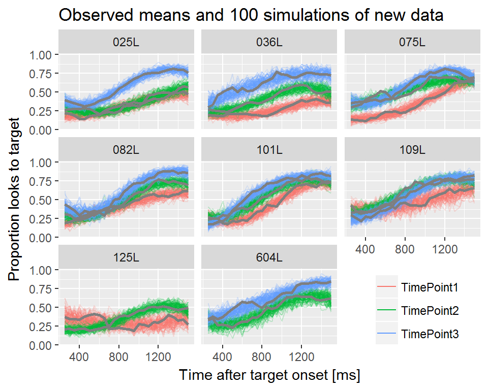

Or we can plot the linear predictions. These are posterior predictions of the
log-odds of looking to target before adding binomial noise.


```r
lpred <- d_m %>% 
  sample_n_of(8, ResearchID) %>% 
  tristan::augment_posterior_linpred(b, newdata = ., nsamples = 100)

ggplot(lpred) + 
  aes(x = Time, y = .posterior_value, color = Study) +
  geom_line(aes(group = interaction(Study, ResearchID, .draw)), 
            alpha = .1) +
  facet_wrap("ResearchID") + 
  geom_point(aes(y = qlogis(Prop)), shape = 1) + 
  theme(
    legend.position = c(.95, 0), 
    legend.justification = c(1, 0),
    legend.margin = margin(0)) +
  guides(color = guide_legend(title = NULL, override.aes = list(alpha = 1))) +
  labs(
    title = "Observed data and 100 posterior predictions",
    x = "Time after target onset",
    y = "Posterior log-odds")
```

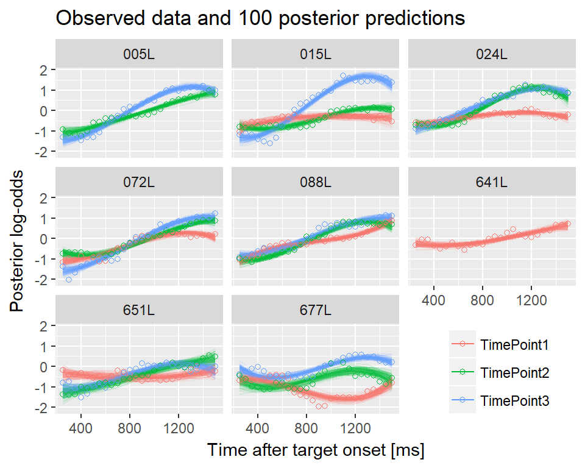

We can also consider predictions for hypothetical, new children as well. This
procedure lets us explore the range of variability in performance at each age.
In this case, the model has learned to predict less accurate and more spread out
performance at age 3, and improved accuaracy and decreased variability at age 4
and moreso at age 5.


```r
dummy_data <- d_m %>% 
  distinct(Study, Time, ot1, ot2, ot3) %>% 
  mutate(ResearchID = "NEW",
         Primary = 0, 
         Others = 0)

lpred <- dummy_data %>% 
  tristan::augment_posterior_linpred(b, newdata = ., nsamples = 1000)

ggplot(lpred) + 
  aes(x = Time, y = plogis(.posterior_value), color = Study) +
  geom_hline(yintercept = .25, size = 2, color = "white") +
  geom_line(aes(group = interaction(Study, .draw)), 
            alpha = .1, show.legend = FALSE) +
  facet_wrap("Study") + 
  guides(color = guide_legend("none")) +
  labs(
    title = "Posterior predictions for 1,000 new participants",
    x = "Time after target onset",
    y = "Proportion looks to target")
```

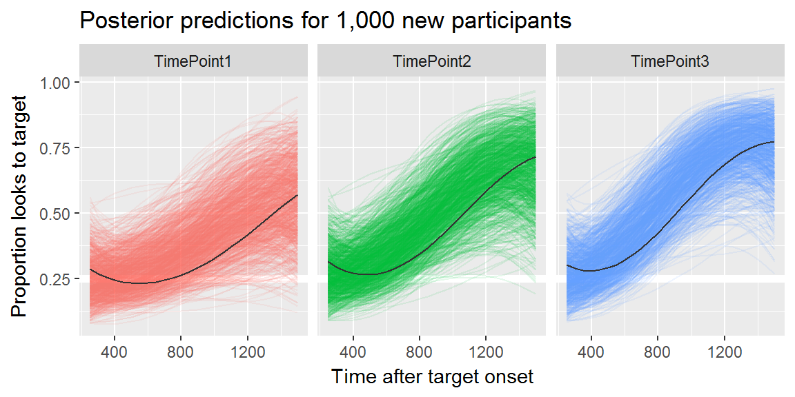

```r

ggplot(lpred) + 
  aes(x = Time, y = plogis(.posterior_value), color = Study) +
  geom_hline(yintercept = .25, size = 2, color = "white") +
  stat_summary(fun.data = median_hilow, fun.args = list(conf.int = .9),
               size = 1, geom = "linerange") + 
  stat_summary(fun.data = median_hilow, fun.args = list(conf.int = .5), 
               size = 1.5, geom = "linerange") + 
  stat_summary(fun.y = median, fun.args = list(conf.int = .5), 
               size = 2.5, geom = "point") + 
  facet_wrap("Study") + 
  guides(color = guide_legend("none")) +
  labs(
    title = "Posterior predictions for 1,000 new participants",
    x = "Time after target onset",
    y = "Proportion looks to target")
```

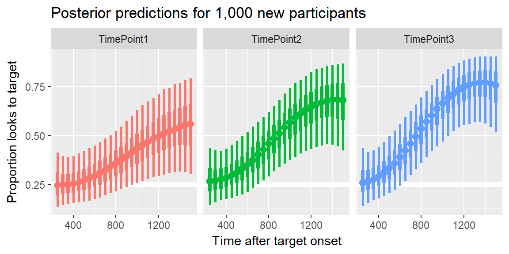


```r
by_draw <- lpred %>%
  group_by(Study, Time) %>%
  summarise(
    iqr = IQR(plogis(.posterior_value)),
    min = min(plogis(.posterior_value)),
    max = max(plogis(.posterior_value)),
    range = max - min)

ggplot(by_draw) +
  aes(x = Time, y = range, color = Study) +
  stat_summary(fun.data = median_hilow, fun.args = list(conf.int = .9),
               size = 1, geom = "linerange") +
  stat_summary(fun.data = median_hilow, fun.args = list(conf.int = .5),
               size = 1.5, geom = "linerange") +
  stat_summary(fun.y = median, fun.args = list(conf.int = .5),
               size = 2.5, geom = "point") +
  labs(
    title = "Ranges of predictions for 1000 new participants",
    x = "Time after target onset",
    y = "Max - min predicted value") 
```

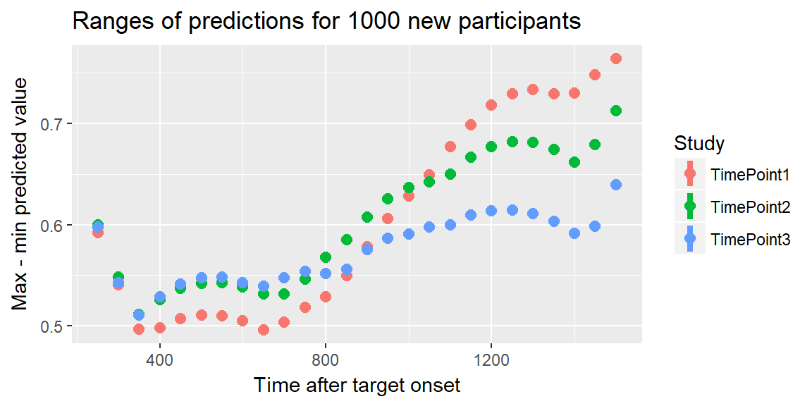

```r

ggplot(by_draw) +
  aes(x = Time, y = iqr, color = Study) +
  stat_summary(fun.data = median_hilow, fun.args = list(conf.int = .9),
               size = 1, geom = "linerange") +
  stat_summary(fun.data = median_hilow, fun.args = list(conf.int = .5),
               size = 1.5, geom = "linerange") +
  stat_summary(fun.y = median, fun.args = list(conf.int = .5),
               size = 2.5, geom = "point") +
  labs(
    title = "25%-75% ranges of predictions",
    x = "Time after target onset",
    y = "Interquartile range of predictions") + 
  ylim(0, .25)
```

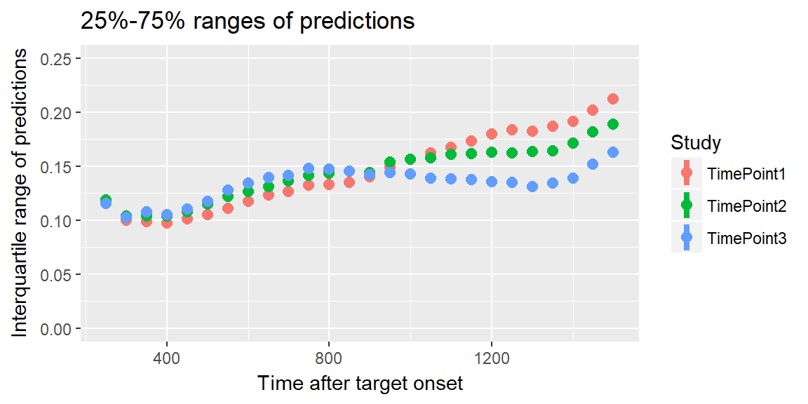

```r


# in_every_study <- d_m %>% 
#   distinct(Study, ResearchID) %>% 
#   split(.$Study) %>% 
#   lapply(getElement, "ResearchID") %>% 
#   Reduce(intersect, .)
# 
# d_m_every <- d_m %>% 
#   filter(ResearchID %in% in_every_study)
# 
# sims <- tristan::augment_posterior_linpred(b, d_m_every, nsamples = 1000)
# 
# ggplot(sims) + 
#   aes(x = Time, y = plogis(.posterior_value, color = Study) +
#   geom_hline(yintercept = .25, size = 2, color = "white") +
#   stat_summary(fun.data = median_hilow, fun.args = list(conf.int = .9),
#                size = 1, geom = "linerange") + 
#   stat_summary(fun.data = median_hilow, fun.args = list(conf.int = .5), 
#                size = 1.5, geom = "linerange") + 
#   stat_summary(fun.y = median, fun.args = list(conf.int = .5), 
#                size = 2.5, geom = "point") + 
#   # geom_line(aes(group = interaction(Study, ResearchID, .draw)), 
#   #           alpha = .1) +
#   # facet_wrap("ResearchID") + 
#   geom_point(aes(y = qlogis(Prop)), shape = 1) + 
#   theme(
#     legend.position = c(.95, 0), 
#     legend.justification = c(1, 0),
#     legend.margin = margin(0)) +
#   guides(color = guide_legend(title = NULL, override.aes = list(alpha = 1))) +
#   labs(
#     title = "Observed data and 100 posterior predictions",
#     x = "Time after target onset",
#     y = "Posterior log-odds")
# sds <- fits %>% 
#   group_by(Study, coef, .draw) %>% 
#   summarise(
#     mean = mean(.posterior_value),
#     min = min(.posterior_value),
#     max = max(.posterior_value),
#     range = max - min,
#     sd = sd(.posterior_value)) %>%
#   group_by(Study, coef) %>% 
#   select(-.draw) %>% 
#   do(bayesplot::mcmc_intervals_data(select(., mean:sd))) %>% 
#   ungroup()
# 
# ggplot(sds %>% filter(coef %in% c("intercept", "ot1"))) + 
#   aes(y = forcats::fct_rev(Study)) +
#   geom_vline(xintercept = 0, size = 2, color = "white") +
#   ggstance::geom_linerangeh(aes(xmin = ll, xmax = hh)) + 
#   ggstance::geom_linerangeh(aes(xmin = l, xmax = h), size = 2) +
#   geom_point(aes(x = m), size = 3, shape = 3) + 
#   labs(x = NULL, y = NULL, caption = "90% and 50% intervals") + 
#   facet_grid(parameter ~ coef, scales = "free")
#   facet_gird("coef", ncol = 1, strip.position = "left", 
#              labeller = label_parsed, scales = "free") + 
#   theme(strip.placement = "outside", 
#         strip.background = element_rect(fill = NA),
#         axis.text.y = element_text(size = rel(1.2))) 
```


### Predicting the future

> As a consequence, individual differences in word recognition at age 3, for
example, will be more discriminating and predictive of age 5 language outcomes
than differences at age 4.


```r
fits <- readr::read_csv("./data/fits.csv.gz")
#> Parsed with column specification:
#> cols(
#>   .draw = col_integer(),
#>   Study = col_character(),
#>   ResearchID = col_character(),
#>   coef = col_character(),
#>   .posterior_value = col_double()
#> )
fits <- fits %>% semi_join(d_m)
#> Joining, by = c("Study", "ResearchID")

point_ests <- fits %>% 
  group_by(Study, ResearchID, coef) %>% 
  summarise(point = median(.posterior_value)) %>% 
  ungroup() %>% 
  tidyr::spread(coef, point)

scores <- readr::read_csv("./data-raw/test_scores.csv") %>% 
  select(Study, ResearchID, Age, EVT_GSV, EVT_Standard, 
         PPVT_GSV, PPVT_Standard)
#> Parsed with column specification:
#> cols(
#>   .default = col_integer(),
#>   Study = col_character(),
#>   ResearchID = col_character(),
#>   Female = col_logical(),
#>   Male = col_logical(),
#>   MAE = col_logical(),
#>   AAE = col_logical(),
#>   Maternal_Education_LMH = col_character(),
#>   MinPair_ProportionCorrect = col_double(),
#>   SAILS_ProportionTestCorrect = col_double()
#> )
#> See spec(...) for full column specifications.

with_ests <- scores %>% 
  inner_join(point_ests)
#> Joining, by = c("Study", "ResearchID")

ggplot(with_ests) + 
  aes(x = intercept, y = EVT_GSV, color = Study) + 
  geom_point() + 
  stat_smooth(method = "lm")
#> Warning: Removed 2 rows containing non-finite values (stat_smooth).
#> Warning: Removed 2 rows containing missing values (geom_point).
```

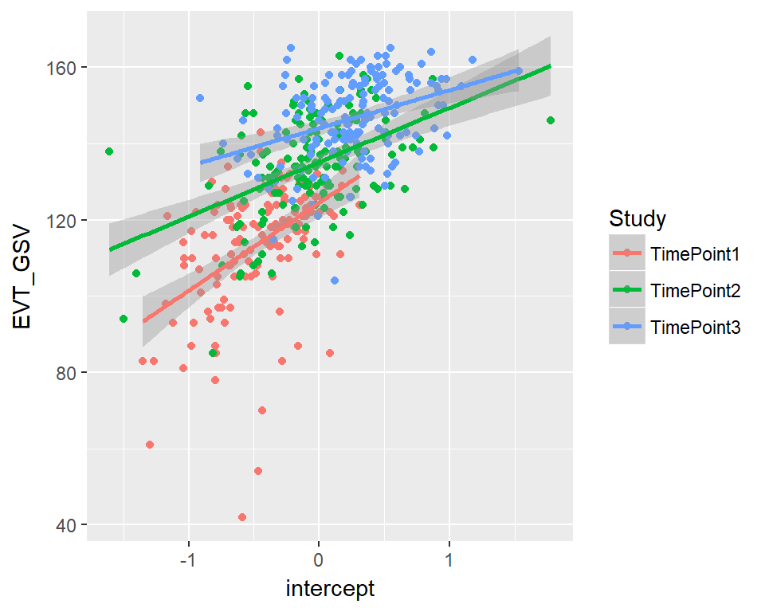

```r

ggplot(with_ests) + 
  aes(x = ot1, y = EVT_GSV, color = Study) + 
  geom_point() + 
  stat_smooth(method = "lm")
#> Warning: Removed 2 rows containing non-finite values (stat_smooth).

#> Warning: Removed 2 rows containing missing values (geom_point).
```

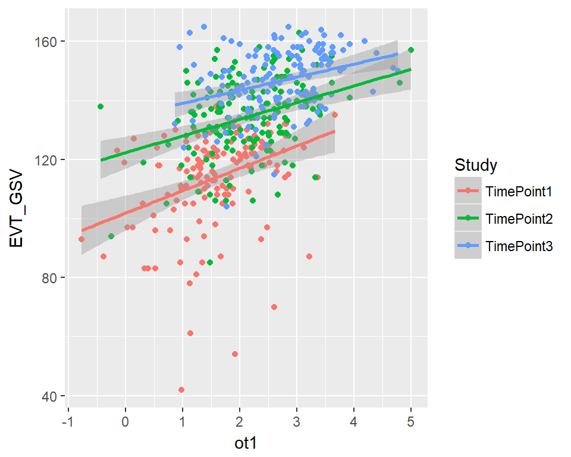

```r

ggplot(with_ests) + 
  aes(x = Age, y = intercept, color = Study) + 
  geom_point() + 
  stat_smooth(method = "lm")
```

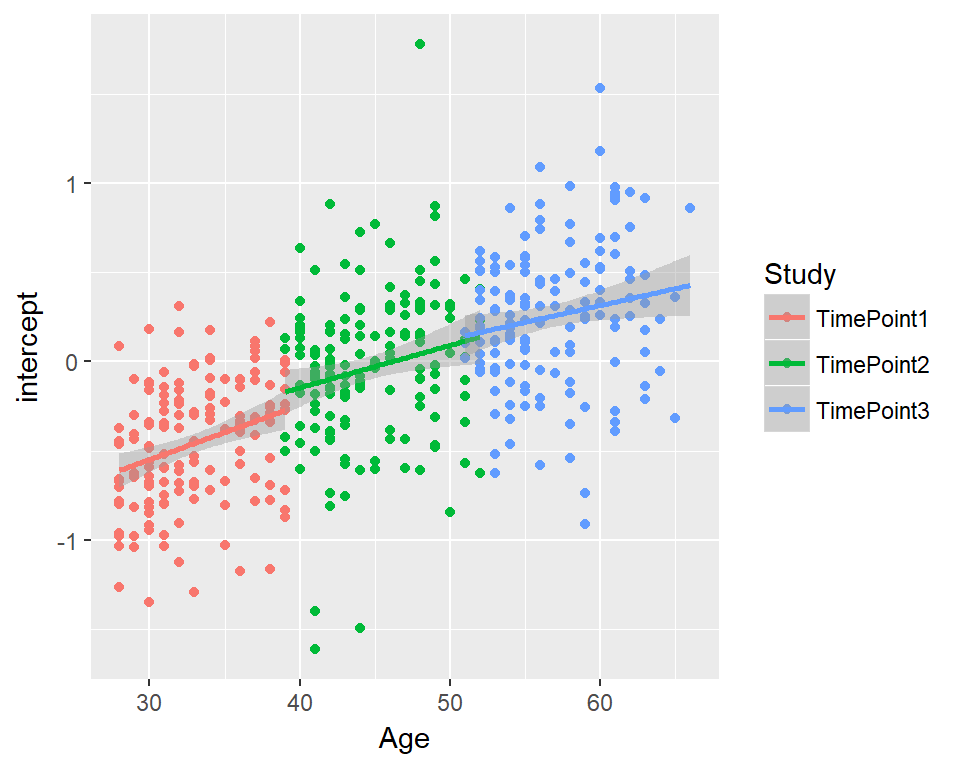

```r

ggplot(with_ests) + 
  aes(x = Age, y = ot1, color = Study) + 
  geom_point() + 
  stat_smooth(method = "lm")
```

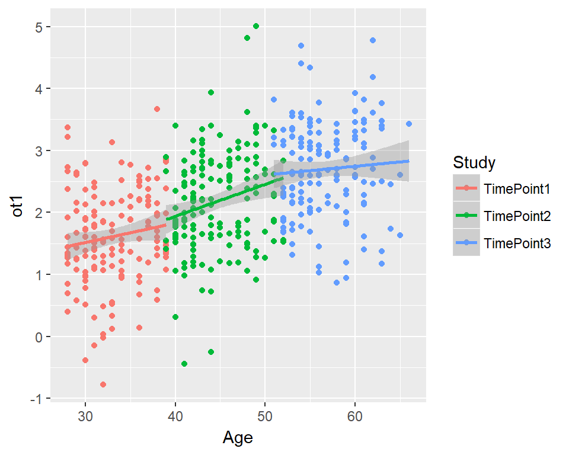

```r

widely <- with_ests %>% 
  tidyr::gather("Test", "Value", -ResearchID, -Study) %>% 
  tidyr::unite("Col", Study, Test) %>% 
  tidyr::spread(Col, Value)


ggplot(widely) + 
  aes(x = TimePoint1_intercept, y = TimePoint3_EVT_GSV) + 
  geom_point() + 
  stat_smooth(method = "lm")
#> Warning: Removed 67 rows containing non-finite values (stat_smooth).
#> Warning: Removed 67 rows containing missing values (geom_point).
```

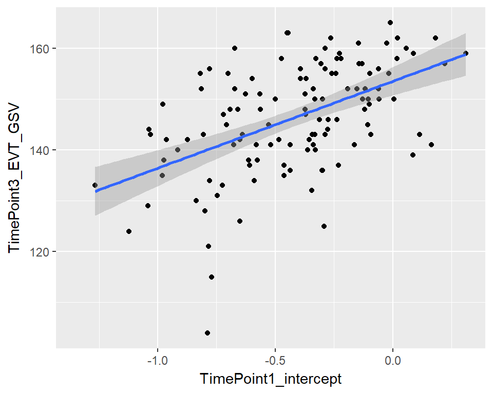

```r

ggplot(widely) + 
  aes(x = TimePoint2_intercept, y = TimePoint3_EVT_GSV) + 
  geom_point() + 
  stat_smooth(method = "lm")
#> Warning: Removed 45 rows containing non-finite values (stat_smooth).
#> Warning: Removed 45 rows containing missing values (geom_point).
```

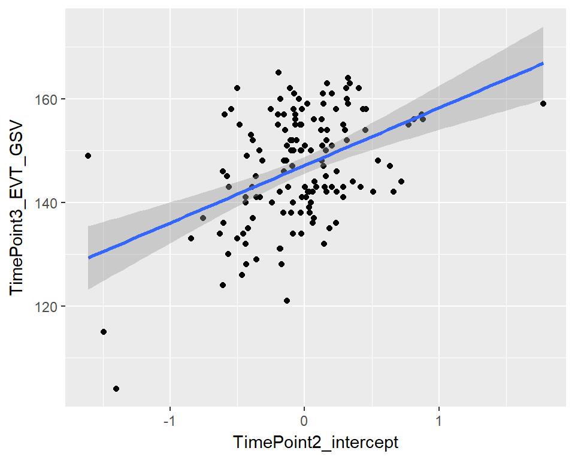

```r

ggplot(widely) + 
  aes(x = TimePoint1_ot1, y = TimePoint3_EVT_GSV) + 
  geom_point() + 
  stat_smooth(method = "lm")
#> Warning: Removed 67 rows containing non-finite values (stat_smooth).
#> Warning: Removed 67 rows containing missing values (geom_point).
```

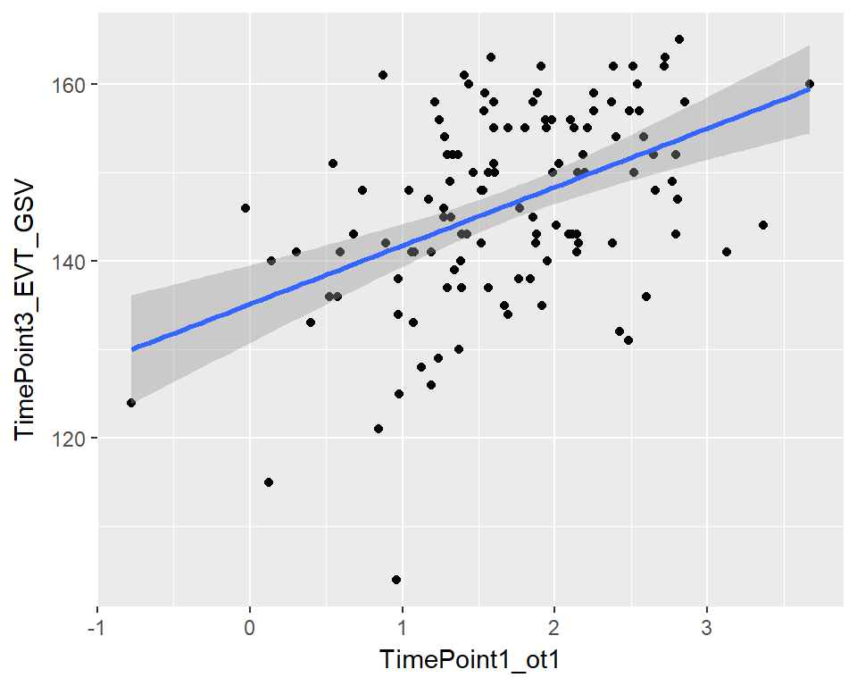

```r

ggplot(widely) + 
  aes(x = TimePoint2_ot1, y = TimePoint3_EVT_GSV) + 
  geom_point() + 
  stat_smooth(method = "lm")
#> Warning: Removed 45 rows containing non-finite values (stat_smooth).
#> Warning: Removed 45 rows containing missing values (geom_point).
```

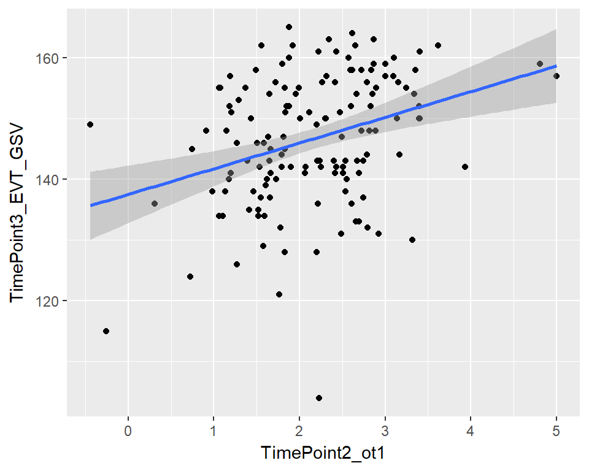

```r

ggplot(widely) + 
  aes(x = TimePoint3_ot1, y = TimePoint3_EVT_GSV) + 
  geom_point() + 
  stat_smooth(method = "lm")
#> Warning: Removed 35 rows containing non-finite values (stat_smooth).
#> Warning: Removed 35 rows containing missing values (geom_point).
```

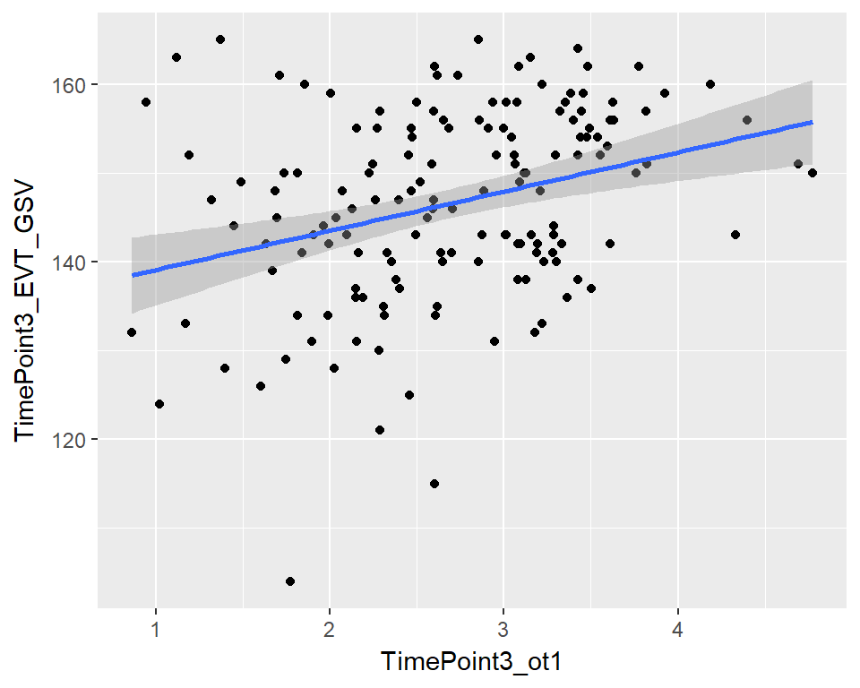


```r
cor_complete <- function(...) cor(..., use = "pairwise.complete")

test <- fits %>% 
  left_join(widely) %>% 
  group_by(Study, coef, .draw) %>% 
  summarise(
    r_TimePoint3_EVT_Standard = cor_complete(.posterior_value, 
                                             TimePoint3_EVT_Standard),
    r_TimePoint3_EVT_GSV = cor_complete(.posterior_value, 
                                        TimePoint3_EVT_GSV),
    r_TimePoint2_PPVT_GSV = cor_complete(.posterior_value, 
                                         TimePoint2_PPVT_GSV),
    r_TimePoint2_PPVT_Standard = cor_complete(.posterior_value, 
                                              TimePoint2_PPVT_Standard))
#> Joining, by = "ResearchID"

c_intervals <- test %>% 
  do(bayesplot::mcmc_intervals_data(
    select(., r_TimePoint3_EVT_Standard:r_TimePoint2_PPVT_Standard))) %>% 
  ungroup()

c_intervals %>% 
  filter(parameter == "r_TimePoint3_EVT_Standard") %>% 
  filter(coef %in% c("intercept", "ot1")) %>% 
  ggplot() + 
    aes(y = forcats::fct_rev(Study)) +
    geom_vline(xintercept = 0, size = 2, color = "white") +
    ggstance::geom_linerangeh(aes(xmin = ll, xmax = hh)) + 
    ggstance::geom_linerangeh(aes(xmin = l, xmax = h), size = 2) +
    geom_point(aes(x = m), size = 3, shape = 3) + 
    facet_wrap("coef") +
    labs(x = NULL, y = NULL, caption = "90% and 50% intervals") + 
    ggtitle("Correlation of curve features and TP3 EVT Standard")
```

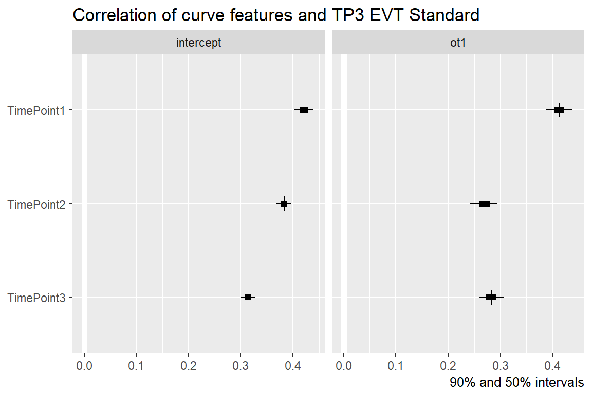

```r

c_intervals %>% 
  filter(parameter == "r_TimePoint2_PPVT_Standard") %>% 
  filter(coef %in% c("intercept", "ot1")) %>% 
  filter(Study != "TimePoint3") %>% 
  ggplot() + 
    aes(y = forcats::fct_rev(Study)) +
    geom_vline(xintercept = 0, size = 2, color = "white") +
    ggstance::geom_linerangeh(aes(xmin = ll, xmax = hh)) + 
    ggstance::geom_linerangeh(aes(xmin = l, xmax = h), size = 2) +
    geom_point(aes(x = m), size = 3, shape = 3) + 
    facet_wrap("coef") +
    labs(x = NULL, y = NULL, caption = "90% and 50% intervals") + 
    ggtitle("Correlation of curve features and TP2 PPVT Standard")
```

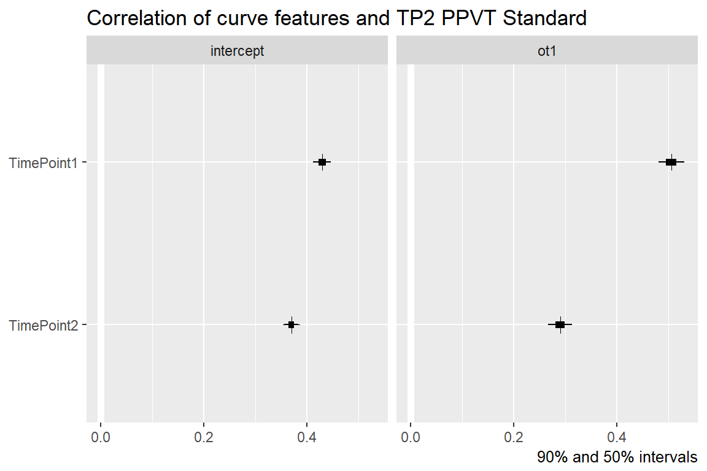

```r

# test %>% 
#   filter(coef == "intercept") %>%
#   ggplot() + 
#   aes(x = c1) + 
#   geom_histogram() + 
#   facet_grid(Study ~ coef)
# 
# test %>% 
#   filter(coef == "ot1") %>%
#   ggplot() + 
#   aes(x = c1) + 
#   geom_histogram() + 
#   facet_grid(Study ~ coef)
# 
# test %>% 
#   filter(coef == "ot2") %>%
#   ggplot() + 
#   aes(x = c1) + 
#   geom_histogram() + 
#   facet_grid(Study ~ coef)

widely %>% tidy_correlation(ends_with("EVT_GSV"))
#> # A tibble: 3 x 5
#>              column1            column2 estimate     n p.value
#>                <chr>              <chr>    <dbl> <dbl>   <dbl>
#> 1 TimePoint1_EVT_GSV TimePoint2_EVT_GSV   0.7087   128       0
#> 2 TimePoint1_EVT_GSV TimePoint3_EVT_GSV   0.6875   121       0
#> 3 TimePoint2_EVT_GSV TimePoint3_EVT_GSV   0.8511   143       0

widely %>% 
  tidy_correlation(TimePoint3_EVT_GSV, ends_with("intercept"), ends_with("ot1")) %>% 
  filter(column1 == "TimePoint3_EVT_GSV")
#> # A tibble: 6 x 5
#>              column1              column2 estimate     n p.value
#>                <chr>                <chr>    <dbl> <dbl>   <dbl>
#> 1 TimePoint3_EVT_GSV TimePoint1_intercept   0.5058   121   0e+00
#> 2 TimePoint3_EVT_GSV TimePoint2_intercept   0.4398   143   0e+00
#> 3 TimePoint3_EVT_GSV TimePoint3_intercept   0.3648   153   0e+00
#> 4 TimePoint3_EVT_GSV       TimePoint1_ot1   0.4518   121   0e+00
#> 5 TimePoint3_EVT_GSV       TimePoint2_ot1   0.3253   143   1e-04
#> 6 TimePoint3_EVT_GSV       TimePoint3_ot1   0.3144   153   1e-04

widely %>% 
  tidy_correlation(TimePoint2_PPVT_GSV, TimePoint1_ot1, TimePoint2_ot1) %>% 
  filter(column1 == "TimePoint2_PPVT_GSV")
#> # A tibble: 2 x 5
#>               column1        column2 estimate     n p.value
#>                 <chr>          <chr>    <dbl> <dbl>   <dbl>
#> 1 TimePoint2_PPVT_GSV TimePoint1_ot1   0.4807   127       0
#> 2 TimePoint2_PPVT_GSV TimePoint2_ot1   0.3418   161       0

widely %>% 
  tidy_correlation(TimePoint2_PPVT_GSV, TimePoint1_ot1, TimePoint2_ot1,
            TimePoint1_intercept, TimePoint2_intercept) %>% 
  filter(column1 == "TimePoint2_PPVT_GSV")
#> # A tibble: 4 x 5
#>               column1              column2 estimate     n p.value
#>                 <chr>                <chr>    <dbl> <dbl>   <dbl>
#> 1 TimePoint2_PPVT_GSV       TimePoint1_ot1   0.4807   127       0
#> 2 TimePoint2_PPVT_GSV       TimePoint2_ot1   0.3418   161       0
#> 3 TimePoint2_PPVT_GSV TimePoint1_intercept   0.4997   127       0
#> 4 TimePoint2_PPVT_GSV TimePoint2_intercept   0.4248   161       0
```


### Relationship with child-level variables

> Vocabulary size and lexical processing will be tightly correlated such that
large year-over-year gains in one measure will predict large year-over-years
gains in the other measure.


