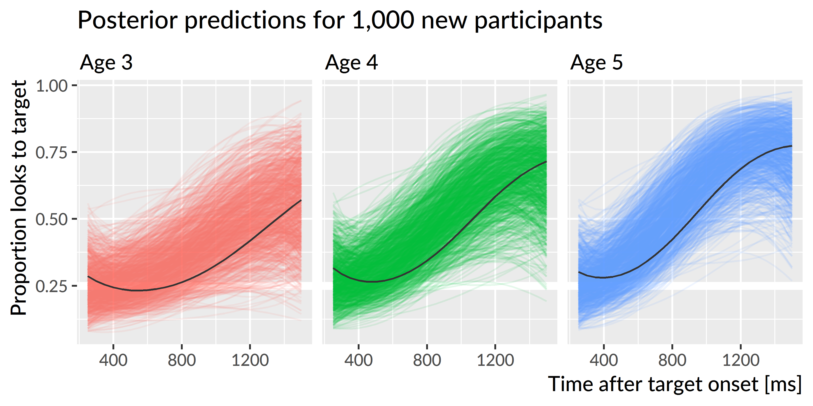

Analysis of familiar word recognition {#fam-rec}
========================================================================

Growth curve analysis
------------------------------------------------------------------------

The outcome measure of interest here is how the probability of fixating
on the target image versus the distractors changes over time. There are
many possible techniques one can employ for modeling time series data.
In this chapter, I used growth curve analysis which uses polynomial
functions of time (a linear trend, a quadratic trend, etc.) to estimate
a time series. @Barr2008 and @Mirman2008 are important early tutorials
for this technique of modeling looking probabilities. (Incidentally,
the two articles were published together in a special issue of *Journal
of Memory and Language* about "emerging" statistical techniques.)
@Mirman2014 also provides a textbook treatment of growth curve analysis for
eyetracking data. This approach is well suited for time series where
the trajectory is relatively simple with one or two inflection points.
Alternatively, one can forgo polynomial trends and use generalized
additive (mixed) models to fit a more general nonlinear shape. I apply
this now-emerging technique in
[Chapter \@ref(lex-competitors)](#lex-competitors) to model wigglier
growth curve shapes. A third possibility is to use nonlinear,
functional growth curves. For the polynomial and additive models,
underlying time features are weighted and summed to fit a nonlinear
shape. For the functional growth curve, the nonlinear shape is fixed in
advance and the model estimates a set of curve parameters so the shape
approximates the data. For example, @bdots17 and @bdots18 model
eyetracking data by assuming an s-shaped curve (a logistic function) and
then estimating the left and right asymptotes, the slope at the steepest
point, and the point where the steepest rise occurs. These parameters
are directly interpretable in terms of looking behaviors, but I have
found that the technique is not flexible enough to handle the noisier
shapes of children's eyetracking data.[^flex] For the following
analyses, therefore, I used polynomial growth curves.

[^flex]: More generally, I think of there being a
  flexibility--interpretability tradeoff with additive models being the
  most flexible but having the least interpretable parameters, functional
  curves being the least flexible but having the most interpretable
  parameters, and polynomials falling in between the two.  

Looks to the familiar image were analyzed using Bayesian, mixed effects
logistic regression. I used *logistic* regression because the outcome
measurement is a probability (the log-odds of looking to the target
image versus the distractors). I used *mixed-effects* models to estimate a
separate growth curve for each child (to measure individual differences
in word recognition) but also treat each child's individual growth curve
as a draw from a distribution of related curves. I used *Bayesian*
techniques to study a generative model of the data. Instead of reporting
and describing a single, best fit of some data, Bayesian methods
consider an entire distribution of plausible fits that are consistent
with the data and any prior information we have about the model
parameters. By using this approach, one can explicitly quantify
uncertainty about statistical effects and draw inferences using
estimates of uncertainty (instead of using statistical
significance—which is not a straightforward matter for mixed-effects
models).[^2]

[^2]: My goals in using this method were simply to estimate model 
    effects and quantify the uncertainty about those effects. This pragmatic, 
    estimation-based approach of Bayesian statistics is illustrated in texts 
    by @GelmanHill and @RethinkingBook.

Word recognition growth curves—that is, looks to the target versus the
distractors at 250 ms, 300 ms, etc.—were fit using an orthogonal cubic
polynomial function of time. Put differently, I modeled the probability
of looking to the target during an eyetracking task as:

$$
\text{log\,odds}(\text{looking}) = 
  \beta_0 + 
  \beta_1\text{Time}^1 + 
  \beta_2\text{Time}^2 + 
  \beta_3\text{Time}^3
$$

That the time terms are *orthogonal* means that $\text{Time}^1$,
$\text{Time}^2$ and $\text{Time}^3$ are transformed so that they
are uncorrelated. See Box 1. Under this formulation, the parameters $\beta_0$ and
$\beta_1$ have a direct interpretation in terms of lexical processing
performance. The intercept, $\beta_0$, measures the area under the
growth curve—or the probability of fixating on the target word averaged
over the whole window. We can think of $\beta_0$ as a measure of *word
recognition reliability*. The linear time parameter, $\beta_1$,
estimates the steepness of the growth curve—or how the probability of
fixating changes from frame to frame. We can think of $\beta_1$ as a
measure of *processing efficiency*, because growth curves with stronger
linear features exhibit steeper frame-by-frame increases in looking
probability.

\Begin{infobox}

**Box 1: Orthogonal time**.

I used orthogonal polynomial features of Time for these growth curve
models. Unlike natural polynomials, these features are uncorrelated.
This aspect makes these models more flexible: I do not have to worry
about any collinearity between Time^1^ and Time^2^. Moreover, adding an
orthogonal cubic Time^3^ term to a quadratic model will not change any
of the estimates for Time^1^ or Time^2^ because the added predictor is
not correlated with the others. One disadvantage of this approach is
that the features are not as straightforward to interpret. 

The figure below shows the orthogonal polynomials used by the model and
how they can be weighted and summed to fit a growth curve.

Note that the time features and weighted features are vertically
centered around 0. The curves are adjusted up or down to their correct
position by the model's intercept term. Conceptually, one can also think
of the intercept as a Time^0^ feature---that is, a horizontal line at
*y* = 1 which is weighted to move the whole curve vertically. This is
why in these models, the intercept is not the value at some time 0 but
rather the average value of the fitted growth curve. To reiterate, for
these word recognition models, the intercept is the average probability
of the curve. 

For all the polynomial growth curves models I used in this project, I
scaled the features so that Time^1^ ranges from −.5 to .5. In other
words, a 1-unit change on Time^1^ marks the whole traversal across the
analysis window. After scaling, Time^2^ ranges from −.33 to .60 and
Time^3^ ranges from −.63 to .63.

In my experience, only the intercept terms and linear time trends of an
orthogonal polynomial model have a behaviorally straightforward
interpretation. The polynomial other terms are less important—or rather,
they do not map as neatly onto behavioral descriptions as the accuracy
and efficiency parameters. The primary purpose of quadratic and cubic
terms is to ensure that the estimated growth curve adequately fits the
data. In this kind of data, there is a steady baseline at chance
probability before the child hears the word, followed a window of
increasing probability of fixating on the target as the child recognizes
the word, followed by a period of plateauing and then diminishing looks
to target. The cubic polynomial allows the growth curve to be fit with
two inflection points: the point when the looks to target start to
increase from baseline and the point when the looks to target stops
increasing.

\End{infobox}

To study how word recognition changes over time, I modeled how the
growth curves change over developmental time. This amounted to studying
how the growth curve parameters changes year over year. I included
dummy-coded indicators for age 3, age 4, and age 5 and allowed these
indicators to interact with the growth curve parameters:

$$
\small
\begin{align*}
  \text{log\,odds}(\text{looking}) =\
    &\beta_0 + 
      \beta_1\text{Time}^1 + 
      \beta_2\text{Time}^2 + 
      \beta_3\text{Time}^3\ + 
      &\text{[age 3 growth curve]} \\
    (&\gamma_{0} + 
      \gamma_{1}\text{Time}^1 + 
      \gamma_{2}\text{Time}^2 +
      \gamma_{3}\text{Time}^3)*\text{Age\,4}\ + \
      &\text{[age 4 adjustments]} \\
    (&\delta_{0} + 
      \delta_{1}\text{Time}^1 + 
      \delta_{2}\text{Time}^2 +
      \delta_{3}\text{Time}^3)*\text{Age\,5} \
      &\text{[age 5 adjustments]} \\
\end{align*}
\normalsize
$$

These year-by-growth-curve-feature terms captured how the shape of the growth
curves changed each year. The model also included random effects to
represent by-child and by-child-by-year effects to estimate a general
growth curve for each child and to estimate how each child's growth
curve changed each year.

The models were fit in R (vers. 3.4.3) with the RStanARM package
(vers. 2.16.3). [Appendix \@ref(aim1-gca-models)](#aim1-gca-models)
contains the R code used to fit the model along with a description of 
the model specifications represented in the model syntax.

I used Bayesian *uncertainty intervals* to draw statistical inferences.
A Bayesian model is the posterior distribution: It is a distribution of
plausible parameter values, given the data, a data-generating model and
any prior information we have about those parameter values. In practice,
these distributions are hard to calculate, so we use Markov Chain Monte
Carlo to get a sample of thousands of values from the posterior
distribution. Thus, rather than having a single best-fitting estimate of
some effect $\beta$, we have a sample of, say, 4,000 plausible values for
$\beta$. We can quantify our uncertainty about $\beta$ by describing the
distribution of those values. I use typically two statistics to describe
that distribution. The median provides a *point estimate* for the
distribution, and the 90% uncertainty interval provides bounds for the
effect. These intervals have an intuitive interpretation. Suppose that
for $\beta$ we get a median of 8 and 90% uncertainty interval of [5, 21].
This interval means that we can be 90% certain that the "true" value of
$\beta$ is between 5 and 21, given the data, our model, and our prior
information. Moreover, by inspecting the interval, we pinpoint areas of
uncertainty. In this example, we can conclude that the effect is likely
to be positive. The lower interval value of 5 tells us that 90% of the
plausible values are greater than 5. A wide range of values are covered
by the interval, however, so we would also conclude that we are not very
certain about the size of the effect. It bears noting that one cannot
interpret frequentist confidence intervals in this way. See
@Kruschke2017 for a recent review of frequentist versus Bayesian
statistics.

### Growth curve features as measures of word recognition performance

As mentioned above, two of the model's growth curve features have
straightforward interpretations in terms of lexical processing
performance: The model's intercept parameter corresponds to the average
proportion or probability of looking to the named image over the trial
window, and the linear time parameter corresponds to slope of the growth
curve or lexical processing efficiency. I also was interested in *peak*
proportion of looks to the target. I derived this value by computing the
growth curves from the model and taking the median of the five highest
points on the curve. Figure \@ref(fig:curve-features) shows three
simulated growth curves and how each of these growth curve features
relate to word recognition performance.

(ref:curve-features) Illustration of the three growth curve features and how they describe lexical processing performance. The three curves used are simulations of new participants at age 4.

(ref:curve-features-scap) Illustration of the three growth curve features and how they describe lexical processing performance.

(\#fig:curve-features)(ref:curve-features)

Year over year changes in word recognition performance
------------------------------------------------------------------------

The mixed-effects model estimated a population-average growth curve
("fixed" effects) and how individual children deviated from the average
("random" effects). Figure \@ref(fig:average-growth-curves) shows 200
posterior samples of the population-average growth curves for each year.
On average, the growth curves become steeper and achieve higher looking
probabilities with each year of the study.

(ref:average-growth-curves) Population-average ("fixed effects") word recognition growth curves at each age. Colored lines represent 200 posterior samples of these growth curves; these are included to visualize the uncertainty about the population averages. The thick light lines represent the observed average growth curve at each age.

(ref:average-growth-curves-scap) Population-average ("fixed effects") word recognition growth curves at each age.

(\#fig:average-growth-curves)(ref:average-growth-curves)

Figure \@ref(fig:effects2) depicts uncertainty intervals with
the model's average effects of each timepoint on the growth curve
features. The intercept and linear time effects increased each year,
confirming that children become more reliable and faster at recognizing
words as they grow older. The peak probability also increased each year.
For each effect, the change from age 3 to age 4 is approximately the
same as the change from age 4 to age 5, as illustrated in
Figure \@ref(fig:pairwise-effects).

(ref:effects2) Uncertainty intervals for growth curve features at each age. The intercept and peak features were converted from log-odds to proportions to ease interpretation.

(ref:effects2-scap) Uncertainty intervals for growth curve features at each age.

(\#fig:effects2)(ref:effects2)

(ref:pairwise-effects) Uncertainty intervals for the differences in growth curve features between ages. Again, the intercept and peak features were converted to proportions.

(ref:pairwise-effects-scap)  Uncertainty intervals for the differences in growth curve features between ages.

(\#fig:pairwise-effects)(ref:pairwise-effects)

The average looking probability (intercept feature) was 0.38
[90% UI: 0.37, 0.40] at age 3, 0.49
[0.47, 0.50] at age 4, and 0.56 [0.54, 0.57] at
age 5. The averages increased by 0.10
[0.09, 0.11] from age 3 to age 4 and by 0.07
[0.06, 0.09] from age 4 to age 5. The peak looking
probability was 0.55 [0.53, 0.57] at age 3,
0.68 [0.67, 0.70] at age 4, and 0.77
[0.76, 0.78] at age 5. The peak values increased by
0.13 [0.11, 0.16] from age 3 to age 4 and
by 0.09 [0.07, 0.10] from age 4 to age 5.
These results numerically confirm the hypothesis that children would
improve in their word recognition reliability, both in terms of average
looking and in terms of peak looking, each year. The changes in peak 
probability were also rather large: children's probability fixating on
the target increased by approximately .1 each year. These growths
indicate the task scaled with children's development because they had
room to improve each year.

**Summary**. The average growth curve features increased year over year,
so that children looked to the target more quickly and more reliably 
as they grew older.

Exploring plausible ranges of performance over time
------------------------------------------------------------------------

Bayesian models are generative; they describe how the data could have
been generated. This model assumed that each child's growth curve was
drawn from a population of related growth curves, and it tried to infer
the parameters over that distribution. These two aspects---a generative
model and learning about the population of growth curves---allow the
model to simulate new samples from that distribution of growth curves.
That is, we can predict a set of growth curves for a hypothetical,
unobserved child drawn from the same distribution as the
195 children observed in this study. This
procedure of studying model implications by having the model generate
new data is called *posterior predictive inference*, and in this case,
it allows one to explore the plausible degrees of variability in
performance at each age.

Figure \@ref(fig:new-participants) shows the posterior predictions
for 1,000 simulated participants, and it demonstrates how the model
expects new participants to improve longitudinally but also exhibit
stable individual features over time. 
Figure \@ref(fig:new-participants-intervals) shows uncertainty intervals
for these simulations. The model learned to predict less accurate and
more variable performance at age 3 with improving accuracy and narrowing
variability at age 4 and age 5.

(ref:new-participants) Posterior predictions for hypothetical *unobserved* participants. Each line represents the predicted performance for a new participant. The three light lines highlight predictions from one single simulated participant. The simulated participant shows both longitudinal improvement in word recognition and similar relative performance compared to other simulations each year, indicating that the model would predict new children to improve year over year and show stable individual differences over time.

(ref:new-participants-scap) Posterior predictions for hypothetical *unobserved* participants. 

(\#fig:new-participants)(ref:new-participants)

(ref:new-participants-intervals) Uncertainty intervals for the simulated participants. Variability is widest at age 3 and narrowest at age 5, consistent with the prediction that children become less variable as they grow older.

(ref:new-participants-intervals-scap) Uncertainty intervals for the simulated participants. 

(\#fig:new-participants-intervals)(ref:new-participants-intervals)

I hypothesized that children would become less variable as they grew
older and converged on a mature level of performance. To address this
question, I inspected the ranges of predictions for the simulated
participants. The claim that children become less variable would imply
that the range of predictions should be narrower for age 5 than for age 4
and narrower for age 4 than for age 3. Figure \@ref(fig:new-ranges)
depicts the range of the predictions, both in terms of the 90-percentile
range (i.e., the range of the middle 90% of the data) and in terms of
the 50-percentile (interquartile) range. The ranges of performance
decrease from age 3 to age 4 to age 5, consistent with the hypothesized
reduction in variability.

(ref:new-ranges) Ranges of predictions for simulated participants over the course of a trial. The ranges are most similar during the first half of the trial when participants are at chance performance, and the ranges are most different at the end of the trial as children reliably fixate on the target image. The ranges of performance decrease with each year of the study as children show less variability.

(ref:new-ranges-scap) Ranges of predictions for simulated participants over the course of a trial.

(\#fig:new-ranges)(ref:new-ranges)

The developmental pattern of increasing reliability and decreasing
variability was also observed for the growth curve peaks. For the
synthetic participants, the model predicted that individual peak
probabilities will increase each year, peak~3~ =
0.55 [90% UI: 0.35, 0.77],
peak~4~ = 0.69 [0.48, 0.86],
peak~5~ = 0.78 [0.59, 0.91].
Moreover, the range of plausible values for the individual peaks
narrowed each for the simulated data. For instance, the difference
between the 95^th^ and 5^th^ percentiles was 0.43 for
age 3, 0.38 for age 4, and 0.32
for age 5.

**Summary**. I used the model's random effects estimates to simulate
growth curves from 1,000 hypothetical, unobserved participants. The
simulated dataset showed increasing looking probability and decreasing
variability with each year of the study. These simulations confirmed the
hypothesis that variability would diminish as children began to demonstrate 
a mature degree of performance for this task.

Are individual differences stable over time?
------------------------------------------------------------------------

I predicted that children would show stable individual differences such
that children who are faster and more reliable at recognizing words at
age 3 remain relatively faster and more reliable at age 5. To evaluate
this hypothesis, I used Kendall's *W* (the coefficient of correspondence
or concordance). This nonparametric statistic measures the degree of
agreement among *J* judges who are rating *I* items. For these purposes,
the items are the 123 children who provided reliable eyetracking
for all three years of the study. (That is, I excluded children who only
had reliable eyetracking data for one or two years.) The judges are the
sets of growth curve parameters from each year of study. For example,
the intercept term provides three sets of ratings: The participants'
intercept terms from age 3 are one set of ratings and the terms from
ages 4 and 5 provide two more sets of ratings. These three ratings are
the "judges" used to compute the intercept's *W*. Thus, I computed five
groups of *W* coefficients, one for each set of growth curve features:
Time^1^, Time^2^, Time^3^, average looking probability, and peak looking
probability.

Because I used a Bayesian model, there is a distribution of ratings and
thus a distribution of concordance statistics. Each sample of the
posterior distribution fits a growth curve for each child in each year,
so each posterior sample provides a set of ratings for concordance
coefficients. This distribution of *W*'s lets us quantify our uncertainty
because we can compute *W*'s for each of the 4000 samples from
the posterior distribution.

One final matter is how to assess whether a concordance statistic is
meaningful. To tackle this question, I also included a "null rater", a
fake parameter that assigned each child in each year a random number. I
use the distribution of *W*'s generated by randomly rating children as a
benchmark for assessing whether the other concordance statistics differ
meaningfully from chance.

(ref:kendall-stats) Uncertainty intervals for the Kendall's coefficient of concordance. Random ratings provide a baseline of null *W* statistics. The peak, intercept and linear time features are decisively non-null, indicating a significant degree of correspondence in children's relative word recognition reliability and efficiency over the three years of the study.

(ref:kendall-stats-scap) Uncertainty intervals for the Kendall's coefficient of concordance. 

(\#fig:kendall-stats)(ref:kendall-stats)

I used the `kendall()` function in the irr R package
[vers. 0.84; @irr] to compute concordance
statistics. Figure \@ref(fig:kendall-stats) depicts uncertainty intervals
for the Kendall *W*'s for these growth curve features. The 90%
uncertainty interval of *W* statistics from random ratings,
[.28, .39], subsumes the intervals for the Time^2^
effect [.30, .35] and the Time^3^ effect
[.28, .35], indicating that these values do not
differentiate children in a longitudinally stable way. Earlier, I
claimed that only the intercept, linear time, and peak features have
psychologically meaningful interpretations and that the higher-order
time features mainly act to capture the curvature of the data. These
null concordance statistics support that claim because the Time^2^ and
Time^3^ features differentiate children across years as well as random
numbers.

Concordance is strongest for the peak feature, *W* =
.59 [.57, .60] and
the intercept term, *W* = .58
[.57, .60], followed by the linear time term,
*W* = .50 [.48, .52]. Because these
values are far removed from the statistics for random ratings, I
conclude that there is a credible degree of correspondence across
years when ranking children using their peak looking probability,
average look probability (the intercept) or their growth curve slope
(linear time).

**Summary**. Growth curve features measured individual differences in
word recognition performance. By using Kendall's *W* to measure the
degree of concordance among growth curve features over time, I tested
whether individual differences in lexical processing persisted over
development. I found that the peak looking probability, average looking
probability and linear time features were stable over time. Children who
were relatively fast (or reliable) at word recognition at one age were also
relatively fast (or reliable) at other ages too.

Predicting future vocabulary size
------------------------------------------------------------------------

I hypothesized that individual differences in word recognition at age 3
will be more discriminating and predictive of future language outcomes than
differences at age 4 or age 5. To test this hypothesis, I calculated
the correlations of growth curve features with age 5 expressive
vocabulary size and age 4 receptive vocabulary. (The receptive test was
not administered during the last year of the study for logistical
reasons.) As with the concordance analysis, I computed each of the
correlations for each sample of the posterior distribution to obtain a
distribution of correlations.

Figure \@ref(fig:evt2-gca-cors) shows the correlations of the peak
looking probability, average looking probability and linear time
features with expressive vocabulary size at age 5, and
Figure \@ref(fig:ppvt4-gca-cors) shows analogous correlations for the
receptive vocabulary at age 4. For all cases, the strongest correlations
were found between the growth curve features at age 3.

Growth curve peaks from age 3 correlated with age 5 vocabulary with
*r* = .52 [90% UI
.50, .54], but the concurrent peaks from age 5
showed a correlation of just *r* = .31
[.29, .33], a difference between age-3 and
age-5 correlations of *r*~3−5~ =
.21
[.18, .24]. A similar pattern held for
lexical processing efficiency values. Linear time features from age 3
correlated with age 5 vocabulary with *r* =
.41 [.39, .44],
whereas the concurrent lexical processing values from age 5 only showed
a correlation of *r* = .28
[.26, .31], a difference of *r*~3−5~ =
.13
[.10, .16]. For the average looking
probabilities, the correlation for age 3, *r* =
.39 [.39, .44], was
probably only slightly greater than the correlation for age 4,
*r*~3−4~ = .02
[&minus;.01, .04] but considerably greater than the
concurrent correlation at age 5, *r*~3−5~ =
.08
[.05, .10].

(ref:evt2-gca-cors) Uncertainty intervals for the correlations of growth curve features at each age with age-5 expressive vocabulary (EVT-2 standard scores). The bottom rows provide intervals for the pairwise differences in correlations between timepoints. For example, the top row of the left panel is the correlation between age-3 peak probability and age-5 expressive vocabulary.

(ref:evt2-gca-cors-scap) Uncertainty intervals for the correlations of growth curve features at each age with age-5 expressive vocabulary.

(\#fig:evt2-gca-cors)(ref:evt2-gca-cors)

Peak looking probabilities from age 3 were strongly correlated with
age 4 receptive vocabulary, *r* = .62
[.61, .64], and this correlation was much
greater than the correlation observed for the age 4 growth curve peaks,
*r*~3−4~ = .26
[.23, .29]. The correlation for age 3
average looking probabilities, *r* = .45
[.44, .47], was greater than the age 4
correlation, *r*~3−4~ =
.08
[.06, .11], and the correlation for age 3
linear time features, *r* = .51
[.49, .54], was likewise greater,
*r*~3−4~ = .22
[.19, .26].

(ref:ppvt4-gca-cors) Uncertainty intervals for the correlations of growth curve features from age 3 and age 4 with age-4 receptive vocabulary (PPVT-4 standard scores). The bottom row shows pairwise differences between the age-3 and age-4 correlations.

(ref:ppvt4-gca-cors-scap) Uncertainty intervals for the correlations of growth curve features from age 3 and age 4 with age-4 receptive vocabulary.

(\#fig:ppvt4-gca-cors)(ref:ppvt4-gca-cors)

**Summary**. Although individual differences in word recognition were
stable over time, early differences were more significant than later
ones. The strongest predictors of future vocabulary size were the growth
curve features from age 3. Of these features, correlations were strongest
for peak looking probabilities.

Discussion
------------------------------------------------------------------------

In the preceding analyses, I examined many aspects of children's
recognition of familiar words. First, I modeled how children's looking
patterns *on average* changed year over year. Children's word
recognition improved each year: The growth curves grew steeper, reached
higher peaks, and increased in their overall average value each year. This
result was unsurprising, but it was valuable because it confirmed that
this word recognition task scaled with development. The task was simple
enough that children could recognize words at age 3 but challenging
enough for children's performance to improve each year.

After establishing how the averages changed each year, I next asked how
variability changed each year. To tackle this question, I used posterior
predictive inference to have the model simulate samples of data, and in
particular, to simulate new participants. The range of performance
narrowed each year, so that children were most variable at age 3 and
least variable at age 5. This result is consistent with a model of
development where children vary widely early on and converge on a more mature
level of performance. From this perspective, word recognition is a skill
where children "grow out" of immature and highly variable performance
patterns. An alternative outcome would have been concerning: Word
recognition differences that expanded with age with some children
falling behind their peers.

Although the range of individual differences decreased with age,
individual differences did not disappear over time. When children at
each age were ranked using growth curve features, I found a high degree
of correspondence among these ratings. Children who were faster or more
accurate at age 3 remained relatively fast or accurate at age 5. Thus,
differences in word recognition were longitudinally stable over the
preschool years. Extrapolating forwards in time, these differences
likely become smaller and smaller and become irrelevant for
everyday listening situations. It is plausible, however, that under
adverse listening conditions, individual differences might re-emerge and
differentiate children's word recognition performance.

Lastly, I analyzed how individual differences in word recognition
features correlated with future vocabulary outcomes. The peak looking
probabilities and growth curve slopes from age 3 showed the strongest
correlations with future vocabulary scores. This finding was remarkable:
Expressive vocabulary scores at age 5, for example, were more strongly
correlated with word recognition data collected two years earlier than
word recognition data collected during the same week. 

We can understand the predictive value of age-3 word recognition
performance from two perspectives. The first interpretation is
statistical. Differences in children's word recognition performance were
greatest at age 3, so word recognition features at age 3 provide more
variance and more information about the children and their future
vocabulary size. The second interpretation is conceptual. Correlations
were strongest for the growth curve peaks. We can think of this feature
as measuring children's maximum word recognition certainty. A child with
a peak of .5, for example, looked the target image half of the time when
they were most certain about the word. Although all of the words used
were familiar to preschoolers, children with higher peaks
knew those words *better*. These children had a stronger foundation for
word-learning than children who show more uncertainty during word
recognition, and as a result, these children had developed larger
vocabularies two years later.

