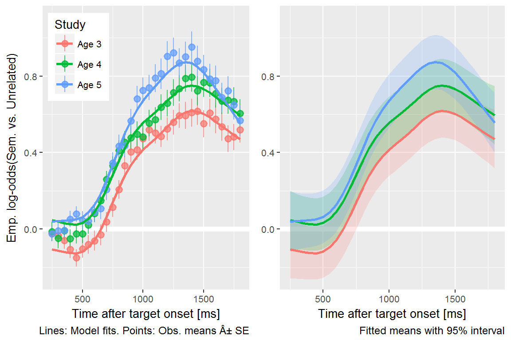
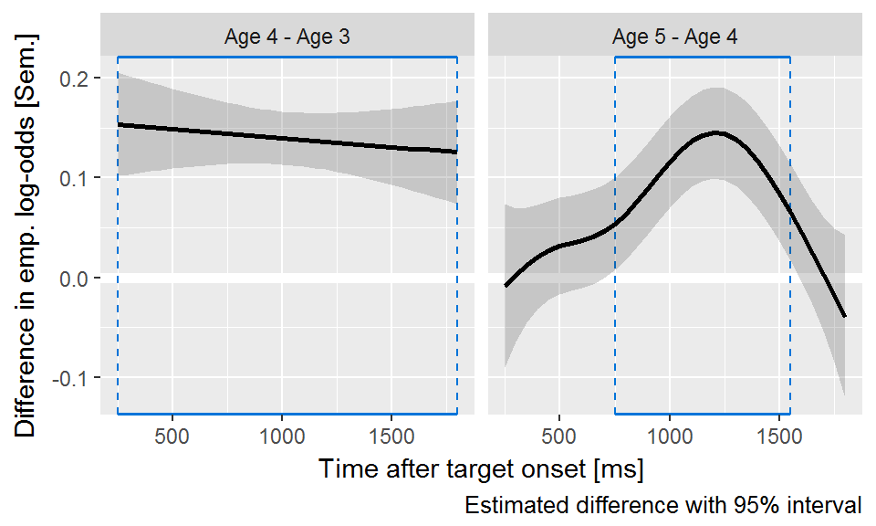
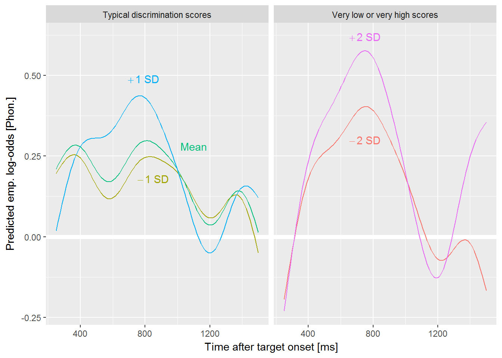

# Visualize looks to each image type


## Looks to the phonological foil


Next, I asked how children's sensitivity to the phonological foils
changed over developmental time. Following our approach in [@RWLPaper],
I only examined trials for which the phonological foil and the noun
shared the same syllable onset. For example, this criterion included
trials with *dress*–*drum*, *fly*–*flag*, or *horse*–*heart*, but it
excluded trials *kite*–*gift* (feature difference), *bear*–*bread*
(onset difference), and *ring*–*swing* (rimes). I kept 13 of
the 24 trials.
[Appendix \@ref(vw-experiment-items)](#vw-experiment-items) provides a
complete list of trials used.

The outcome measure for these analyses was the log-odds of fixating on
the phonological foil versus the unrelated image. Because children
looked more to the target word with each year of the study, they
necessarily looked less to the distractors each year.
Figure \@ref(fig:declining-phon-props) illustrates how the proportions
of looks to the phonological foils declined each year. Therefore, I
examined the effect of the phonological foil in comparison to the
unrelated foil. For example, on the trials where the target is *fly*, we
can study the effect of the phonological foil *flag* by looking at when
and to what to degree the children fixate on *flag* more than the
unrelated image *pen*. If a window of time of shows a consistent
advantage for the phonological foil over the unrelated image, we can
conclude that the children were sensitive to the phonological foil. By
studying the time course of fixations to the phonological foil versus
the unrelated image, we can identify when the phonological foil affected
word recognition most significantly.

<!-- Note time window for semantic foils. -->

As in the previous models, I downsampled the data into
50-ms (3-frame) bins in
order to smooth the data. I modeled the looks
from  to  ms. Lastly, I
aggregated looks by child, study and time.

(ref:declining-phon-props) Because children looked more to the target as
they grew older, they numerically looked less the foils too. This effect
is why I evaluated the phonological and semantic foils by comparing them
against the unrelated image.

<div class="figure">

<p class="caption">(\#fig:declining-phon-props)(ref:declining-phon-props)</p>
</div>

To account for the sparseness of the data, I used the empirical log-odds
(or empirical logit) transformation [@Barr2008]. This transformation
adds .5 to the looking counts. For example, a time-frame with 4 looks to
the phonological foil and 1 look to the unrelated image has a
conventional log-odds of log(4/1) = 1.39 and empirical log-odds of
log(4.5/1.5) = 1.10. This transformation fills in 0 counts, and it
dampens the extremeness of some probabilities that arise in sparse count
data.


To model these data, I fit a generalized additive model with fast restricted maximum
likelihood estimation [@Wood2017; @Soskuthy2017 for a tutorial for
linguists]. Box 1 provides a brief overview of these models. I used the
mgcv R package [vers. 1.8.23; @Wood2017] with
support from the tools in the itsadug R package
[vers. 2.3; @itsadug].[^gca-fail]

[^gca-fail]: Initially, I tried to use Bayesian polynomial growth curve
    models, as in the earlier analysis of the looks to the target image. These
    models however did not converge, even when strong priors were placed on
    the parameters. 


\Begin{infobox}
<div class = "infobox">

**Box 1: The Intuition Behind Generalized Additive Models**.

In these analyses, the outcome of interest is a value that changes over
time in a nonlinear way. We model these time series by building a set of
features to represent time values. In the growth curve analyses of
familiar word recognition, I used a set of polynomial features which
expressed time as the weighted sum of a linear trend, a quadratic trend
and cubic trend. That is:

$$
\text{log-odds}(\mathit{looking}) = 
  \alpha + \beta_1 * \textit{Time}^1 +
           \beta_2 * \textit{Time}^2 +
           \beta_3 * \textit{Time}^3
$$

But another way to think about the polynomial terms is as *basis
functions*: A set of features that combine to approximate some nonlinear
function of time. Under this framework, the model can be expressed as:

$$
\text{log-odds}(\mathit{looking}) = 
  \alpha + f(\textit{Time})
$$
  
This is the idea behind generalized additive models and their *smooth
terms*. These smooths fit nonlinear functions of data by weighting and
adding simple functions together. The figures below show 9 basis
functions from a "thin-plate spline" and how they can be weighted and
summed to fit a growth curve.


Each of these basis functions is weighted by a model coefficient, but
the individual basis functions are not a priori meaningful. Rather, it
is the whole set of functions that approximate the curvature of the
data---i.e., *f*(Time))---so we statistically evaluate the whole batch
of coefficients simultaneously. This joint testing is similar to how one
might test a batch of effects in an ANOVA. If the batch of effects
jointly improve model fit, we infer that there is a significant smooth
or shape effect.

Smooth terms come with an estimated degrees of freedom (EDF). These
values provide a sense of how many degrees of freedom the smooth
consumed. An EDF of 1 is a perfectly straight line, indicating no
smoothing. Higher EDF values indicate that the smooth term captured more
curvature from the data.

<!-- The other important thing to know about generalized additive models is that -->
<!-- wigglyness is penalized. With so many functions, one might worry about -->
<!-- overfitting the data and including incidental wiggliness into *f*(Time). These -->
<!-- models, however, include a smoothing parameter that -->
</div>
\End{infobox}


The model included main effects of study year. These *parametric* terms
work like conventional regression effects and determined the growth
curve's average values. The model used age 4 as the reference year, so
the intercept represented the average looking probability at
age 4. The model's year effects therefore represented differences
between age 4 vs. age 3 and age 4 vs. age 5.

The model also included *smooth* terms to represent the time course of
the data. As with the parametric effects, age 4 served as the reference
year. The model estimated a smooth for age 4 and it estimated
*difference smooths* to capture how the curvature at age 3 and age 5
differed from the age-4 curvature. Each of these study-level smooths
used 10 knots (9 basis functions). I also included child-level *random
smooths* to represent child-level variation in growth curve shapes.
Because there is much as less data at the child level than at the study
level, these random smooths only included 5 knots (4 basis functions).
We can think of these simpler splines as coarse adjustments in growth
curve shape to capture child-level variation from limited data.
Altogether, the model contained the following terms:

$$
\small
\begin{align*}
   \text{emp. log-odds}(\mathit{phon.\ vs.\ unrelated}) =\    
   & \alpha + \beta_1\text{Age3} + \beta_2\text{Age5} +\ &\text{[growth curve averages]} \\
   & f_1(\text{Time}, \text{Age4})\ +                    &\text{[reference smooth]} \\ 
   & f_2(\text{Time}, \text{Age4} - \text{Age3})\ +      &\text{[difference smooths]} \\ 
   & f_3(\text{Time}, \text{Age4} - \text{Age5})\ +      & \\ 
   & f_i(\text{Time}, \text{Child}_i)                    &\text{[by-child random smooths]} \\
\end{align*}
$$


The model’s fitted values are shown in
Figure \@ref(fig:phon-vs-unre-fits). These are the average empirical
log-odds of fixating on the phonological foil versus the unrelated image
for each year of the study. The model captured the trend for increased
looks to the competitor image with each year of the study. At age 4 and
age 5, the shape rises from a baseline to the peak around 800 ms. These
curves slope downwards and eventually fall beneath the initial baseline.
The shape at age 3 does not have a steady rise from baseline and shows a
very small peak around 800 ms.

(ref:phon-vs-unre-fits) With each year of the study, children looked
more to the phonological foil, relative to unrelated image, during and
after the target noun. the target noun. Both figures show means for each
year estimated by the generalized additive model. The left compares
model estimates to observed means and standard errors, and the right
visualizes estimated means and their 95% confidence intervals.

<div class="figure">

<p class="caption">(\#fig:phon-vs-unre-fits)(ref:phon-vs-unre-fits)</p>
</div>

The average looks to the phonological foil over the unrelated for age 4
was 0.17 emp. log-odds, .54 proportion units. The averages
for age 3 and age 4 did not significantly differ, *p*&nbsp;= .51 but the
average value was significantly greater at age 5, 0.33 emp. log-odds,
.58 proportion units, *p*&nbsp;< .001. Visually, this effect shows up
in the almost constant height difference between the age-4 and the age-5
curves.

(ref:phon-diff-curves) Differences in the average looks to the
phonological foil versus the unrelated image between age 4 and the other
ages. Plotted line is estimated difference and the shaded region is
the 95% confidence around that difference. Blue boxes highlight regions
where the 95% interval excludes zero. From age 3 to age 4, children
become more sensitive to the phonological foil during and after the
target noun. The curves for age 3 and age 4 have largely the same shape,
but they steadily diverge over time.

<div class="figure">

<p class="caption">(\#fig:phon-diff-curves)(ref:phon-diff-curves)</p>
</div>

There was a significant smooth term for time at age&nbsp;4, estimated degrees
of freedom (EDF) = 6.78, *p*&nbsp;< .001.
Figure \@ref(fig:phon-diff-curves) visualizes how and when the smooths
from other studies differed from the age-4 smooth.

The age-3 and age-4 significantly differed, EDF = 5.45,
*p*&nbsp;< .001. In particular, the curves are significantly different
from 500 to 1050 ms. This result confirms that the looks to the
phonological foil increased from age 3 and age 4 during the time window
immediately following presentation of the noun. The similarity between
the phonological foil and the target occurs early in the trial. Given
the 150--300 ms time required to execute an eye movement in response to
speech, the time window for these differences indicates that children
became more sensitive to the phonological similarities between the foil
and the target from age 3 to age 4.

The age-3 and age-4 curves also differed significantly after 1250 ms.
The effect reflects how the looks to phonological foil decreased as the
trial progresses. After an incorrect look to the foil, the children on
average corrected their gaze and looked even less to the phonological
foil. We do not observe this degree of correction during age 3,
presumably because children at age 3 hardly looked to the phonological
foil early on.

The age-4 and age-5 smooths also significantly differed, EDF =
1.00, *p*&nbsp;< .001, although the low EDF values indicates that
the shape of the difference was a flat line. Thus, the difference
between the age-4 and age-5 smooths is driven primarily by the intercept
difference and a linear diverging trend---that is, the distance between
the two grows slightly over time. The same general curvature was
observed for the two studies, reflecting the same general looking
behavior at both time points. Children showed an early increase in looks
to the phonological foil relative to the unrelated image but after
receiving disqualifying information from the rest of the word, the looks
to the phonological foil rapidly decrease. The primary difference
between age-4 and age-5 is that the foil effect becomes more pronounced
at age 5.

Talking points:

  - Children increased their relative looks to the phonological foil with each
    year of the study. Although they looked to the target more quickly and more
    reliably with each of the study, the advantage of the phonological foil over
    the unrelated image increased with each year. Thus, the children became more
    sensitive to the phonological cohort words as they grew older.
  - There is hardly an effect of the phonological foil during timepoint 1. There
    are a few ways to interpret this finding. The first may be artefactual. The
    stimuli were re-recorded at timepoint 2 so the timepoint 1 stimuli were
    somewhat longer on average (around 800 ms at TP1 vs. 550--800ms later on).
    However, with slower stimuli, we would still expect an inflection in looks
    to the foil as children have more time to activate the phonological
    representations to the cohort. In other words, with more time to respond,
    there could plausibly be an even greater effect of early phonological
    information.
  - Alternatively, the children in timepoint 1 may not be using the early
    similarity of words during word recognition. That is, instead of immediate
    incremental activation of lexical cohorts, the children may not be
    activating the cohorts as reliably. This would imply that further study is
    required on the evidence for when young children begin to show immediate
    activation of cohorts.
  - The children at timepoint1 may not be incrementally activating the cohorts.
    The children in timepoint 2 and 3 certainly are.
  - Incremental activation and early commitments to partial information goes up 
    with age.


## Looks to the semantic foil

Next, I asked how children's sensitivity to the semantic foils changed
as they grew older. As in [@RWLPaper], I only examined trials for
which the semantic foil and the noun were part of the same category. For
example, I included trials with *bee*–*fly*, *shirt*–*dress*, and
*spoon*–*pan*, but I excluded trials where the similarity was perceptual
(*sword*–*pen*) or too abstract (*swan*–*bee*). This criterion kept
13 of the 24 trials. 
[Appendix \@ref(vw-experiment-items)](#vw-experiment-items) provides a
complete list of trials used.


The model’s fitted values are shown in
Figure \@ref(fig:semy-vs-unre-fits). The average empirical log-odds of
fixating on the semantic foil versus the unrelated image increased with
each year of the study. All three years show the same general time
course of effects: Looks begin to increase from a baseline around 750 ms
and peak around 1300 ms. The peaks of the curves increased as children
grew older. The semantic foil shows a clear advantage over the unrelated
image at age 3, which was not the case for the phonological foil at
age 3.

(ref:semy-vs-unre-fits) With each year of the study, children looked
more to the semantic foil, relative to the unrelated image, with peak
looking occurring after the target noun. Both figures show means for
each year estimated by the generalized additive model. The left compares
model estimates to observed means and standard errors, and the right
visualizes estimated means and their 95% confidence intervals.

<div class="figure">

<p class="caption">(\#fig:semy-vs-unre-fits)(ref:semy-vs-unre-fits)</p>
</div>

The average looks to the semantic foil over the unrelated for age 4 was
0.44 emp. log-odds, .61 proportion units. Children looked
significantly less to the semantic foil on average at age 3, 0.30
emp. log-odds, .57 proportion units, *p*&nbsp;< .001, and they looked
significantly more to the semantic foil at age 5, 0.50 emp.
log-odds, .62 proportion units, *p*&nbsp;< .001. The peaks of the
growth curves, in proportion units, were .65at
age 3, .68 at age 4, and
.70.

There was a significant smooth term for time at age 4, estimated degrees
of freedom (EDF) = 7.04, *p*&nbsp;< .001.
Figure \@ref(fig:semy-diff-curves) visualizes the time course of the
differences between the smooths from each study.

(ref:semy-diff-curves) Differences in the average looks to the semantic
foil versus the unrelated image between age 4 and the other ages.
Plotted line is estimated difference and the shaded region is the 95%
confidence around that difference. Blue boxes highlight regions where
the 95% interval excludes zero. The flat line on the left reflects how
the shape of the growth curves remained the same from age 3 to age 4 and
only differed in average height. From age 4 to age 5, the lines quickly
diverge and the age-5 curve reaches a higher peak value.

<div class="figure">

<p class="caption">(\#fig:semy-diff-curves)(ref:semy-diff-curves)</p>
</div>

The shapes of the age-3 and age-4 curves did not significantly differ,
EDF = 1.00, *p*&nbsp;= .535. The age-3 curve begins to rise
about 100 ms later, and it reaches a shallower peak value than the age-4
curve. These two features create a nearly constant height difference
between the two curves, and thus, the two curves show the same overall
shape.

The age-4 and age-5 smooths significantly differed, EDF = 1.00,
*p*&nbsp;< .001. The differences are greatest after the end of the target
noun, in the window from 750 to 1500 ms. The two curves start from a
similar baseline but quickly diverge as the age-5 curve reaches a higher
peak value. After 1500 ms, the age-5 turns downwards to overlap with the
age-4 curve. Thus, children look more to the semantic foil relative to
the unrelated image, but they are also quicker to correct and look away
from it.

**Summary.** Children became more sensitivity to the semantic foil with each
year of the study. Unlike with the phonological foils, the semantic foils
clearly influenced looking patterns at age 3. The semantic foil effect occurs
when we would expect it too: After the end of the target noun, after activation
of the target noun and its neighbors. 

  - That the effect of the foil increases each year indicates that the
    semantic representations of words have strengthened.
  - Is inhibition coming online at age 5?
  - If children were just confused between bear/horse, fly/bee,
    goat/sheep, etc., they should be confused more at younger ages when
    they know much less about the world. So if it were confusion or
    guess, the semantic foil should be stronger at age 3. But they are
    also slower at word recognition in general at younger ages, so maybe
    these things cancel each other out?


## Individual differences in competitor sensitivity at age 3

Next, I asked whether children differed reliably in their sensitivity to
the phonological and semantic foils based on speech perception and
vocabulary measures collected at age 3

As a measure of speech perception, I used scores from a minimal
pair discrimination experiment administered during the first year of the study.
[citations] The task is essentially an ABX discrimination task: A
picture of a familar object is shown and labeled (e.g., "car"), another
object is shown and labeled ("jar"), and then both images are shown and
one of the two is named. The child then indicated which word they heard
by tapping on the image on a touch-screen. 

I derived speech perception scores by fitting a hierarchical item-response
model. This logistic regression model estimates the probability of child
*i* correctly choosing word *j* on word-pair *k*. The equation below provides 
a term-by-term description of the model. The model's intercept term
represents the average participant's probability of correctly answering
for an average item. By-child random intercepts capture a child's
deviation from the overall average, so they estimate the child's
*ability*. By-word and by-word-in-pair random intercepts capture the
relative difficulty of particular items on the experiment. The
by-word-in-pair effects were necessary because four words appeared in
more than one word pair (e.g., *juice*--*goose* and *juice*--*moose*).
The model also controlled for the children's ages and receptive
vocabulary scores (PPVT-4 growth scale values). These predictors were
transformed to have mean 0 and standard deviation 1, so the the model's
intercept reflected a child of an average age and an average vocabulary
level. Put differently, the by-child intercepts reflect a child's
ability after controlling for age and receptive vocabulary.

$$
\small
\begin{align*}
   \text{log-odds}(\mathit{choosing\ correct\ word}) =\    
   & \alpha\ +                  &\text{[average participant ability]} \\
   & \alpha_i\ +                &\text{[difference of participant}\ i
                                       \text{'s ability from average]} \\ 
   & \alpha_j\ +                &\text{[word}\ j\text{'s difficulty]} \\
   & \alpha_{j,k}\ +            &\text{[word}\ j
                                       \text{'s difficulty in word-pair}\ k] \\
   & \beta_{1}\text{Age}\ +     &\text{[participant-level predictors]} \\ 
   & \beta_{2}\text{Vocabulary} & \\
\end{align*}
$$

I tested whether phonemic discrimination ability at age-3 predicted
looks to the phonological foil over the unrelated image by modifying the
generalized additive model from earlier. In particular, I included a
smooth term for the phonemic discrimination ability score and a "smooth
interaction" between the smooth of time and phonemic ability. These
smooth interaction terms are analogous to interaction terms in linear
models. In this case, the interaction term allows the ability score to
change the shape of the time trend. The additive model was therefore:

$$
\small
\begin{align*}
   \text{emp. log-odds}(\mathit{phon.\ vs.\ unrelated}) =\    
   & \alpha +\ &\text{[growth curve average]} \\
   & f_1(\text{Time})\ +                    &\text{[time smooth]} \\ 
   & f_2(\text{Ability})\ +                 &\text{[ability smooth]} \\ 
   & f_3(\text{Time} * \text{Ability})\ +   &\text{[interaction smooth]} \\
   & f_i(\text{Time}, \text{Child}_i)       &\text{[by-child random smooths]} \\
\end{align*}
$$


```r
phon_base <- "./data/aim1-phon-gamm-age3-base.rds.gz"
phon_minp <- "./data/aim1-phon-gamm-age3-minp.rds.gz"
phon_ppvt <- "./data/aim1-phon-gamm-age3-ppvt.rds.gz"
phon_ppvt_para <- "./data/aim1-phon-gamm-age3-ppvt-para.rds.gz"

b2_age3 <- if (file.exists(phon_base)) {
  readr::read_rds(phon_base)
} else {
  bam(
    elog ~ s(Time) + s(Time, R, bs = "fs", m = 1, k = 5),
    data = phon_d_minp) %>% 
  readr::write_rds(phon_base)
}

b2_age3_minp <- if (file.exists(phon_minp)) {
  readr::read_rds(phon_minp)
} else {
  bam(
    elog ~ s(Time) + 
      s(ability) + 
      ti(Time, ability) + 
      s(Time, R, bs = "fs", m = 1, k = 5),
    data = phon_d_minp) %>% 
  readr::write_rds(phon_minp)
}

b2_age3_ppvt <- if (file.exists(phon_ppvt)) {
  readr::read_rds(phon_ppvt)
} else {
  bam(
    elog ~ s(Time) + 
      s(ppvt) + 
      ti(Time, ppvt) + 
      s(Time, R, bs = "fs", m = 1, k = 5),
    data = phon_d_minp) %>% 
  readr::write_rds(phon_ppvt)
}

b2_age3_ppvt_0 <- if (file.exists(phon_ppvt_para)) {
  readr::read_rds(phon_ppvt_para)
} else {
  bam(
    elog ~ ppvt + 
      s(Time) + 
      s(Time, R, bs = "fs", m = 1, k = 5),
    data = phon_d_minp) %>% 
  readr::write_rds(phon_ppvt_para)
}
#> Warning in gam.side(sm, X, tol = .Machine$double.eps^0.5): model has repeated 1-
#> d smooths of same variable.

n_phon_minp <- phon_d_minp %>% 
  pull(ResearchID) %>% 
  unique() %>% 
  length()

minp_summary <- summary(b2_age3_minp)
phon_minp_edf <- get_smooth_edf(minp_summary, "s(ability)")
phon_minp_p <- get_smooth_pvalue(minp_summary, "s(ability)")

phon_minp_time_edf <- get_smooth_edf(minp_summary, "ti(Time,ability)")
phon_minp_time_p <- get_smooth_pvalue(minp_summary, "ti(Time,ability)")

ppvt_summary <- summary(b2_age3_ppvt)
phon_ppvt_edf <- get_smooth_edf(ppvt_summary, "s(ppvt)")
phon_ppvt_p <- get_smooth_pvalue(ppvt_summary, "s(ppvt)")

phon_ppvt_time_edf <- get_smooth_edf(ppvt_summary, "ti(Time,ppvt)")
phon_ppvt_time_p <- get_smooth_pvalue(ppvt_summary, "ti(Time,ppvt)")

comparison <- compareML(b2_age3, b2_age3_minp, print.output = FALSE)
chi_phon <- format_chi_squared(comparison)
# compareML(b2_age3, b2_age3_minp,  suggest.report = TRUE)
```

The model included data from 144 participants; these were
children with eyetracking data, receptive vocabulary and phonological
discrimination data at age 3. There was not a significant smooth effect
for phonological discrimination ability, EDF = 1.00,
*p*&nbsp;= .742. The interaction smooth between time and ability was
significant, EDF = 7.65, *p*&nbsp;= .029. Model
comparison between the model and a reduced model (without the Ability
and Ability × Time effects) supported inclusion of the predictor,
_&chi;_<sup>2</sup>(5)&nbsp;= 6.84, *p*&nbsp;= .018.

To examine the contribution of the interaction term, I visualized
model-predicted growth curves for an average participant at different
phonological ability scores. Figure \@ref(fig:age3-phon-by-minp) shows
how looks to phonological foil apparently increased with discrimination
ability. The left panel shows how the predicted early looks to the
phonological foil become more pronounced as phonological discrimination
increases. This nonlinear interaction, however, becomes unstable at
extreme values. In particular, children with very low phonological
discrimination abilities (2 SD below average) showed roughly the same
estimated growth curves as children with above average (+1 SD)
discrimination scores. For the middle 68% of children, we can observe a
sensible and interpretable effect, but this effect term is poorly
behaved at very low abilities scores. In particular, children with low
phonemic discrimination are predicted to be especially sensitive to the
phonological foil. Such a finding contradicts my prior expectation that
phonological discrimination would be related to processing of word
onsets, so I interpret as a modeling artifact. A conservative conclusion
from this model would be that differences in phonological discrimination
predicted early looks to the phonological foil, but the direction of
this effect was not consistent at low ability scores.

(ref:age3-phon-by-minp) Estimated looks the phonological foil relative
to the unrelated image at age 3. Lines represent different predictions
for an average participant at different levels of performance on a
minimal-pair discrimination task. Greater discrimination scores
*generally* predicted greater peak looks to the foil at 800 ms, but
this trend sharply reversed at very low discrimination scores.


```r
smooth_times <- modelr::seq_range(unique(phon_d_minp$Time), 100)
pp <- get_predictions(
  b2_age3_minp, 
  cond = list(
    ability = c(-2, -1, 0, 1, 2),
    Time = smooth_times), 
  rm.ranef = TRUE) 
#> Summary:
#> 	* Time : numeric predictor; with 100 values ranging from 250.000000 to 1500.000000. 
#> 	* ability : numeric predictor; with 5 values ranging from -2.000000 to 2.000000. 
#> 	* R : factor; set to the value(s): 001L. (Might be canceled as random effect, check below.) 
#> 	* NOTE : The following random effects columns are canceled: s(Time,R)
#> 

df_labs <- data.frame(
  Time = c(790, 1100, 850), 
  fit = c(.49, .28, .18), 
  # label = c("+1 SD", "Mean", "-1 SD"), 
  label = c("paste(+1, phantom(.), SD)", "Mean", "paste(-1, phantom(.), SD)"), 
  ability = c("+1 SD", "Mean", "-1 SD"),
  panel = "Typical discrimination scores")

df_labs2 <- data.frame(
  Time = c(750, 750), 
  fit = c(.30, .62), 
  # label = c("-2 SD", "+2 SD"), 
  label = c("paste(-2, phantom(.), SD)", "paste(+2, phantom(.), SD)"), 
  ability = c("-2 SD", "+2 SD"),
  panel = "Very low or very high scores")

pp %>% 
  mutate(
    panel = ifelse(ability %in% c(-2, 2), 
                   "Very low or very high scores", 
                   "Typical discrimination scores"),
    ability = factor(
      ability, labels = c("-2 SD", "-1 SD", "Mean", "+1 SD", "+2 SD"))) %>% 
  ggplot() + 
    aes(x = Time, y = fit, color = ability, fill = ability) + 
    geom_hline(yintercept = 0, size = 2, color = "white") +
    geom_line() + 
    geom_text(aes(label = label), data = df_labs, parse = TRUE) +
    geom_text(aes(label = label), data = df_labs2, parse = TRUE) +
    labs(
      x = constants$x_time,
      y = constants$y_pred_elog_phon) + 
    facet_wrap("panel") + 
    guides(color = FALSE)
```

<div class="figure">

<p class="caption">(\#fig:age3-phon-by-minp)(ref:age3-phon-by-minp)</p>
</div>


To test the role of receptive vocabulary, I also fit analogous models
using growth scale value scores from the PPVT-4, a receptive vocabulary
test. I first adjusted these scores in a regression model to control
for--that is, partial out the effects of---age and predicted accuracy on
the phonological discrimination task. There was not a significant smooth
effect for receptive vocabulary, EDF = 1.00,
*p*&nbsp;= .717, or a significant interaction smooth between time and
receptive vocabulary, EDF = 1.00,
*p*&nbsp;= .492. Receptive vocabulary therefore was not related to
looks to the phonological foil at age 3.

I tested the same two predictors on looks to the semantic foil at age 3.
These child-level factors did not show any parametric effects, smooth
effects or smooth interactions with time. Thus, children's looks to the
semantic foil were not reliably related to phonological discrimination
or receptive vocabulary.

Talking points :

* I tested whether two child-level features predicted looks to the competitor image at age 3. 
* One a priori expectation was that looks to the phonological foil would relate to phonological discrimination ability, because children who can reliably discriminate one-feature phonetic differences between words would have richer phonological or phonetic representations that supported word recognition.
* The expectation was tenuously supported by a generalized additive model where children with greater discrimination abilities showed more early looks to the phonological foil. However, this model showed an unexpected effect for children with the lowest discrimination scores, so this model is interpreted cautiously.
* The other a prior expectation was that looks to semantic foil would relate to looks to the receptive vocabulary. However, neigther predicted related to looks the semantic foil.


<!-- What's going on here: -->

<!--   - The weak phonological foils are indeed weaker than the strong foils. -->
<!--   - The strong semantic foils appear stronger than the weak ones. The -->
<!--     strong foils show a growth curve pattern of increasing looks away -->
<!--     from baseline and there a developmental difference among the growth -->
<!--     curves for each time point. -->
<!--   - Children have a lower advantage for the target (vs unrelated) in -->
<!--     weak foil trials because... why? My reading is that if the semantic -->
<!--     or phonological foil is effective, children will look at it instead -->
<!--     of the unrelated image. Conversely, if the semantic or phonological -->
<!--     foil are less effective, children will look more to the unrelated -->
<!--     image, which pulls down the ratio of looks to target versus the -->
<!--     unrelated image. -->


<!-- Each curve is the log odds of looking to the target, phonological foil, and -->
<!-- semantic foil versus the unrelated word. Positive values mean more looks to an -->
<!-- image type than the unrelated. If you think of the _y_ axis as the image's -->
<!-- _relatedness_ to the target, you can see a time course of relatedness in each -->
<!-- panel: Here early phonological effects meaning early relatedness and later, -->
<!-- flatter semantic effects meaning late relatedness. (These effects make even more -->
<!-- sense sense if phonological representations affect processing before semantic -->
<!-- ones.) -->

<!-- This plot suggests an important finding: Children becoming more sensitive to the -->
<!-- phonological and semantic foils as they grow older. (I use the verb *suggest* -->
<!-- because this is still a preliminary, unmodeled finding.) Jan and I had made -->
<!-- opposite predictions about whether this would happen. Her argument, I think, was -->
<!-- that children become better at word recognition by becoming better able to -->
<!-- inhibit interference from competing words. This plot would suggest that they -->
<!-- show increased sensitive to the target and foils words by looking less to the -->
<!-- unrelated word as they age and reapportioning those looks to the other three -->
<!-- lexically relevant words. -->
