# Visualize looks to each image type

We continue our exploration of the raw data by aggregating looks to each image 
type. 


Earlier we cleaned the data to remove trials with excessive missing data 
and blocks of trials with too few trials. Read in that data.


Plot growth curves to each AOI.


The looks to target increase year over year which decreases the remaining
proportion of looks for the other three images each year. To study the relative
propensity of looking to each image, we instead can use the log-odds of looking
to each AOI versus the unrelated image.


```
#> Warning: Removed 10559 rows containing non-finite values (stat_smooth).
```


Each curve is the log odds of looking to the target, phonological foil, and
semantic foil versus the unrelated word. Positive values mean more looks to an
image type than the unrelated. If you think of the _y_ axis as the image's
_relatedness_ to the target, you can see a time course of relatedness in each
panel: Here early phonological effects meaning early relatedness and later,
flatter semantic effects meaning late relatedness. (These effects make even more
sense sense if phonological representations affect processing before semantic
ones.)

This plot suggests an important finding: Children becoming more sensitive to the
phonological and semantic foils as they grow older. (I use the verb *suggest*
because this is still a preliminary, unmodeled finding.) Jan and I had made
opposite predictions about whether this would happen. Her argument, I think, was
that children become better at word recognition by becoming better able to
inhibit interference from competing words. This plot would suggest that they
show increased sensitive to the target and foils words by looking less to the
unrelated word as they age and reapportioning those looks to the other three
lexically relevant words.


## Comparing strong versus weak foils

In @RWLPaper, we ignored trials for certain items where we didn't think the
phonological or semantic similarity was strong enough. The two sets of
phonological foils are shown below.


Table: (\#tab:print-phon-foil-tables)Trials with strong phonological foils.

Target   PhonologicalFoil   SemanticFoil   Unrelated 
-------  -----------------  -------------  ----------
bear     bell               horse          ring      
bee      bear               fly            heart     
bell     bee                drum           swing     
dress    drum               shirt          swing     
drum     dress              bell           sword     
flag     fly                kite           pear      
fly      flag               bee            pen       
heart    horse              ring           bread     
heart    horse              ring           pan       
horse    heart              bear           pan       
pan      pear               spoon          vase      
pan      pear               spoon          bell      
pear     pen                cheese         ring      
pear     pen                cheese         vase      
pen      pear               sword          van       
vase     van                gift           swan      


Table: (\#tab:print-phon-foil-tables)Trials with weak phonological foils.

Target   PhonologicalFoil   SemanticFoil   Unrelated 
-------  -----------------  -------------  ----------
bread    bear               cheese         vase      
cheese   shirt              bread          van       
gift     kite               vase           bread     
kite     gift               flag           shirt     
ring     swing              dress          flag      
shirt    cheese             dress          fly       
spoon    swan               pan            drum      
swan     spoon              bee            bell      
swan     spoon              bee            ring      
swing    spoon              kite           heart     
sword    swan               pen            gift      
van      pan                horse          sword     

The stronger phonological foils are pairs where the syllable onsets are the
same. The weaker foils include rime pairs, pairs where the words have
different syllable onsets, and pairs where the onsets differ by a phonetic
feature.


Table: (\#tab:print-semy-foil-tables)Trials with strong semantic foils.

Target   PhonologicalFoil   SemanticFoil   Unrelated 
-------  -----------------  -------------  ----------
bear     bell               horse          ring      
bee      bear               fly            heart     
bell     bee                drum           swing     
bread    bear               cheese         vase      
cheese   shirt              bread          van       
dress    drum               shirt          swing     
drum     dress              bell           sword     
fly      flag               bee            pen       
horse    heart              bear           pan       
pan      pear               spoon          vase      
pan      pear               spoon          bell      
pear     pen                cheese         ring      
pear     pen                cheese         vase      
shirt    cheese             dress          fly       
spoon    swan               pan            drum      


Table: (\#tab:print-semy-foil-tables)Trials with weak semantic foils.

Target   PhonologicalFoil   SemanticFoil   Unrelated 
-------  -----------------  -------------  ----------
flag     fly                kite           pear      
gift     kite               vase           bread     
heart    horse              ring           bread     
heart    horse              ring           pan       
kite     gift               flag           shirt     
pen      pear               sword          van       
ring     swing              dress          flag      
swan     spoon              bee            bell      
swan     spoon              bee            ring      
swing    spoon              kite           heart     
sword    swan               pen            gift      
van      pan                horse          sword     
vase     van                gift           swan      

The strong semantic foils belong to the same category and the weaker ones have a
less obvious relationship (*ring* and *dress*).

We visually confirm that the strong versus weak foils behave differently.


```
#> Warning: Removed 48304 rows containing non-finite values (stat_smooth).
```


```
#> Warning: Removed 43071 rows containing non-finite values (stat_smooth).
```


What's going on here:

- The weak phonological foils are indeed weaker than the strong foils.
- The strong semantic foils appear stronger than the weak ones. The strong
  foils show a growth curve pattern of increasing looks away from baseline and
  there a developmental difference among the growth curves for each time
  point.
- Children have a lower advantage for the target (vs unrelated) in weak foil
  trials because... why? My reading is that if the semantic or phonological
  foil is effective, children will look at it instead of the unrelated image.
  Conversely, if the semantic or phonological foil are less effective,
  children will look more to the unrelated image, which pulls down the ratio
  of looks to target versus the unrelated image.

In the above plots, we fixed the denominator to be the number of looks to the
unrelated image and varied the numerator. In the plots below, we fix the
numerator to be the looks to the target and vary the denominator to looks to
target versus looks to each foil.


```
#> Warning: Removed 37498 rows containing non-finite values (stat_smooth).
```


Curves in both panels attain the same height, so phonological and unrelated foils 
affect processing equally later in the trial. The strong phonological foils 
curves in the Target vs Phonological comparison rise later than the weak foils, 
reflecting early looks to the phonological foils.


```
#> Warning: Removed 29775 rows containing non-finite values (stat_smooth).
```


Curves in the two panels do not attain the same height, so the semantic foil
reduces odds of fixating to the target later on in a trial. There appears to be
no difference in strong and weak foils in Year 2 and Year 3, so I might be able
to collapse to remove this distinction and include more items in the analysis.


## Preparing data for the model


```
#> Modelling options:
#> List of 4
#>  $ bin_width : num 3
#>  $ start_time: num 250
#>  $ end_time  : num 1500
#>  $ bin_length: num 50
#> 
```

## Looks to the phonological foil


Next, we asked how children's sensitivity to the phonological foils changed over
developmental time. We only examined trials for which the phonological foil and
the noun shared the same syllable onset. For example, this criterion included
trials with *dress*–*drum*, *fly*–*flag*, or *horse*–*heart*, but it excluded
trials *kite*–*gift* (feature difference), *bear*–*bread* (onset difference),
and *ring*–*swing* (rimes). We kept 13 of the 24 trials.

The outcome measure for these analyses was the log-odds of fixating on the
phonological foil versus the unrelated image. Because children looked more to
the target word with each year of the study, they necessarily looked less to the
distractors each year. Figure N below illustrates how the proportions of looks
to the phonological foils declined each year. Therefore, we examined the effect
of the phonological foil in comparison to the unrelated foil. For example, on
the trials where the target is *fly*, we study the effect of the phonological
foil *flag* by looking at when and to what to degree the children fixate on
*flag* more than the unrelated image *pen*. If a window of time of shows a
consistent advantage for the phonological foil over the unrelated image, we can
conclude that the children were sensitive to the phonological foil. By studying
the time course of fixations to the phonological foil versus the unrelated
image, we can identify when the phonological foil affected word recognition most
significantly.

As in the previous models, we downsampled the data into
50-ms (3-frame) bins in order to
smooth the data. We modeled the looks from 250 to
1500 ms. Lastly, we aggregated looks by child, study and
time.


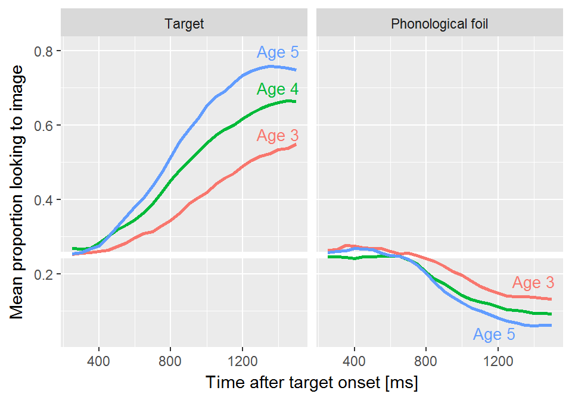

To account for the sparseness of the data, we used the empirical log-odds (or
empirical logit) transformation [@Barr2008]. This transformation adds .5 to
the looking counts. For example, a time-frame with 4 looks to the phonological
foil and 1 look to the unrelated image has a conventional log-odds of
log(4/1) = 1.39 and empirical log-odds of log(4.5/1.5) = 1.10. This
transformation fills in 0 values, and it dampens the extremeness of some
probabilities that arise in sparse count data. 


We fit a generalized additive model with fast restricted maximum likelihood
estimation [@Wood2017; @Soskuthy2017 for a tutorial for linguists]. Box 1
provides a brief overview of these models. We fit the models using the R package
`mgcv` [vers. 1.8.23; @Wood2017] with support from the
tools in the `itsadug` package [vers. 2.3;
@itsadug]. 


<div class = "infobox">
**Box 1: The Intuition Behind Generalized Additive Models**.

In these analyses, the outcome of interest is a value that changes over time in
a nonlinear way. We model these time series by building a set of features to
represent time values. In the growth curve analyses of familiar word
recognition, we used a set of polynomial features which expressed time as the
weighted sum of a linear trend, a quadratic trend and cubic trend. That is:

$$
\text{log-odds}(\mathit{looking}) = 
  \alpha + \beta_1 * \textit{Time}^1 +
           \beta_2 * \textit{Time}^2 +
           \beta_3 * \textit{Time}^3
$$

But another way to think about the polynomial terms is as *basis functions*: A
set of features that combine to approximate some nonlinear function of
time. Under this framework, the model can be expressed as:

$$
\text{log-odds}(\mathit{looking}) = 
  \alpha + f(\textit{Time})
$$
  
This is the idea behind generalized additive models and their *smooth terms*.
These smooths fit nonlinear functions of data by weighting and adding 
simple functions together. The figures below show 9 basis functions from a
"thin-plate spline" and how they can be weighted and summed to fit a growth
curve.

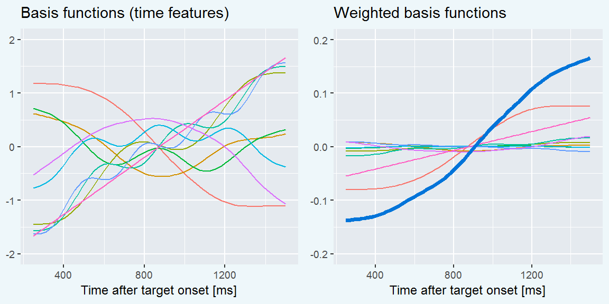

Each of these basis functions is weighted by a model coefficient, but the
individual basis functions are not a priori meaningful. Rather, it is the whole
set of functions that approximate the curvature of the data---i.e.,
*f*(Time))---so we statistically evaluate the whole batch of coefficients
simultaneously. This joint testing is similar to how one might test a batch of
effects in an ANOVA. If the batch of effects jointly improve model fit, we infer
that there is a significant smooth or shape effect. (Not quite sure this is 100%
accurate yet.)

Smooth terms come with an estimated degrees of freedom (EDF). These values
provide a sense of how many degrees of freedom the smooth consumed. An EDF of 1
is a perfectly straight line, indicating no smoothing. Higher EDF values
indicate that the smooth term captured more curvature from the data.

<!-- The other important thing to know about generalized additive models is that -->
<!-- wigglyness is penalized. With so many functions, one might worry about -->
<!-- overfitting the data and including incidental wiggliness into *f*(Time). These -->
<!-- models, however, include a smoothing parameter that -->
</div>


The model included main effects of study year. These *parametric* terms
work like conventional regression effects and determined the growth curve's
average values. We used age 4 as the reference year, so the model's intercept
represented the average looking probability at age 4. The model's year effects
therefore represented differences between age 4 vs. age 3 and age 4 vs. age 5.

The model also included *smooth* terms to represent the time course of the data.
We included a smooth term for trial time to represent a general effect of time
following noun onset across all studies, and we also included smooth terms for
time for each study. These study-specific smooths estimate how the shape of the
data differs in each individual study. Each of these smooths used 10 knots (9
basis functions). We also included child-level "random smooths" to represent
child-level variation in growth curve shapes. Because we have much as less data
at the child level than at the study level, these random smooths only included 5
knots (4 basis functions). We can think of these simpler splines as coarse
adjustments in growth curve shape to capture child-level variation from limited
data. Altogether, the model contained the following terms:

```
emp. log-odds(phonological vs. unrelated) = 
  α + β1*Study1 + β2*Study3 +   [growth curve averages]
  f1(Time) +                    [general smooth]
  f2(Time, Age-3) +             [study-specific smooths]
  f3(Time, Age-4) + 
  f4(Time, Age-5) + 
  f5(Time, Child-ID)            [by-child random smooths]
```


The model’s fitted values are shown in Figure N. These are the average empirical
log-odds of fixating on the phonological foil versus the unrelated image for
each year of the study. The model captured the trend for increased looks to the
competitor image with each year of the study. At age 4 and age 5, the shape
rises from a baseline to the peak around 800 ms. These curves slope downwards
and eventually fall beneath the initial baseline. The shape at age 3 does not
have a steady rise from baseline and shows a very small peak around 800 ms.

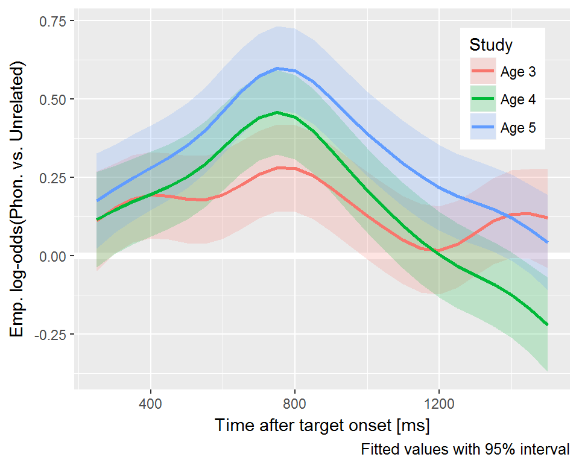

The average looks to the phonological foil over the unrelated for age 4 was
0.17 emp. log-odds, .54 proportion units. The averages for age 3 and
age 4 did not significantly differ, *p* = .43 but the average value was
significantly greater at age 5, 0.33 emp. log-odds, .58 proportion
units, *p* .43. Visually, this effect shows up in the almost constant
height difference between the age-4 and the age-5 curves.

There was a significant smooth term for time in general, estimated degrees of
freedom (EDF) = 6.78, *p* < .001, and for the age-3 smooth,
EDF = 4.39, *p* < .001. In contrast, the age-4 and age-5 smooths
did not differ significantly from the general time smooth, age-4 EDF =
1.00, age-4 *p* = .195, age-5 EDF = 1.00, age-5 *p* =
.394. The shapes of the age-4 and age-5 growth curves showed the same general
shape but with different heights.

We also computed the difference between the growth curves from successive
studies. These are shown in Figure N. The curves of the age-3 and age-4 were
significantly different from 500 to 1050 ms. This result confirms that the looks
to the phonological foil increased from age 3 and age 4 during the time window
immediately following presentation of the noun. The similarity between the
phonological foil and the target occurs early in the trial. Given
the 150--300 ms time required to execute an eye movement in response to speech,
the time window for these differences indicates that children became more
sensitive to the phonological similarities between the foil and the target from
age 3 to age 4.

The two curves also differed significantly after 1250 ms. The effect reflects
how the looks to phonological foil decreased as the trial progresses. After an
incorrect look to the foil, the children on average corrected their gaze and
looked even less to the phonological foil. We do not observe this degree of
correction during age 3 presumably because children hardly looked to the
phonological foil early on.

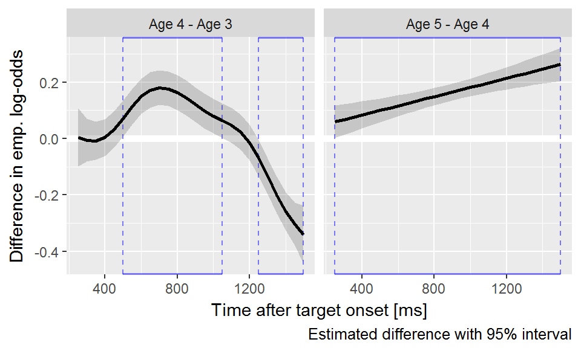

In contrast, the difference between the age-4 and age-5 smooths is driven
primarily by the intercept difference and a linear diverging trend---that is,
the distance between the two grows slightly over time. The same general
curvature was observed for the two studies, reflecting the same general looking
behavior at both time points. Children showed an early increase in looks to the
phonological foil relative to the unrelated image but after receiving
disqualifying information from the rest of the word, the looks to the
phonological foil rapidly decrease. The primary difference between age-4 and
age-5 is that the foil effect was more pronounced at age 5.


Talking points:

  - Children increased their relative looks to the phonological foil with each
    year of the study. Although they looked to the target more quickly and more
    reliably with each of the study, the advantage of the phonological foil over
    the unrelated image increased with each year. Thus, the children became more
    sensitive to the phonological cohort words as they grew older.
  - There is hardly an effect of the phonological foil during timepoint 1. There
    are a few ways to interpret this finding. The first may be artefactual. The
    stimuli were re-recorded at timepoint 2 so the timepoint 1 stimuli were
    somewhat longer on average (around 800 ms at TP1 vs. 550--800ms later on).
    However, with slower stimuli, we would still expect an inflection in looks
    to the foil as children have more time to activate the phonological
    representations to the cohort. In other words, with more time to respond,
    there could plausibly be an even greater effect of early phonological
    information.
  - Alternatively, the children in timepoint 1 may not be using the early
    similarity of words during word recognition. That is, instead of immediate
    incremental activation of lexical cohorts, the children may not be
    activating the cohorts as reliably. This would imply that further study is
    required on the evidence for when young children begin to show immediate
    activation of cohorts.
  - The children at timepoint1 may not be incrementally activating the cohorts.
    The children in timepoint 2 and 3 certainly are.
  - Incremental activation and early commitments to partial information goes up 
    with age.


Here we have the data and the model fits.

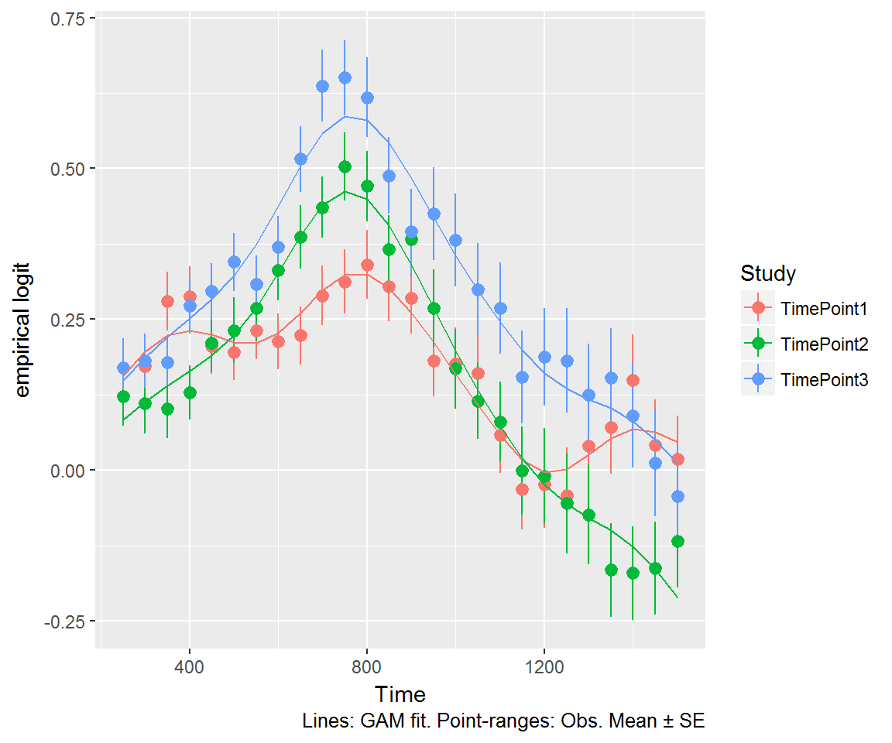


```r
itsadug::gamtabs(b2r, type = "html")
```

<!-- html table generated in R 3.4.3 by xtable 1.8-2 package -->
<!-- Sat Mar 03 11:53:26 2018 -->
<table border=1>
<caption align="bottom">   </caption>
  <tr> <td> A. parametric coefficients </td> <td align="right"> Estimate </td> <td align="right"> Std. Error </td> <td align="right"> t-value </td> <td align="right"> p-value </td> </tr>
  <tr> <td> (Intercept) </td> <td align="right"> 0.1661 </td> <td align="right"> 0.0491 </td> <td align="right"> 3.3857 </td> <td align="right"> 0.0007 </td> </tr>
  <tr> <td> STimePoint1 </td> <td align="right"> -0.0123 </td> <td align="right"> 0.0156 </td> <td align="right"> -0.7931 </td> <td align="right"> 0.4277 </td> </tr>
  <tr> <td> STimePoint3 </td> <td align="right"> 0.1612 </td> <td align="right"> 0.0153 </td> <td align="right"> 10.5327 </td> <td align="right"> &lt; 0.0001 </td> </tr>
   <tr> <td> B. smooth terms </td> <td align="right"> edf </td> <td align="right"> Ref.df </td> <td align="right"> F-value </td> <td align="right"> p-value </td> </tr>
  <tr> <td> s(Time) </td> <td align="right"> 6.7768 </td> <td align="right"> 7.7740 </td> <td align="right"> 8.5686 </td> <td align="right"> &lt; 0.0001 </td> </tr>
  <tr> <td> s(Time):STimePoint2 </td> <td align="right"> 1.0003 </td> <td align="right"> 1.0005 </td> <td align="right"> 1.6769 </td> <td align="right"> 0.1954 </td> </tr>
  <tr> <td> s(Time):STimePoint1 </td> <td align="right"> 4.3905 </td> <td align="right"> 5.4940 </td> <td align="right"> 13.1740 </td> <td align="right"> &lt; 0.0001 </td> </tr>
  <tr> <td> s(Time):STimePoint3 </td> <td align="right"> 1.0004 </td> <td align="right"> 1.0007 </td> <td align="right"> 0.7255 </td> <td align="right"> 0.3943 </td> </tr>
  <tr> <td> s(Time,R) </td> <td align="right"> 832.5109 </td> <td align="right"> 974.0000 </td> <td align="right"> 11.5381 </td> <td align="right"> &lt; 0.0001 </td> </tr>
   <a name=tab.gam></a>
</table>


## Looks to the semantic foil

We used a similiar procedure on the looks to the semantic foil.


```r
n_semy <- semy_foils$strong_foil$Target %>% unique() %>% length()
```

Next, we asked how children's sensitivity to the semantic foils changed over
developmental time. We only examined trials for which the semantic foil and the
noun were part of the same category. We kept trials, for example, with
*bee*–*fly*, *shirt*–*dress*, or *spoon*–*pan*, but we excluded trials where
the similarity was perceptual (*sword*–*pen*) or too abstract (*swan*–*bee*). We
kept 13 of the 24 trials.


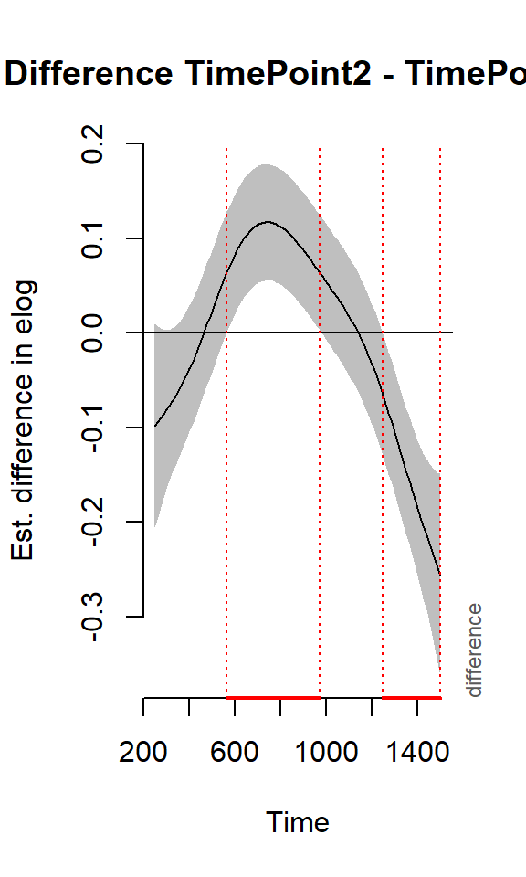

```
#> 
#> Family: gaussian 
#> Link function: identity 
#> 
#> Formula:
#> elog ~ S + s(Time) + s(Time, by = S)
#> 
#> Parametric coefficients:
#>             Estimate Std. Error t value Pr(>|t|)    
#> (Intercept)  0.43802    0.01097  39.919  < 2e-16 ***
#> STimePoint1 -0.12954    0.01557  -8.322  < 2e-16 ***
#> STimePoint3  0.07938    0.01574   5.043  4.6e-07 ***
#> ---
#> Signif. codes:  0 '***' 0.001 '**' 0.01 '*' 0.05 '.' 0.1 ' ' 1
#> 
#> Approximate significance of smooth terms:
#>                       edf Ref.df      F  p-value    
#> s(Time)             6.792  7.879 27.318  < 2e-16 ***
#> s(Time):STimePoint2 1.078  1.142  0.605 0.422443    
#> s(Time):STimePoint1 1.143  1.261  0.286 0.705947    
#> s(Time):STimePoint3 2.699  3.567  6.321 0.000141 ***
#> ---
#> Signif. codes:  0 '***' 0.001 '**' 0.01 '*' 0.05 '.' 0.1 ' ' 1
#> 
#> Rank: 38/39
#> R-sq.(adj) =  0.0711   Deviance explained = 7.15%
#> -REML =  47702  Scale est. = 1.2714    n = 30976
```

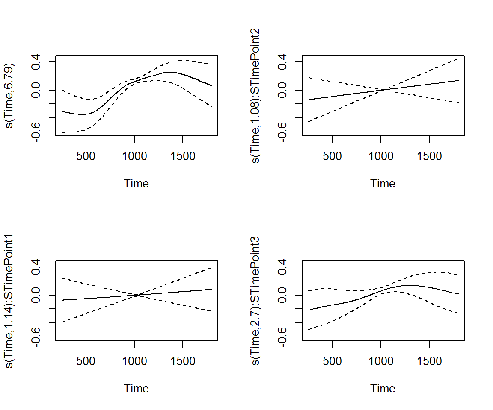

```
#>            df      AIC
#> s2n  9.165313 95563.23
#> s2  16.898148 95363.53
```

The model’s predictions are shown in the figure. It captured the trend for
increased looks to the competitor image with each year of the study.


```
#> Summary:
#> 	* S : factor; set to the value(s): TimePoint1, TimePoint2, TimePoint3. 
#> 	* Time : numeric predictor; with 30 values ranging from 250.000000 to 1800.000000.
```

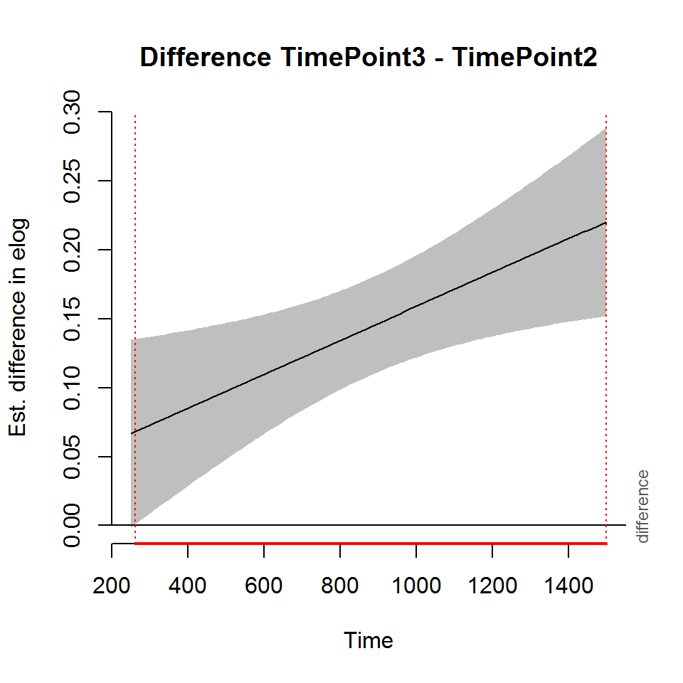

We also computed the difference of the curves from different studies. The
difference from timepoint 1 to timepoint 2 is just a matter of height.


```
#> Summary:
#> 	* Time : numeric predictor; with 100 values ranging from 250.000000 to 1800.000000.
```

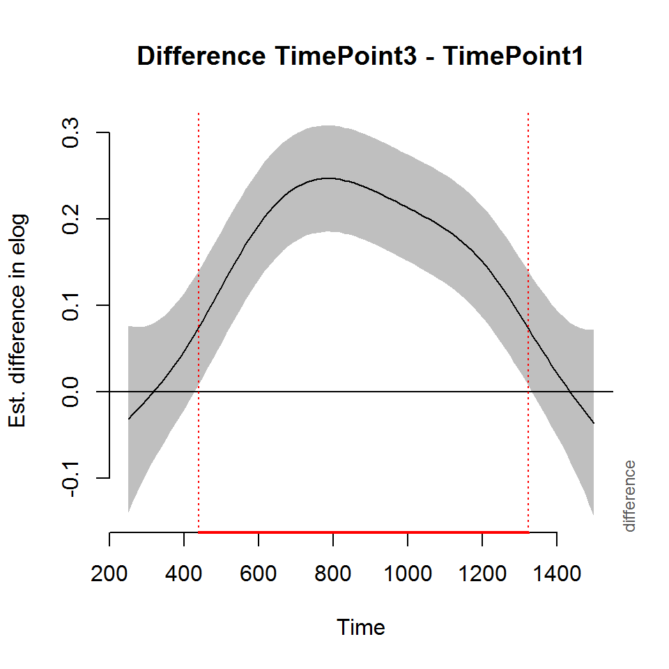

```
#> 
#> Time window(s) of significant difference(s):
#> 	250.000000 - 1800.000000
```

The difference from timepoint 2 to timepoint 3 includes a slight bump as the two
curves diverge from a similar starting position.


```
#> Summary:
#> 	* Time : numeric predictor; with 100 values ranging from 250.000000 to 1800.000000.
```

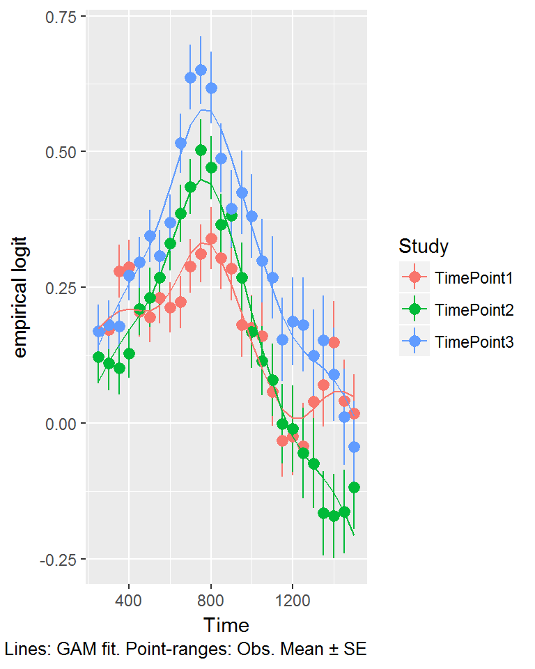

```
#> 
#> Time window(s) of significant difference(s):
#> 	735.353535 - 1596.464646
```

Timepoint 3 and timepoint 1 differ too. 


```
#> Summary:
#> 	* Time : numeric predictor; with 100 values ranging from 250.000000 to 1800.000000.
```


```
#> 
#> Time window(s) of significant difference(s):
#> 	312.626263 - 1800.000000
```

Here we have the data and the model fits.

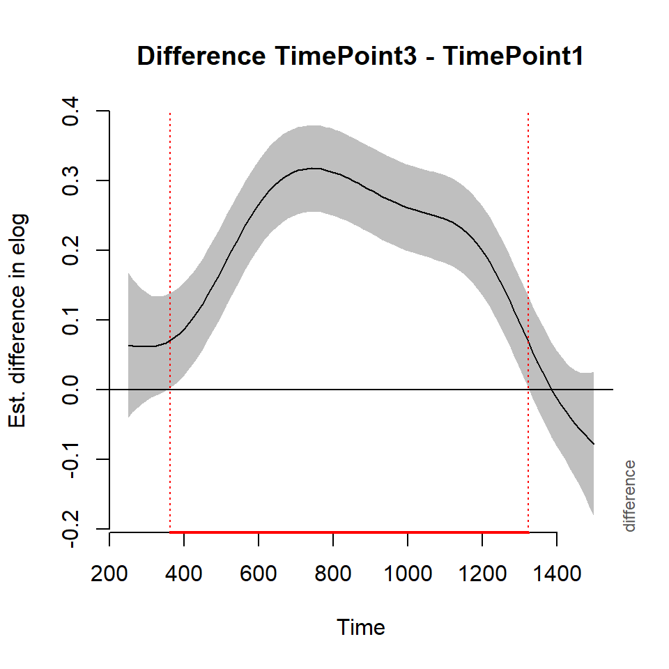


```r
itsadug::gamtabs(s2, type = "html")
```

<!-- html table generated in R 3.4.3 by xtable 1.8-2 package -->
<!-- Sat Mar 03 11:53:44 2018 -->
<table border=1>
<caption align="bottom">   </caption>
  <tr> <td> A. parametric coefficients </td> <td align="right"> Estimate </td> <td align="right"> Std. Error </td> <td align="right"> t-value </td> <td align="right"> p-value </td> </tr>
  <tr> <td> (Intercept) </td> <td align="right"> 0.4380 </td> <td align="right"> 0.0110 </td> <td align="right"> 39.9190 </td> <td align="right"> &lt; 0.0001 </td> </tr>
  <tr> <td> STimePoint1 </td> <td align="right"> -0.1295 </td> <td align="right"> 0.0156 </td> <td align="right"> -8.3225 </td> <td align="right"> &lt; 0.0001 </td> </tr>
  <tr> <td> STimePoint3 </td> <td align="right"> 0.0794 </td> <td align="right"> 0.0157 </td> <td align="right"> 5.0433 </td> <td align="right"> &lt; 0.0001 </td> </tr>
   <tr> <td> B. smooth terms </td> <td align="right"> edf </td> <td align="right"> Ref.df </td> <td align="right"> F-value </td> <td align="right"> p-value </td> </tr>
  <tr> <td> s(Time) </td> <td align="right"> 6.7920 </td> <td align="right"> 7.8788 </td> <td align="right"> 27.3184 </td> <td align="right"> &lt; 0.0001 </td> </tr>
  <tr> <td> s(Time):STimePoint2 </td> <td align="right"> 1.0776 </td> <td align="right"> 1.1421 </td> <td align="right"> 0.6050 </td> <td align="right"> 0.4224 </td> </tr>
  <tr> <td> s(Time):STimePoint1 </td> <td align="right"> 1.1427 </td> <td align="right"> 1.2614 </td> <td align="right"> 0.2861 </td> <td align="right"> 0.7059 </td> </tr>
  <tr> <td> s(Time):STimePoint3 </td> <td align="right"> 2.6995 </td> <td align="right"> 3.5673 </td> <td align="right"> 6.3211 </td> <td align="right"> 0.0001 </td> </tr>
   <a name=tab.gam></a>
</table>


## Look for individual differences in competitor sensitivity

[...put this on hold for a while...]

<!-- Let's just run with all the foils. There's a trade-off here about sparsity and -->
<!-- strength of the stimuli. -->


```
#> Parsed with column specification:
#> cols(
#>   .default = col_integer(),
#>   Study = col_character(),
#>   ResearchID = col_character(),
#>   Female = col_logical(),
#>   Male = col_logical(),
#>   MAE = col_logical(),
#>   AAE = col_logical(),
#>   Maternal_Education_LMH = col_character(),
#>   MinPair_ProportionCorrect = col_double(),
#>   SAILS_ProportionTestCorrect = col_double()
#> )
#> See spec(...) for full column specifications.
#> Joining, by = "ResearchID"
#> `geom_smooth()` using method = 'gam'
```

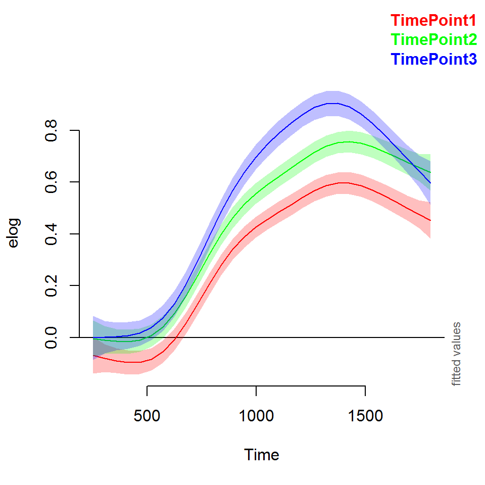

```
#> Joining, by = "ResearchID"
#> `geom_smooth()` using method = 'gam'
```


```
#> Parsed with column specification:
#> cols(
#>   .default = col_integer(),
#>   Study = col_character(),
#>   ResearchID = col_character(),
#>   Female = col_logical(),
#>   Male = col_logical(),
#>   MAE = col_logical(),
#>   AAE = col_logical(),
#>   Maternal_Education_LMH = col_character(),
#>   MinPair_ProportionCorrect = col_double(),
#>   SAILS_ProportionTestCorrect = col_double()
#> )
#> See spec(...) for full column specifications.
#> Joining, by = "ResearchID"
#> `geom_smooth()` using method = 'gam'
```


```
#> Joining, by = "ResearchID"
#> `geom_smooth()` using method = 'gam'
```


```
#> Joining, by = "ResearchID"
#> `geom_smooth()` using method = 'gam'
```

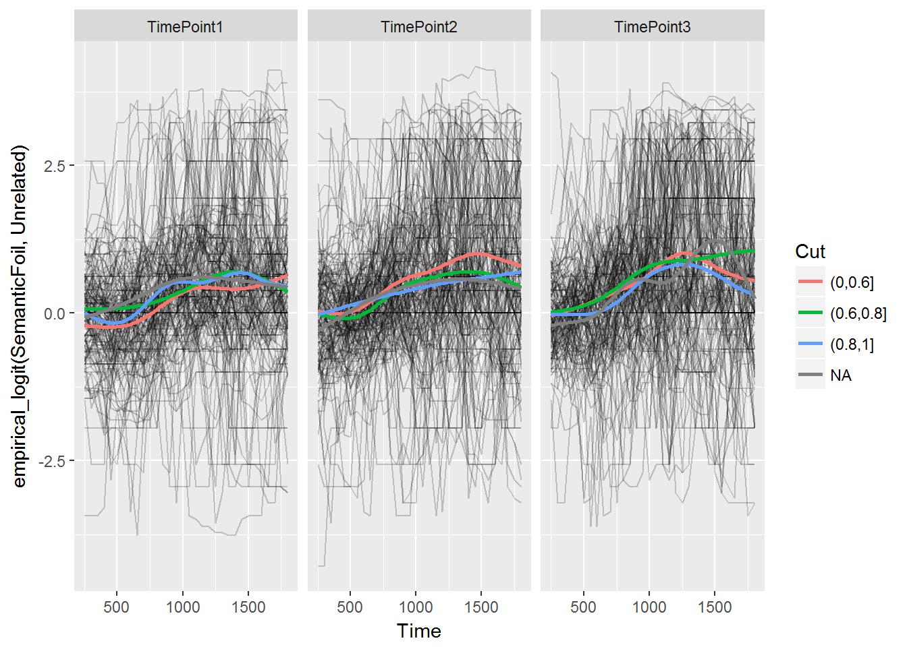


## Interim summary

* Visual evidence that the semantic foil and phonological foil become more 
  relevant (compared to unrelated foil) each year. 
* Our previous distinction between strong and weak foils still applies, 
  although it might be better to exclude only the (a priori) weakest foils, 
  like the rime phonological foils.
