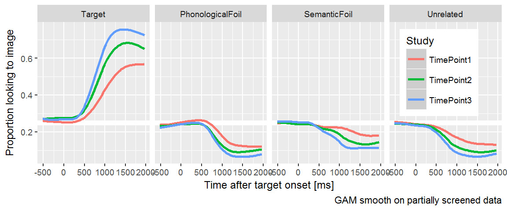
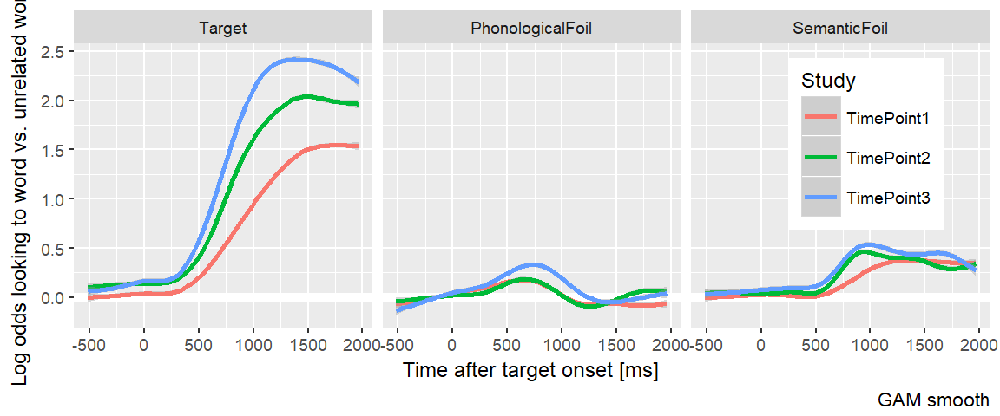
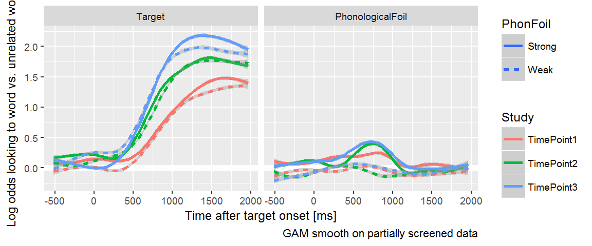
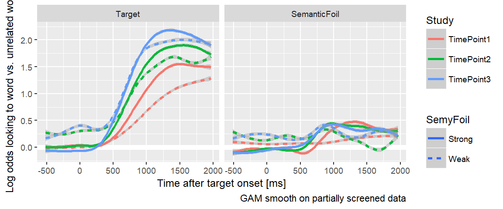
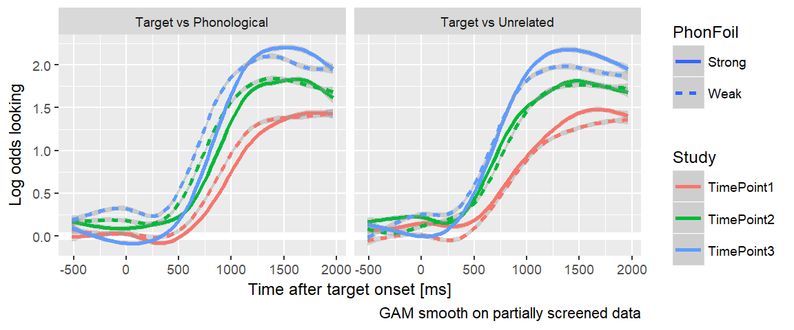
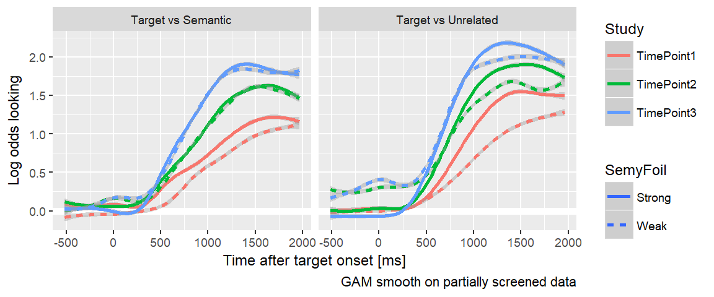

# Visualize looks to each image type

We continue our exploration of the raw data by aggregating looks to each image 
type. 


```r
library(dplyr)
library(rlang)
library(littlelisteners)
library(ggplot2)
library(tjmisc)
```

Earlier we cleaned the data to remove trials with excessive missing data 
and blocks of trials with too few trials. Read in that data.


```r
data <- readr::read_csv("./data/aim1-screened.csv.gz")
```

Plot growth curves to each AOI.


```r
resp_def <- create_response_def(
  primary = "Target",
  others = c("PhonologicalFoil", "SemanticFoil", "Unrelated"),
  elsewhere = "tracked",
  missing = NA
)

defs <- cycle_response_def(resp_def)

# We use this later on
semy_defs <- defs %>% 
  purrr::keep(~ .x$primary %in% c("Target", "SemanticFoil")) 
phon_defs <- defs %>% 
  purrr::keep(~ .x$primary %in% c("Target", "PhonologicalFoil"))

# Aggregate looks using each rule
looks_by_aoi <- data %>% 
  aggregate_looks(defs, Study + ResearchID + Time ~ GazeByImageAOI) %>% 
  rename(AOI = .response_def) %>% 
  select(AOI:Time, Prop, Primary, Unrelated) %>% 
  mutate(AOI = factor(AOI, c("Target", "PhonologicalFoil", 
                             "SemanticFoil", "Unrelated")))
  
ggplot(looks_by_aoi) + 
  aes(x = Time, y = Prop, color = Study) + 
  geom_hline(size = 2, color = "white", yintercept = .25) +
  stat_smooth() + 
  facet_grid( ~ AOI) + 
    labs(x = "Time after target onset [ms]",
       y = "Proportion looks",
       caption = "GAM smooth on partially screened data") +
  theme_grey(base_size = 9) +
  theme(legend.position = c(0.95, 0.95), 
        legend.justification = c(1, 1))
#> `geom_smooth()` using method = 'gam'
```



Normalize by using ratio of looks to each AOI versus the unrelated image. 


```r
ggplot(looks_by_aoi %>% filter(AOI != "Unrelated")) + 
  aes(x = Time, y = log(Primary / Unrelated), color = Study) + 
  geom_hline(size = 2, color = "white", yintercept = 0) +
  stat_smooth() + 
  facet_grid( ~ AOI) + 
    labs(x = "Time after target onset [ms]",
       y = "Log odds looking to word vs. unrelated word",
       caption = "GAM smooth on partially screened data") +
  theme_grey(base_size = 9) +
  theme(legend.position = c(0.95, 0.95), 
        legend.justification = c(1, 1))
#> `geom_smooth()` using method = 'gam'
#> Warning: Removed 10559 rows containing non-finite values (stat_smooth).
```



Each curve is the log odds of looking to the target, phonological foil, and
semantic foil versus the unrelated word. Positive values mean more looks to an
image type than the unrelated. If you think of the _y_ axis as the image's
_relatedness_ to the target, you can see a time course of relatedness in each
panel: Here early phonological effects meaning early relatedness and later,
flatter semantic effects meaning late relate relatedness. (Which makes extra
sense if phonological representations come into play before semantic ones.)

This plot suggests an important finding: Children becoming more sensitive to the
phonological and semantic foils as they grow older. (I use the verb _suggest_
because this is still a preliminary finding). Jan and I had made opposite 
predictions about whether this would happen. Her argument, I think, was that 
children become better at word recognition by becoming better able to inhibit 
interference from competing words. This plot would suggest that they show 
increased sensitive to the target and foils words by looking less to the 
unrelated word as they age and reapportioning those looks to the other three 
lexically relevant words.

## Comparing strong versus weak foils

In @RWLPaper, we ignored trials for certain items where we didn't think the
phonological or semantic similarity was strong enough.


```r
trial_info <- bind_rows(
  readr::read_csv("data-raw/rwl_timepoint1_trials.csv.gz"),
  readr::read_csv("data-raw/rwl_timepoint2_trials.csv.gz"),
  readr::read_csv("data-raw/rwl_timepoint3_trials.csv.gz")) %>% 
  select(TrialID, Target = WordTarget, 
         PhonologicalFoil = WordPhonologicalFoil,
         SemanticFoil = WordSemanticFoil, 
         Unrelated = WordUnrelated)

good_phono <- c("bear", "bee", "bell", "dress", "drum", "flag", "fly", 
                "heart", "horse", "pan", "pear", "pen", "vase")

good_semy <- c("bear", "bee", "bell", "bread", "cheese", "dress", 
               "drum", "fly", "horse", "pan", "pear", "shirt", "spoon")

words <- trial_info %>% 
  distinct(Target, PhonologicalFoil, SemanticFoil, Unrelated)

phono_foils <- split(words, words$Target %in% good_phono) %>% 
  lapply(arrange, Target) %>% 
  setNames(c("weak_foil", "strong_foil"))

semy_foils <- split(words, words$Target %in% good_semy) %>% 
  lapply(arrange, Target) %>% 
  setNames(c("weak_foil", "strong_foil"))

phono_foils$strong_foil %>% 
  knitr::kable(caption = "Trials with strong phonological foils.")
```


Table: (\#tab:print-foil-tables)Trials with strong phonological foils.

Target   PhonologicalFoil   SemanticFoil   Unrelated 
-------  -----------------  -------------  ----------
bear     bell               horse          ring      
bee      bear               fly            heart     
bell     bee                drum           swing     
dress    drum               shirt          swing     
drum     dress              bell           sword     
flag     fly                kite           pear      
fly      flag               bee            pen       
heart    horse              ring           bread     
heart    horse              ring           pan       
horse    heart              bear           pan       
pan      pear               spoon          vase      
pan      pear               spoon          bell      
pear     pen                cheese         ring      
pear     pen                cheese         vase      
pen      pear               sword          van       
vase     van                gift           swan      

```r

phono_foils$weak_foil %>% 
  knitr::kable(caption = "Trials with weak phonological foils.")
```


Table: (\#tab:print-foil-tables)Trials with weak phonological foils.

Target   PhonologicalFoil   SemanticFoil   Unrelated 
-------  -----------------  -------------  ----------
bread    bear               cheese         vase      
cheese   shirt              bread          van       
gift     kite               vase           bread     
kite     gift               flag           shirt     
ring     swing              dress          flag      
shirt    cheese             dress          fly       
spoon    swan               pan            drum      
swan     spoon              bee            bell      
swan     spoon              bee            ring      
swing    spoon              kite           heart     
sword    swan               pen            gift      
van      pan                horse          sword     

```r

semy_foils$strong_foil %>% 
  knitr::kable(caption = "Trials with strong semantic foils.")
```


Table: (\#tab:print-foil-tables)Trials with strong semantic foils.

Target   PhonologicalFoil   SemanticFoil   Unrelated 
-------  -----------------  -------------  ----------
bear     bell               horse          ring      
bee      bear               fly            heart     
bell     bee                drum           swing     
bread    bear               cheese         vase      
cheese   shirt              bread          van       
dress    drum               shirt          swing     
drum     dress              bell           sword     
fly      flag               bee            pen       
horse    heart              bear           pan       
pan      pear               spoon          vase      
pan      pear               spoon          bell      
pear     pen                cheese         ring      
pear     pen                cheese         vase      
shirt    cheese             dress          fly       
spoon    swan               pan            drum      

```r

semy_foils$weak_foil %>% 
  knitr::kable(caption = "Trials with weak semantic foils.")
```


Table: (\#tab:print-foil-tables)Trials with weak semantic foils.

Target   PhonologicalFoil   SemanticFoil   Unrelated 
-------  -----------------  -------------  ----------
flag     fly                kite           pear      
gift     kite               vase           bread     
heart    horse              ring           bread     
heart    horse              ring           pan       
kite     gift               flag           shirt     
pen      pear               sword          van       
ring     swing              dress          flag      
swan     spoon              bee            bell      
swan     spoon              bee            ring      
swing    spoon              kite           heart     
sword    swan               pen            gift      
van      pan                horse          sword     
vase     van                gift           swan      

We should verify that the two sets of words behave differently.


```r
weak_phon_looks <- trial_info %>% 
  semi_join(phono_foils$weak_foil) %>% 
  inner_join(data) %>% 
  mutate(PhonFoil = "Weak")
#> Joining, by = c("Target", "PhonologicalFoil", "SemanticFoil", "Unrelated")
#> Joining, by = "TrialID"

strong_phon_looks <- trial_info %>% 
  semi_join(phono_foils$strong_foil) %>% 
  inner_join(data) %>% 
  mutate(PhonFoil = "Strong")
#> Joining, by = c("Target", "PhonologicalFoil", "SemanticFoil", "Unrelated")
#> Joining, by = "TrialID"

phon_data <- bind_rows(strong_phon_looks, weak_phon_looks)

weak_semy_looks <- trial_info %>% 
  semi_join(semy_foils$weak_foil) %>% 
  inner_join(data) %>% 
  mutate(SemyFoil = "Weak")
#> Joining, by = c("Target", "PhonologicalFoil", "SemanticFoil", "Unrelated")
#> Joining, by = "TrialID"

strong_semy_looks <- trial_info %>% 
  semi_join(semy_foils$strong_foil) %>% 
  inner_join(data) %>% 
  mutate(SemyFoil = "Strong")
#> Joining, by = c("Target", "PhonologicalFoil", "SemanticFoil", "Unrelated")
#> Joining, by = "TrialID"

phon_data <- bind_rows(strong_phon_looks, weak_phon_looks)
semy_data <- bind_rows(weak_semy_looks, strong_semy_looks)

looks_by_aoi2 <- phon_data %>% 
  aggregate_looks(phon_defs, 
                  Study + ResearchID + PhonFoil + Time ~ GazeByImageAOI) %>% 
  rename(AOI = .response_def) %>% 
  select(AOI:Time, PhonFoil, Prop, Primary, PhonologicalFoil, Unrelated) %>% 
  mutate(AOI = factor(AOI, c("Target", "PhonologicalFoil", 
                             "SemanticFoil", "Unrelated")))

looks_by_aoi3 <- semy_data %>% 
  aggregate_looks(semy_defs, 
                  Study + ResearchID + SemyFoil + Time ~ GazeByImageAOI) %>% 
  rename(AOI = .response_def) %>% 
  select(AOI:Time, SemyFoil, Prop, Primary, SemanticFoil, Unrelated) %>% 
  mutate(AOI = factor(AOI, c("Target", "PhonologicalFoil", 
                             "SemanticFoil", "Unrelated")))

ggplot(looks_by_aoi2 %>% filter(AOI != "Unrelated")) + 
  aes(x = Time, y = log(Primary / Unrelated), 
      color = Study, linetype = PhonFoil) + 
  geom_hline(size = 2, color = "white", yintercept = 0) +
  stat_smooth() + 
  facet_grid( ~ AOI) + 
    labs(x = "Time after target onset [ms]",
       y = "Log odds looking to word vs. unrelated word",
       caption = "GAM smooth on partially screened data") +
  theme_grey(base_size = 9) 
#> `geom_smooth()` using method = 'gam'
#> Warning: Removed 48304 rows containing non-finite values (stat_smooth).
```



```r

ggplot(looks_by_aoi3 %>% filter(AOI != "Unrelated")) + 
  aes(x = Time, y = log(Primary / Unrelated), 
      color = Study, linetype = SemyFoil) + 
  geom_hline(size = 2, color = "white", yintercept = 0) +
  stat_smooth() + 
  facet_grid( ~ AOI) + 
    labs(x = "Time after target onset [ms]",
       y = "Log odds looking to word vs. unrelated word",
       caption = "GAM smooth on partially screened data") +
  theme_grey(base_size = 9) 
#> `geom_smooth()` using method = 'gam'
#> Warning: Removed 43071 rows containing non-finite values (stat_smooth).
```



What's going on here:

* The weak phonological foils are indeed weaker than the strong foils.
* The strong semantic foils appear stronger than the weak ones. The strong foils 
  show a growth curve pattern of increasing looks away from baseline and there 
  a developmental difference among the growth curves for each time point.
* Children have a lower advantage for the target (vs unrelated) in weak 
  foil trials because... why?

Now let's look at the target versus each foil and the unrelated.


```r
semantic_target_curves <- looks_by_aoi3 %>% 
  filter(AOI == "Target") %>% 
  mutate(`Target vs Semantic` = log(Primary / SemanticFoil), 
         `Target vs Unrelated` = log(Primary / Unrelated)) %>% 
  tidyr::gather("Comparison", "LogOdds", 
                `Target vs Semantic`, `Target vs Unrelated`) 
  
phonological_target_curves <- looks_by_aoi2 %>% 
  filter(AOI == "Target") %>% 
  mutate(`Target vs Phonological` = log(Primary / PhonologicalFoil), 
         `Target vs Unrelated` = log(Primary / Unrelated)) %>% 
  tidyr::gather("Comparison", "LogOdds", 
                `Target vs Phonological`, `Target vs Unrelated`) 
  
ggplot(phonological_target_curves) + 
  aes(x = Time, y = LogOdds, 
      color = Study, linetype = PhonFoil) + 
  geom_hline(size = 2, color = "white", yintercept = 0) +
  stat_smooth() + 
  facet_grid( ~ Comparison) + 
    labs(x = "Time after target onset [ms]",
       y = "Log odds looking",
       caption = "GAM smooth on partially screened data") +
  theme_grey(base_size = 9) 
#> `geom_smooth()` using method = 'gam'
#> Warning: Removed 37498 rows containing non-finite values (stat_smooth).
```



Both comparisons attain the same height, so phonological and unrelated foils 
affect processing equally later in the trial. The strong phonological foils 
curves in the Target vs Phonological comparison rise later than the weak foils, 
reflecting early looks to the phonological foils.


```r
ggplot(semantic_target_curves) + 
  aes(x = Time, y = LogOdds, 
      color = Study, linetype = SemyFoil) + 
  geom_hline(size = 2, color = "white", yintercept = 0) +
  stat_smooth() + 
  facet_grid( ~ Comparison) + 
    labs(x = "Time after target onset [ms]",
       y = "Log odds looking",
       caption = "GAM smooth on partially screened data") +
  theme_grey(base_size = 9) 
#> `geom_smooth()` using method = 'gam'
#> Warning: Removed 29775 rows containing non-finite values (stat_smooth).
```



The two comparisons do not attain the same height, so the semantic foil reduces 
odds of fixating to the target later on in a trial. There appears to be no 
difference in strong and weak foils in Year 2 and Year 3, so I might be able 
to collapse to remove this distinction and include more items in the analysis.


## Look for individual differences in competitor sensitivity

[...put this on hold for a while...]

<!-- Let's just run with all the foils. There's a trade-off here about sparsity and -->
<!-- strength of the stimuli. -->


## Interim summary

* Visual evidence that the semantic foil and phonological foil become more 
  relevant (compared to unrelated foil) each. 
* Our previous distinction between strong and weak foils still applies, 
  although it might be better to exclude only the (a priori) weakest foils, 
  like the rime phonological foils.
