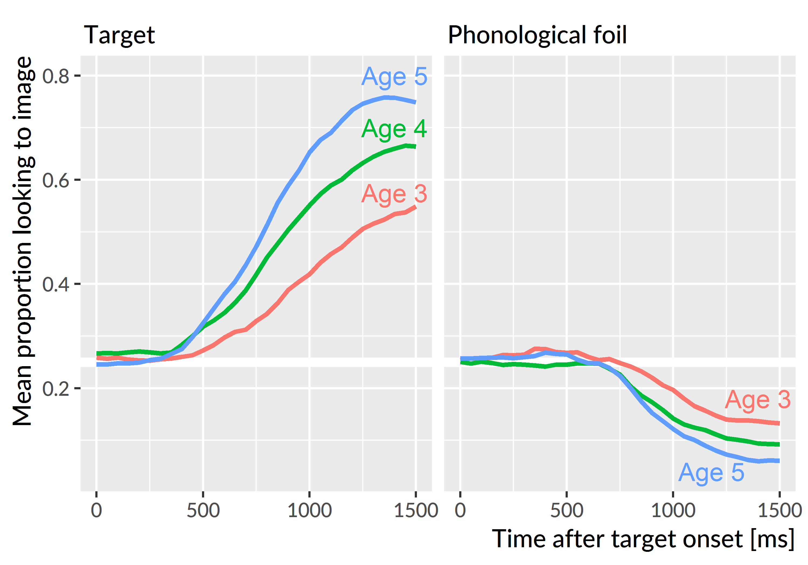
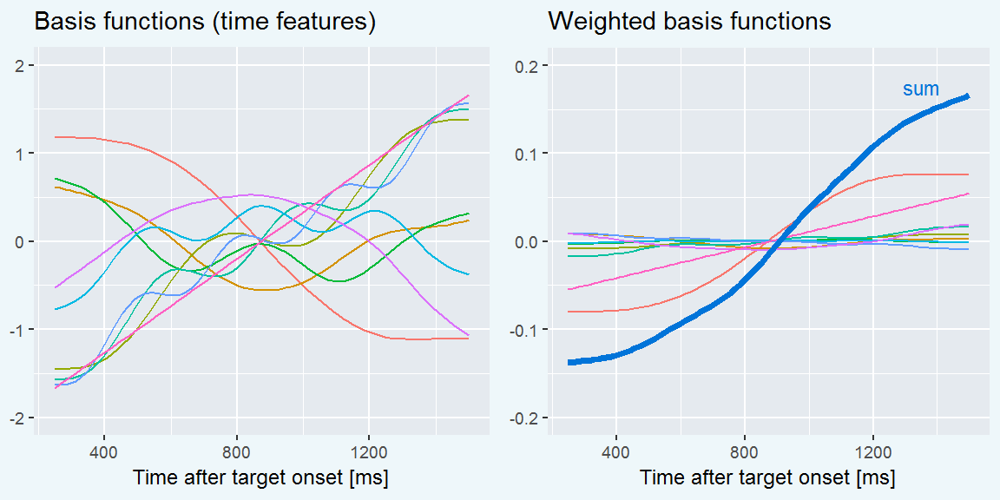
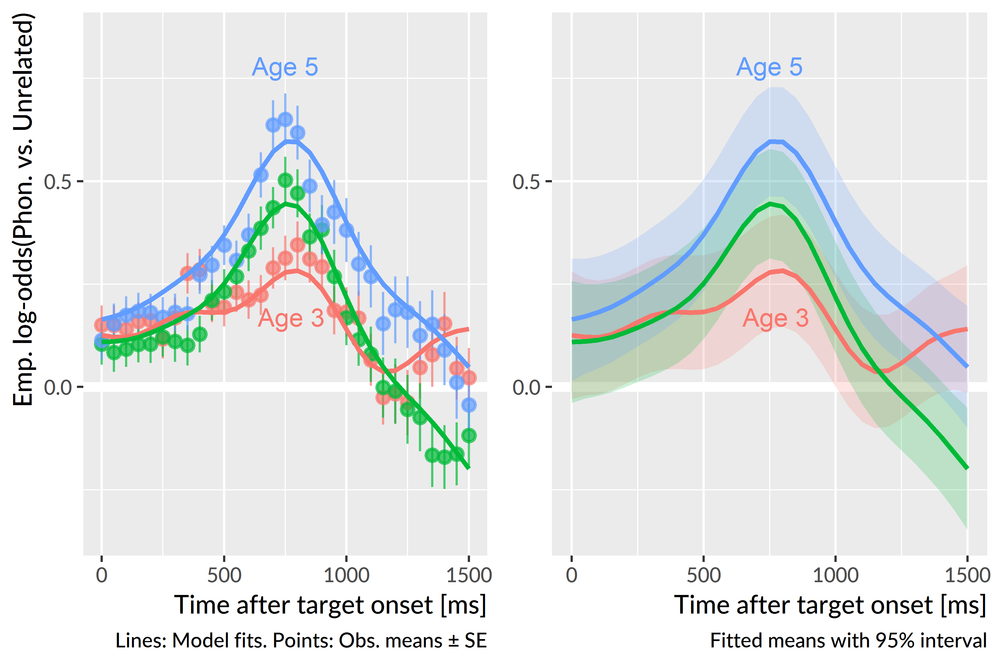
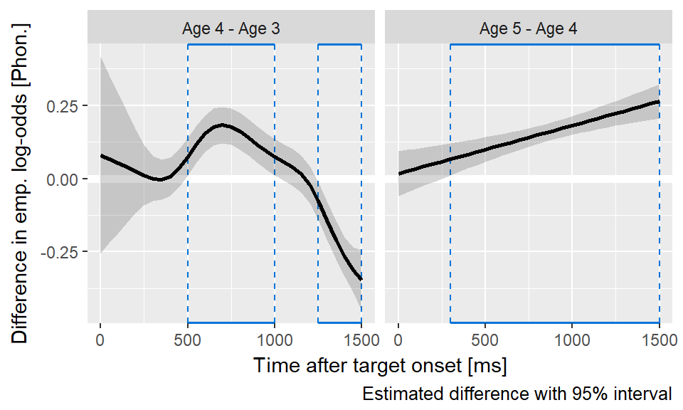
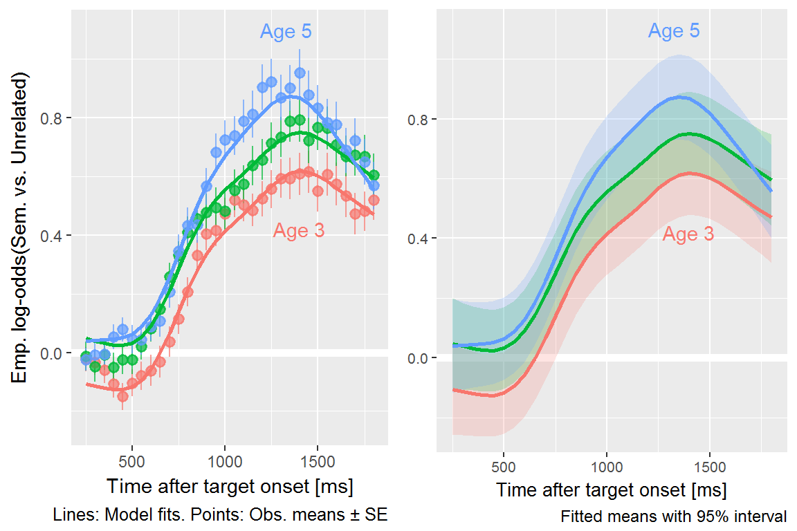
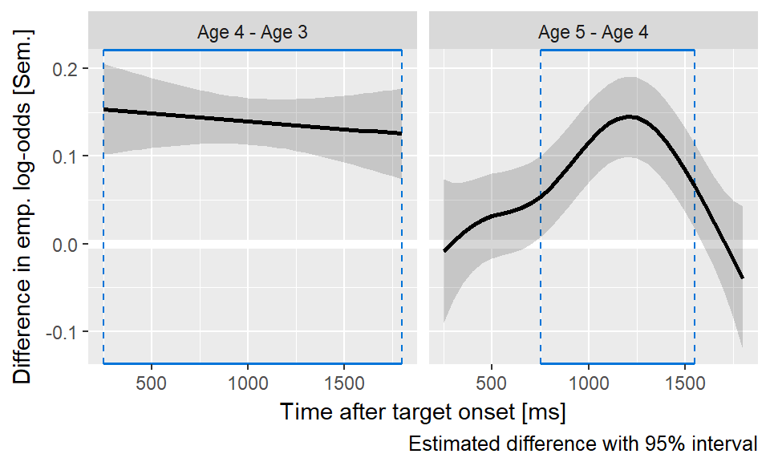

Effects of phonological and semantic competitors {#lex-competitors}
=======================================================================

Looks to the phonological competitor
------------------------------------------------------------------------

The next question I asked was how children's sensitivity to the
phonological competitors changed over developmental time. Following our
approach in @RWLPaper, I only examined trials for which the phonological
foil and the noun shared the same syllable onset. For example, this
criterion included trials with *dress*–*drum*, *fly*–*flag*, or
*horse*–*heart*, but it excluded trials *kite*–*gift* (phonetic
feature difference), *bear*–*bread* (onset difference), and
*ring*–*swing* (rimes). I kept 13 of the 24 trials.
[Appendix \@ref(vw-experiment-items)](#vw-experiment-items) provides a
complete list of trials used.

The outcome measure for these analyses was the log-odds of fixating on
the phonological competitor versus the unrelated word Because children
looked more to the target word with each year of the study, they
necessarily looked less to the distractors each year. 
Figure \@ref(fig:declining-phon-props) illustrates how the proportions
of looks to the phonological foils declined each year. Therefore, I
examined the effect of the phonological foil in comparison to the
unrelated foil. For example, on the trials where the target is *fly*, we
can study the effect of the phonological foil *flag* by looking at when
and to what degree the children fixate on *flag* more than the
unrelated image *pen*. If a window of time of shows a consistent
advantage for the phonological foil over the unrelated image, we
conclude that the children were sensitive to the phonological foil
during that window. By studying the time course of fixations to the
phonological competitor versus the unrelated word, we can identify when the
phonological competitor affected word recognition most significantly.

(ref:declining-phon-props) Because children looked more to the target as
they grew older, they numerically looked less the foils too. This effect
is why I evaluated the phonological and semantic foils by comparing them
against the unrelated image.

(\#fig:declining-phon-props)(ref:declining-phon-props)

As in the models from the previous chapter, I downsampled the data into
50-ms (3-frame) bins in
order to smooth the data. For these trials, I modeled the looks
from 0 to 1500 ms,
and I aggregated looks by child, study and time bin.
To account for the sparseness of the data, I used the empirical log-odds
(or empirical logit) transformation [@Barr2008]. This transformation
adds .5 to the looking counts. For example, a time-frame with 4 looks to
the phonological foil and 1 look to the unrelated image has a
conventional log-odds of log(4/1) = 1.39 and empirical log-odds of
log(4.5/1.5) = 1.10. This transformation fills in bins with 0 looks with
.5/.5 (avoiding 0/0 problems), and it dampens the extremeness of
some probabilities that arise in sparse count data.

To model these data, I fit a generalized additive model with fast
restricted maximum likelihood estimation [@Wood2017; @Winter2016;
see @Soskuthy2017 for a tutorial for linguists]. Box 1 provides a brief
overview of these models. I used the mgcv R package
[vers. 1.8.23; @Wood2017] with support from the
tools in the itsadug R package [vers. 2.3;
@itsadug].[^gca-fail] [Appendix \@ref(aim1-gca-models)](#aim1-gca-models)
contains the R code used to fit these models along with a description of 
the specifications represented by the model syntax.

[^gca-fail]: Initially, I tried to use Bayesian polynomial growth
  curve models, as in the earlier analysis of the looks to the target
  image. These models however did not converge, even when strong priors
  were placed on the parameters. In principle, I could have used Bayesian
  generalized additive models, but the software ecosystem and available
  tools for model criticism and inference are currently rather limited.

\Begin{infobox}

**Box 1: Intuition behind generalized additive models**.

In these analyses, the outcome of interest is a value that changes over
time in a nonlinear way. We model these time series by building a set of
features to represent time values. In the growth curve analyses of
familiar word recognition, I used a set of polynomial features which
expressed time as the weighted sum of a linear trend, a quadratic trend
and cubic trend. That is:

$$
\text{log-odds}(\mathit{looking}) =
  \alpha + \beta_1 * \textit{Time}^1 +
           \beta_2 * \textit{Time}^2 +
           \beta_3 * \textit{Time}^3
$$

But another way to think about the polynomial terms is as *basis
functions*: A set of features that combine to approximate some nonlinear
function of time. Under this framework, the model can be expressed as:

$$
\text{log-odds}(\mathit{looking}) =
  \alpha + f(\textit{Time})
$$

This is the idea behind generalized additive models and their *smooth
terms*. These smooths fit nonlinear functions of data by weighting and
adding simple functions together. The figures below show 9 basis
functions from a "thin-plate spline" and how they can be weighted and
summed to fit a growth curve.

Each of these basis functions is weighted by a model coefficient, but
the individual basis functions are not a priori meaningful. Rather, it
is the whole set of functions that approximate the curvature of the
data---i.e., *f*(Time))---so we statistically evaluate the whole batch
of coefficients simultaneously. This joint testing is similar to how one
might test a batch of effects in an ANOVA. If the batch of effects
jointly improve model fit, we infer that there is a significant smooth
or shape effect at play.

Smooth terms come with an estimated degrees of freedom (EDF). These
values provide a sense of how many degrees of freedom the smooth
consumed. An EDF of 1 is a perfectly straight line, indicating no
smoothing. Higher EDF values indicate that the smooth term captured more
curvature from the data.

<!-- The other important thing to know about generalized additive models is that -->
<!-- wigglyness is penalized. With so many functions, one might worry about -->
<!-- overfitting the data and including incidental wiggliness into *f*(Time). These -->
<!-- models, however, include a smoothing parameter that -->

\End{infobox}

The model included main effects of study year. These *parametric* terms
work like conventional regression effects and determined the growth
curve's average values. The model used age 4 as the reference year, so
the intercept represented the average looking probability at
age 4. The year effects represented differences
between age 4 vs. age 3 and age 4 vs. age 5.

The model also included *smooth* terms to represent the time course of
the data. As with the parametric effects, age 4 served as the reference
year. The model estimated a smooth for age 4 and it estimated
*difference smooths* to capture how the curvature at age 3 and age 5
differed from the age-4 curvature. Each of these study-level smooths
used 10 knots (9 basis functions). I also included child-level *random
smooths* to represent child-level variation in growth curve shapes.
Because there is much as less data at the child level than at the study
level, these random smooths only included 5 knots (4 basis functions).
We can think of these simpler splines as coarse adjustments in growth
curve shape to capture child-level variation from limited data.
Altogether, the model contained the following terms:

$$
\small
\begin{align*}
   \text{emp. log-odds}(\mathit{phon.\ vs.\ unrelated}) =\
   & \alpha + \beta_1\text{Age3} + \beta_2\text{Age5} +\ &\text{[growth curve averages]} \\
   & f_1(\text{Time}, \text{Age4})\ +                    &\text{[reference smooth]} \\
   & f_2(\text{Time}, \text{Age4} - \text{Age3})\ +      &\text{[difference smooths]} \\
   & f_3(\text{Time}, \text{Age4} - \text{Age5})\ +      & \\
   & f_i(\text{Time}, \text{Child}_i)                    &\text{[by-child random smooths]} \\
\end{align*}
$$

The model’s fitted values are shown in
Figure \@ref(fig:phon-vs-unre-fits). These are the average empirical
log-odds of fixating on the phonological foil versus the unrelated image
for each year of the study. The model captured the trend for increased
looks to the competitor image with each year of the study. At age 4 and
age 5, the shape rises from a baseline to the peak around 800 ms. These
curves slope downwards and eventually fall beneath the initial baseline.
The shape at age 3 does not have a steady rise from baseline and shows a
small peak around 800 ms. The peak proportions of looks to the
phonological competitor versus the unrelated word were
.57 at 800 ms for age 3,
.61 at 750 ms for age 4, and
.64 at 750 ms for age 5.

(ref:phon-vs-unre-fits) With each year of the study, children looked
more to the phonological competitor (relative to the unrelated image)
during and after the target noun. Both figures show means for each year
estimated by the generalized additive model. The left panel compares
model estimates to observed means and standard errors, and the right
panel visualizes estimated means and their 95% confidence intervals.

(\#fig:phon-vs-unre-fits)(ref:phon-vs-unre-fits)

The early peaks occur when one would expect if children are acting on
partial phonological information. The similarity between the
phonological competitor and the target noun occurs early on in the
trial. Suppose a child acts on the first 400 ms of the phonological
competitor. Assuming a 200--300 ms overhead to execute an eye movement
in response to speech, the child would reach the phonological foil
around 600--700 ms. This window is slightly before the observed peaks
at 750--800 ms, but the age 4 and age 5 curves both are on the rise away
from baseline during this window. 

The average looks to the phonological foil over the unrelated image for
age 4 was 0.16 emp. log-odds, .54 proportion units. The
averages for age 3 and age 4 did not significantly differ, *p*&nbsp;= .85,
but the average value was significantly greater at age 5, 0.31 emp.
log-odds, .58 proportion units, *p*&nbsp;< .001. Visually, this
effect shows up in the almost constant height difference between the
age-4 and the age-5 curves.

There was a significant smooth term for time at age 4, estimated degrees
of freedom (EDF) = 7.28, *p*&nbsp;< .001.
Figure \@ref(fig:phon-diff-curves) visualizes how and when the smooths
from other studies differed from the age-4 smooth.

(ref:phon-diff-curves) Differences in the average looks to the
phonological competitor versus the unrelated image between age 4 and the
other ages. Plotted line is estimated difference and the shaded region
is the 95% confidence interval around that difference. Boxes highlight
regions where the 95% interval excludes zero. From age 3 to age 4,
children become more sensitive to the phonological foil during and after
the target noun. The linear difference curve for age 4 versus age 5
indicates that the two years largely have the same curvature, but they
steadily diverge over the course of the trial.

(\#fig:phon-diff-curves)(ref:phon-diff-curves)

The age-3 and age-4 curves significantly differed, EDF = 5.48,
*p*&nbsp;< .001. In particular, the curves are significantly different
from 500 to 1050 ms. This result confirms that the looks to the
phonological foil increased from age 3 and age 4 during the time window
immediately following presentation of the noun and that children became
more sensitive to the phonological similarities between the competitor
and the target from age 3 to age 4.

The age-3 and age-4 curves also differed significantly after 1250 ms, so
that at age 4 children looked less to the competitor compared to age 3.
The effect reflects how the looks to phonological competitor decrease as
a trial progresses. After an incorrect look to the foil, the children on
average corrected their gaze and looked even less to the phonological
foil. We do not observe this degree of correction during age 3,
because children at age 3 looked less overall to the phonological
foil early on.

The age-4 and age-5 smooths also significantly differed, EDF =
1.00, *p*&nbsp;< .001, although the low EDF values indicates that
the shape of the difference was a flat line. Thus, the difference
between the age-4 and age-5 smooths is driven primarily by the intercept
difference and a linear diverging trend---that is, the distance between
the two grows slowly over time. The same general curvature was
observed for the two studies, suggesting the same general looking
behavior at both time points: Children showed an early increase in looks
to the phonological foil relative to the unrelated image but after
receiving disqualifying information from the rest of the word, the looks
to the phonological foil rapidly decrease. The primary difference
between age-4 and age-5 is that the competitor effect becomes more
pronounced at age 5.

**Summary**. Children looked more to the phonological competitor than the
unrelated image early on in the trials. The advantage of the phonological
competitor peaked on average around 800 ms after target onset, and the
early timing indicates that children were shifting their gaze in
response to the fleeting phonological similarity of the competitor to
the target noun. The peak was small at age 3 but increased in height
with each year of the study. Children became more sensitive to the
phonological cohort competitors as they grew older.

Looks to the semantic competitor
------------------------------------------------------------------------

I asked how children's sensitivity to the semantic competitor changed
as they grew older. As in @RWLPaper, I only examined trials for
which the semantic foil and the noun were part of the same category. For
example, I included trials with *bee*–*fly*, *shirt*–*dress*, and
*spoon*–*pan*, but I excluded trials where the similarity was perceptual
(*sword*–*pen*) or too abstract (*swan*–*bee*). This criterion kept
13 of the 24 trials.
[Appendix \@ref(vw-experiment-items)](#vw-experiment-items) provides a
complete list of trials used.

For these trials, I used the same modeling technique as the one used for
phonological competitors: Generalized additive models with study effects
and a time smooth, time-by-study difference smooths, and time-by-child
random smooths. I modeled the looks
from 250 to 1800 ms.
This window was 300 ms longer than the one used
for the phonological competitors in order to capture late-occurring
semantic effects.

The model’s fitted values are shown in
Figure \@ref(fig:semy-vs-unre-fits). The average empirical log-odds of
fixating on the semantic competitor versus the unrelated word increased with
each year of the study. All three years show the same general time
course of effects: Looks begin to increase from a baseline around 750 ms
and peak around 1300 ms. The peak proportions of looks to the
semantic competitor versus the unrelated word increased as children grew
older: The peaks were .65 at
1400 ms for age 3, .68 at
1400 ms for age 4, and .71 at
1350 ms for age 5. Moreover, the semantic competitor
shows a decisive advantage over the unrelated image at age 3, in contrast
to the limited advantage of the phonological competitor at age 3.

(ref:semy-vs-unre-fits) With each year of the study, children looked
more to the semantic foil (relative to the unrelated image) with peak
looking occurring after the target noun. Both figures show means for
each year estimated by the generalized additive model. The left panel
compares model estimates to observed means and standard errors, and the
right panel visualizes estimated means and their 95% confidence
intervals.

(\#fig:semy-vs-unre-fits)(ref:semy-vs-unre-fits)

The average looks to the semantic foil over the unrelated image for
age 4 was 0.44 emp. log-odds, .61 proportion units.
Children looked significantly less to the semantic foil on average at
age 3, 0.30 emp. log-odds, .57 proportion
units, *p*&nbsp;< .001, and they looked significantly more to the semantic
foil at age 5, 0.50 emp. log-odds, .62
proportion units, *p*&nbsp;< .001. 

There was a significant smooth term for time at age 4, estimated degrees
of freedom (EDF) = 7.04, *p*&nbsp;< .001.
Figure \@ref(fig:semy-diff-curves) visualizes the time course of the
differences between the smooths from each study.

(ref:semy-diff-curves) Differences in the average looks to the semantic
competitor versus the unrelated word between age 4 and the other ages.
Plotted line is estimated difference and the shaded region is the 95%
confidence interval around that difference. Boxes highlight regions
where the 95% interval excludes zero. The flat line on the left reflects
how the shape of the growth curves remained the same from age 3 to age 4
and only differed in average height. From age 4 to age 5, the lines
quickly diverge and the age-5 curve reaches a higher peak value.

(\#fig:semy-diff-curves)(ref:semy-diff-curves)

The shapes of the age-3 and age-4 curves did not significantly differ,
EDF = 1.00, *p*&nbsp;= .535. The age-3 curve begins to rise
about 100 ms later, and it reaches a shallower peak value than the age-4
curve. These two features create a nearly constant height difference
between the two curves, and thus the two curves show the same overall
shape.

The age-4 and age-5 smooths significantly differed, EDF = 3.74,
*p*&nbsp;< .001. The differences are greatest after the end of the target
noun, in the window from 750 to 1500 ms. The two curves start from a
similar baseline but quickly diverge as the age-5 curve reaches a higher
peak value. After 1500 ms, the age-5 curve turns downwards to overlap
with the age-4 curve. Children looked more to the semantic foil
relative to the unrelated image, but they were also quicker to correct
and look away from it.

**Summary.** Children became more sensitive to the semantic competitor,
compared to the unrelated word, with each year of the study. The
semantic foils clearly influenced looking patterns at age 3, in contrast
to the muted effect observed for the phonological foils. The semantic
effect also occurred when we would expect: After the end of the target
noun, following the lexical activation of the target noun and its
semantic neighbors.

Child-level differences in competitor sensitivity at age 3
------------------------------------------------------------------------

Next, I asked whether children differed reliably in their sensitivity to
the phonological and semantic foils based on speech perception and
vocabulary measures collected at age 3

As a measure of speech perception, I used scores from a minimal pair
discrimination experiment administered during the first year of the
study. [citations] The task is essentially an ABX discrimination task:
A picture of a familiar object is shown and labeled (e.g., "car"),
another object is shown and labeled ("jar"), and then both images are
shown and one of the two is named. The child then indicated which word
they heard by tapping on the image on a touch-screen.

I derived speech perception scores by fitting a hierarchical
item-response model. This logistic regression model estimates the
probability of child *i* correctly choosing word *j* on word-pair *k*.
The equation below provides a term-by-term description of the model. The
model's intercept term represents the average participant's probability
of correctly answering for an average item. By-child random intercepts
capture a child's deviation from the overall average, so they estimate
the child's *ability*. By-word and by-word-in-pair random intercepts
capture the relative *difficulty* of particular items on the experiment.
The by-word-in-pair effects were necessary because four words appeared
in more than one word pair (e.g., *juice*--*goose* and
*juice*--*moose*). The model also controlled for the children's ages and
receptive vocabulary scores (PPVT-4 growth scale values). These
predictors were transformed to have mean 0 and standard deviation 1, so
the the model's intercept reflected a child of an average age and an
average vocabulary level. Therefore, the by-child intercepts
reflect a child's ability after controlling for age and receptive
vocabulary.

$$
\small
\begin{align*}
   \text{log-odds}(\mathit{choosing\ correct\ word}) =\
   & \alpha\ +                  &\text{[average participant ability]} \\
   & \alpha_i\ +                &\text{[difference of participant}\ i
                                       \text{'s ability from average]} \\
   & \alpha_j\ +                &\text{[word}\ j\text{'s difficulty]} \\
   & \alpha_{j,k}\ +            &\text{[word}\ j
                                       \text{'s difficulty in word-pair}\ k] \\
   & \beta_{1}\text{Age}\ +     &\text{[participant-level predictors]} \\
   & \beta_{2}\text{Vocabulary} & \\
\end{align*}
$$

I tested whether phonemic discrimination ability at age 3 predicted
looks to the phonological competitor over the unrelated image by
modifying the generalized additive model from earlier. In particular, I
included a smooth term for the phonemic discrimination ability score and
a "smooth interaction" between the smooth of time and phonemic ability.
These smooth interaction terms are analogous to interaction terms in
linear models. In this case, the interaction term allows the ability
score to change the shape of the time trend. The additive model was
therefore:

$$
\small
\begin{align*}
   \text{emp. log-odds}(\mathit{phon.\ vs.\ unrelated}) =\
   & \alpha +\ &\text{[growth curve average]} \\
   & f_1(\text{Time})\ +                    &\text{[time smooth]} \\
   & f_2(\text{Ability})\ +                 &\text{[ability smooth]} \\
   & f_3(\text{Time} * \text{Ability})\ +   &\text{[interaction smooth]} \\
   & f_i(\text{Time}, \text{Child}_i)       &\text{[by-child random smooths]} \\
\end{align*}
$$

The model included data from 144 participants; these were
children with eyetracking data, receptive vocabulary and phonemic
discrimination data at age 3. There was not a significant smooth effect
for discrimination ability, EDF = 1.00, *p*&nbsp;= .551 or
for an interaction smooth between time and ability, EDF =
8.37, *p*&nbsp;= .303.

To test the role of receptive vocabulary, I also fit analogous models
using growth scale value scores from the PPVT-4, a receptive vocabulary
test. I first adjusted these scores in a regression model to control
for--that is, to partial out the effects of---age and predicted accuracy
on the discrimination task. There was not a significant
smooth effect for receptive vocabulary, EDF = 1.00,
*p*&nbsp;= .868, or a significant interaction smooth between time and
receptive vocabulary, EDF = 5.57,
*p*&nbsp;= .610. Receptive vocabulary therefore was not related to
looks to the phonological foil at age 3.

I tested the same two predictors on looks to the semantic foil at age 3.
These child-level factors did not show any significant parametric
effects, smooth effects or smooth interactions with time. Thus,
children's looks to the semantic foil were not reliably related to
phonemic discrimination or receptive vocabulary.

**Summary**. These models tested whether two child-level
factors---minimal-pair discrimination ability and receptive
vocabulary---predicted looks to the phonological and semantic
competitors at age 3. No significant effects were observed for 
all cases. 

Discussion
------------------------------------------------------------------------

In the preceding analyses, I examined children's fixation patterns to
the phonological and semantic competitors and how these fixation
patterns changed over developmental time. With each year of the study,
children looked more to the target overall, so they consequently looked
less to the competitor images each year. To account for this fact, these
analyses examined the ratio of looks to the competitors versus the
unrelated word. This ratio measured the relative advantage of a
competitor over the unrelated word.

### Immediate activation of phonological neighbors

Developmentally, children became more sensitive to the phonological
competitors with each year of the study. These words shared the same
syllable onset as the target noun---for example, the pairs
*dress*–*drum* or *fly*–*flag*. The competitors affected word
recognition early on, with relative looks to the phonological foils
peaking around 800 ms. The target nouns were approximately 800 ms in duration
at age 3 and 550--800 ms at later ages. Assuming a 200–300 ms overhead
for executing an eye movement in response to speech, this timing
indicates that children shifted their gaze immediately, based on partial
information. Moreover, the tendency to act on partial information became
stronger with age, because the early advantage of the phonological
competitor increased with each year of the study.

When children looked to the phonological competitor, they fixated on the
wrong image and had to revise their interpretation of the noun. At
ages 4 and 5, the early peaks of looks to the phonological competitor
were followed by a steep, monotonic decrease in looks: Children rejected
their initial interpretation of the word and considered other images. At
age 3, the average pattern showed more wiggliness, suggesting that
children were less decisive in rejecting the phonological competitor.
The shapes of the looking patterns at age 4 and age 5 were essentially
the same. In particular, the older children were not any faster in the
rejecting the phonological competitor on average.

We can interpret these findings in terms of lexical processing dynamics.
Under this view, incoming speech activates phonetic and phonemic and
lexical representations. The word with the strongest activation is the
favored interpretation and the object of the child's fixations. The
early looks to the phonological competitors reflect immediate
activation of lexical units: Children activate words on the basis of
partial acoustic information. This result is a hallmark of spoken word
recognition. The activation of phonologically plausible words becomes
stronger with age, as reflected in children's increasing sensitivity to
the phonological competitors. Some mechanisms that may explain this
developmental pattern include changes in lexical organization so that
neighborhoods of phonologically similar words coactivate and changes in
lexical representations so that partial information can more eagerly
activate compatible words.[^connectionism]

[^connectionism]: I am not too committed to any particular mechanisms
  of *representation* or *organization*. Under a connectionist framework
  with distributed representations, for instance, a 
  word is represented as a pattern of activation distributed over many shared 
  units. (I think of numbers on a digital clock where seven lines turn on or 
  off to make ten digits but exponentially more complicated.) In that
  case, representation and organization are inseparable, and it would make
  more sense to talk about the strength and number of connections instead.
  My point here is that the lexical mechanisms involved should be ones
  that enable stronger immediate activations as a result of learning more
  words.

Children at age 4 and age 5 did not show any changes in how quickly they
rejected the phonological foil, and this results suggests that lexical
inhibition may not change over the preschool years. The reasoning is as
follows: If children developed stronger lexical inhibition with age, so
that lexical competition resolves more quickly, then we would expect
activation of the phonological competitors to decay more quickly and for
children to reject the phonological competitor more quickly. But this
pattern is not what we observed in the growth curve
analyses.[^decay-rates] The developmental trajectory here is one of
increased activation, of children learning words and learning
similarities among them so that phonological similar words participate
in word recognition.

[^decay-rates]: Granted, there might be some subtle nonlinear effect
  at play where higher peak activations require a greater degree of
  inhibition to overcome, so changes in inhibition could be a plausible
  part of the developmental story. But there is no compelling reason from 
  the data to make that assertion.

### Late activation of semantic neighbors

The semantic competitors were from the same category as the target noun:
for example, *bee*–*fly* or *shirt*–*dress*. Children showed
year-over-year increases in their sensitivity to the semantic
competitor, compared to the unrelated image. Looks the semantic foils
started rising steadily 500--700 ms after target onset and peaked late
in the trial, around 1300 ms. This time-course is more protracted than
the immediate peaks observed for the phonological competitor.

In terms of lexical processing, this late timing is consistent with
cascading activation: Spoken words immediately activate phonological
neighborhoods with activation cascading onto semantically related words.
As a particular word is favored, its semantic relatives receive more
secondary activation. For example, children hear "find the shirt",
activate the target *shirt*, but also activate other pieces of clothing
including *dress*. The late timing of looks to the semantic competitor
therefore reflects late, secondary activation of the spoken word's semantic
relatives. In other words, the activation of a semantic neighbor (like
*dress*) is greatest when the activation of the spoken word (*shirt*) is
greatest which happens relatively late, once the competition among
phonological alternatives resolves.

Under this account, children hear a word, activate it, and become
increasingly likely to fixate on the semantic competitor, compared to
the unrelated image. The late looks probably reflect a combination of 
behaviors: children considering the semantically related image to check
their initial interpretation as well as children looking to the wrong image
because of confusion, lack of knowledge, overriding activation from
the semantic competitor, or lack of interest in the target. 

Initially, I had subscribed to a confusion or lack-of-knowledge
interpretation of the semantic competitor's advantage. That is, children
look to the semantic competitor because they do not know the difference
between the target and the semantic competitor. After all, my thinking
went, these were young children and decisions like *bee* vs. *fly* or
*goat* vs. *sheep* can be difficult. But there are two objections to
that line of reasoning. First, our lab piloted the set of words in
preschool classrooms, so we confirmed that children could reliably and
correctly point to *bee* even when *fly* is an alternative. Second, we
would a priori expect that children's confusion among words to be
greatest when they are youngest and have much less experience with these
semantic categories. (Indeed, children at age 3 looked less to the
target overall, so in general, they were less successful at recognizing
the target word.) 

The late looks to the semantic competitor, relative to the unrelated
image, however, were greatest at age 5. Children's looks became more
selective with age: They looked more to the semantic competitor because
they had discovered the semantic connections among words. They had
learned the similarity between *bee* and *fly* or *shirt* and *dress*.
Put another way, to demonstrate confusion between two choices, children
must learn some association that connects the two; they must use or
activate some information that induces warranted uncertainty. Rather
than confusion about the meaning of nouns, the late looks likely reflect
a confirmatory behavior where children give some consideration to the
semantic alternative. This is especially the case at age 5, where the
advantage of semantic competitor quickly decreases after its peak,
indicating rejection of the semantic competitor.

### Lexical competitors and individual differences

I asked whether offline child-level measures predicted sensitivity to
the phonological and semantic competitors at age 3. I used children's
ability scores from a minimal-pair discrimination task as a measure of
phonemic speech perception, and I also used scores from a receptive
vocabulary test. For the phonological competitor, I expected that
children with better phonemic discrimination would show increased
looks to the phonological competitor because they had more detailed
phonemic representations that would activate phonological neighborhoods
more quickly. For the semantic competitor, I likewise expected children
with larger receptive vocabularies to show increased looks to the
semantic competitor because these children knew more words and likely
developed more semantic connections among the words. I tested these
effects by using the scores as parametric effects to see if they
predicted average looks to the competitor, and alternatively, by using
the scores for smooth effects to see if they influenced the time course
of looks to the foils.

None of these expectations held: Neither of the child-level measures
predicted average sensitivity to the phonological or semantic
competitors at age 3. Part of the result may be artifactual: The
data---looks to a subset of images on a subset of trials---may be too
limited at the individual level for the models to pick up on child-level
effects. Part of the result may be developmental too: Children were
least sensitive to the competitors at age 3, so individual differences
may be too small for the data or models to capture. Further work, with
different experimental designs, may elaborate on whether offline
measures can reliably detect differences in sensitivity to lexical
competitors during word recognition. 

