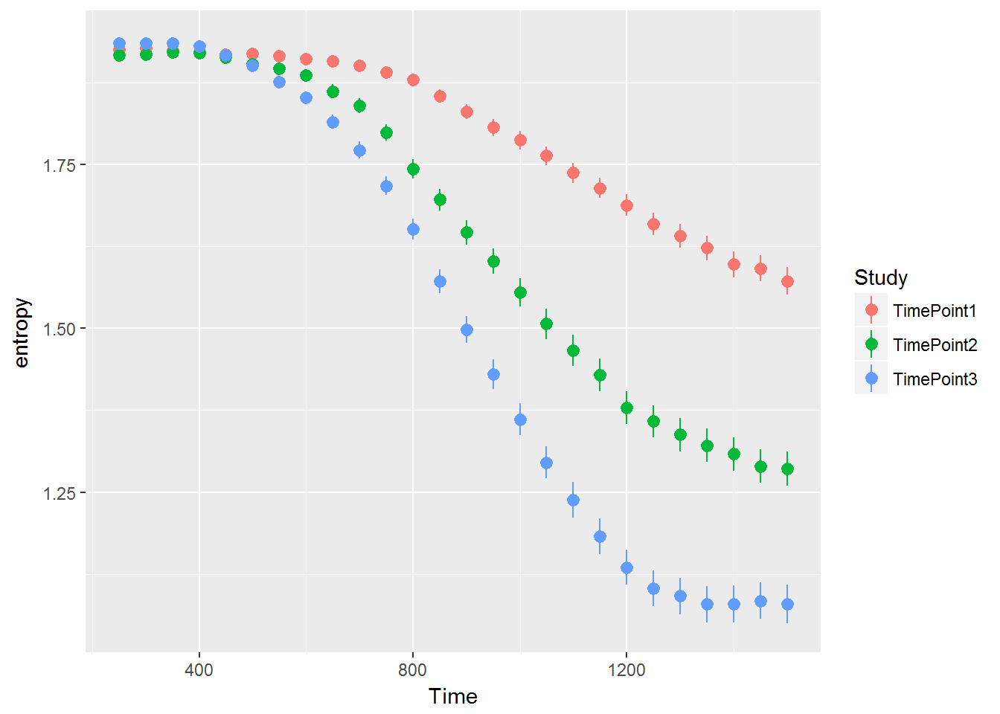
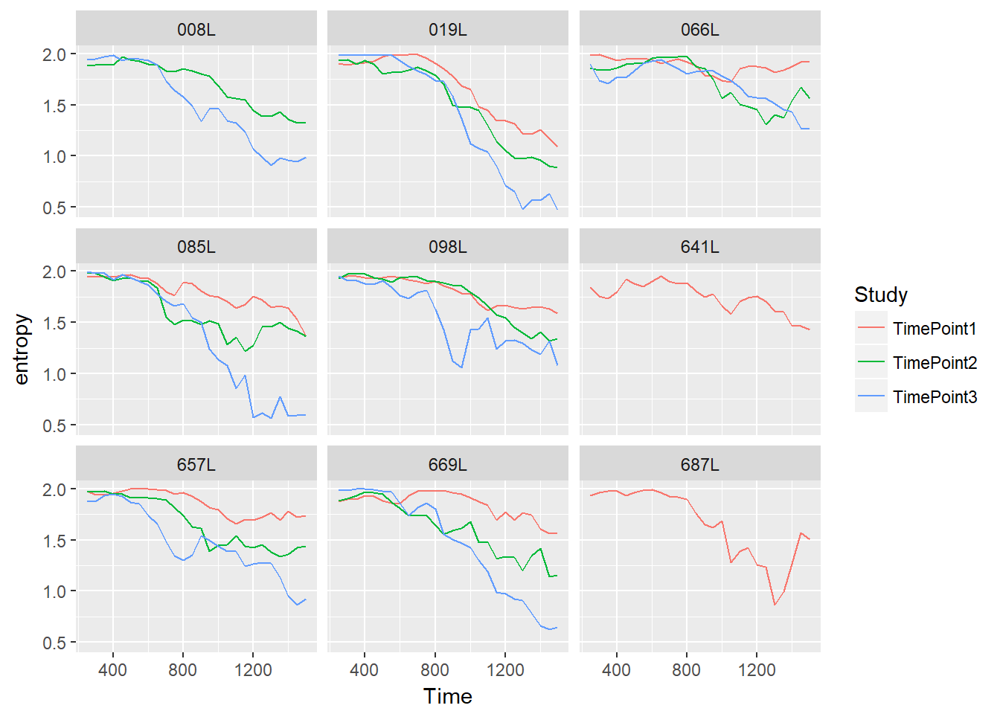

Entropy in familiar word recognition
===========================================================================


```r
entropy <- function(x, ..., f = log2) {
  counts <- c(x, ...)
  p <- counts / sum(counts)
  weighted <- ifelse(p == 0, 0, p * f(p))
  -sum(weighted)
}

d_m <- d_m %>% 
  group_by(Study, ResearchID, Time) %>% 
  mutate(
    entropy = entropy(PhonologicalFoil, SemanticFoil, Target, Unrelated)) %>% 
  ungroup()

ggplot(d_m) + 
  aes(x = Time, y = entropy, color = Study) + 
  stat_summary()
#> No summary function supplied, defaulting to `mean_se()
```



```r

d_m %>% 
  sample_n_of(9, ResearchID) %>% 
  ggplot() + 
    aes(x = Time, y = entropy, color = Study) + 
    geom_line() + 
    facet_wrap("ResearchID")
```



