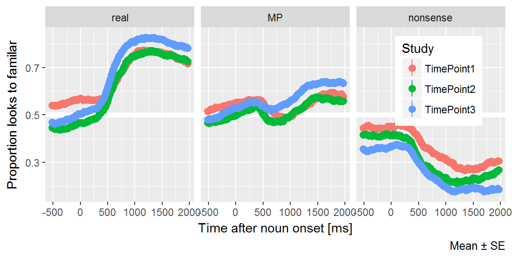
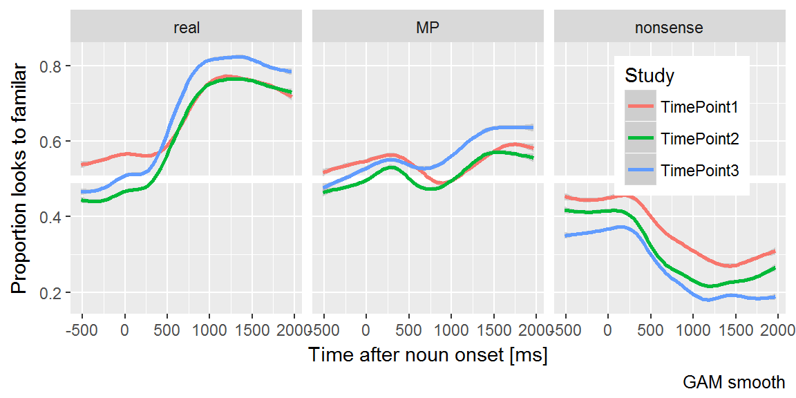
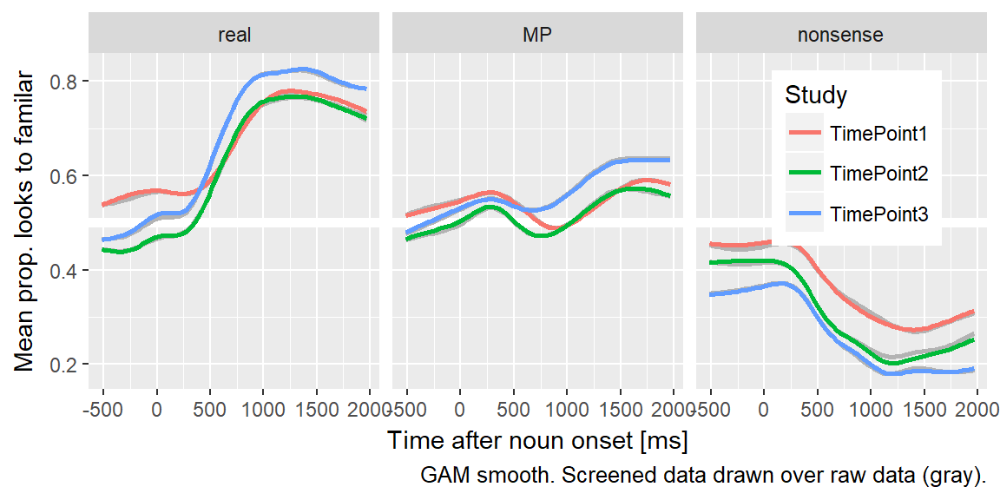

Aim 2: Method
===================


## Visual stimuli


The images used in the experiment consisted of color photographs on
gray backgrounds. These images were piloted in a preschool classroom to
ensure that children consistently used the same label for familiar
objects and did not consistently use the same label for novel/unfamiliar
objects.


## Coding Notebook


Here is the first look at the raw, unscreened, unbinned data.



Observations:

  - Probability of looking to familiar image given real word increased in
    year 3. Kind of unexpected that they could improve noticeably on this simple
    two-image task.
  - Probability of looking to unfamiliar given a nonword increases each year.
  - Probability of looking to familiar given a mispronunciation increased
  - 250 to 1500 looks like a reasonable analysis window.
  - Before the onset of the target word, there appears to be some looking
    preferences—maybe—for the familiar at timepoint 1 and unfamiliar
    in timepoint 3.
  - The "peak" growth curve feature will need to be flipped for the nonword
    trials.

### Data screening

We will use the missing data window and missing data threshold as Aim 1. We need
to add a new rule for minimum trials per condition. Let's go with 6.


```
#> $bin_width
#> [1] 3
#> 
#> $start_time
#> [1] 250
#> 
#> $end_time
#> [1] 1500
#> 
#> $bin_length
#> [1] 50
```

After mapping the gaze coordinates onto the onscreen images, we performed data
screening. As in Aim 1, we considered the time window from
0 to 2000 ms after noun
onset. We identified a trial as *unreliable* if at least
50% of the looks were missing during the time
window. We excluded an entire block of trials if it had fewer than
18 reliable trials. As an additional criterion, we
excluded participants who failed to provide at least
6 reliable trials per experimental condition.


Table \@ref(tab:mp-screening-counts) shows the numbers of participants and
trials excluded at each timepoint due to unreliable data. As with the experiment
in Aim 1, there were more children in the second timepoint than the first
timepoint due to a timing error in the initial version of this experiment,
leading to the exclusion of 30 participants from the
first timepoint.


Table: (\#tab:mp-screening-counts)Eyetracking data before and after data screening.

Dataset                Study         N Children   N Blocks   N Trials
---------------------  -----------  -----------  ---------  ---------
Raw                    TimePoint1           177        341      12245
                       TimePoint2           181        349      12600
                       TimePoint3           164        325      11736
Screened               TimePoint1           162        305       9062
                       TimePoint2           170        320      10031
                       TimePoint3           157        306      10113
Raw &minus; Screened   TimePoint1            15         36       3183
                       TimePoint2            11         29       2569
                       TimePoint3             7         19       1623




## Prepare the dataset for modeling

As in Aim 1, to prepare the data for modeling, we downsampled the data into
50-ms (3-frame) bins. We modeled
the looks from 250 to 1500 ms. Lastly,
we aggregated looks by child, study, condition and time, and created orthogonal
polynomials to use as time features for the model.


