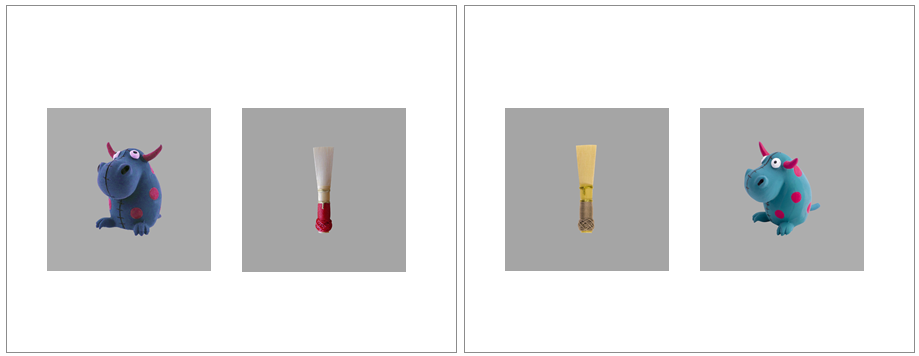

Method {#aim2-method}
=======================================================================

Data collection for this experiment occurred during the same
longitudinal study as the familiar word recognition experiment of Study 1.
Thus, this experiment used the same participants, the same stimulus
preparation and style, and the same general experimental procedure as
those reported in detail in [Chapter \@ref(aim1-method)](#aim1-method).

Mispronunciation task
------------------------------------------------------------------------

This experiment is an adaptation of the mispronunciation detection task
by @WhiteMorgan2008 and @MPPaper. In the experiment, two images are
presented onscreen—a familiar object and an unfamiliar object—and the
child hears a prompt to view one of the images. In the *correct
pronunciation* (or *real word*) and *mispronunciation* conditions, the
child hears either the familiar word (e.g., *duck*) or a one-feature
mispronunciation of the first consonant of the target word (*guck*).
These conditions are designed to test whether children associate
mispronunciations with novel objects. To encourage fast referent selection,
there were also trials in a *nonword* condition where the label was an
unambiguous novel word (e.g., *shann* presented with images of a cup and
a novel-looking bassoon reed). Each nonword was constructed to match the
phonotactic probability of one of the mispronunciations. 
Figure \@ref(fig:sample-mp-screen) shows the screens used in two trials.
Importantly, within a block of trials, the child never hears both the
correct and mispronounced forms of the same word. A child hearing "duck"
then a few trials later hearing "guck" would provide a basis of
comparison so that the child can decide that "guck" is probably not
"duck"---the design used here avoided this situation and is a change
from the design of @MPPaper.

(ref:sample-mp-screen-cap) Example displays for a trial in which *duck* is mispronounced as "guck" (*left*) and a trial in which the nonword *shann* is presented (*right*).

(ref:sample-mp-screen-scap) Example displays for a trial in which *duck* is mispronounced as "guck" and a trial in which the nonword *shann* is presented.

(\#fig:sample-mp-screen)(ref:sample-mp-screen-cap)

<!-- (Maybe explain why the nonword condition give children the license to -->
<!-- interpret a mispronunciation as a nonword.) -->
<!-- So, children sometimes heard correct productions that can be mapped to familiar -->
<!-- objects and sometimes heard flagrant nonwords that could be quickly associated -->
<!-- to unfamiliar objects. Both of these behaviors are encouraged by the experiment. -->

In a block of the experiment, there were 12 trials each from the correct
production, mispronunciation, and nonword conditions, and children
received two blocks of the task. A complete list of the items used in
the experiment over the three years of the study is included in
[Appendix \@ref(mp-experiment-items)](#mp-experiment-items).

Visual stimuli
------------------------------------------------------------------------

The images used in the experiment consisted of color photographs on gray
backgrounds. As in the familiar word recognition experiment, these
images were piloted in two preschool classrooms. Piloting confirmed that
children consistently used the same label for familiar objects. For the
novel objects, the children reported to not know a word for the object,
or if they did name the object, they did not consistently use the same
word for an object.

Novel word retention tests
-----------------------------------------------------------------------

At age 5, following the second block of this task, we tested children's
retention of the labels for the novel objects. They were first tested using an
open-set procedure: They were shown each of the images and asked to name
it. I will not analyze or report those results, because children seldom named
the novel objects using the labels from the task. For example, the
rainbow-filled flasks used for *sooze* (mispronounced *shoes*) were called
*science*, *potions*, *magic*, *bottles*, among other labels.

Following the open-set naming test, children had a closed-set
recognition test. Two of the novel objects were paired. One of the
objects was from a mispronunciation trial and the other was from a
nonword trial. For example, the toy creature (*guck*) was paired with the
bassoon reed (*shann*) from the nonword condition. The pairs were yoked, as
each nonword was designed to match the phonotactic probability of
one of the mispronunciations. During the retention test, children saw
two images of the novel objects (say, *reed1.jpeg* and *toy1.jpeg*)
printed on a letter-size sheet of paper, heard one of novel labels
(*shann*), and had to point to the named object.
Figure \@ref(fig:retention-display) shows an example of what the
children saw when tested on *guck* and *shann*. In a later trial, the
other label (*guck*) was tested but using different image assets for the
objects (*toy2.jpeg* and *reed2.jpeg*). In a block of testing, there
were 12 trials, 6 for nonwords and 6 for mispronunciations. 

(ref:retention-display) Examples of retention trials that tested *guck* and *shann*. During the first retention trial (*left*), children heard one of the unfamiliar words (e.g., *guck*). The correct response was to point to the toy bull creature because it was the unfamiliar object used on the *duck--guck* trials. During a later trial that used different image assets (*right*), children heard the other word (*shann*). The correct response was to point to the bassoon reed because it was the unfamiliar object used on the *shann* trials. 

(ref:retention-display-scap) Examples of retention trials that tested *guck* and *shann*.

(\#fig:retention-display)(ref:retention-display)

Data screening {#aim2-screening}
------------------------------------------------------------------------

Table \@ref(tab:mp-screening-counts) shows the numbers of participants
and trials excluded during each of year of the study due to unreliable
data. There were more children in the second year than the first year
due to a timing error in the initial version of this experiment, leading
to the exclusion of 30 participants from the
first year.

Table: (\#tab:mp-screening-counts)Eyetracking data before and after data screening. For convenience, the number of exclusions is included as Raw&nbsp;&minus; Screened. *Percent Missing*: Percentage of looks offscreen during 0--2000&nbsp;ms after target onset.

Dataset                Year     Children   Blocks   Trials   Percent Missing
---------------------  ------  ---------  -------  -------  ----------------
Raw                    Age 3         177      341    12245             25.4%
                       Age 4         181      349    12600             21.4%
                       Age 5         164      325    11736             16.7%
Screened               Age 3         162      305     9062              7.9%
                       Age 4         170      320    10031              8.1%
                       Age 5         157      306    10113              7.8%
Raw &minus; Screened   Age 3          15       36     3183             17.6%
                       Age 4          11       29     2569             13.3%
                       Age 5           7       19     1623              8.9%

After mapping the gaze coordinates onto the onscreen images, I performed
data screening following the same set of steps as in
[Chapter \@ref(aim1-method)](#aim1-method). To make data quality
judgments, I only considered the window from
0 to 2000 ms after
noun onset. Next, I identified a trial as *unreliable* if at least
50% of the looks were missing during the
time window, and I excluded an entire block of trials if it had fewer
than 18 reliable trials. As an additional
criterion, I excluded participants who failed to provide at least
6 reliable trials per experimental
condition.

### Classifying trials based on initial fixation location

During preliminary visualization of the age-level growth curves, I
observed an increasing preference for the unfamiliar image for the
nonword condition---see Figure \@ref(fig:novelty-bias). The growth curves
showed a typical pattern of a baseline at noun onset followed by a quick
change in height as the word unfolded. For the nonword condition, this
baseline level moved further from .5 (chance with two images) with each
year of the study: Children became more likely to fixate on the novel
object at the start of these trials. 

(ref:novelty-bias) Observed average looks to the target on nonword trials. At the onset of the target noun, there is a novelty preference that increases with each year of the study. This novelty preference is the motivation for separating trials based on gaze location at target onset. Points and intervals represent the mean and standard error of children's empirical growth curves.

(ref:novelty-bias-scap) Observed average looks to the target on nonword trials. 

(\#fig:novelty-bias)(ref:novelty-bias)

Because this was a two-image task, I was able to account for the
location of the child's gaze at the onset of the target noun. For each
trial, I counted the number of looks to the familiar object and the
unfamiliar object during the first 250 ms after target noun onset
(specifically, 0 ≤ *time* \< 250 ms). If the majority of the looks
landed on the familiar object, then the trial was a *familiar-initial*
trial. An analogous rule labeled trials as *unfamiliar-initial* trials.
Ties were broken by favoring the earlier fixated image on the assumption
that the earlier image better reflected the child's fixation location at
the onset of the target word. For example, a tie might be a trial
with 7 frames of looking to the unfamiliar image, followed by 1 frame
between the two images, followed by 7 frames to the familiar image. In
this case, the unfamiliar image was viewed first, so the trial is
classified as unfamiliar-initial. If there were no looks to either image
during that window, the trial was not classified for either image and it
was excluded.

Table \@ref(tab:mp-initial-looks-counts) shows the counts and percentages of 
trial classification. About 5% of trials were
excluded because the child looked to neither image during the
first 250 ms of the noun onset. The table shows how the percentage
of unfamiliar-initial trials increased with each year of the study.
Accounting for this trend was the rationale for classifying trials based
on the initial fixation location. 

Table: (\#tab:mp-initial-looks-counts)Number of trials classified based on initial fixation location.

Year    Condition           Familiar initial   Unfamiliar initial   Neither/excluded
------  -----------------  -----------------  -------------------  -----------------
Age 3   Real word               1629 (53.7%)         1250 (41.2%)        154 (5.10%)
        Nonword                 1284 (43.8%)         1453 (49.6%)        194 (6.60%)
        Mispronunciation        1608 (51.9%)         1305 (42.1%)        185 (6.00%)
Age 4   Real word               1561 (45.9%)         1693 (49.8%)        145 (4.30%)
        Nonword                 1280 (39.2%)         1799 (55.2%)        183 (5.60%)
        Mispronunciation        1686 (50.0%)         1552 (46.1%)        132 (3.90%)
Age 5   Real word               1718 (50.5%)         1558 (45.8%)        125 (3.70%)
        Nonword                 1172 (35.2%)         1959 (58.9%)        194 (5.80%)
        Mispronunciation        1752 (51.7%)         1487 (43.9%)        148 (4.40%)

## Model preparation

To prepare the data for modeling, I downsampled the data into
50-ms (3-frame) bins. I
modeled looks from 300 to 1,500 ms after noun onset. Lastly, I
aggregated looks by child, year, condition, initial fixation location,
and time, and I created orthogonal polynomials to use as time features
for the model. Figure \@ref(fig:aim2-real-word-spaghetti),
Figure \@ref(fig:aim2-nonword-spaghetti), and
Figure \@ref(fig:aim2-mispronunciation-spaghetti) shows the empirical
growth curves for each condition following the above-described data
screening and preparation steps.

(ref:aim2-real-word-spaghetti) Empirical word recognition growth curves for the real words. Each line represents an individual child's proportion of looks to the target image over time. The heavy lines are the averages of the lines for each year. Only the steep, upward growth curves from unfamiliar-initial trials are analyzed.

(ref:aim2-real-word-spaghetti-scap) Empirical word recognition growth curves for the real words.

(ref:aim2-nonword-spaghetti) Empirical word recognition growth curves for the nonwords. Only the steep, downward growth curves from familiar-initial trials are analyzed.

(ref:aim2-nonword-spaghetti-scap) Empirical word recognition growth curves for the nonwords.

(ref:aim2-mispronunciation-spaghetti) Empirical word recognition growth curves for the mispronunciations. Both types of curves are analyzed.

(ref:aim2-mispronunciation-spaghetti-scap) Empirical word recognition growth curves for the mispronunciations.

(\#fig:aim2-real-word-spaghetti)(ref:aim2-real-word-spaghetti)

(\#fig:aim2-nonword-spaghetti)(ref:aim2-nonword-spaghetti)

(\#fig:aim2-mispronunciation-spaghetti)(ref:aim2-mispronunciation-spaghetti)

