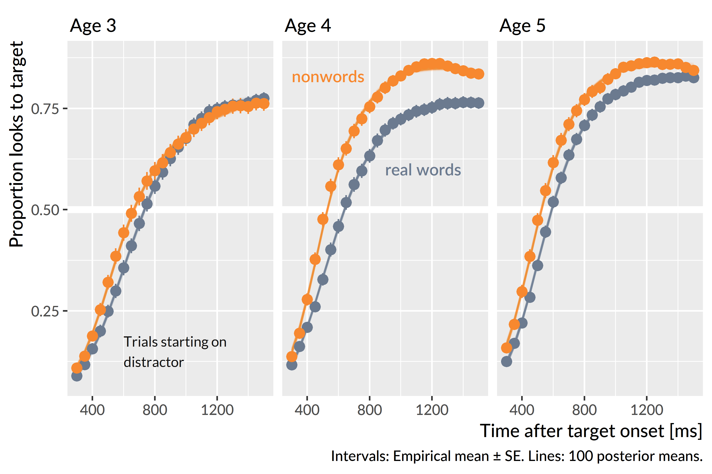
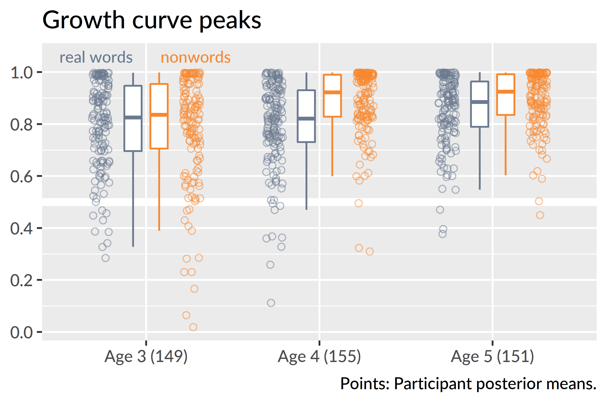
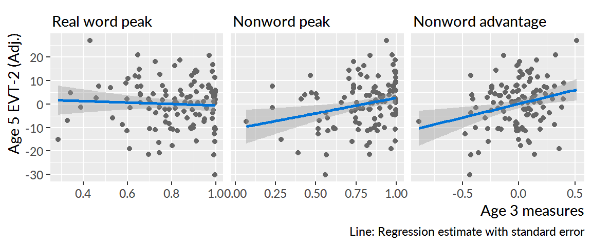
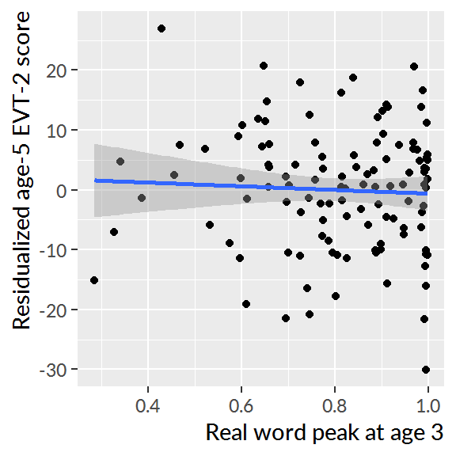
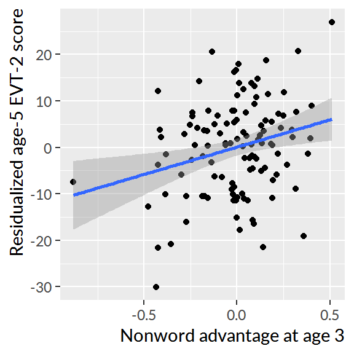
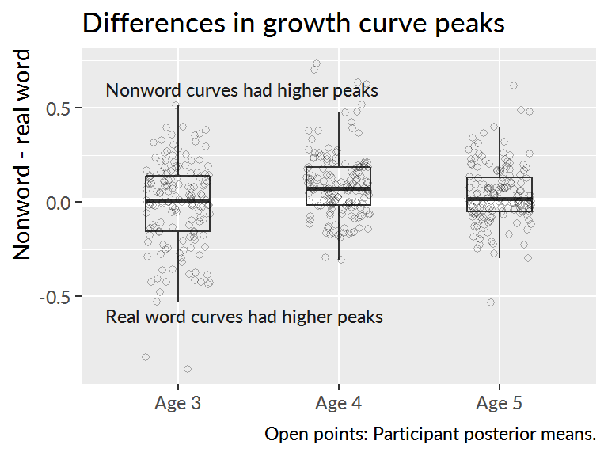

Development of referent selection
=======================================================================


## Nonwords versus real words

I asked whether the recognition of familiar words differed from the
fast-selecting of referents for a nonword. I fit a Bayesian mixed
effects logistic regression model, as in Chapter X. For the real word
and nonword conditions, there is a well-defined target image. For real
words, it is the familar image, and for nonwords, it is the novel image.
Therefore, I modeled the data under these assumptions. The outcome
measures were therefore:

* P(Look to familiar image | Hear a real word)
* P(Look to unfamiliar image | Hear a nonword )

The important analytic question is whether and to what degree these two
probabilities differ. This growth curve model is similar to the one in
Chapter X with cubic polynomial and a condition effect which interacts
with time features. Thus, the basic model is:

$$
\small
\begin{align*}
   \text{log-odds}(\mathit{looking\,}) =\
    &\beta_0 + 
      \beta_1\text{Time}^1 + 
      \beta_2\text{Time}^2 + 
      \beta_3\text{Time}^3\ + 
      &\text{[nonword growth curve]} \\
    (&\gamma_0 + 
      \gamma_1\text{Time}^1 + 
      \gamma_2\text{Time}^2 +
      \gamma_3\text{Time}^3)*\text{Condition} \
      &\text{[adjustments for real words]} \\
\end{align*}
$$

I fit a separate model for each year of the study.[^bayes-fail]
[Appendix \@ref(aim2-gca-models)](#aim2-gca-models) contains the R code
used to fit these models along with a description of the specifications
represented by the model syntax. I used moderately informative
priors---see Appendix X. For these analyses, I limited my attention to
the distractor-initial.


[^bayes-fail]: A single model containing all three years with
corresponding year effects, year-by-time interactions, and
year-by-condition-by-time conditions had difficulty converging, and even
when a working model was obtained, a bug in the modeling software
prevented me from obtaining posterior predictions. I reported the bug in
an issue for the package's source code repository. 


  - I model data from 300 ms to 1500.
  - I flipped the growth curve for the nonword condition so that it
    reflects the proportion of looking to the unfamiliar object when
    presented a nonword. Both the real word and nonword conditions
    measure referent selection as the probability of fixating on the
    appropriate referent when presented with a label.

I removed any Study x Child levels if a child had fewer than 4
fixations in a single time bin. Put another way, children had to
have at least 4 looks to one of the images in every 50 ms time bin.
This screening removed 13 children from Age 3,
15 from Age 4, and 6 from Age 5.


The figure below shows group average of growth curves---that is, I
averaged the participant's individual model-estimated or empirical
growth curves together--for each condition and age. 




Recall from earlier chapters that in these growth curve models, I
consider only the intercept and linear time terms to be behaviorally
meaningful parameters. The intercept measures overall the average growth
curve value so it reflects looking reliability, and the linear time term
measures the overall stepness of the growth so it reflects lexical
processing efficiency. I also derive a measure of peak looking
probability by taking the median of top five points in a growth curve,
and this peak provides a measure of lexical processing uncertainty
(higher peaks indicate less uncertainty about a word).

I evaluated the condition effects by looking at the effect of the real
word condition on the intercept and linear time terms. The two
conditions did not reliable differ at age 3. The real-word condition
effect on the intercept was &minus;0.19 [90%&nbsp;UI: &minus;0.43--0.05] and its interaction with
the linear time term was 0.45 [&minus;0.05--0.94]. Both these 90% intervals
include 0 as a plausible estimate for the condition difference, so I
conclude that the conditions did not differ on average at age 3.

There was an advantage for the nonword condition at age 4 and age 5. The
real-word effect was negative at age 4, &minus;0.82 [&minus;1.01--&minus;0.62], so that on
average, children looked less to target on the real words than the
nonword trials. There was a suggestive effect linear time effect at
age 4, &minus;0.52 [&minus;0.96--&minus;0.04]. The curve for real words was probably less
steep at age 4 but values near 0 remain plausible. At age 5, only the
intercept difference was credible, &minus;0.48 [&minus;0.70--&minus;0.27]. In general,
children performed better in the nonword condition than the real word
condition at age 4 and age 5. This difference shows up in the growth
curve model through intercept effects, although it is plausible that
children's nonword growth curves were steeper than the real word curves
at age 4.




Figure X shows the distribution of the posterior means of the growth
curves for condition. Here, descriptive statistics reveal a great deal
about developmental trends for this task. At age 3, the median peak
values are similar around 80%. The peaks increase for the nonword
condition in the following year, with a median value of .... It is worth
emphasizing what this median tells us: At age 4, half of the children
had a peak looking probability of xxx. In other words, children are
performing at the ceiling on this task by age 4. To quantify the degree
of ceiling performance, I calculcated the number of children per
condition with a growth curve peak greater than
or equal to .99 over the posterior distribution. For the nonword
condition, there were 23.00 [90%&nbsp;UI: 20.00--26.00] children who performed at
ceiling at age 3, 41.00 [36.00--45.00] at age 4, 40.00 [36.00--44.00]
and at age 5. For the real word condition, the number of children
attaining ceiling performance was more uneven: there were
20.00 [16.00--24.00] ceiling performers at age 3,
13.00 [10.00--16.00], and 13.00 [10.00--16.00] at age 5.


To compare peaks looking probabilities between ages, I fit a linear mixed effects
model with restricted maximum likelihood via the lme4 R package
[vers. 1.1.17; @lme4]. I regressed the growth
curve peaks onto experimental condition, age group, and the age x
condition interaction. The model included randomly varying intercepts for child and
child-year. This modeling software does not provide *p*-values for its
effects estimates, so for these comparisons, I decided that an effect
was significant when the *t* statistic for a model fixed effect
has an absolute value of 2 or greater. In practical terms, this convention
interprets an effect as significant when its estimate is at least 2
standard errors away from 0. (@GelmanHill use this approach with
mixed models.)

At age 3, the two conditions did not significantly differ,
B<sub>real-nonword</sub> = .01, *t* = 0.95. At age 4,
nonword peaks were on average .09 proportion units greater
than the real word peaks, *t* = 5.79, and at age 5, the nonword
peaks were .04 proportion units greater than the real word
peaks, *t* = 2.56. For the nonword condition there was a
significant increase in the peaks from age 3 to age 4, *B*<sub>4-3</sub>
= .10, *t* = 5.99, whereas there was no improvement from
age 4 to age 5, *t* = 0.37. In the real word condition, there was
only a significant improvement from age 4 to age 5, *B*<sub>5-4</sub> =
.06, *t* = 3.25.


<!-- [pvalues]: The lme4 package does not provide *p*-values because it is -->
<!-- unclear what number to use for the degrees of freedom with hierarchical -->
<!-- or repeated measures data. One approach is the so-called "normal -->
<!-- approximation" which treats t-values like z-scores---i.e., drawn from a -->
<!-- normal distribution with mean 0 and standard deviation 1. Under this -->
<!-- approach, conventional significance obtains when is greater than or -->
<!-- equal to 1.96 in magnitude. I use 2 as the cutoff because I find significance thresholds are arbitrary. -->


**Summary**. There is a decisive advantage for the nonword condition
after age 3. Performance begins to saturate at age 4 with the group
averages for peak looking probabilities over 90%. The real word
condition is more anomalous with performance only showing average
increases from age 4 to age 5.

<!-- The -->
<!-- conditions did not significantly differ at this age. The nonword peaks -->
<!-- were significantly higher greater than real word peaks at age 4 [blah -->
<!-- vs. blah, p=value.] and at age 5 although the difference was smaller -->
<!-- [blah vs. blah, p=value.]. -->


### Within child condition effects

...

## Which type of referent selection better predicts age 5 vocabulary

I hypothesized that performance on the nonword condition would be a
better predictor of future vocabulary size than the real word condition.
This hypothesis follows from the assumption that fast referent
selection, as opposed to familiar word recognition, is a more relevant
skill for word-learning. Put another way, a child's ability to quickly
map a novel word to a referent is more closely related to the demands of
in the moment word-learning than familiar word recognition.

In chapter X, I found that peak looking probability at age 3 positively
correlated with age 5 vocabulary. Pairing this finding with my
hypothesis, I predicted that the growth curve peaks in the nonword
condition at age 3 would be better predictors of vocabulary at age 5
than the real word peaks at age 3.

For these analyses, I regressed age-5 expressive vocabulary standard
scores onto the age-3 expressive vocabulary score and onto age-3 real
word peaks and age-3 nonword peaks. As expected, there was a strong
relationship between age 3 and age 5 vocabulary, blah, blah, *R*^2^ = blah. A standard deviation increase in bocabulary at age 3 predicted an x SD increase (standard score points) at age 5. There was no effect of age-3 peak over and above age-3 vocabulary. There was a significant effect of the nonword peak, delta*R*^2^ = blah, over and above age-3 vocabulary. A .1 increase nonword peak probability predicted an increase of blah.





```
#> 
#> Call:
#> lm(formula = scale(TimePoint3) ~ scale(TimePoint1), data = w_evt)
#> 
#> Residuals:
#>      Min       1Q   Median       3Q      Max 
#> -2.06427 -0.49523  0.05418  0.45853  1.85324 
#> 
#> Coefficients:
#>                   Estimate Std. Error t value Pr(>|t|)    
#> (Intercept)       0.006696   0.065536   0.102    0.919    
#> scale(TimePoint1) 0.701418   0.066348  10.572   <2e-16 ***
#> ---
#> Signif. codes:  0 '***' 0.001 '**' 0.01 '*' 0.05 '.' 0.1 ' ' 1
#> 
#> Residual standard error: 0.7051 on 114 degrees of freedom
#>   (27 observations deleted due to missingness)
#> Multiple R-squared:  0.495,	Adjusted R-squared:  0.4906 
#> F-statistic: 111.8 on 1 and 114 DF,  p-value: < 2.2e-16
#> 
#> Call:
#> lm(formula = scale(TimePoint3) ~ scale(TimePoint1) + scale(nonsense), 
#>     data = w_evt)
#> 
#> Residuals:
#>      Min       1Q   Median       3Q      Max 
#> -1.90820 -0.48102 -0.00153  0.44206  1.71467 
#> 
#> Coefficients:
#>                     Estimate Std. Error t value Pr(>|t|)    
#> (Intercept)       -0.0006292  0.0636482  -0.010  0.99213    
#> scale(TimePoint1)  0.6577832  0.0661923   9.937  < 2e-16 ***
#> scale(nonsense)    0.1953632  0.0688071   2.839  0.00536 ** 
#> ---
#> Signif. codes:  0 '***' 0.001 '**' 0.01 '*' 0.05 '.' 0.1 ' ' 1
#> 
#> Residual standard error: 0.6843 on 113 degrees of freedom
#>   (27 observations deleted due to missingness)
#> Multiple R-squared:  0.5287,	Adjusted R-squared:  0.5203 
#> F-statistic: 63.37 on 2 and 113 DF,  p-value: < 2.2e-16
#> 
#> Call:
#> lm(formula = scale(TimePoint3) ~ scale(TimePoint1) + scale(real), 
#>     data = w_evt)
#> 
#> Residuals:
#>      Min       1Q   Median       3Q      Max 
#> -2.01574 -0.49171  0.07312  0.44064  1.77233 
#> 
#> Coefficients:
#>                   Estimate Std. Error t value Pr(>|t|)    
#> (Intercept)        0.00719    0.06574   0.109    0.913    
#> scale(TimePoint1)  0.70627    0.06714  10.519   <2e-16 ***
#> scale(real)       -0.03638    0.06653  -0.547    0.586    
#> ---
#> Signif. codes:  0 '***' 0.001 '**' 0.01 '*' 0.05 '.' 0.1 ' ' 1
#> 
#> Residual standard error: 0.7073 on 113 degrees of freedom
#>   (27 observations deleted due to missingness)
#> Multiple R-squared:  0.4964,	Adjusted R-squared:  0.4875 
#> F-statistic: 55.69 on 2 and 113 DF,  p-value: < 2.2e-16
#> 
#> Call:
#> lm(formula = scale(TimePoint3) ~ scale(TimePoint1) + scale(diff), 
#>     data = w_evt)
#> 
#> Residuals:
#>      Min       1Q   Median       3Q      Max 
#> -1.74706 -0.48540  0.07322  0.46396  1.45289 
#> 
#> Coefficients:
#>                   Estimate Std. Error t value Pr(>|t|)    
#> (Intercept)       0.002282   0.063599   0.036   0.9714    
#> scale(TimePoint1) 0.682369   0.064714  10.544   <2e-16 ***
#> scale(diff)       0.190080   0.066697   2.850   0.0052 ** 
#> ---
#> Signif. codes:  0 '***' 0.001 '**' 0.01 '*' 0.05 '.' 0.1 ' ' 1
#> 
#> Residual standard error: 0.6841 on 113 degrees of freedom
#>   (27 observations deleted due to missingness)
#> Multiple R-squared:  0.5289,	Adjusted R-squared:  0.5206 
#> F-statistic: 63.43 on 2 and 113 DF,  p-value: < 2.2e-16
```


*** 

to fold in

As in Chapter XX, I calculated the posterior distribution of growth
curves for each child x condition x year. To measure children's
lexical processing, I used the peak value each growth curve by taking
the median of the top 5 model fits. For each child, I calculated the
difference between the peak of the real word and the nonword growth
curves. This difference in peak values conveys the *condition advantage*
for a child. The figure below visualizes the condition advantages.





### Points for discussion

The advantage of nonwords over real words was an unexpected. My
pre-analysis hypotheses were that word recognition in the real word
condition would be easier than in the nonword condition, or failing
that, the two conditions would not reliably differ. I had discounted the
possibility of an overall advantage for nonwords over real words.


<!-- For this task, I will model how the looks to the familiar image differ -->
<!-- in each condition (real words, mispronunciations, nonwords) and how the -->
<!-- growth curves for each condition change year over year. This model will -->
<!-- use growth curve model described in [Growth Curve Analysis](#growth-curve-analysis) but -->
<!-- augmented with Condition effects. -->

<!-- I will examine whether and when any dissociation is observed for word -->
<!-- recognition in the real word and nonword conditions. @McMurray2012 argue that  -->
<!-- familiar word recognition and fast -->
<!-- association for novel words reflect the same cognitive process: referent -->
<!-- selection. Data from this task would support with this hypothesis when -->
<!-- the growth curves for looks to the familiar image are symmetrical for -->
<!-- the real word and nonword conditions. Figure \@ref(fig:le-means), showing data -->
<!-- from @MPPaper [, _n_\ =\ 34 children, 30-46 months old], shows some -->
<!-- symmetry for the real word and nonword conditions. -->

<!-- I tested whether the two measures ever dissociate by computing the -->
<!-- posterior predicted difference between the growth curves. This approach -->
<!-- is similar to the bootstrap-based divergence analyses used in some word -->
<!-- recognition experiments [e.g., @Oleson2015; @eyetrackingR]. The -->
<!-- essential question is when—at which specific time points—do two growth -->
<!-- curves differ from one another. The bootstrap approach -->
<!-- uses resampling to get an estimate, whereas I use posterior -->
<!-- predicted samples to estimate these differences. -->

<!-- Specifically, I will compute the posterior-predicted looks to the -->
<!-- familiar object in the real word condition, P(Familiar | Real Word, Time -->
<!-- *t*, Child *i*) and the analogous looks to the unfamiliar object in the -->
<!-- nonword condition, P(Unfamiliar | Nonword, Time *t*, Child *i*). The -->
<!-- difference between these two probabilities estimates how the time course -->
<!-- of word recognition differs between these two conditions, and I can use -->
<!-- 50% and 90% uncertainty intervals to determine during which time points -->
<!-- the curves credibly differ from each other. -->


