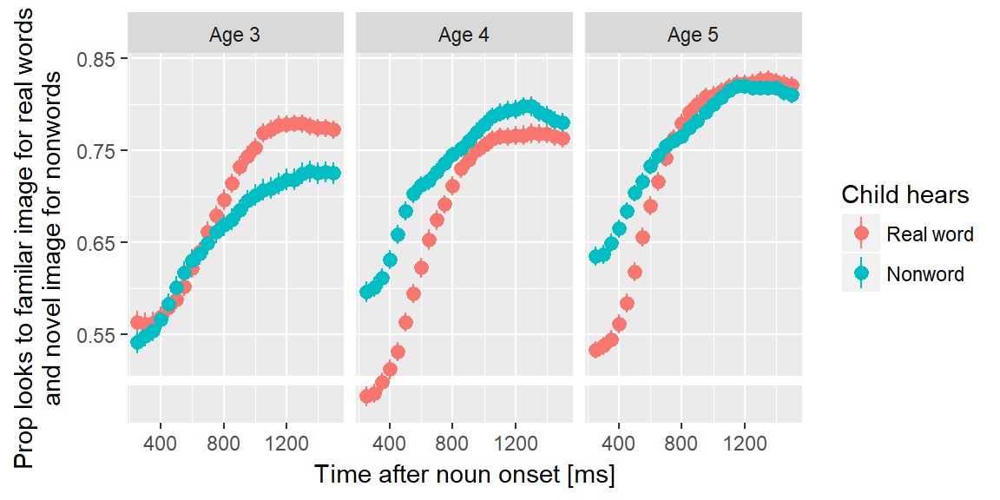
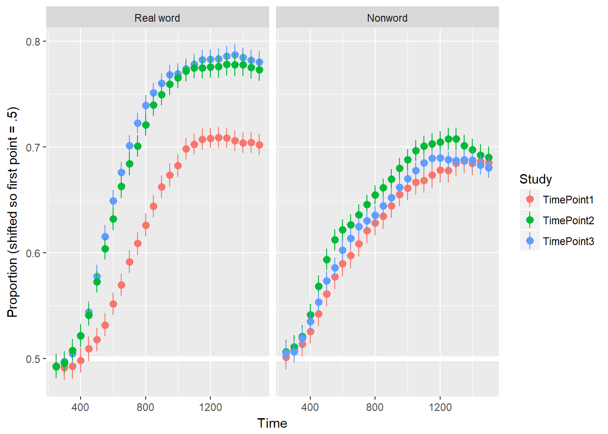
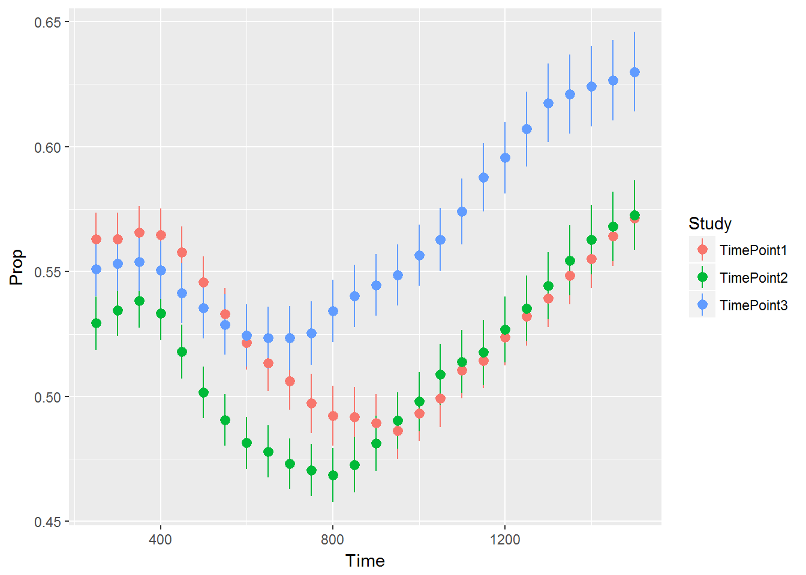

Analysis of referent selection
===========================================================================


## Nonwords versus real words



Let's cheat and offset the curves so they start at the same value. This can help
us see how their heights compare.


```r
ggplot(d_nonword) + 
  aes(x = Time, y = Prop2, color = Study) + 
  geom_hline(yintercept = .5, color = "white", size = 2) +
  # stat_summary(color = "grey50") + 
  stat_summary(
    aes(y = Prop2 - .07),
    data = . %>% filter(Condition == "real", Study == "TimePoint1")) + 
  stat_summary(
    aes(y = Prop2 - .04),
    data = . %>% filter(Condition == "real", Study == "TimePoint3")) + 
  stat_summary(
    aes(y = Prop2 + .01),
    data = . %>% filter(Condition == "real", Study == "TimePoint2")) + 
  stat_summary(
    aes(y = Prop2 - .04),
    data = . %>% filter(Condition == "nonsense", Study == "TimePoint1")) + 
  stat_summary(
    aes(y = Prop2 - .09),
    data = . %>% filter(Condition == "nonsense", Study == "TimePoint2")) + 
  stat_summary(
    aes(y = Prop2 - .13),
    data = . %>% filter(Condition == "nonsense", Study == "TimePoint3")) + 
  facet_wrap("`Child hears`")  + 
  labs(
    y = "Proportion (shifted so first point = .5)"
  )
#> No summary function supplied, defaulting to `mean_se()
#> No summary function supplied, defaulting to `mean_se()
#> No summary function supplied, defaulting to `mean_se()
#> No summary function supplied, defaulting to `mean_se()
#> No summary function supplied, defaulting to `mean_se()
#> No summary function supplied, defaulting to `mean_se()
```




```r
d_mp <- d_m %>% 
  filter(Condition == "MP")
ggplot(d_mp) + 
  aes(x = Time, y = Prop, color = Study) + 
  stat_summary()
#> No summary function supplied, defaulting to `mean_se()
```



