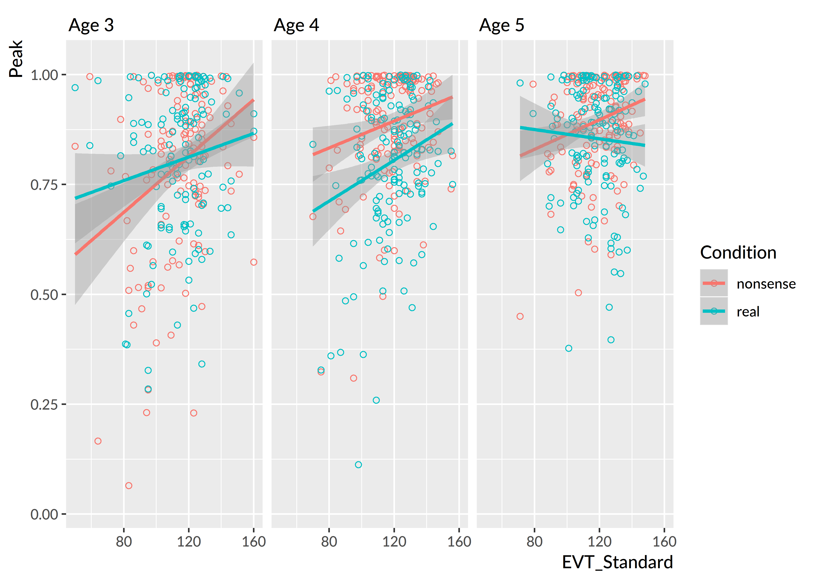

Development of referent selection
=======================================================================

## Nonwords versus familiar words

I asked whether the recognition of familiar words differed from the
fast selection of referents for nonwords. I fit a Bayesian mixed-effects
logistic regression growth-curve model, as in
[Chapter \@ref(fam-rec)](#fam-rec). For the real word and nonword
conditions, there is a well-defined target image: the familiar image for
real words and the novel/unfamiliar image for nonwords. The outcome
measures were the probabilities of fixating to the target image in each
condition:

  - P(look to familiar image | hear a real word)
  - P(look to unfamiliar image | hear a nonword)

Both the real word and nonword conditions measure referent selection as
the probability of fixating on the appropriate referent when presented
with a label. The important analytic question is whether and to what
degree these two probabilities differ. The growth curve model is similar
to the one in [Chapter \@ref(fam-rec)](#fam-rec) with linear, quadratic
and cubic time features but it adds a condition effect which interacts
with these features. The linear model was:

$$
\small
\begin{align*}
   \text{log-odds}(\mathit{looking\,}) =\
    &\beta_0 + 
      \beta_1\text{Time}^1 + 
      \beta_2\text{Time}^2 + 
      \beta_3\text{Time}^3\ + 
      &\text{[nonword growth curve]} \\
    (&\gamma_0 + 
      \gamma_1\text{Time}^1 + 
      \gamma_2\text{Time}^2 +
      \gamma_3\text{Time}^3)*\text{Condition} \
      &\text{[adjustments for real words]} \\
\end{align*}
$$

I fit a separate model for each year of the study.
[Appendix \@ref(aim2-gca-models)](#aim2-gca-models) contains the R code
used to fit these models along with a description of the specifications
represented by the model syntax. The mixed model included by-child and
by-child-by-condition random effects to allow some of a
child's growth curve features to be similar between conditions
(by-child effects) and to differ between conditions
(by-child-by-condition effects).

For these analyses, I limited focus to distractor-initial trials, and
modeled the data from 300 to 1500 ms after target
onset. I removed any Age × Child levels if a child had fewer than 4
fixations in a single time bin. In other words, children had to have at
least 4 looks to one of the images in every 50 ms time bin. This
screening removed 13 children at age 3,
15 at age 4, and 6 at age 5.

Figure \@ref(fig:aim2-real-nonword-means) shows the group averages of the growth
curves. For each condition and age, I computed the empirical growth
curve for each participant, and I averaged the participants' growth
curves together to obtain group averages. I also applied this process
to 100 model-estimated growth curves.

(ref:aim2-real-nonword-means) Averages of participants' growth curves in each condition and age. The lines represent 100 posterior predictions of the group average. 

(\#fig:aim2-real-nonword-means)(ref:aim2-real-nonword-means)

In [Chapter \@ref(fam-rec)](#fam-rec), I claim that for these growth
curve models only the intercept and linear time terms are behaviorally
meaningful model parameters. The intercept measures the average growth
curve value so it reflects overall *looking reliability*, and the linear
time term measures the overall steepness of the growth so it reflects
*lexical processing efficiency*. I also derived a measure of peak
looking probability by taking the median of top five points in a growth
curve, and this peak provides a measure of *word recognition certainty*.
Higher peaks indicate less uncertainty about a word.

I evaluated the general condition effects by looking at how the
population-level ("fixed") effects differed in each condition. Due to
ceiling effects, where children's growth curves saturated 100% looking
probabilities, the population-level average growth curve outperformed
the observed group averages in Figure \@ref(fig:aim2-real-nonword-means).
The condition differences described by these population-level effects,
however, do qualitatively match the patterns in the group averages.

The two conditions did not reliably differ at age 3. The
population-level average proportion of looks to the target for nonwords
was .60 [90% UI: .55, .65], compared to .56 [.51, .60] for real
words---a difference (nonword advantage) of .05 [&minus;.01, .11]. For the
linear time feature, the nonword slope increases by
9% [&minus;1%, 18%] in the real word condition. Both
these 90% intervals include 0 as a plausible estimate for the condition
difference, so there is uncertainty about the sign of the effect. I
therefore conclude that the conditions did not credibly differ on
average at age 3.

There was an advantage for the nonword condition at age 4 and age 5. The
population-level average proportion of looks for the nonwords was
.79 [90% UI: .76, .82], compared to `props4$b_Real` for real words. On
average, children looked less to target for the real words than the
nonwords. There was a suggestive effect linear time effect where the
nonword curve was 13% [1%, 25%] steeper than the real word
one. The curve for real words was probably less steep at age 4 but small
values near 0 remain plausible. At age 5, only the average probability
difference was credible, .81 [90% UI: .78, .83] for nonwords compared to
`props5$b_Real` for real words. In general, children performed better in
the nonword condition than the real word condition at age 4 and age 5.
This difference shows up in the growth curve model through intercept
effects, although it is plausible that children's nonword growth curves
were steeper than the real word curves at age 4.

I analyzed the children's model-estimated growth curve peaks. Each
posterior sample of the model represents a plausible set of growth curve
parameters for the data, so for each of these samples, I calculated the
growth curves for each child and the peaks of the growth curves.
Figure \@ref(fig:aim2-gca-peaks) shows the the posterior averages of the
growth curves peaks for each participant.

(ref:aim2-gca-peaks) Growth curve peaks by child, condition and year of the study. The movement of the medians conveys how the nonword peaks effect increased from age 3 to age 4 and the real word peaks increased from age 4 to age 5. The piling of points near the 1.0 line depicts how children reached ceiling performance on this task.

(\#fig:aim2-gca-peaks)(ref:aim2-gca-peaks)

Descriptive statistics reveal the developmental trends for this task. At
age 3, the median peak values were similar for the two conditions:
.84 for nonwords and .83 for real words. The peaks
increased for the nonword condition in the following year with a median
value of .92. It is worth emphasizing what this statistic
tells us: At age 4, half of the children had a peak looking probability
of .92 *or greater*. In other words, half the children
performed near the ceiling on this task by age 4. At age 5, the median
nonword peak was .93, essentially unchanged from age 4. For
the real words, the median peak increased from .82 at age 4 to
.89 at age 5.

To quantify the degree of ceiling performance, I calculated the number
of children per condition with a growth curve peak greater than or equal
to .99 over the posterior distribution. For the nonword condition, there
were 23 [90%&nbsp;UI: 20, 26] children who performed at ceiling at age 3,
41 [36, 45] at age 4, 40 [36, 44] and at age 5. For
the real word condition, the number of children attaining ceiling
performance was more uneven: there were 20 [16, 24]
ceiling-performers at age 3, 13 [10, 16] at age 4, and
13 [10, 16] at age 5.

To compare peaks looking probabilities between ages, I fit a linear
mixed effects model with restricted maximum likelihood via the lme4 R
package [vers. 1.1.17; @lme4]. I regressed the
children's average growth curve peaks onto experimental condition, age
group, and the age × condition interaction. The model included randomly
varying intercepts for child and child-year. This modeling software does
not provide *p*-values for its effects estimates, so for these
comparisons, I decided that an effect was significant when the *t*
statistic for a population-level ("fixed") effect had an absolute value
of 2 or greater. In practical terms, this convention interprets an
effect as "significant" when its estimate is at least 2 standard errors
away from 0. (@GelmanHill use this approach when with mixed models.)

At age 3, the two conditions did not significantly differ,
Breal-nonword = .01, *t* = 0.95. At age 4,
nonword peaks were on average .09 proportion units greater
than the real word peaks, *t* = 5.79, and at age 5, the nonword
peaks were .04 proportion units greater than the real word
peaks, *t* = 2.56. For the nonword condition there was a
significant increase in the peaks from age 3 to age 4, *B*4-3
= .10, *t* = 5.99, whereas there was no improvement from
age 4 to age 5, *t* = 0.37. In the real word condition, there was
only a significant improvement from age 4 to age 5, *B*5-4 =
.06, *t* = 3.25.

<!-- [pvalues]: The lme4 package does not provide *p*-values because it is -->
<!-- unclear what number to use for the degrees of freedom with hierarchical -->
<!-- or repeated measures data. One approach is the so-called "normal -->
<!-- approximation" which treats t-values like z-scores---i.e., drawn from a -->
<!-- normal distribution with mean 0 and standard deviation 1. Under this -->
<!-- approach, conventional significance obtains when is greater than or -->
<!-- equal to 1.96 in magnitude. I use 2 as the cutoff because I find significance thresholds are arbitrary. -->

<!-- > As in Chapter XX, I calculated the posterior distribution of growth -->
<!-- curves for each child x condition x year. To measure children's -->
<!-- lexical processing, I used the peak value each growth curve by taking -->
<!-- the median of the top 5 model fits. For each child, I calculated the -->
<!-- difference between the peak of the real word and the nonword growth -->
<!-- curves. This difference in peak values conveys the *condition advantage* -->
<!-- for a child. The figure below visualizes the condition advantages. -->

Finally, I asked whether expressive vocabulary size correlated with peak looking performance on the two conditions. At all three years, children with larger vocabularies had higher peak looking values. At age 3 and age 4, vocabulary positively correlated with real-word looking performance, but only the age-4 correlation was significant.

Table: (\#tab:unnamed-chunk-9)Correlation between EVT-2 standard scores and curve peaks

Study   Condition       n            r        p
------  -----------  ----  -----------  -------
Age 3   nonwords      137          .30   < .001
Age 3   real words    137          .15     .086
Age 4   nonwords      153          .20     .015
Age 4   real words    153          .23     .004
Age 5   nonwords      149          .23     .005
Age 5   real words    149   &minus;.06     .475

**Summary.** There is a decisive advantage for the nonword condition after age 3. Performance begins to saturate at age 4 with the group averages for peak looking probabilities over 90%. The real word condition is more anomalous with performance only showing average increases from age 4 to age 5.

**Summary**. Children performed similarly for real words and nonwords
at age 3. Children's processing of nonwords improved at age 4. At this
age, performance also began to saturate with the group average for peak
looking probability greater than .9 for the nonword condition.
Consequently, children did not improve in processing of nonwords from
age 4 to age 5. For the real word condition, children's performance did
not change from age 3 to age 4 but it did improve from age 4 to age 5.
At both age 4 and age 5, there was a decisive advantage for the nonword
condition. Finally, children with larger vocabularies looked more to the
nonwords compared to children with smaller vocabularies. A comparable effect for
real words was observed at age 3 and age 4 but only reliably observed at age 4.

## Does age 3 referent selection better predict age 5 vocabulary?

I hypothesized that performance on the nonword condition would be a
better predictor of future vocabulary size than the real word condition.
This hypothesis follows from the assumption that fast referent
selection, as opposed to familiar word recognition, is a more relevant
skill for word-learning. Put another way, a child's ability to quickly
map a novel word to a referent is more closely related to the demands of
in the moment word-learning than familiar word recognition.

In [Chapter \@ref(fam-rec)](#fam-rec), I found that peak looking
probability at age 3 positively correlated with age 5 vocabulary.
Pairing this finding with my hypothesis, I predicted that the growth
curve peaks in the nonword condition at age 3 would be better predictors
of vocabulary at age 5 than the real word peaks at age 3.

For these analyses, I regressed age-5 expressive vocabulary (EVT-2)
standard scores onto age-3 expressive vocabulary score and onto age-3
real word peaks or age-3 nonword peaks. There were 116
children with data available for this analysis. There was an expectedly
strong relationship between age 3 and age 5 vocabulary, *R*^2^ =
.49. A 1-SD (18-point) increase in vocabulary at age 3
predicted an 0.7-SD (10-point) increase at
age 5. There was no effect of age-3 real-word peak over and above age-3
vocabulary, *p* = .59. There was a significant effect of the
nonword peak, *p* = .005, *ΔR*^2^ = .03, over
and above age-3 vocabulary. A .1 increase in nonword peak probability
predicted a 0.10-SD (1.4-point)
increase in age-5 vocabulary. Figure \@ref(fig:age-5-from-peaks) depicts
the difference between the two conditions with a flat line for the real
condition and small slope for the nonword condition.

(ref:age-5-from-peaks) Marginal effects of age-3 referent selection measures on age-5 expressive vocabulary standard scores. The vocabulary scores were adjusted (residualized) to control for age-3 vocabulary, so these regression lines show the effects of the predictors over and above age-3 vocabulary.

(\#fig:age-5-from-peaks)(ref:age-5-from-peaks)

Finally, I tested whether the difference between nonword and real word
peaks within children predicted vocabulary growth. By themselves,
differences do not convey much information about how well the child
performed: A difference of 0 can happen if a child has peaks of .1 in
both conditions or .9 in both conditions. To control for general
referent selection performance, therefore, I also included the
within-child averages of the two peaks. The model predicted age-5
vocabulary using the within-child average of the peaks, the nonword
advantage, and age-3 vocabulary. In this case, condition-averaged
performance did not significantly predict age-5 vocabulary, *p* =
`p_both`. The condition differences did predict age-5 vocabulary: A .1
increase in the nonword condition advantage predicted a
0.08-SD (1.1-point) increase in age-5
vocabulary, *p* = `p_both`

**Summary**. A child's performance in the nonword condition at age 3
positively predicted expressive vocabulary size at age 5. This effect
held even when controlling age-3 vocabulary size, and the effect emerged
when using the absolute growth curve peak or using the relative
advantage of the nonword condition over the real word condition.
Although the effects were significant, the effect sizes were small. The
EVT-2 is normed to have an IQ-like scale with a mean of 100 and standard
deviation of 15. An increase of .1 in age-3 growth curve peak predicted
an increase in age-5 vocabulary of 1.4, approximately one
tenth of the test norms' standard deviation.

## Discussion

For this discussion, I limited discussion to the main results.

For these two conditions, I hypothesized were word recognition in the real word
condition would be easier than in the nonword condition, or failing
that, the two conditions would not reliably differ. I had discounted a
third possibility of any overall advantage for nonwords over real words.
The advantage of nonwords at age 4 and age 5 over real words was an therefore
unexpected result.

Why would children perform better for the nonword trials?
The results are consistent with a novelty bias in referent selection [@Horst2011]. Alternatively, the presense of the mispronunciation trials, analyzed in chapter XX, may undermine familiar word recognition. For one-third of the trials, children hear a bad version of a familiar word and they show more uncertain responses to them. This could make recognition of familiar words more difficult by priming children to not rely as heavily on syllable-initial sounds for recognition. In contrast, the nonword trials are unambiguous.

Children also showed limited year-over-year changes in this task. Indeed, many children obtained ceiling performance with growth curve peaks at .99 or greater. Therefore we might say that children have mastered nonword fast-referent selection in a two-alternative forced choice context by age 4.

* talk about vocab effects

The findings here replicated those of @Bion2013, namely that concurrent vocabulary size positively predicted the amount of looking to the novel object on nonword trials. They however make a point to note that fast referent selection is not necessary for word-learning: "In fact, those 18-month-olds whose accuracy scores on Disambiguation trials were lower than 0.50 were reported to produce as many as 389 words .... those 24-month-olds who failed to show a disambiguation bias produced as many as 417 words". In other words, a toddler may purportedly know hundreds of words but still not reliably look to a novel object given a novel label.

* talk about how nonword peaks were weak predictors of growth

In @Horst2011, two-year-olds were familiarized to novel objects. They were later tested to prompted to select a novel object (*can you get the fode?*) from three choices: 2 familiarized novel objects and 1 new unfamiliarized novel object. They demonstrated a clear preference for the unfamiliarized novel object. 

@Bion2013 tested referent-selection in 18, 24, and 30 month-olds. In that article's second experiment, toddlers were trained on two novel words on disambiguation trials. They would see a familiar object and an unfamiliar object and hear a prompt with a nonword. Later retention trials presented the two unfamilar objects were presented and named. Mixed in with these trials were familiar object trials  in which the familiar object was labeled (e.g., car). In that experiment, children looked more to the target on the familiar word trialsthan on the nonword trials. For the 30-month olds: 82% versus 68% percentage of looks to the target. Importantly, they found a correlation between CDI expressive vocabulary and proportion of looks on disambiguation trials, r(61) = .37, (this is a partial correlation that controls for age).

In this experiment, children heard more words in total (6). The 3-year-olds in our study had the same peak looking proportion for both kinds of words around .83.

CHildren's year-over-year development on this task was limited.

<!-- For this task, I will model how the looks to the familiar image differ -->
<!-- in each condition (real words, mispronunciations, nonwords) and how the -->
<!-- growth curves for each condition change year over year. This model will -->
<!-- use growth curve model described in [Growth Curve Analysis](#growth-curve-analysis) but -->
<!-- augmented with Condition effects. -->

<!-- I will examine whether and when any dissociation is observed for word -->
<!-- recognition in the real word and nonword conditions. @McMurray2012 argue that  -->
<!-- familiar word recognition and fast -->
<!-- association for novel words reflect the same cognitive process: referent -->
<!-- selection. Data from this task would support with this hypothesis when -->
<!-- the growth curves for looks to the familiar image are symmetrical for -->
<!-- the real word and nonword conditions. Figure \@ref(fig:le-means), showing data -->
<!-- from @MPPaper [, _n_\ =\ 34 children, 30-46 months old], shows some -->
<!-- symmetry for the real word and nonword conditions. -->

<!-- I tested whether the two measures ever dissociate by computing the -->
<!-- posterior predicted difference between the growth curves. This approach -->
<!-- is similar to the bootstrap-based divergence analyses used in some word -->
<!-- recognition experiments [e.g., @Oleson2015; @eyetrackingR]. The -->
<!-- essential question is when—at which specific time points—do two growth -->
<!-- curves differ from one another. The bootstrap approach -->
<!-- uses resampling to get an estimate, whereas I use posterior -->
<!-- predicted samples to estimate these differences. -->

<!-- Specifically, I will compute the posterior-predicted looks to the -->
<!-- familiar object in the real word condition, P(Familiar | Real Word, Time -->
<!-- *t*, Child *i*) and the analogous looks to the unfamiliar object in the -->
<!-- nonword condition, P(Unfamiliar | Nonword, Time *t*, Child *i*). The -->
<!-- difference between these two probabilities estimates how the time course -->
<!-- of word recognition differs between these two conditions, and I can use -->
<!-- 50% and 90% uncertainty intervals to determine during which time points -->
<!-- the curves credibly differ from each other. -->

