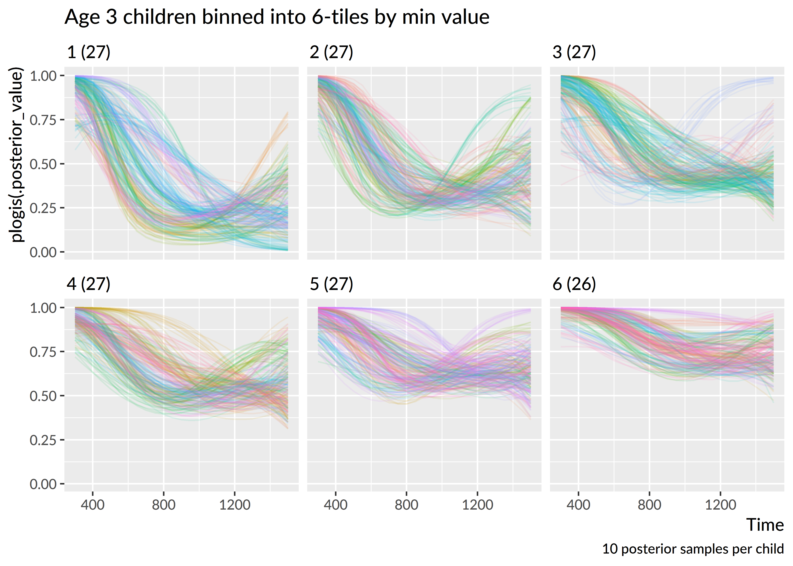

Sensitivity to mispronunciations
=======================================================================

For the mispronunciation trials, there is no correct "target", as there
is for the nonword or real word trials. The design of the task allows
the child to associate the mispronunciation with a unfamilar object or
with a familiar object with phonologicallly similar name. As a result,
there are not any "distractor-initial" trials. Therefore, I analyzed the
mispronunciation trials separately for both initial fixation locations.
One model handled trials a child's gaze started on the familiar object
and another model handled trials starting on the unfamiliar object. For
these models, I fit a growth curve model that included indicators for
Age and interations Time × Age interactions, like the one from
[Chapter \@ref(fam-rec)](#fam-rec). The basic model was therefore:

$$
\small
\begin{align*}
   \text{log-odds}(\mathit{looking\,}) =\
    &\beta_0 + 
      \beta_1\text{Time}^1 + 
      \beta_2\text{Time}^2 + 
      \beta_3\text{Time}^3\ + 
      &\text{[age 3 growth curve]} \\
    (&\gamma_{0} + 
      \gamma_{1}\text{Time}^1 + 
      \gamma_{2}\text{Time}^2 +
      \gamma_{3}\text{Time}^3)*\text{Age}\,\text{4} + \
      &\text{[adjustments for age 4]} \\
    (&\delta_{0}\!\ + 
      \delta_{1}\text{Time}^1\!\ + 
      \delta_{2}\text{Time}^2\!\ +
      \delta_{3}\text{Time}^3)*\text{Age}\,\text{5} \
      &\text{[adjustments for age 5]} \\
\end{align*}
$$

[Appendix \@ref(aim2-gca-models)](#aim2-gca-models) contains the R code
used to fit these models along with a description of the specifications
represented by the model syntax. The mixed model included by-child and
by-child-by-age random effects so that it captured how some of a child's
growth curve features may be similar over developmental time
and may differ at each age.

For these analyses, I modeled the data from 300
to 1500 ms after target onset. As in the real-word vs.
nonword analyses, I removed any Age × Child levels if a child had fewer
than 4 fixations in a single time bin. Children had to have at least 4
looks to one of the two images in every 50 ms time bin. For the
familiar-initial trials, this screening removed 1
child at age 3, 4 at age 4, and
0 tage 5, and for the unfamiliar-initial trials,
this screening removed 6, 6, and
2 children at ages 3, 4, and 5, respectively.

## Unfamiliar-initial trials

When children start on the image of a novel object and hear a
mispronunciation, they tend to look to the familiar image.
Figure \@ref(fig:unfam-initial-mp-trials) shows the average of
children's growth curves along with the 100 model-estimated group
averages. The growth curves all cross the .5 threshold, so that the
children on average looked more to the familiar image than the unfamilar
image. Granted, the degree of referent selection here is not as great as
that observed for the nonwords or real words. For those conditions, the
average growth curves reached a peak of around .77 at age 3 whereas for
the mispronunciations the age-3 peak is around .62. Children were slower
to process mispronunciations. For the real-word condition, the average
age 3 growth curve crosses .5 looking probability around 775 ms after
target onset whereas in the mispronunciation condition, this threshold
is crossed at 1000 ms. Children associate the mispronunciation with the
familiar object, although they are slower and show greater uncertainty.

(ref:unfam-initial-mp-trials) Averages of participants' growth curves in
each age. The lines represent 100 posterior predictions of
the group average. 

(\#fig:unfam-initial-mp-trials)(ref:unfam-initial-mp-trials)

Of the growth curve features, developmental changes were only observed
for the intercept and peak probability features. At age 3, the average
proportion of looks to the familiar image was
.37 [90% UI: .34, .40]. The looking proportion increased by
.04 [&minus;.01, .08] to .40 [.37, .44] at
age 4. This year-over-year change is probably positive, but a change
of 0 is still a plausible result. Visually, this uncertainty appears in
the growth curve plot by how close together the age-3 and age-4 growth
curves appear. The average proportion of looks increased by
.07 [.03, .12] to .48 [.45, .51] at
age 5. Here, there is more certainty that the year-over-year change was
positive. In short, performance was similar for age 3 and age 4 but
there was a marked improvement at age 5.

Figure \@ref(fig:unfam-peaks-by-age) shows participant's growth curve
peaks for each year of the study. The average of the participant's
growth curve peaks followed the same pattern as the intercept: similar
levels at age 3 and age 4 (.63 versus
.64) but a clear gain in looking peak probability
at age 5 (.69). Unlike the nonword conditions,
very few listeners achieve a peak of looking probability of .1.

None of the other growth curve features showed developmental changes.
That is, There were no credible year-over-year changes for the linear,
quadratic or cubic time components of the growth curve. Although
Figure \@ref(fig:unfam-initial-mp-trials) shows children's probability
of looking to the familiar image increasing sharply at age 5, this
effect cannot be clear tied to any of the model's polynomial time
features. After about 600 ms, the age 5 curve is almost parallel to
other curves. This is consistent with the intercept effect: The
curve is higher than the others on average, but it doesn't show any
differences in shape.

(\#fig:unfam-peaks-by-age)(ref:unfam-peaks-by-age)

**Summary**. When children look at the unfamilar object and hear a
mispronunciation, they on average look to the familiar image that sounds
like the mispronunciation. Children are much more uncertain in this
condition, compared to the conditions whether appropriate referent is
more obvious. The only development changes observed were the increases
in looking reliability and peak looking probability at age 5.

## Familiar-initial trials

Preschoolers associate one-feature onset-mispronunciations with the
familiar word that matches the rime of the word. 

Figure XX shows the growth curve averages for trials starting on the
familiar image. Here the looking patterns show a rush into uncertainty.
At age 3 and age 4, the growth sharply decrease into chance
level-performance. Behaviorally, they are looking to both images
equally. One interpretation of this pattern is that the children are
making brief confirmatory looks to the novel image; they checking out
the novel image. But this cannot be right because the growth curve never
dips much below .5 (certainly not below .4). So there is more likely a
mix of behaviors, with children staying put on some trials and
considering the novel object on some trials.

* Age 3 and age 4 intercepts differ. Age 4 lower.
* Age 4 and age 5 intercepts differ. Age 5 higher.
* Captures differences in average value.

* Age 3 and age 4 linear slopes differ. Age 4 less negative.
* Age 4 and age 5 linear slopes differ. Age 5 less negative.
* Less of a linear trend downwards with age.
* 3 ish vs 2.5ish vs. 1.75 ish

* Age 4 and age 5 quadratic slopes differ. 
* Age 5 10% less than age 4, value moves closer to zero (2-ish vs. 1.75 ish).

* No credible differences for cubic time component.

 
  - When we plot these features out, we see that they add up to make it
    so that the Age 4 curve dips down lowest and Age 5 does not dip as
    far down.
  - The developmental story, if any, is that children stick with the
    familiar object slightly more at age 5.

***

I asked whether growth curve "valleys" provided a meaningful feature for
this data. This value was defined as the median of the five smallest
proportions of a growth curve. It reflects the maximum degree to which
the novel image is considered as a referent for the mispronunciation.

* There is considerable spread at each age. 
* The middle boxplot almost stretches perfectly from 0 to 1.
* There is probably a few different behaviors being captured here.
* That said, the median is closer to .5 at age 5 which matches how the 
  growth curves looked.

## Discussion

  - For the first set of analyses, they reliably and more reliably with
    age look to the familiar image.
  - There is a definite penalty to the mispronunciation when we compare
    against real word or nonword peaks.
  - Unlike those conditions which started to show ceiling effects at
    age 4, children are much more uncertain here.
  - In terms of lexical processing, the syllable onset leads them down a
    garden path. They have to hear more of the word in order to
    associate the mispronunciation with the target. This is a bit like
    processing a rime word.
  - The development story is that they can use the rest of the word more
    effectively to associate the MP with the familiar image. This would
    predict that children become more sensitive to rime-based lexical
    competitors during the preschool years.
  - So they are sensitive but they become more accommodating of the
    mispronounced version.
  

  - For second set of analyses, there is no one clear strategy for
    referent selection. We see a few different patterns among children.
    Some stay put. Some always switch. Some do both.
  - The growth curve averages rush to .5, which is equal looks to both
    images, which is maximum uncertainty.
  - The age 5 curve doesn't dip as far, so they are slightly more likely
    to stay put.
  - These sets of analyses mainly demonstrate that when children start
    on a familiar image and hear a mispronunciation, they have a few
    options for howto proceed.
  - This also shows a possible decoupling between lexical processing and referent selection. It is unlikely that children heard the mispronunciations differently in these trials, but rather the responded differently.

