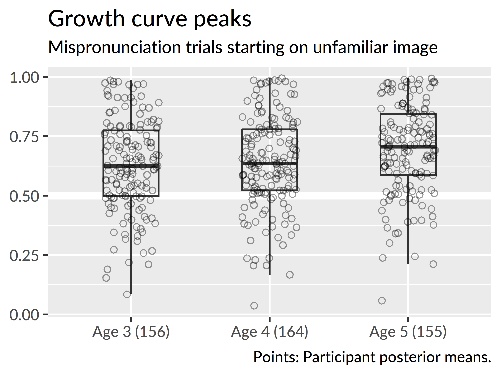
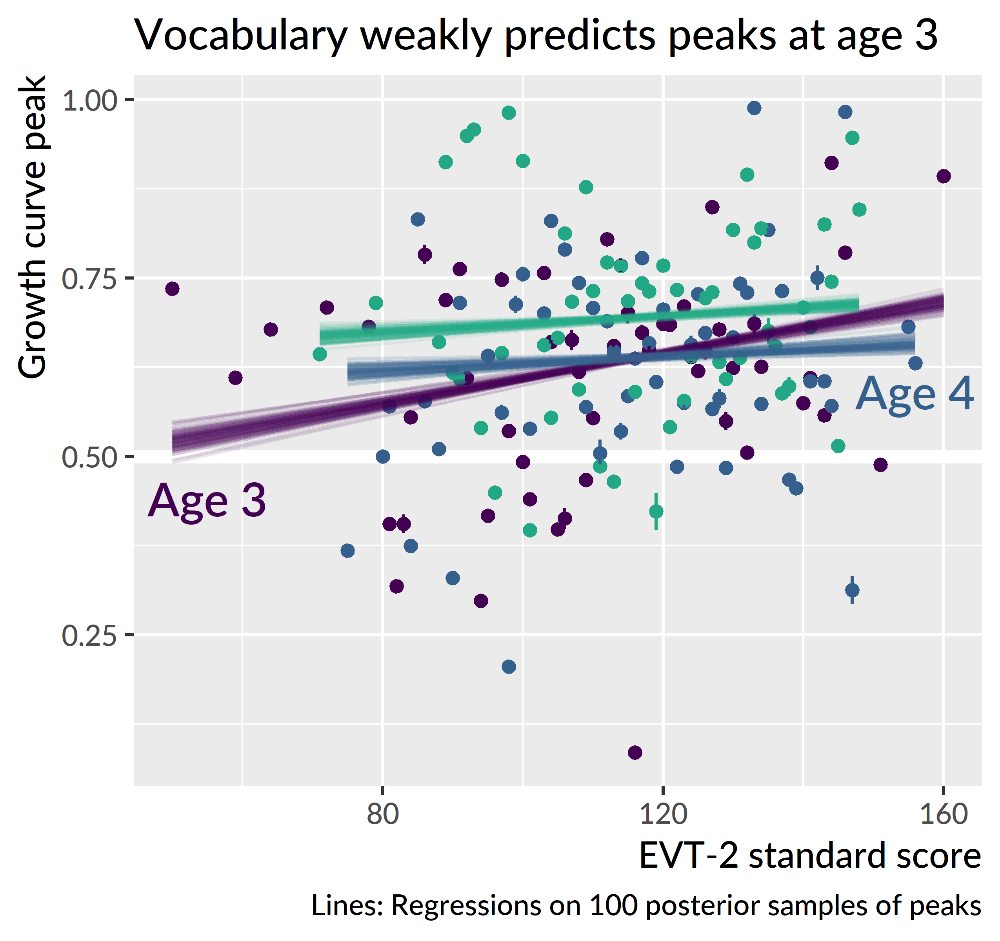
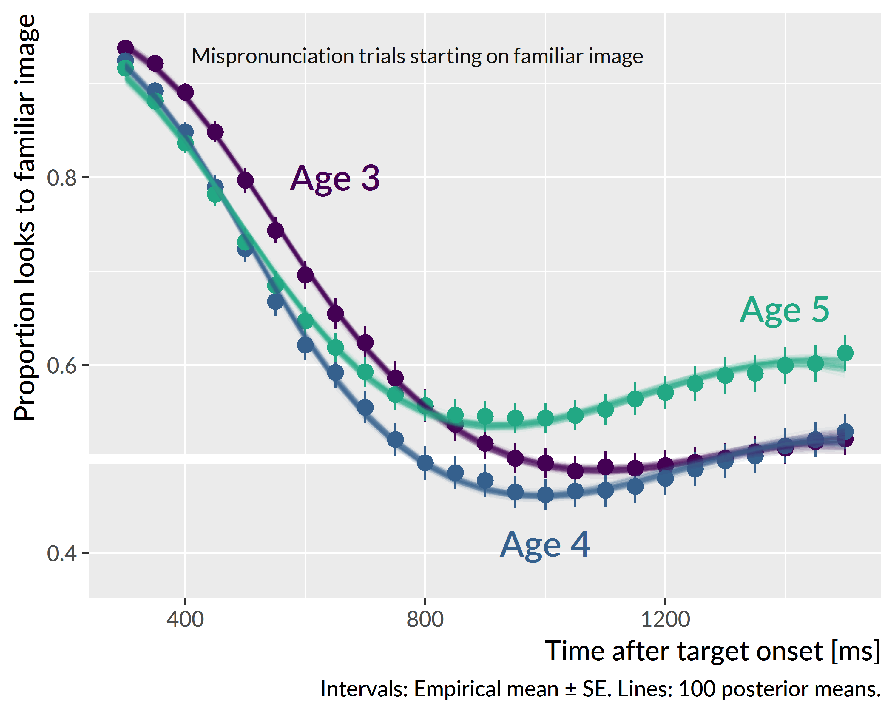
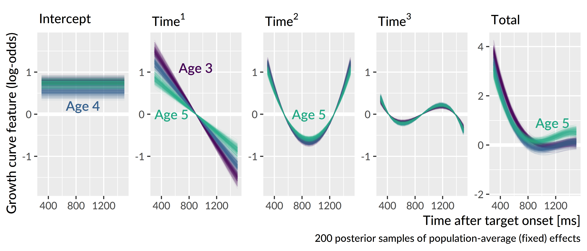
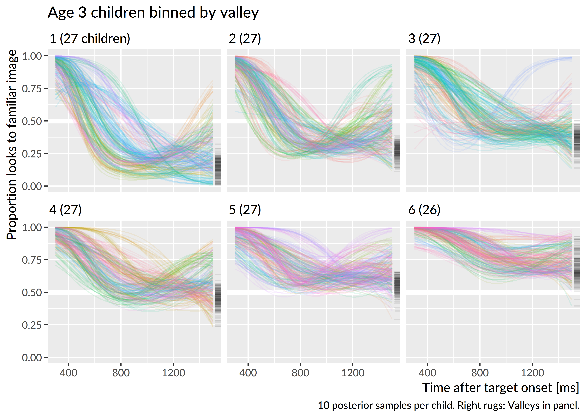
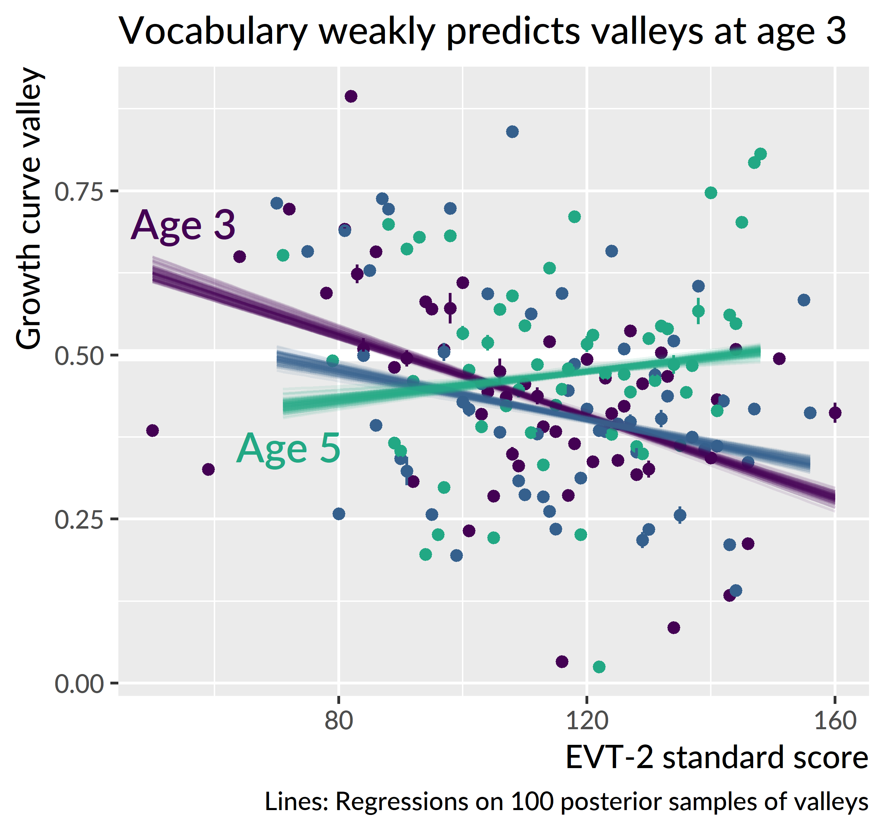
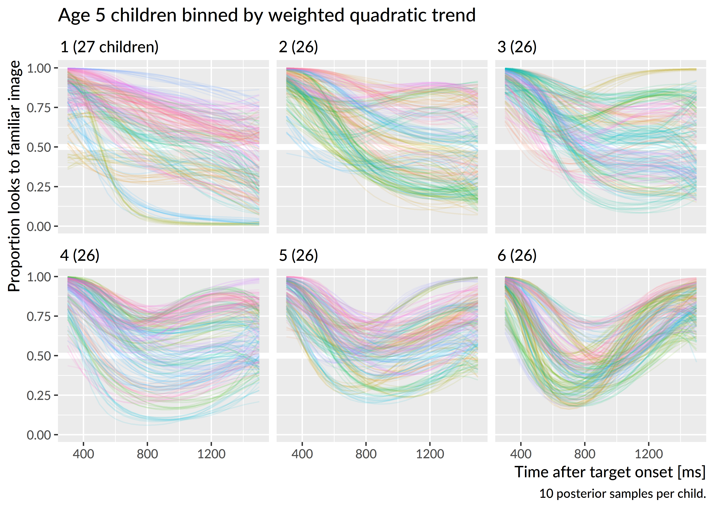

Sensitivity to mispronunciations
=======================================================================

For the mispronunciation trials, there is no correct "target", as there
is for the other conditions. The design of the task allows the child to
associate a mispronunciation with an unfamiliar object or with the
familiar object with a name that sounds like the mispronunciation. As a
result, I analyzed the mispronunciation trials separately for both
initial-fixation locations. One analysis handled trials where a child's
gaze started on the familiar object and another analysis handled trials
starting on the unfamiliar object. For these models, I fit a Bayesian
logistic regression growth curve model that included indicators for Age
and Time × Age interactions, as in the model from
[Chapter \@ref(fam-rec)](#fam-rec). The linear model was therefore:

$$
\small
\begin{align*}
   \text{log-odds}(\mathit{looking}) =\
    &\beta_0 + 
      \beta_1\text{Time}^1 + 
      \beta_2\text{Time}^2 + 
      \beta_3\text{Time}^3\ + 
      &\text{[age 3 growth curve]} \\
    (&\gamma_{0} + 
      \gamma_{1}\text{Time}^1 + 
      \gamma_{2}\text{Time}^2 +
      \gamma_{3}\text{Time}^3)*\text{Age}\,\text{4} + \
      &\text{[adjustments for age 4]} \\
    (&\delta_{0}\!\ + 
      \delta_{1}\text{Time}^1\!\ + 
      \delta_{2}\text{Time}^2\!\ +
      \delta_{3}\text{Time}^3)*\text{Age}\,\text{5} \
      &\text{[adjustments for age 5]} \\
\end{align*}
$$

The mixed effects model included by-child and by-child-by-age random
effects so that it would capture how a child's growth curve features may
be similar over developmental time (by-child effects) and may differ at
each age (by-child-by-age effects).
[Appendix \@ref(aim2-gca-models)](#aim2-gca-models) contains the R code
used to fit these models along with a description of the model's
specification/syntax.

For these analyses, I modeled the data from 300
to 1500 ms after target onset. As in the real word vs.
nonword analyses, I removed any Age × Child levels if the child's data
had fewer than 4 fixations in a single time bin. As a result, children
had to have at least 4 looks to one of the two images in every 50-ms
time bin. For the unfamiliar-initial trials, this screening removed
6 children at age 3, 6 at age 4,
and 2 at age 5, and for the familiar-initial trials,
this screening removed 1, 4, and
0 children at ages 3, 4, and 5, respectively.

## Unfamiliar-initial trials: Move along now

When preschoolers started on the image of a novel object and heard a
mispronunciation, they looked to the familiar image.
Figure \@ref(fig:unfam-initial-mp-trials) shows the average of
children's growth curves along with the 100 model-estimated group
averages. The growth curves all cross the .5 threshold, so the
children on average looked more to the familiar than the unfamiliar
image. Granted, the degree of referent selection is not as strong as
that observed for the real words or nonwords. For those conditions, the
average growth curve reached a peak of around .77 at age 3, but for the
mispronunciations the age-3 peak is around .62. Children also were
comparatively slower to process mispronunciations. For the real-word
condition, the average age-3 growth curve crosses .5 looking probability
around 775 ms after target onset, whereas in the mispronunciation
condition, this threshold is crossed at 1000 ms. Children associate the
mispronunciation with the familiar object, although they are slower and
show greater uncertainty compared to real word trials.

(ref:unfam-initial-mp-trials) Averages of participants' growth curves in each age. The lines represent 100 posterior predictions of the group average. 

(\#fig:unfam-initial-mp-trials)(ref:unfam-initial-mp-trials)

Of the growth curve features, developmental changes were only observed
for the average probability (intercept) and peak probability features.
At age 3, the average proportion of looks to the familiar image was
.37 [90% UI: .34, .40]. At age 4, the looking proportion
increased by .04 [&minus;.01, .08] to
.40 [.37, .44]. This year-over-year change was probably
positive, but the the uncertainty interval still includes a change of 0
as a plausible result. Visually, this uncertainty appears in the growth
curve plot by how close together the age-3 and age-4 growth curves
appear. At age 4, the average proportion of looks
increased by .07 [.03, .12] to
.48 [.45, .51]. Here, there is more certainty that the
year-over-year change was positive, and this result is consistent with
the visual separation of the age-5 growth curve from the others. In
short, performance was similar for age 3 and age 4 but there was a
marked improvement at age 5.

Figure \@ref(fig:unfam-peaks-by-age) shows participant's growth curve
peaks for each year of the study. The peaks were computed as in other
chapters by taking the median of the five highest values on the curve.
The average of the participants' peak looking probabilities followed the same
pattern as the average looking probabilities: similar levels at age 3 and age 4
(.63 versus .64) but a
clear gain in looking peak probability at age 5
(.69). 

(ref:unfam-peaks-by-age) Growth curve peaks by age for mispronunciation trials starting on the unfamiliar image.

(\#fig:unfam-peaks-by-age)(ref:unfam-peaks-by-age)

Figure \@ref(fig:unfam-peaks-by-age) also indicates how most of the
children at each age favored the familiar object over the unfamilar
object. The bottom hinge of the boxplots mark the location of the 25th
percentile. Therefore, approximately 75% of children at age 3 were on or
above the .5 threshold. Unlike the other conditions, very few
listeners achieve a peak of looking probability of .99: At age 5, only
3 [1, 5] children reached ceiling performance, compared
to approximately 40 for nonwords and 13 for real words.

None of the other growth curve features showed developmental changes.
That is, there were no credible year-over-year changes for the linear,
quadratic or cubic time components of the growth curve. Although
Figure \@ref(fig:unfam-initial-mp-trials) shows children's probability
of looking to the familiar image increasing more quickly at age 5, this
effect cannot be clearly tied to any of the model's polynomial time
features. After 600 ms, the age-5 curve is almost parallel to
other curves. This visual feature is consistent with the intercept
effect: The curve is higher than the others on average, but it does not
show any differences in shape.

### Child-level predictors

I tested whether child-level measures predicted looking
behavior under these conditions. First, I asked if performance on a
minimal pair discrimination task at age 3 predicted looking behavior at
age 3. The rationale here is the hypothesis that children with better
minimal pair discrimination may be especially sensitive to
mispronunciations. Proportion of items correct on the task did not
correlate with growth curve peaks, *r* = &minus;.03 [90% UI: &minus;.05, &minus;.01], *n* =
138, nor with any other growth curve measures.

I also tested whether expressive vocabulary (EVT-2 standard score)
predicted performance in this condition. In this case, there were
significant effects at age 3 where a higher expressive vocabulary
predicted higher peak probabilities and higher average probabilities.
These effects, however, were very small. As shown in
Figure \@ref(fig:plot-evt-mp-unfam-peaks), for example, a 15-point
increase in expressive vocabulary predicted an increase of growth curve
peak of .03, *R*^2^ = .03. Expressive
vocabulary did not predict any of the growth curve features at age 4 or
at age 5.

(ref:plot-evt-mp-unfam-peaks) Relationship between expressive vocabulary and growth curve peaks for mispronunciation trials starting on the unfamiliar image. I took 100 draws from the posterior distribution and computed participant's growth curve peaks for each draw. Points represent the mean and standard error of 100 peaks. Lines represent regressions fit on each draw. 

(\#fig:plot-evt-mp-unfam-peaks)(ref:plot-evt-mp-unfam-peaks)

**Summary**. When children are looking at the unfamiliar object and hear
a mispronunciation, they shift their looks on average to the familiar
image that sounds like the mispronunciation. Children are much more
uncertain in this condition, compared to the real-word and nonword
conditions where the appropriate referent is more obvious. The only
developmental changes observed were the increases in average looking
probability and peak looking probability at age 5. Finally, there was a
small effect of expressive vocabulary on looking probability at age 3,
but no other effects of vocabulary were observed. Minimal pair
discrimination at age 3 also did not predict looking behavior.

Familiar-initial trials: Should I stay or should I go?
------------------------------------------------------------------------

The preceding results showed that preschoolers associate one-feature
onset-mispronunciations with the familiar word that matches the rime of
the word. But that was only for trials where children start on the unfamilar
object. I now consider the other situation, where children are fixating
on a familiar object and hear a word that immediately mismatches with
the name of that familiar object. On the basis of the first segment,
children have information that supports switching to another image. But
as the rest of the word unfolds, they hear a syllable rime that supports
staying.

Figure \@ref(fig:fam-initial-mp-trials) shows the growth curve averages
for trials starting on the familiar image. The looking patterns show a
sharp fall towards .5 which is chance-level performance. Behaviorally,
children on average move quickly to look at both images equally. They
rush into maximum uncertainty, especially at age 4. Patterns are
somewhat more restrained at age 5. Here, the average of the growth
curves never dips below .5, and in fact, it shows a late rise to .6
looking probability. At this age, children are overall more likely to
stay on the familiar object. Finally, at age-3, the curve begins to fall
later than the other curves, reflecting a slower change from the
starting probability.

<!-- One possible interpretation of this pattern is that the children making  -->
<!-- brief confirmatory looks to the novel image; they checking out -->
<!-- the novel image. But this cannot be right because the growth curve never -->
<!-- dips much below .5 (certainly not below .4). So there is more likely a -->
<!-- mix of behaviors, with children staying put on some trials and -->
<!-- considering the novel object on some trials. -->

(ref:fam-initial-mp-trials) Averages of participants' growth curves in each age. The lines represent 100 posterior predictions of the group average. 

(\#fig:fam-initial-mp-trials)(ref:fam-initial-mp-trials)

In other analyses, growth curves rise and plateau, and age-related
effects appear in how quickly the curves rise or the height at which
they plateau. In those cases, it is straightforward to interpret how the
intercept and linear time effects contribute to the curve's shape over
development. For this model, the curves *fall* and plateau, and there is
not an obvious developmental, year-over-year change among the curves.
Thus, more effort is required to interpret the model parameters and how
they combine to form the growth curve shape.

Figure \@ref(fig:mp-fam-gca-features) visualizes how the growth curve
features are weighted at each year and how they contribute to the
overall growth curve shape. At age 3, the intercept feature, or average
proportion of looks to the familiar image, was .68 [90% UI: .65, .71]. The
feature is less meaningful in this situation because the curves all
start at a high probability which inflates the average value. That said,
comparisons remain useful. At age 4, the average probability decreased
by .05 [.02, .09] to .63 [.60, .66], and at age 5 the average
probability returns to age-3 levels, .68 [.65, .71]. This intercept
effect contributes to how the age-4 curve dips below the others and
indeed briefly crosses the .5 probability threshold.

(ref:mp-fam-gca-features) Weighted growth curve features. For the first four panels, the *y* axes are scaled to the same range. This scaling highlights how the cubic time component contributes less to the overall shape than the other features.

(\#fig:mp-fam-gca-features)(ref:mp-fam-gca-features)

For the linear time feature, the slope becomes flatter year over year,
decreasing by 19% [7%, 29%] from age 3 to age 4 and
decreasing by 30% [17%, 42%] from age 4 to age 5. For
these curves, however, the starting location is the highest value on the
curve, so the linear time feature in this case mostly works to set the
starting location of the curves. When the features are combined in
Figure \@ref(fig:mp-fam-gca-features), the age-3 curve, which has the
steepest linear time feature, starts at a higher value than the others.

There was a credible change in the quadratic time feature at
age 5. One way to think of a positive quadratic trend is like a weight
hanging on a string: It pulls and bends the whole curve downwards. At
age 5, the quadratic feature is 12% [1%, 22%] smaller than at
age 4, meaning that the age-5 curve has slightly less bend downwards.
Finally, there were no credible differences in the cubic time feature.
Compared to the other features, the cubic trend only a small amount to
the overall shape of the curves.

The combination of these effects shows in the final panel of
Figure \@ref(fig:mp-fam-gca-features). The age-4 curve dips down
furthest beneath 0 log-odds (.5 probability)---this is driven by in the
intercept feature. The age-5 curve stays above 0 log-odds and eventually
starts to rise away from its minimum value, owning to the dampened
linear and quadratic features.

**Summary**. The shape of the average growth curves changed with each
year of the study. Given the interplay of the curve features, I will
avoid assigning a developmental intepretation to individual features.
There are two main noticeable developmental trends at play however.
First, the age-3 curve starts to fall from its baseline probability a
little later than the other curves. Second, the age-5 curve stays above
.5 probability and starts to rise at the end of the trial. At age 5,
children were more likely stay looking at the familiar object than look
at both images equally.

### Child-level predictors and different listening behaviors

In other word recognition analyses, I derived a growth curve "peak"
value as a measure of maximum looking probability or minimum word
recognition uncertainty. For these trials, I asked whether analogous
growth curve "valleys" provided a meaningful feature for looking
behavior when children start a trial fixated on the familiar image. This
value was defined as the median of the five smallest values of a growth
curve. Intuitively, it reflects the maximum degree to which the novel
image is considered as a referent for the mispronunciation.

Figure \@ref(fig:fam-peaks-by-age) shows the posterior means of
participants' growth curve valleys. Note that there is considerable
variability at each age, with the 0--1 interval nearly covered at age 4.
The median value is closer to .5 at age 5, and this difference is
consistent with the growth curve trajectories where the average age 5
curve had did not dip as low as the other curves.

(ref:fam-peaks-by-age) Growth curve peaks by age for mispronunciation trials starting on the familiar image.

(\#fig:fam-peaks-by-age)(ref:fam-peaks-by-age)

The wide range of values for the growth curve valleys suggests that
there are a few different listening behaviors that are being averaged
over in the above analyses. The valleys above .6, for example, indicate
that some children on average stay with the familiar image, and the
valleys below .4 indicate children who favor the unfamiliar image. 

To explore individual listening behaviors, I visualized children's
individual growth curves based on their growth curve valleys. Within
each year, I grouped children into sextiles based on the posterior mean
of the their valley and plotted their individual growth
curves. Figure \@ref(fig:age3-valley-curves) shows the results from
age 3. The final two bins show children who stayed with the
familiar image throughout the mispronuciation trials. The first two bins
mostly contain children who switched to the unfamilar image and stayed
there. These are also children whose curves show a pronounced u-shaped
trajectory. Specifically, the curves with the highest ending points in
the first three bins highligh children with u-shaped trajectories. In
these curves, the probability of fixating on the familiar image briefly
decreases, as the child considers the other image.

(ref:age3-valley-curves) Growth curves for mispronunciations trials starting on the unfamilar object at age 3. Children were grouped into sextiles based on the posterior mean of the growth curve valley---that is, the lowest point on the growth curve. Ten lines are drawn per child to visualize uncertainty. Children were assigned colors arbitrarily. On the right side of each panel are "rugs" which mark the valleys in that panel.

(\#fig:age3-valley-curves)(ref:age3-valley-curves)

I asked whether any child-level factors predicted children's looking
behaviors. I first regressed growth curve valleys on EVT-2 standard
score. There was a small effect at age 3, *R*^2^ =
.09, *n* = 145. A 15-point
increase in expressive vocabulary predicted decrease in growth curve
valley of .05. At the other ages, the effects are
neglibly small, as shown in Figure \@ref(fig:mp-fam-valley-evt).

(ref:mp-fam-valley-evt) Relationship between expressive vocabulary and growth curve valleys for mispronunciation trials starting on the familiar image. Valleys were computed on 100 draws of the posterior distribution. Points represent the mean and standard error of the valleys. Lines represent the fit of the regression in each draw. Although the slopes of age-4 and age-5 lines are noticeably different from the age-3 one, they cover a tiny amount of the *y* axis so they represent a neglible effect.

(\#fig:mp-fam-valley-evt)(ref:mp-fam-valley-evt)

I regressed age-3 valleys onto expressive vocabulary, minimal-pair
discrimination accuracy, and their interaction. The two main effects and
their interaction were all statistically significant, *R*^2^ =
.17, *n* = 139. The
effects of vocabulary and minimal-pair discrimination were both
negative, so that higher scores on these measures predicted lower growth
curve valleys---that is, a greater maximum probability of fixating on
the unfamilar image. For an average participant, a 15-point increase in
expressive vocabulary predicted decrease of
.03, and an increase of minimal pair
accuracy of .1 predicted a decrease in valley of
.03. The interaction term, however,
was positive, meaning that increasing one of the predictors
simulataneously weakens the effect of the other. As one of the
predictors increases, it can push the effect of the other closer to zero
so that its simple effect is "no longer" statistically significant. In
this case, the simple effect of expressive vocabulary was not
significant when minimal pair accuracy was .71 or greater
(that is, at the 60-percentile or greater).
Conversely, the simple effect of minimal pair discrimination accuracy
was not significant when expressive vocabulary standard score was
119 or greater (at the 60-percentile or
greater). In summary, at age 3, both expressive vocabulary and minimal
pair discrimination each predicted greater consideration of the
unfamiliar image. But these effects was also redundant so that large
changes in one predictor would weaken the effect of the other. 

The growth curve valley feature measures the maximum extent to which the novel
object is considered as the referent on these trials. But the u-shaped
growth curves in Figure \@ref(fig:age3-valley-curves) suggest another
listening response on this task: Confirmatory looks to the unfamiliar
object. In these u-shaped curves, a child's probability of fixating on
the familiar object temporarily decreases as the novel object is
considered, and the probability rises as that interpretation is
rejected. To quantify this tendency, I computed each child's growth
curve on the probability scale and re-estimated the quadratic trends in
these curves. Exploratory visualization showed that children with higher
values on this quadratic trend were more likely to have a u-shape curve.
This feature, however, also favored sigmoid or z-shaped curves that
rapidly fell and plateaued. To avoid these kinds of curves, I weighted
the quadratic trend using the median of the final five points of the
curve. The weighted quadratic feature penalized curves that have a
strong quadratic trend but end on a low probability. Figure
\@ref(fig:mp-fam-prop-ot2-bins) shows growth curves of age 5 children
binned using this feature. The bottom row of panels illustrates how the
u-shaped feature becomes stronger in each bin. The weighted quadratic feature
was weakly correlated with the growth curve valleys, *r* =
&minus;.12, and the lack of correlation appears in the figure
by how the curves in each panel reach different valleys.

(ref:mp-fam-prop-ot2-bins) Growth curves for mispronunciations trials starting on the unfamilar object at age 5. Children were grouped into sextiles based on the posterior mean of their curves quadratic trend weighted by the height of the curve in the final time bins. Ten lines are drawn per child to visualize uncertainty. Children were assigned colors arbitrarily. 

(\#fig:mp-fam-prop-ot2-bins)(ref:mp-fam-prop-ot2-bins)

I regressed the u-shaped curve feature onto expressive vocabulary
standard score at each age and onto minimal pair discrimination for
age 3. There was a tiny yet significant of vocabulary at
age 5, *R*^2^ = .03, where children with lower vocabularies
had a slightly stronger u-shaped trend in their growth curve. This
effect, however, is so small as to be negligible. None of the effects were 
significant.

**Summary**. At age 3, children with larger expressive vocabularies or
better minimal pair discrimination had lower growth curve valleys---that
is, they looked more to the unfamiliar object when they heard a
mispronunciation while fixated on an image of the mispronounced word.
These two child-level measures significantly interacted so that
increasing both measures simultaneously had diminishing returns. I
devised a measure of the how u-shaped the growth curves were, but there
were not any meaningful effects of vocabulary or expressive vocabulary
on this measure.

## Discussion

In the lab, when preschoolers are looking at a novel object and hear the name of
a different familiar object, albeit mispronounced, they look to the familiar
object. Children do this reliably at age 3 and even more reliably at age 5. They
look much less to the object compared to trials where they hear a correct
production of the familiar word---see Figure \@ref(fig:mp-vs-real-peaks)--or
when they hear a nonword in a context that supports fast-referent selection.
Therefore, they are unquestionably sensitive to mispronunciations of familiar
words so that they are more uncertain when they hear a mispronunciation.

  - Unlike those conditions which started to show ceiling effects at
    age 4, children are much more uncertain here.
  - In terms of lexical processing, the syllable onset leads them down a
    garden path. They have to hear more of the word in order to
    associate the mispronunciation with the target. This is a bit like
    processing a rime word.
  - The development story is that they can use the rest of the word more
    effectively to associate the MP with the familiar image. This would
    predict that children become more sensitive to rime-based lexical
    competitors during the preschool years.
  - But there is no effect of expressive vocabulary here, especially at older ages.
  - So they are sensitive but they become more accommodating of the
    mispronounced version.
  

(ref:mp-vs-real-peaks) Text reference for caption

(\#fig:mp-vs-real-peaks)(ref:mp-vs-real-peaks)

  - For second set of analyses, there is no one clear strategy for
    referent selection. We see a few different patterns among children.
    Some stay put. Some always switch. Some do both.
  - The growth curve averages rush to .5, which is equal looks to both
    images, which is maximum uncertainty.
  - The age 5 curve doesn't dip as far, so they are slightly more likely
    to stay put.
  - These sets of analyses mainly demonstrate that when children start
    on a familiar image and hear a mispronunciation, they have a few
    options for how to proceed.
  - This also shows a possible decoupling between lexical processing and
  referent selection. It is unlikely that children heard the mispronunciations
  differently in these trials, but rather the responded differently.
  

