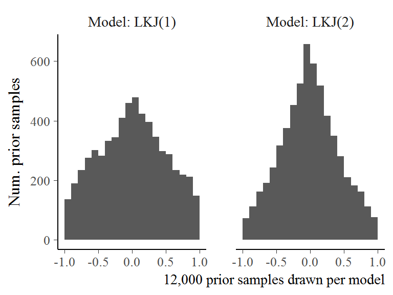
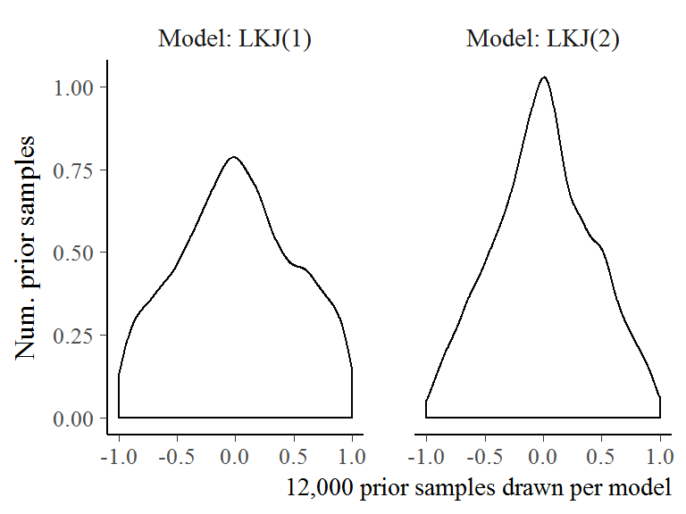

(APPENDIX) Appendix {#appendix-appendix .unnumbered}
========================================================================

Computational Details for Specific Aim 1 {#aim1-gca-models}
========================================================================

Growth Curve Analysis Models
------------------------------------------------------------------------

The models were fit in R (version) with RStanARM (version).

When I computed the orthogonal polynomial features for Time, they were
rescaled so that the linear feature ranged from −.5 to .5. Under this
scaling a unit change in Time^1^ was equal to change from the start to
the end of the analysis window. The polynomial features for the Time had
the following ranges:


Feature            Min    Max   Range
--------  ------------  -----  ------
Time^1^    &minus;0.50   0.50    1.00
Time^2^    &minus;0.33   0.60    0.93
Time^3^    &minus;0.63   0.63    1.26

Here is the code used to fit the model with RStanARM. It took about 24 hours
to run the model.


```r
library(rstanarm)
options(mc.cores = parallel::detectCores())

m <- stan_glmer(
  cbind(Primary, Others) ~
    (ot1 + ot2 + ot3) * Study +
    (ot1 + ot2 + ot3 | ResearchID/Study),
  family = binomial,
  prior = normal(0, 1, autoscale = FALSE),
  prior_intercept = normal(0, 2),
  prior_covariance = decov(2, 1, 1),
  data = d_m)

readr::write_rds(m, "./data/stan_aim1_cubic_model.rds.gz")
```

We used moderately informative priors for the main regression effects.

* b ~ Normal(mean = 0, sd = 1)

Under the Normal(0, 1) prior, before seeing any data, we expect 95% of plausible
effects to fall in the range ±1.96, which is an adequate range for these
growth curve models. For example, consider just the effect of Time^1^. If a
listener starts at chance performance, 25% or -1.1
logits, and increases to, say, 65% or 0.62, the effect
of a unit change in Time^1^ would be a change of
1.72 logits. This magnitude of effect is
accommodated by our Normal(0, 1) prior. 

_Here I would have to also describe the random effects structure._

For the hierarchical part of the model, I used RStanARM's `decov()` prior which
simultaneously sets a prior of the variances and correlations of the model's
random effect terms. For these terms, I used the default prior for the variance
terms and used a weakly informative LKJ(2) prior on the random effect
correlations. The difference between LKJ(1) and LKJ(2) is that under
LKJ(2) extreme correlations are less plausible. In the figure below, we
see that the LKJ(2) prior nudges some of the probability mass away from
±1 towards the center. The motivation for this kind of prior was
*regularization*: We give the model a small amount of information to
nudge it away from extreme, degenerate values.





<div class = "infobox">

**Box 1: A brief comment about priors.**

Bayesian models require prior information (“priors”). Priors are also
commonly referred to as "prior beliefs", and Bayesian techniques are
criticized or dismissed for smuggling subjectivity into the scientific
enterprise. I find this unfortunate on two grounds. First, *belief*
overstates things. As George Box said, "all models are wrong, but some
are useful" [cite], so no part of a statistical model should be called
a "belief" when the whole thing is a convenient fiction. That's why I
prefer the term *prior information*. [Hat tip Gelman?] Second, other
parts of the statistical model are also subjective: likelihood
functions, what kind of ANOVA, what to covary, whether to transform
measurements, whether a *p* = .07 is a "marginal" effect or no effect at
all, and so on. This subjectivity seems reasonable, provided that we
scientists are open about modeling decisions.

For these models, I will use weakly to moderately informative priors.
For example, suppose *x* and *y* are scaled to mean 0 and standard
deviation 1. A weakly informative prior for the effect of *x* on *y*
might be Normal(0, 5)—a normal distribution with mean 0 and standard
deviation 5. If we fit a regression model and observed an effect size
of 12 SD units, our first assumption would be that something went wrong
with our software. The weakly informative prior captures this level of
prior information. A moderately informative prior would be Normal(0, 1).
This prior information captures our disciplinary experience that effect
sizes greater than ±1 relatively uncommon in child language research. A
strongly informative prior for this effect might be something like
Normal(.4, .1) which says that our model should be very skeptical of
negative effects and of effects larger than .8. For this project, I will
default to the first two levels of prior information.

</div>

Items used in the visual world experiment {#vw-experiment-items}
========================================================================

Each row of the table represents a set of four images used in a trial
for the experiment. There were two blocks of trials with different
images and trial orderings. For the two unrelated foils with more than
one word listed, the first word was used in block one and the second in
block two.

  **Target**   **Phonological**   **Semantic**   **Unrelated**
  ------------ ------------------ -------------- ---------------
  bear         bell               horse          ring
  bee          bear               fly            heart
  bell         bee                drum           swing
  bread        bear               cheese         vase
  cheese       shirt              bread          van
  dress        drum               shirt          swing
  drum         dress              bell           sword
  flag         fly                kite           pear
  fly          flag               bee            pen
  gift         kite               vase           bread
  heart        horse              ring           bread/pan
  horse        heart              bear           pan
  kite         gift               flag           shirt
  pan          pear               spoon          vase
  pear         pen                cheese         ring/vase
  pen          pear               sword          van
  ring         swing              dress          flag
  shirt        cheese             dress          fly
  spoon        swan               pan            drum
  swan         spoon              bee            bell
  swing        spoon              kite           heart
  sword        swan               pen            gift
  van          pan                horse          sword
  vase         van                gift           swan


Items used in the mispronunciation experiment {#mp-experiment-items}
========================================================================

The stimuli changed between Year 1 and Year 2 so that dog/tog was
replaced with rice/wice.

  **Time Points**   **Word Group**   **Condition**        **Audio (IPA)**   **Familiar Object**   **Unfamiliar Object**
  ----------------- ---------------- -------------------- ----------------- --------------------- -----------------------
  1                 dog              Correct Production   /dɔg/             dog                   wombat
                                     Mispronunciation     /tɔg/             dog                   wombat
                                     Nonword              /vef/             ball                  sextant
  1, 2, 3           cake             Correct Production   /kek/             cake                  horned melon
                                     Mispronunciation     /gek/             cake                  horned melon
                                     Nonword              /pʌm/             book                  churn
  1, 2, 3           duck             Correct Production   /dʌk/             duck                  toy creature
                                     Mispronunciation     /gʌk/             duck                  toy creature
                                     Nonword              /ʃæn/             cup                   reed
  1, 2, 3           girl             Correct Production   /gɜ˞l/            girl                  marmoset
                                     Mispronunciation     /dɜ˞l/            girl                  marmoset
                                     Nonword              /nedʒ/            car                   work holder
  1, 2, 3           shoes            Correct Production   /ʃuz/             shoes                 flasks
                                     Mispronunciation     /suz/             shoes                 flasks
                                     Nonword              /giv/             sock                  trolley
  1, 2, 3           soup             Correct Production   /sup/             soup                  steamer
                                     Mispronunciation     /ʃup/             soup                  steamer
                                     Nonword              /tʃim/            bed                   pastry mixer
  2, 3              rice             Correct Production   /ɹaɪs/            rice                  anise
                                     Mispronunciation     /waɪs/            rice                  anise
                                     Nonword              /bep/             ball                  sextant

Related Work {#related-work}
========================================================================

In this section, I clarify relationships between this project and other
word recognition research reported from our lab. In short, our lab has
reported results about the two-image and four-image experiments from
cross-sectional samples, describing child-level measures that predict
performance in these tasks. In contrast, my dissertation 1) focuses on
the longitudinal development of word recognition and 2) engages with the
fine-grained details of lexical processing.

@MPPaper analyzed a different version of the mispronunciation experiment
on a different sample of children (*n* = 34, 30-46 months old). This
earlier version included both real word and the mispronunciation of the
real word in the same block of trial. For example, a child would hear
“dog” and “tog” during the same session of the experiment. This design
might subtly temper the effect of mispronounced stimuli by allowing the
listener to compare the mispronunciation to its correctly produced
counterpart. The version of the experiment in Specific Aim 2 separates
the real words and mispronunciations so that a child never hears a
familiar word and its mispronunciation during the same block of trials.
With this design, there is no explicit point of comparison for the
mispronunciation, and the child has to rely on his or her own lexical
representations when processing these words.

@RWLPaper analyzed data from the four-image experiment in Specific
Aim 1. This study featured a diverse cross-sectional sample of 60
children, half of whom received the experiment in African American
English and half received it in Mainstream American English. The sample
ranged in age from 28 to 60 months. The study “borrowed” data from 23
participants from Year 1 of the longitudinal study to enrich parts of
the samples demographics. For this manuscript, we analyzed how
vocabulary and maternal education predicted looking patterns, including
relative looks to the semantic and phonological foils.

Mahr and Edwards (in press) was the manuscript I originally authored for
my preliminary examinations. The paper analyzes the same kinds of
relations as @Weisleder2013 which showed that lexical processing
efficiency mediated the effect of language input on future vocabulary
size. In particular, I asked whether word recognition performance on the
four-image task of Specific Aim 1, vocabulary size, and home language
input data from Year 1 predicted vocabulary size at Year 2. The paper
only examined looks to the familiar image from one year of the study, so
it did not analyze any lexical competition effects or the development of
word recognition within children.
