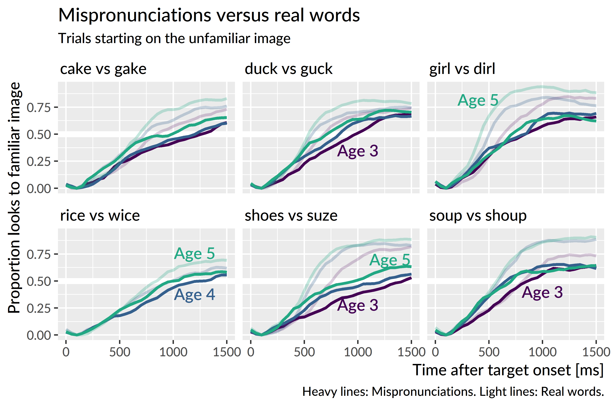
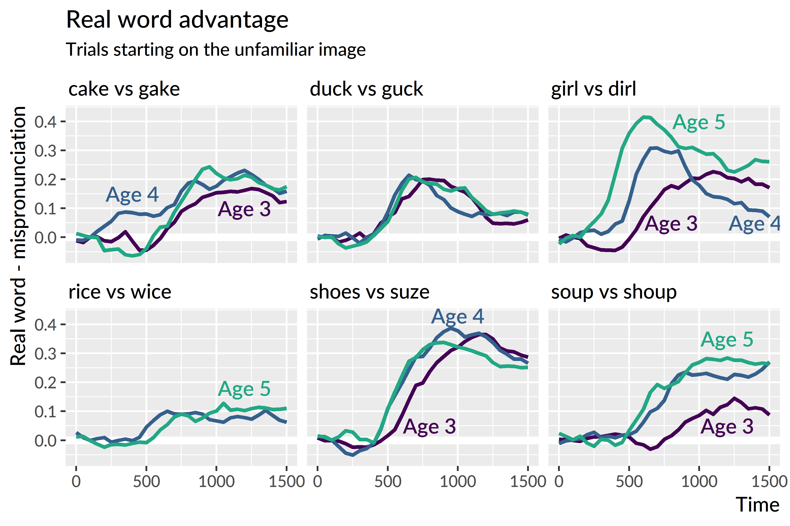

Effects of specific mispronunciations {#aim2-mp-items}
========================================================================

In this section, I briefly discuss item-level differences for the
mispronunciation task.

I intended to formally analyze and model these effects as part of the
main analysis. Prior to beginning this project, I expected that children
would show different responses for different real-word--mispronunciation
pairs. Not all mispronunciations are equally bad, and in fact, there
could be some systematic tendencies in the badness of the
mispronunciations. I hypothesized that children would show less of a
penalty for later-acquired sounds. What I had in mind in particular was
that *rice* and *wice* would be more similar than, say, *duck* and
*guck* and other pairs.

The design of this experiment and the data collected, however, are not
equipped to address this hypothesis. I came to this conclusion after
visualizing the *rice* versus *wice* looking data and observing that
children looked to *rice* less than the other real words. Figure
\@ref(fig:mp-vs-real) shows the growth curves for real word and
mispronunciations. 

(ref:mp-vs-real) Average proportion of looks to the familiar object for real words and mispronunciations. A *dog*/*tog* pair was administered at age 3 but it was replaced by *rice*/*wice* at age 4.

(\#fig:mp-vs-real)(ref:mp-vs-real)

*Rice* and *wice*
are indeed very similar, but children do not know *rice* very well it
seems. In the plot, for instance, age-5 *rice* has as many looks as
age-4 *dirl*. Given that the data tested only 6 mispronunciations per
year, compounded by the fact that some real words are harder than
others, I decided that it would not feasible to draw conclusions about
different kinds of mispronunciations. A more appropriate study would
test many more mispronunciations and vary the familiarity of the paired
real words to handle these limitations. 

It is still informative to plot the differences between the real word
and mispronunciation lines, as in Figure \@ref(fig:mp-real-diffs). This
plot confirms that *rice* and *wice* are very similar. One interesting,
and somewhat unexpected feature, is how the differences increase with
age for some items. Namely, it appears that *dirl* becomes a worse and
worse realization of *girl* as children grow older. A similar change
happens with *shoup* for *soup*.

(ref:mp-real-diffs) Difference between the average proportion of looks to real words and mispronunciations.

(\#fig:mp-real-diffs)(ref:mp-real-diffs)

