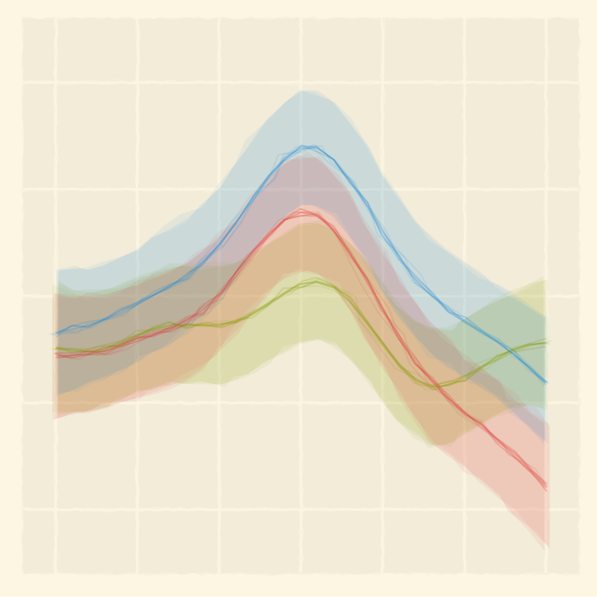

--- 
title: "Development of word recognition in preschoolers"
author: "Tristan Mahr"
date: "2018-09-04"
documentclass: "book"
site: "bookdown::bookdown_site"
github-repo: "tjmahr/dissertation"
panflute-filters: "fix-apa-ampersands"
link-citations: yes
cover-image: "assets/cover.png"

# Data for the PDF version
year: 2018
oral-date: August 7, 2018
signature: 
  - "Jan Edwards, Professor, Hearing and Speech Sciences (University of Maryland)"
  - "Susan Ellis Weismer, Professor, Communication Sciences and Disorders"
  - "Margarita Kaushanskaya, Professor, Communication Sciences and Disorders"
  - "Jenny Saffran, Professor, Psychology"
  - "David Kaplan, Professor, Educational Psychology"
  - "Bob McMurray, Professor, Psychology (University of Iowa)"
abstract-school: "The University of Wisconsin--Madison"
abstract-year: 2018
abstract-advisor: "Professor Jan Edwards and Professor Susan Ellis Weismer"
abstract: '
Vocabulary size in preschool is a robust predictor of later language development, and early language skills predict early literacy skills at school entry. By studying the mechanisms that shape word learning, we can understand how individual differences in language ability arise. Word recognition—the process of mapping incoming speech sounds to known or novel words—has been shown in toddlers to predict later language outcomes. We do not know how this ability develops over time. This dissertation reports the results for two word recognition experiments administered during each year of a 3-year longitudinal study with 160 preschoolers. Children were 2.5–3-years-old in year 1 and 4.5–5-years-old in year 3.
 
In the first experiment, four images of familiar nouns were presented onscreen followed by a prompt to view one of the images (e.g., *find the bell!*). Images included the target word (e.g., *bell*), a semantically related word (*drum*), a phonologically similar word (*bee*), and an unrelated word (*swing*). Early differences in word recognition were longitudinally stable so that children who were faster and more accurate at age 3 were relatively fast and accurate at age 5. Moreover, word recognition efficiency at age 3 was a stronger predictor of age-5 vocabulary size than concurrent (age-5) word recognition efficiency. Word recognition behavior thus provided an important early predictor of vocabulary growth. Analysis of children’s looks to the competitors showed that children become more sensitive to the phonological and semantic competitors, compared to the unrelated word, as they grew older. Children become better at recognizing familiar words by developing connections among words.
 
The second experiment used a mispronunciation study in which a child saw a familiar object and an unfamiliar object and heard a real word (e.g., *shoes*), a one-feature mispronunciation (*suze*), or a nonword (*geeve*). Contrary to pre-analysis hypotheses, children recognized real words and fast-selected novel-object referents for nonwords equally well and even performed better in the nonword condition. Children became more likely to associate the familiar object with the mispronunciations as they grew older. At age 5, children showed better retention for novel objects labeled with nonwords than with mispronunciations.
'
acknowledgements: '<!-- Pointers: --> <!-- Empty lines get removed, I think, during compilation. Thus, all the text is mashed together in a single paragraph. So use paragraph 
 tags. --> <!-- This text gets injected into a YAML header, so apostrophes prematurely close the YAML string, raising an error. Use &#39; instead. -->  
Thanks to my advisor and mentor Jan Edwards for recognizing my potential, plucking me from the Masters program, and giving me the opportunity to be a part of her lab. Jan changed my life by giving me a purpose and place to develop my skills.
  
Working in the Learning To Talk lab was an enriching experience. I had the freedom to explore and experiment, to fail and learn. I entered as a speech pathologist and left a data scientist. Thanks to Ben Munson, Mary Beckman, Franzo Law II, Matt Winn, Pat Reidy, Tatiana Thonesavanh, Alissa Schneeberg, Kayla Kristensen, Allie Johnson, Michelle Erskine, and Lizzy Hill. Special thanks to Nancy and Bob Wermuth for being role models.
  
A lot of smart and busy people gave me their time and thoughts. Thanks to the faculty who were always willing to advise me: Margarita Kaushanskaya, Audra Sterling, Jenny Saffran, Courtney Seidel, Katie Hustad. Thanks for Susan Ellis Weismer for taking me under her wing and helping me through some stressful periods. Thanks to Bob McMurray for giving an enthusiastic, eye-opening lecture at ASHA 2013 about how eyetracking data works as a measure of word recognition. Thanks to Tim Rogers for being on my prelim committee.
  
Thanks to my compatriots at Waisman and elsewhere whom I commiserated with often: Pierce Edmiston, Courtney Venker, Ron Pomper, Martin Zettersten, Liz Premo, Janine Mathee, Phoebe Natzke, whoever happened to be around in Rita&#39;s lab on a given day. Thanks to Lolo for telling me that graduate training for speech pathology is a career for a linguist.
  
This research would not have been possible without the families and children who participated in our research. 
  
I am grateful for the financial support from the NIH grants that supported me as a trainee or as a research assistant: NICHD Grant 2-T32-HD049899 to Maryellen MacDonald, NIDCD R01 DC012513 to Susan Ellis Weismer, Jan Edwards, and Jenny R. Saffran, and NIDCD T32 DC05359-10 to Susan Ellis Weismer. The data for this project were collected as part of the Learning to Talk project which was funded by NIDCD R01 DC002932 to Jan Edwards, Mary E. Beckman, and Benjamin Munson. Thanks to departmental administrators who kept the machine running: Maureen Garity, Amanda Talbert, Choutae Yang.
  
I spend all day working in R and RStudio. I want to thank Hadley Wickham for fixing the language and for working in open source so that I could learn from his work. Thanks to other RStudio people: Yihui Xie, Kevin Ushey, Jenny Bryan, and Mara Averick.
  
I&#39;ve spent the last two years basically teaching myself Bayesian statistics. Thanks to the Jonah Gabry, Paul-Christian Bürkner and the Stan team for a great ecosystem; David Kaplan for talking me through some of my early doubts; and Richard McElreath for putting his *Statistical Rethinking* course on YouTube.
  
Recognition is due for the community of statisticians, data scientists, psychologists, and language scientists whom I spent idle moments with on Twitter. There are too many of you to name. Thanks to the fellow graduate students, post-docs and others early in their research careers for helping me feel a sense of community. I often used the medium as a way to think out loud as I worked through modeling, programming or plotting problems. Thanks to those who chimed in to answer questions, suggest references, or offer feedback.
  
I will finish by thanking the people closest to me. I grew up on dairy farm in rural Wisconsin and I was the seventh of ten children. That explains about 70% of who I am and whom I&#39;ve become. My mom is nothing short of a superhero. My dad has been a paragon of steadiness and selflessness. Thanks to my siblings and their families for keeping me from taking myself too seriously. Thanks also to my-laws for being close to us.
  
Finally, thanks to my wife Amanda. None of this would have been possible without your love, support, humor, and nerdery. People sometimes thought I was a workaholic because I would get to my office at 8 am. But really, I just wanted to ride the bus with you in the morning. We started a family together! Shout out to Kiki and Nooper for the snuggles. 
'
affiliation: > 
  Department of Communication Sciences and Disorders, 
  University of Wisconsin--Madison"
school: "University of Wisconsin--Madison"
program: "Communication Sciences and Disorders"
chair: "Jan Edwards"
dedication: |
  For Penny
lot: true
lot-title: List of tables
lof: true
lof-title: List of figures
geometry: "left=1.275in,right=1.275in,top=1.275in,bottom=1.275in"
---

\frontmatter

Welcome {-}
========================================================================

This book, when finished, will contain my dissertation research. 

- Last compiled: 2018-09-04 10:16:25
